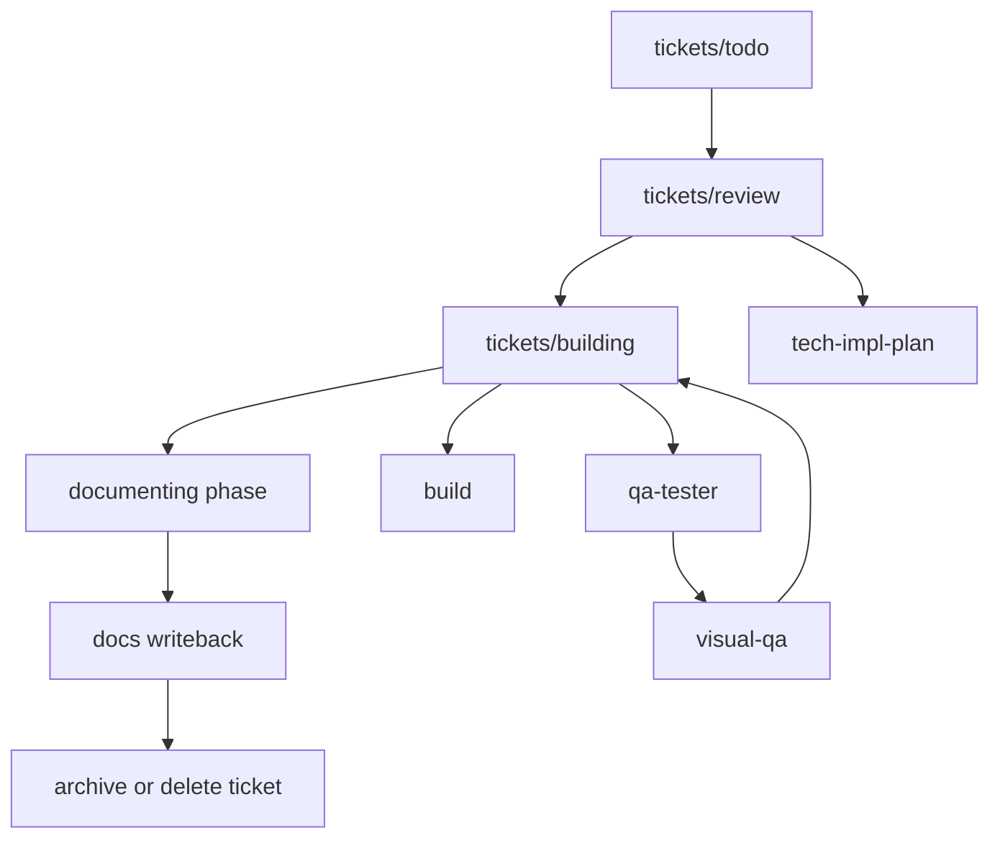

# `AGENTS.md`

Repo contract. More specific `AGENTS.md` wins.

<!--
Hot-path contract for equipped agents.
Keep this file terse: embedded flow, guardrails, and state-machine rules only.
Detailed workflow mechanics belong in skills.
-->

## System Map

<!--
Duplicated here on purpose.
Equipped agents may load AGENTS.md without carrying README.md, so the minimum system flow must live here too.
-->



## DoD

Done only if relevant items pass:

- plan exists + matches `skills/tech-impl-plan`
- ticket frontmatter and body both reflect the final active-work state
- tests pass
- TS strict passes; no `any`
- lint + format clean
- `docs/HISTORY.md` updated
- durable rules promoted to `docs/MEMORY.md`
- repeated failures or user correction patterns logged in `docs/TROUBLES.md` when applicable
- new invariants logged + referenced
- review loop done; `visual-qa` only if UI changed
- changes pushed to GitHub

## Boundary

Root file = repo guardrails only.

Use:

- `commit-message` for compact commit subject style
- `tech-impl-plan` for planning shape
- `prd` when reqs are unclear
- `spec-to-ticket` for slicing
- `runtime-debugging` for repro/runtime issues
- `visual-qa` for UI changes
- `code-review` for final quality sweep

Avoid:

- repeating skill internals here
- committing live Codex state; track reusable harness config only (`agents/`, `skills/`, `rules/`, scripts, sanitized templates). See `MEM-0001`.

## Context First

Before edits:

- read nearby specs / PRDs / module docs
- search for existing patterns
- inspect affected files + interfaces
- bootstrap from `tickets/review/*`, `tickets/building/*`, `tickets/todo/*`, `docs/prd.md`, `docs/specs/*`, `docs/MEMORY.md`, `docs/TROUBLES.md`

No blind edits.

## Modes

- planning = work from `tickets/review/` until user approves
- build = work from `tickets/building/` until implementation, QA, evidence, and review are complete

Planning handoff rule:

- planning approval is the checkpoint for starting execution
- once a ticket is approved for execution, treat in-scope user feedback as authorization to edit immediately
- do not reply with "if you want I can change it" when the user is clearly asking for correction

## Core Rules

- delete > accumulate
- modular by default
- code = source of truth
- no speculative abstractions
- MVP first: 1 -> 10 -> 100
- ticket-metadata v1 ends at visible tickets/docs/config foundations; assisted continuation, stop hooks, and autonomy-mode runtime work stay outside v1 unless a later ticket explicitly re-opens them
- user complaints about the current output are correction requests by default; fix first and explain briefly only when useful

## Module Scaffolding

If a touched module lacks them, add:

1. `MODULE/AGENTS.md`
2. `MODULE/README.md`

README should cover:

- purpose
- public API / entrypoints
- minimal example
- how to test

## Memory

Files:

- `docs/HISTORY.md` = append-only
- `docs/MEMORY.md` = curated constraints
- `docs/TROUBLES.md` = append-only repeated-failure and correction log

Format:

- `YYYY-MM-DD HH:mm Z | TYPE | MEM-#### | tags | text`

Log when:

- invariant
- API or data model change
- behavior / perf / security constraint
- migration
- architecture shift

Troubles log when:

- the same miss or correction happens more than once
- the user has to restate a requirement because execution drifted
- a preventable tool/process mistake blocks progress
- an expectation mismatch should feed future system tuning

Troubles format:

- `YYYY-MM-DD HH:mm Z | area,tags | request | miss | correction | prevention`

Promotion rule:

- `docs/TROUBLES.md` is for raw operator feedback, not durable truth
- promote repeated or structural lessons from `docs/TROUBLES.md` into `docs/MEMORY.md`, `AGENTS.md`, or the relevant skill only after the pattern is clear

If you introduce an invariant:

1. log memory
2. update nearest `AGENTS.md`
3. reference `MEM-####` in code if applicable

## Code Standards

- TS strict
- no `any`
- explicit return types on exported APIs
- side-effects at edges
- tests colocated when practical
- modules should stay extractable

Major logic files should start with the standard header block:

```ts
/**
 * MODULE NAME
 * ===========
 * Purpose
 *
 * KEY CONCEPTS:
 * -
 *
 * USAGE:
 * -
 *
 * MEMORY REFERENCES:
 * - MEM-####
 */
```

## Delegation

Use only when it materially improves outcome.

<!--
Delegation should be ticket-file-first.
The delegated agent should receive the ticket path as the primary contract and use chat only for a short execution note.
-->

Required:

- repro/runtime bug w/ unclear cause -> `runtime-debugging`
- UI behavior/layout/style change -> `visual-qa`
- broad cross-module exploration -> `explore`
- final quality sweep -> `code-review`

Avoid:

- forcing `runtime-debugging` for obvious stack-trace fixes
- `visual-qa` for docs/rules-only changes
- unnecessary delegation for small local edits

If a plan delegates, include:

- delegated agent
- skill
- one-line why
- expected artifact
- exact ticket file path
- required write-back target in that ticket

Delegation protocol:

- create or select the ticket first
- pass the ticket path/reference to the delegated agent
- keep the freeform prompt short and secondary to the ticket
- require the delegated agent to reconcile progress back into that same ticket

If none: `Not needed`.

## Ticket State Machine

<!--
Board movement is part of execution, not a chat convention.
Agents should update the ticket file and board state together so the filesystem board stays trustworthy.
-->

- new or split work -> create a ticket in `tickets/todo/`
- deferred, quarantined, or out-of-rollout work -> keep the ticket in `tickets/todo/` with explicit blockers; do not leave it in `tickets/building/`
- active planning / user approval -> keep the ticket in `tickets/review/`
- approved execution -> move the ticket to `tickets/building/`
- once implementation + QA pass -> update ticket `phase` to `documenting`, write durable docs, then archive/delete the ticket or move it to `tickets/done/` only if a short-lived done lane is still useful
- do not keep README/config/install/runtime surfaces for quarantined tickets active in the tracked repo; parked work should stay unshipped or be documented only as out of scope

Agents must:

- follow the canonical ticket shape in `tickets/templates/ticket.md`
- treat the ticket as the active task object:
  - frontmatter = fixed machine-readable metadata
  - body = task-local memory, plan, evidence, blockers, and handoff
- use the same canonical dialect in `todo/`, `review/`, and `building/`; backlog tickets are not exempt
- treat `tickets/INDEX.md` as a human summary only; automation truth lives in the ticket file plus its folder path
- update the ticket file, not just chat
- record blockers in the ticket
- create linked follow-up tickets when scope splits or new work is discovered
- update `tickets/INDEX.md` when a ticket changes state so the human summary stays readable
- do not move a ticket into `tickets/building/` while `approval_required: true`, `blocked_by` is non-empty, or a required `depends_on` ticket is still unresolved for the requested slice

Blocker rule:

- execution blocker -> keep ticket in `tickets/building/` and record blocker
- planning/scope blocker -> move ticket back to `tickets/review/`

Ownership split:

- `tickets/` = active work visibility + active task metadata
- nearest folder `README.md` = local/module rationale
- `docs/MEMORY.md`, `docs/HISTORY.md`, `docs/TROUBLES.md` = durable memory after completion

Anti-goals:

- no separate per-task runtime state file in v1
- no `run_id` or parallel run tree for active work
- no hidden automation or auto-continue behavior
- no assumed runtime selector for \"the current active ticket\" in v1; downstream hook work must define that explicitly before mutating ticket metadata

When changing ticket metadata contracts or moving many tickets:

- run `python3 bin/check_ticket_metadata.py`
- fix metadata drift before claiming the board is trustworthy

## Defaults

- FE: Next.js App Router
- BE: Convex
- state: Zustand
- AI: Vercel AI SDK
- core: TypeScript + Node.js

## Commit Style

- default: `type(scope): lower-case imperative summary`
- lead with the main delta, not the file list
- keep scope short and obvious when possible

## Stop If

- scope conflicts or is unclear
- API/interface contract is ambiguous
- migration is risky with no rollback
- circular dependency appears

No silent architectural drift.
