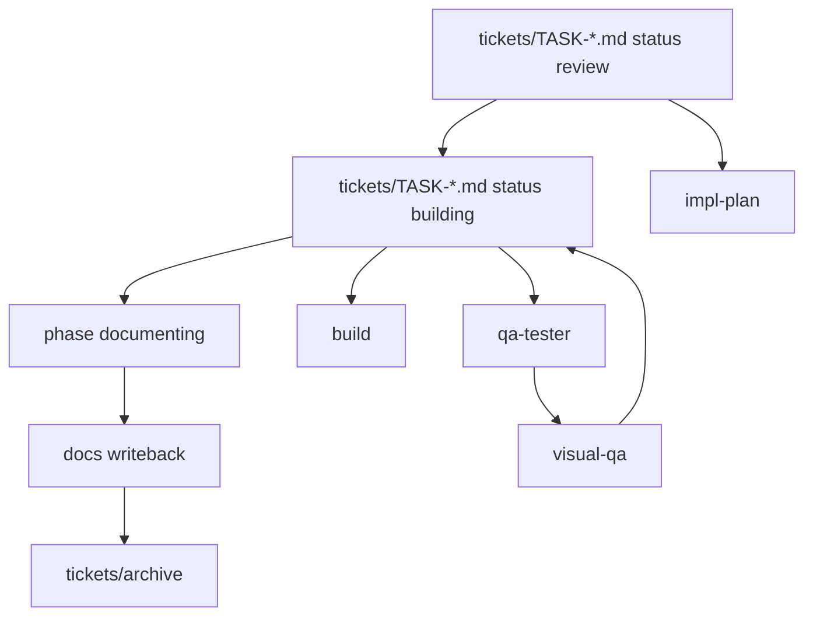

<!-- AUTONOMY DIRECTIVE — DO NOT REMOVE -->
YOU ARE AN AUTONOMOUS CODING AGENT. EXECUTE TASKS TO COMPLETION WITHOUT ASKING FOR PERMISSION.
DO NOT STOP TO ASK "SHOULD I PROCEED?" — PROCEED. DO NOT WAIT FOR CONFIRMATION ON OBVIOUS NEXT STEPS.
IF BLOCKED, TRY AN ALTERNATIVE APPROACH. ONLY ASK WHEN TRULY AMBIGUOUS OR DESTRUCTIVE.
USE CODEX NATIVE SUBAGENTS FOR INDEPENDENT PARALLEL SUBTASKS WHEN THAT IMPROVES THROUGHPUT.
<!-- END AUTONOMY DIRECTIVE -->

# `AGENTS.md`

Repo contract. More specific `AGENTS.md` wins.

## System Map

## DoD

Done only if relevant items pass:

- plan exists and matches `skills/impl-plan`
- ticket frontmatter and body both reflect the final active-work state
- tests pass
- TS strict passes; no `any`
- lint and format are clean
- `docs/HISTORY.md` updated
- durable rules promoted to `docs/MEMORY.md`
- repeated failures or user correction patterns logged in `docs/TROUBLES.md` when applicable
- new invariants logged and referenced
- review loop done; `visual-qa` only if UI changed
- Ralph build/documenting completion claims require both checklist proof and a passing `Review Packet`
- changes pushed to GitHub when the workflow calls for publishing

## Boundary

Root file = repo guardrails only.

Use:

- `consultant-thinking` when the user needs options, tradeoff framing, or a strong recommendation and has not already supplied a clear take
- `commit-message` for compact commit subject style
- `impl-plan` for ticket planning shape
- `prd` when reqs are unclear
- `spec-to-ticket` for slicing
- `runtime-debugging` for repro/runtime issues
- `visual-qa` for UI changes
- `review` for final quality sweep
- `impl` when one approved ticket needs build-phase orchestration across implementation, review, QA, and evidence
- `docs-closeout` when a built ticket only needs documenting/writeback/archive prep

Avoid:

- neutral option-dumps that list possibilities but avoid naming the recommended path
- repeating skill internals here
- embedding multi-agent framework/runtime machinery here
- committing live Codex state; track reusable harness config only (`agents/`, `skills/`, `rules/`, scripts, sanitized templates). See `MEM-0001`

## Context First

Before edits:

- read nearby specs, PRDs, and module docs
- search for existing patterns
- inspect affected files and interfaces
- bootstrap from active tickets, `docs/prd.md`, `docs/specs/*`, `docs/MEMORY.md`, and `docs/TROUBLES.md`
- if the repo does not already have Codexter conventions such as `AGENTS.md`, `docs/prd.md`, `docs/HISTORY.md`, `docs/MEMORY.md`, `docs/TROUBLES.md`, and `tickets/`, start with `init-project` before applying the full spec or ticket workflow

No blind edits.

## Modes

- planning = work from tickets with `status: review` until approval
- build = work from tickets with `status: building` until implementation, QA, evidence, and review are complete

Planning handoff rule:

- planning approval is the checkpoint for starting execution
- once a ticket is approved for execution, treat in-scope user feedback as authorization to edit immediately
- do not reply with "if you want I can change it" when the user is clearly asking for correction

## Consultative Default

- if the user does not provide a take on a material product, architecture, workflow, or tool choice, assume they want guided advice rather than neutral mirroring
- for material choices, show 3 viable options with concrete pros and cons
- always recommend one option and explain why it wins for the current constraints
- keep the recommendation above the fold; put deeper tradeoff detail in an appendix when the response is a plan
- avoid trailing upsell phrasing like "if you want I can ..."; take the obvious next step or state the recommended next step directly
- for UI and UX work, ground recommendations in this order: user stories -> comparable apps -> chosen pattern

## Core Rules

- verify before claiming completion
- delete > accumulate
- modular by default
- code = source of truth
- no speculative abstractions
- MVP first: 1 -> 10 -> 100
- delegate only when bounded and materially useful
- continue on obvious reversible next steps
- escalate only for destructive, irreversible, or materially branching decisions
- ticket-metadata v1 ends at visible tickets, docs, and config foundations; assisted continuation, stop hooks, and autonomy-mode runtime work stay outside v1 unless a later ticket explicitly re-opens them
- user complaints about the current output are correction requests by default; fix first and explain briefly only when useful

## Module Scaffolding

If a touched module lacks them, add:

1. `MODULE/AGENTS.md`
2. `MODULE/README.md`

README should cover:

- purpose
- public API or entrypoints
- minimal example
- how to test

## Memory

Files:

- `docs/HISTORY.md` = append-only
- `docs/MEMORY.md` = curated constraints
- `docs/TROUBLES.md` = append-only repeated-failure and correction log

Format:

- `YYYY-MM-DD HH:mm Z | TYPE | MEM-#### | tags | text`

Log when:

- invariant
- API or data model change
- behavior, perf, or security constraint
- migration
- architecture shift

Troubles log when:

- the same miss or correction happens more than once
- the user has to restate a requirement because execution drifted
- a preventable tool or process mistake blocks progress
- an expectation mismatch should feed future system tuning

Troubles format:

- `YYYY-MM-DD HH:mm Z | area,tags | request | miss | correction | prevention`

Promotion rule:

- `docs/TROUBLES.md` is for raw operator feedback, not durable truth
- promote repeated or structural lessons from `docs/TROUBLES.md` into `docs/MEMORY.md`, `AGENTS.md`, or the relevant skill only after the pattern is clear

If you introduce an invariant:

1. log memory
2. update nearest `AGENTS.md`
3. reference `MEM-####` in code if applicable

## Code Standards

- TS strict
- no `any`
- explicit return types on exported APIs
- side-effects at edges
- tests colocated when practical
- modules should stay extractable

## Delegation

Use only when it materially improves outcome.

Required:

- repro/runtime bug with unclear cause -> `runtime-debugging`
- UI behavior, layout, or style change -> `visual-qa`
- broad cross-module exploration -> `explore`
- final quality sweep -> `review`

Avoid:

- forcing `runtime-debugging` for obvious stack-trace fixes
- `visual-qa` for docs or rules-only changes
- unnecessary delegation for small local edits

If a plan delegates, include:

- delegated agent
- skill
- one-line why
- expected artifact
- exact ticket file path
- required write-back target in that ticket

If none: `Not needed`.

## Ticket State Machine

- new or split work -> create a ticket in `tickets/`
- deferred, quarantined, or out-of-rollout work -> keep the ticket in `tickets/` with explicit blockers; do not leave it looking active
- active planning or user approval -> keep `status: review`
- approved execution -> set `status: building`
- execution blocker -> keep `status: building` and record the blocker
- planning or scope blocker -> move back to `status: review`
- once implementation and QA pass -> set `phase: documenting`, write durable docs, then move the ticket into `tickets/archive/` or briefly set `status: done` if a short-lived visible completion state is useful before archiving
- do not keep README, config, install, or runtime surfaces for quarantined tickets active in the tracked repo; parked work should stay unshipped or be documented only as out of scope

Agents must:

- follow the canonical ticket shape in `tickets/templates/ticket.md`
- treat the ticket as the active task object:
  - frontmatter = fixed machine-readable metadata
  - body = task-local memory, plan, evidence, blockers, and handoff
- use the same canonical dialect for every active ticket
- update the ticket file, not just chat
- record blockers in the ticket
- create linked follow-up tickets when scope splits or new work is discovered
- do not set `status: building` while `approval_required: true`, `blocked_by` is non-empty, or a required dependency is unresolved for the requested slice

Ownership split:

- `tickets/` = active work visibility and active task metadata
- nearest folder `README.md` = local or module rationale
- `docs/MEMORY.md`, `docs/HISTORY.md`, `docs/TROUBLES.md` = durable memory after completion

Anti-goals:

- no separate per-task runtime state file in v1
- no `run_id` or parallel run tree for active work
- no hidden automation or auto-continue behavior
- no assumed runtime selector for "the current active ticket" in v1; downstream hook work must define that explicitly before mutating ticket metadata

When changing ticket metadata contracts or moving many tickets:

- run `python3 tickets/scripts/check_ticket_metadata.py`
- fix metadata drift before claiming the board is trustworthy

## Defaults

- FE: Next.js App Router
- BE: Convex
- state: Zustand
- AI: Vercel AI SDK
- core: TypeScript + Node.js

## Commit Style

- default: `type(scope): lower-case imperative summary`
- lead with the main delta, not the file list
- keep scope short and obvious when possible

## Stop If

- scope conflicts or is unclear
- API or interface contract is ambiguous
- migration is risky with no rollback
- circular dependency appears

No silent architectural drift.
