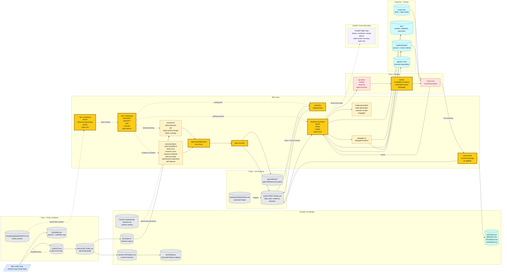

# Farplane Architecture

Current-state system map for Farplane.

Use this file as the top-level architecture guide after the repo-local
[AGENTS.md](/Users/kenjipcx/coding-harness/Farplane/AGENTS.md). It explains
which surfaces exist, what each one owns, and where to go next.

Documentation routing starts in
[README.md](/Users/kenjipcx/coding-harness/Farplane/README.md). Keep this file
and README in sync whenever the public workflow, shipped capability list, or
whole-system diagram changes.

## Purpose

Farplane is Farplane Core: the harness repo for running long-form engineering
work through visible artifacts instead of hidden runtime state or transcript
memory alone.

Farplane Core now sits inside the Farplane OS product family:

| Surface | Path | Owns |
| --- | --- | --- |
| Farplane Core | `Farplane/` | Harness contracts, skills, hooks, evals, tickets, review, proof, and repo memory |
| Farplane Console | `../Farplane-Console/` | Operational dashboard, activity telemetry, nudges, eval views, and Mighty Guard health workflows |
| Farplane UI | `../Farplane-UI/` | Optional immersive office/game experience and skill-object interactions |
| Farplane Office | alias only | The office/game mode inside Farplane UI, not a repo rename |

The repo is organized around five concerns:

- `AGENTS.md`: project-local operating map loaded every loop
- `ARCHITECTURE.md`: top-level system map and canonical surface guide
- `docs/`: durable knowledge and behavior specs
- `tickets/`: active execution objects and archived work history
- `skills/`, `agents/`, `bin/`: reusable workflows, bounded specialists, and
  runtime helpers

## One Picture



Legend:

- `blue` = incoming operator surface
- `gray` = durable docs, specs, and ticket files
- `amber/yellow` = skill contracts and highlighted handoff skills
- `cyan` = runtime helpers and specialist process surfaces
- `red` = proof, review, and Stop-hook gates
- `teal` = memory/writeback
- `dashed purple` = future scale boundary, not shipped behavior

## Canonical Surfaces

### Documentation router

The public docs are intentionally split by job:

| Surface | Owns | Must Stay In Sync With |
| --- | --- | --- |
| [README.md](/Users/kenjipcx/coding-harness/Farplane/README.md) | reader routing, setup, current-state summary, roadmap cap | this file, `docs/specs/README.md` |
| [ARCHITECTURE.md](/Users/kenjipcx/coding-harness/Farplane/ARCHITECTURE.md) | system diagram, surface ownership, read order, current limits | README, `docs/specs/harness-techniques.md` |
| [docs/specs/README.md](/Users/kenjipcx/coding-harness/Farplane/docs/specs/README.md) | canonical behavior-spec index and doc-gardening loop | README, this file |
| [tickets/README.md](/Users/kenjipcx/coding-harness/Farplane/tickets/README.md) | ticket state machine, invocation policy, metadata contract | ticket template, board/compute specs |
| [docs/HISTORY.md](/Users/kenjipcx/coding-harness/Farplane/docs/HISTORY.md) / [docs/MEMORY.md](/Users/kenjipcx/coding-harness/Farplane/docs/MEMORY.md) / [docs/TROUBLES.md](/Users/kenjipcx/coding-harness/Farplane/docs/TROUBLES.md) / [docs/LESSONS.md](/Users/kenjipcx/coding-harness/Farplane/docs/LESSONS.md) | durable timeline, invariants, raw repeated misses, and distilled lessons | closeout tickets and nearest module docs |

If a public harness claim changes, update the relevant row's surfaces in the
same pass and run:

```bash
python3 bin/validators/check_doc_parity.py
python3 bin/validators/check_harness_invariants.py
python3 tickets/scripts/check_ticket_metadata.py
```

Do not shrink or remove the colored Mermaid maps in README or ARCHITECTURE
during cleanup unless the replacement carries the same routing information.

### Entry surfaces

- [AGENTS.md](/Users/kenjipcx/coding-harness/Farplane/AGENTS.md)
  Purpose: project-local operating map, read-first paths, local rules
- [README.md](/Users/kenjipcx/coding-harness/Farplane/README.md)
  Purpose: product story, setup, and major public entrypoints
- [ARCHITECTURE.md](/Users/kenjipcx/coding-harness/Farplane/ARCHITECTURE.md)
  Purpose: system map, ownership boundaries, and where each concern lives

### Knowledge surfaces

- [docs/specs/README.md](/Users/kenjipcx/coding-harness/Farplane/docs/specs/README.md)
  Purpose: index of canonical behavior and execution specs
- [docs/specs/invocation-and-adapters.md](/Users/kenjipcx/coding-harness/Farplane/docs/specs/invocation-and-adapters.md)
  Purpose: completed capped Symphony-inspired follow-through: explicit
  invocation triggers, adapter conformance, external compute recipes, and clear
  deferrals
- [docs/fundamentals/harness-engineering-doctrine.md](/Users/kenjipcx/coding-harness/Farplane/docs/fundamentals/harness-engineering-doctrine.md)
  Purpose: routing doctrine for where harness changes belong before widening policy or adding new surfaces
- [docs/specs/invocation-and-adapters.md](/Users/kenjipcx/coding-harness/Farplane/docs/specs/invocation-and-adapters.md)
  Purpose: canonical ownership split for BoardAdapter, WorkItem, explicit
  ticket invocation, ComputeSelector, local Farplane, operator-invoked serial
  Ralph, and future Symphony/shared board compute modes
- [docs/specs/harness-techniques.md](/Users/kenjipcx/coding-harness/Farplane/docs/specs/harness-techniques.md)
  Purpose: current-state technique inventory, with implemented versus proposed
  techniques kept explicit
- [docs/specs/filesystem-lifecycle.md](/Users/kenjipcx/coding-harness/Farplane/docs/specs/filesystem-lifecycle.md)
  Purpose: lifecycle, read defaults, drain flows, and keep/delete rules for
  durable filesystem state
- [docs/features/README.md](/Users/kenjipcx/coding-harness/Farplane/docs/features/README.md)
  Purpose: structured feature registry contract for dedupe, provenance, source
  references, evidence links, known limits, and benchmark metrics
- [skills/feed-scout/SKILL.md](/Users/kenjipcx/coding-harness/Farplane/skills/feed-scout/SKILL.md)
  Purpose: tracked-profile monitoring recipe for discovering X, YouTube, and
  blog content, deduping canonical URLs in a content/proposal ledger, and
  routing eligible items to harness-scout and best-of-worlds
- [docs/specs/doc-governance.md](/Users/kenjipcx/coding-harness/Farplane/docs/specs/doc-governance.md)
  Purpose: structural versus narrative doc-audit policy and the doc-gardening
  workflow
- [docs/HISTORY.md](/Users/kenjipcx/coding-harness/Farplane/docs/HISTORY.md)
  Purpose: append-only change log
- [docs/MEMORY.md](/Users/kenjipcx/coding-harness/Farplane/docs/MEMORY.md)
  Purpose: curated durable invariants and constraints
- [docs/TROUBLES.md](/Users/kenjipcx/coding-harness/Farplane/docs/TROUBLES.md)
  Purpose: raw repeated misses, blockers, user corrections, and pain points
- [docs/LESSONS.md](/Users/kenjipcx/coding-harness/Farplane/docs/LESSONS.md)
  Purpose: distilled post-fix lessons for prompt, skill, eval, and policy improvements
- [docs/TASTE.md](/Users/kenjipcx/coding-harness/Farplane/docs/TASTE.md)
  Purpose: shared visual doctrine when a repo has UI work
- [qa/README.md](/Users/kenjipcx/coding-harness/Farplane/qa/README.md)
  Purpose: repo-owned QA/browser-test entry guidance and cookbook policy
- [qa/cookbook](/Users/kenjipcx/coding-harness/Farplane/qa/cookbook)
  Purpose: reusable shortcuts, deep links, seeds, probes, and workflow runbooks for agent-efficient QA

### Execution surfaces

- [tickets/README.md](/Users/kenjipcx/coding-harness/Farplane/tickets/README.md)
  Purpose: ticket lifecycle, frontmatter contract, invocation policy, and
  durable progress policy
- [tickets/templates/ticket.md](/Users/kenjipcx/coding-harness/Farplane/tickets/templates/ticket.md)
  Purpose: canonical compact ticket-as-program shape for task scope, delta,
  program pseudocode, map, `Done / Proof`, state, links, and optional agent
  contract/run hints for delegated or unattended work
- [tickets](/Users/kenjipcx/coding-harness/Farplane/tickets)
  Purpose: active ticket board
- [tickets/archive](/Users/kenjipcx/coding-harness/Farplane/tickets/archive)
  Purpose: completed or retired work history

### Review and proof surfaces

- [docs/specs/review-gates.md](/Users/kenjipcx/coding-harness/Farplane/docs/specs/review-gates.md)
  Purpose: QA -> reviewer -> Stop-hook quality gate split
- [skills/review/README.md](/Users/kenjipcx/coding-harness/Farplane/skills/review/README.md)
  Purpose: public entrypoint to the review system
- [docs/review/rubrics/review-rubric-index.md](/Users/kenjipcx/coding-harness/Farplane/docs/review/rubrics/review-rubric-index.md)
  Purpose: canonical scoring map, thresholds, and rubric family selection

The review scoring model is canonical in `skills/review/*`, not in this file.

### Runtime and orchestration surfaces

- [docs/specs/spec-first-execution-loop.md](/Users/kenjipcx/coding-harness/Farplane/docs/specs/spec-first-execution-loop.md)
  Purpose: end-to-end execution model, lane roles, and orchestration boundaries
- [docs/specs/invocation-and-adapters.md](/Users/kenjipcx/coding-harness/Farplane/docs/specs/invocation-and-adapters.md)
  Purpose: invocation, adapter, compute, runtime state, and operator-visible surfaces, with `.farplane/` as the canonical live root
- [skills/ralph/SKILL.md](/Users/kenjipcx/coding-harness/Farplane/skills/ralph/SKILL.md)
  Purpose: public board context surface that selects one eligible filesystem
  ticket or safe tiny-ticket batch and hands the work unit to `$work`
- [skills/work/SKILL.md](/Users/kenjipcx/coding-harness/Farplane/skills/work/SKILL.md)
  Purpose: Work Admission surface that classifies one request, ticket, batch,
  board-selected unit, epic, or metric loop before choosing Goal, compute,
  planning, proof, and downstream skills
- [skills/farplane-invocation/SKILL.md](/Users/kenjipcx/coding-harness/Farplane/skills/farplane-invocation/SKILL.md)
  Purpose: normal-Codex invocation contract that loads `WORKFLOW.md`,
  validates one explicit `FarplaneRunEnvelope`, selects local compute, routes
  to the existing phase skill, and writes parseable proof without launching
  Codex or treating ticket existence as a trigger
- [skills/delegate-cli/SKILL.md](/Users/kenjipcx/coding-harness/Farplane/skills/delegate-cli/SKILL.md)
  Purpose: public external CLI delegation workflow for routing bounded builder
  work through profile/adapter contracts while Farplane keeps ticket, QA, and
  review authority
- [skills/delegate-frontend/SKILL.md](/Users/kenjipcx/coding-harness/Farplane/skills/delegate-frontend/SKILL.md)
  Purpose: first external CLI profile surface, routing frontend implementation
  and design-polish work through the Pi plus Kimi K2.6 profile
- [bin](/Users/kenjipcx/coding-harness/Farplane/bin)
  Purpose: hooks, validators, runtime helpers
- [experiments](/Users/kenjipcx/coding-harness/Farplane/experiments)
  Purpose: smoke runs, source-ingestion fixtures, eval outputs, and proof
  artifacts

## Ownership Boundaries

- Root docs should stay map-like.
- Detailed behavior belongs in `docs/specs/*`.
- Ticket-local state belongs in `tickets/TASK-*/ticket.md`, not in chat.
- Reusable QA shortcuts and deterministic browser-entry guidance belong in
  `qa/cookbook/*`, not in ticket prose or transient chat.
- Review scoring belongs in `skills/review/*`.
- Runtime machinery belongs in `bin/`, `hooks.json`, and the runtime specs.
- Reusable workflow detail belongs in `skills/*`.
- Skill dependency hierarchy belongs in `docs/skills/README.md`, the generated
  skill registry, and direct `SKILL.md` checklist links. The global template
  carries only the always-loaded skill-loading reflex.

## Read Order

When orienting on the repo:

1. Read [AGENTS.md](/Users/kenjipcx/coding-harness/Farplane/AGENTS.md).
2. Read [ARCHITECTURE.md](/Users/kenjipcx/coding-harness/Farplane/ARCHITECTURE.md).
3. Read [README.md](/Users/kenjipcx/coding-harness/Farplane/README.md) for product/setup context.
4. Read [docs/specs/README.md](/Users/kenjipcx/coding-harness/Farplane/docs/specs/README.md).
5. Read [docs/fundamentals/harness-engineering-doctrine.md](/Users/kenjipcx/coding-harness/Farplane/docs/fundamentals/harness-engineering-doctrine.md) when the task changes the harness itself.
6. Read the active ticket and [tickets/README.md](/Users/kenjipcx/coding-harness/Farplane/tickets/README.md).
7. Follow links into the specific spec, skill, or runtime surface you actually need.

## Current Limits

- The architecture map is intentionally current-state-first and should not become
  a second encyclopedia.
- README is the documentation router; ARCHITECTURE is the ownership map. Update
  both together when the public harness story changes.
- Farplane has strong single-ticket orchestration and a guarded serial
  filesystem-ticket dispatcher, but not parallel N-agent dispatch with leases,
  worktrees, merge policy, stale-worker recovery, and batch QA yet.
- Doc governance is hybrid by design: structural entrypoint checks are
  mechanical, while narrative drift is audited with a prompt-driven workflow.
