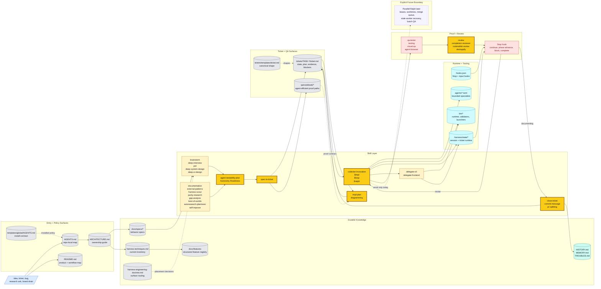

# Codexter Architecture

Current-state system map for Codexter.

Use this file as the top-level architecture guide after the repo-local
[AGENTS.md](/Users/kenjipcx/coding-harness/Codexter/AGENTS.md). It explains
which surfaces exist, what each one owns, and where to go next.

## Purpose

Codexter is a harness repo for running long-form engineering work through visible
artifacts instead of hidden runtime state or transcript memory alone.

The repo is organized around five concerns:

- `AGENTS.md`: project-local operating map loaded every loop
- `ARCHITECTURE.md`: top-level system map and canonical surface guide
- `docs/`: durable knowledge and behavior specs
- `tickets/`: active execution objects and archived work history
- `skills/`, `agents/`, `bin/`: reusable workflows, bounded specialists, and
  runtime helpers

## One Picture

Legend:

- `blue` = incoming operator surface
- `gray` = durable docs, specs, and ticket files
- `amber/yellow` = skill contracts and highlighted handoff skills
- `cyan` = runtime helpers and specialist process surfaces
- `red` = proof, review, and Stop-hook gates
- `teal` = memory/writeback
- `dashed purple` = future scale boundary, not shipped behavior

## Canonical Surfaces

### Entry surfaces

- [AGENTS.md](/Users/kenjipcx/coding-harness/Codexter/AGENTS.md)
  Purpose: project-local operating map, read-first paths, local rules
- [README.md](/Users/kenjipcx/coding-harness/Codexter/README.md)
  Purpose: product story, setup, and major public entrypoints
- [ARCHITECTURE.md](/Users/kenjipcx/coding-harness/Codexter/ARCHITECTURE.md)
  Purpose: system map, ownership boundaries, and where each concern lives

### Knowledge surfaces

- [docs/specs/README.md](/Users/kenjipcx/coding-harness/Codexter/docs/specs/README.md)
  Purpose: index of canonical behavior and execution specs
- [docs/specs/harness-engineering-doctrine.md](/Users/kenjipcx/coding-harness/Codexter/docs/specs/harness-engineering-doctrine.md)
  Purpose: routing doctrine for where harness changes belong before widening policy or adding new surfaces
- [docs/specs/board-compute-orchestration.md](/Users/kenjipcx/coding-harness/Codexter/docs/specs/board-compute-orchestration.md)
  Purpose: canonical ownership split for BoardAdapter, WorkItem,
  ComputeSelector, local Codexter, serial Ralph, and future Symphony/shared
  board compute modes
- [docs/specs/harness-techniques.md](/Users/kenjipcx/coding-harness/Codexter/docs/specs/harness-techniques.md)
  Purpose: current-state technique inventory, with implemented versus proposed
  techniques kept explicit
- [docs/features/README.md](/Users/kenjipcx/coding-harness/Codexter/docs/features/README.md)
  Purpose: structured feature registry contract for dedupe, provenance, source
  references, evidence links, known limits, and benchmark metrics
- [docs/specs/doc-governance.md](/Users/kenjipcx/coding-harness/Codexter/docs/specs/doc-governance.md)
  Purpose: structural versus narrative doc-audit policy and the doc-gardening
  workflow
- [docs/HISTORY.md](/Users/kenjipcx/coding-harness/Codexter/docs/HISTORY.md)
  Purpose: append-only change log
- [docs/MEMORY.md](/Users/kenjipcx/coding-harness/Codexter/docs/MEMORY.md)
  Purpose: curated durable invariants and constraints
- [docs/TROUBLES.md](/Users/kenjipcx/coding-harness/Codexter/docs/TROUBLES.md)
  Purpose: repeated misses, user corrections, and prevention ideas
- [docs/TASTE.md](/Users/kenjipcx/coding-harness/Codexter/docs/TASTE.md)
  Purpose: shared visual doctrine when a repo has UI work
- [qa/README.md](/Users/kenjipcx/coding-harness/Codexter/qa/README.md)
  Purpose: repo-owned QA/browser-test entry guidance and cookbook policy
- [qa/cookbook](/Users/kenjipcx/coding-harness/Codexter/qa/cookbook)
  Purpose: reusable shortcuts, deep links, seeds, probes, and workflow runbooks for agent-efficient QA

### Execution surfaces

- [tickets/README.md](/Users/kenjipcx/coding-harness/Codexter/tickets/README.md)
  Purpose: ticket lifecycle, frontmatter contract, and durable progress policy
- [tickets/templates/ticket.md](/Users/kenjipcx/coding-harness/Codexter/tickets/templates/ticket.md)
  Purpose: canonical ticket shape for planning, artifact-first evidence, and optional `Agent Contract`, `Autonomy Readiness`, and `Evidence Checklist` sections for UI-bearing or unattended work
- [tickets](/Users/kenjipcx/coding-harness/Codexter/tickets)
  Purpose: active ticket board
- [tickets/archive](/Users/kenjipcx/coding-harness/Codexter/tickets/archive)
  Purpose: completed or retired work history

### Review and proof surfaces

- [docs/specs/review-gates.md](/Users/kenjipcx/coding-harness/Codexter/docs/specs/review-gates.md)
  Purpose: QA -> reviewer -> Stop-hook quality gate split
- [skills/review/README.md](/Users/kenjipcx/coding-harness/Codexter/skills/review/README.md)
  Purpose: public entrypoint to the review system
- [skills/review/references/review-rubric-index.md](/Users/kenjipcx/coding-harness/Codexter/skills/review/references/review-rubric-index.md)
  Purpose: canonical scoring map, thresholds, and rubric family selection

The review scoring model is canonical in `skills/review/*`, not in this file.

### Runtime and orchestration surfaces

- [docs/specs/spec-first-execution-loop.md](/Users/kenjipcx/coding-harness/Codexter/docs/specs/spec-first-execution-loop.md)
  Purpose: end-to-end execution model
- [docs/specs/orchestrator-subagent-loop.md](/Users/kenjipcx/coding-harness/Codexter/docs/specs/orchestrator-subagent-loop.md)
  Purpose: lane roles and orchestration boundaries
- [docs/specs/runtime-surface.md](/Users/kenjipcx/coding-harness/Codexter/docs/specs/runtime-surface.md)
  Purpose: runtime state and operator-visible surfaces, with `.harness/` as the canonical live root
- [skills/ralph/SKILL.md](/Users/kenjipcx/coding-harness/Codexter/skills/ralph/SKILL.md)
  Purpose: public serial dispatcher that selects one eligible filesystem
  ticket and hands it to `impl-plan`, `$impl`, or `close-ticket`
- [skills/codexter-invocation/SKILL.md](/Users/kenjipcx/coding-harness/Codexter/skills/codexter-invocation/SKILL.md)
  Purpose: normal-Codex invocation contract that loads `WORKFLOW.md`,
  validates one `CodexterRunEnvelope`, selects local compute, routes to the
  existing phase skill, and writes parseable proof without launching Codex
- [skills/delegate-cli/SKILL.md](/Users/kenjipcx/coding-harness/Codexter/skills/delegate-cli/SKILL.md)
  Purpose: public external CLI delegation workflow for routing bounded builder
  work through profile/adapter contracts while Codexter keeps ticket, QA, and
  review authority
- [skills/delegate-frontend/SKILL.md](/Users/kenjipcx/coding-harness/Codexter/skills/delegate-frontend/SKILL.md)
  Purpose: first external CLI profile surface, routing frontend implementation
  and design-polish work through the Pi plus Kimi K2.6 profile
- [bin](/Users/kenjipcx/coding-harness/Codexter/bin)
  Purpose: hooks, validators, runtime helpers
- [experiments](/Users/kenjipcx/coding-harness/Codexter/experiments)
  Purpose: smoke runs, source-ingestion fixtures, eval outputs, and proof
  artifacts

## Ownership Boundaries

- Root docs should stay map-like.
- Detailed behavior belongs in `docs/specs/*`.
- Ticket-local state belongs in `tickets/TASK-*/ticket.md`, not in chat.
- Reusable QA shortcuts and deterministic browser-entry guidance belong in
  `qa/cookbook/*`, not in ticket prose or transient chat.
- Review scoring belongs in `skills/review/*`.
- Runtime machinery belongs in `bin/`, `hooks.json`, and the runtime specs.
- Reusable workflow detail belongs in `skills/*`.

## Read Order

When orienting on the repo:

1. Read [AGENTS.md](/Users/kenjipcx/coding-harness/Codexter/AGENTS.md).
2. Read [ARCHITECTURE.md](/Users/kenjipcx/coding-harness/Codexter/ARCHITECTURE.md).
3. Read [README.md](/Users/kenjipcx/coding-harness/Codexter/README.md) for product/setup context.
4. Read [docs/specs/README.md](/Users/kenjipcx/coding-harness/Codexter/docs/specs/README.md).
5. Read [docs/specs/harness-engineering-doctrine.md](/Users/kenjipcx/coding-harness/Codexter/docs/specs/harness-engineering-doctrine.md) when the task changes the harness itself.
6. Read the active ticket and [tickets/README.md](/Users/kenjipcx/coding-harness/Codexter/tickets/README.md).
7. Follow links into the specific spec, skill, or runtime surface you actually need.

## Current Limits

- The architecture map is intentionally current-state-first and should not become
  a second encyclopedia.
- Codexter has strong single-ticket orchestration and a guarded serial
  filesystem-ticket dispatcher, but not parallel N-agent dispatch with leases,
  worktrees, merge policy, stale-worker recovery, and batch QA yet.
- Doc governance is hybrid by design: structural entrypoint checks are
  mechanical, while narrative drift is audited with a prompt-driven workflow.
