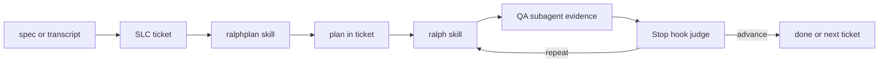
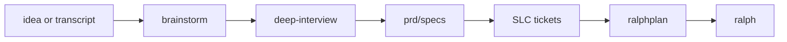
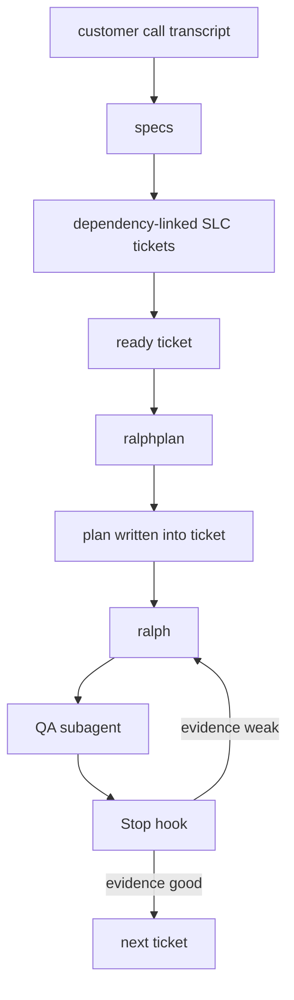
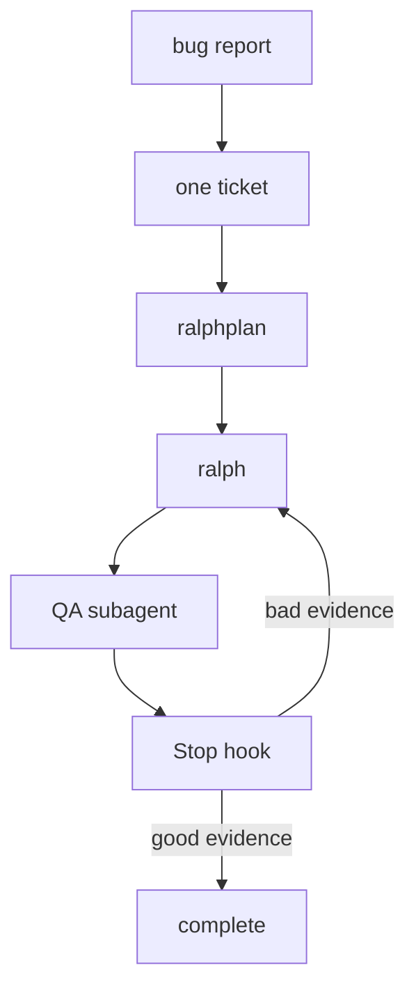
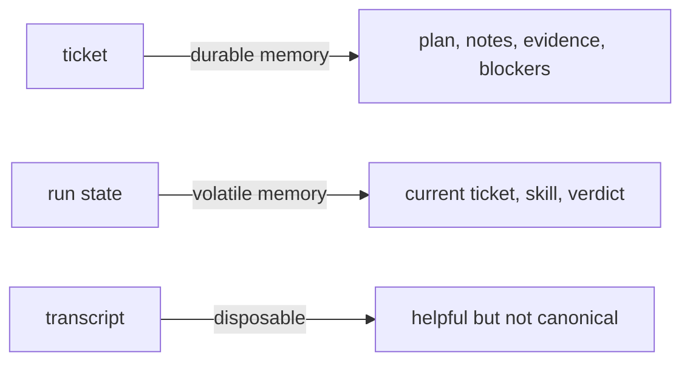
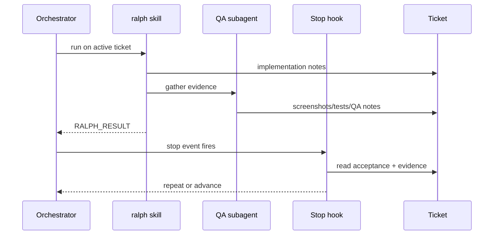

# Codexter

Ticket-first autonomous Codex harness.

The core idea is simple:

- `brainstorm` explores options before commitment
- `deep-interview` sharpens vague inputs into clear product requirements
- humans think in specs and tickets
- `ralphplan` turns a ticket into an executable plan
- `ralph` implements and gathers evidence
- a `Stop` `hook` judges the evidence
- the orchestrator decides whether to repeat, advance, block, or complete

## One Picture



## Why This Exists

Long-running agent work fails in four predictable ways:

- vague work starts too early
- one giant transcript drifts
- evidence is logged but not sanity-checked
- humans cannot tell what happened later

Codexter solves that by making the **ticket** the canonical memory object and keeping sessions disposable.

## Front-End Funnel



## Story: Greenfield



Minimal interpretation:

1. You ingest a messy idea.
2. It becomes specs.
3. Specs become dependency-aware tickets.
4. The next unblocked ticket gets planned.
5. The same ticket gets implemented.
6. Evidence is gathered.
7. The hook either forces another pass or lets the system move on.

## Story: Brownfield



This is the same system, just with one ticket instead of many.

## The Important Boundary



- **ticket** = durable task memory
- **run state** = machine-readable current step
- **transcript** = disposable

That is why the system can recover from resets without losing the real task state.

## Evidence Gate



This is the whole philosophy:

- the `skill` produces evidence
- the `hook` decides whether that evidence is actually good enough

## What Is Canonical Today

- Specs: [docs/specs](/Users/kenjipcx/coding-harness/Codexter/docs/specs)
- Front-end skills: [skills/brainstorm](/Users/kenjipcx/coding-harness/Codexter/skills/brainstorm), [skills/deep-interview](/Users/kenjipcx/coding-harness/Codexter/skills/deep-interview)
- Prompts: [prompts](/Users/kenjipcx/coding-harness/Codexter/prompts)
- Runtime scripts: [bin](/Users/kenjipcx/coding-harness/Codexter/bin)
- Active prototype ticket: [TASK-0011](/Users/kenjipcx/coding-harness/Codexter/tickets/building/TASK-0011-ralph-hook-integration-and-evals.md)
- Experiments: [experiments](/Users/kenjipcx/coding-harness/Codexter/experiments)

## Current Prototype Status

What is proven:

- `ralphplan` dry-run advances to `building`
- `ralph` with missing evidence gets repeated
- project-local `current-run.json` is enough for replay-level hook selection
- real Codex sessions now fire the `Stop` `hook`
- live sessions can produce `hook: Stop Blocked`

Where to see that:

- [2026-04-05-stop-hook-smoke.md](/Users/kenjipcx/coding-harness/Codexter/experiments/2026-04-05-stop-hook-smoke.md)
- [latest-runs.json](/Users/kenjipcx/coding-harness/Codexter/experiments/latest-runs.json)
- [stop-hook.jsonl](/Users/kenjipcx/coding-harness/Codexter/.ralph/logs/stop-hook.jsonl)

Main remaining gap:

- long-running multi-ticket client work is not proven yet

## Setup

### Option A: Clone straight into `~/.codex`

```bash
git clone <your-remote-url> ~/.codex
cp ~/.codex/config.toml.example ~/.codex/config.toml
```

Then replace placeholders and local secrets in `~/.codex/config.toml`.

### Option B: Keep the repo elsewhere and link it into `~/.codex`

```bash
git clone <your-remote-url> ~/src/codex-harness
cd ~/src/codex-harness
bash install.sh
```

The installer:

- links tracked files into `~/.codex`
- seeds `config.toml` if missing
- links `hooks.json` when present

## Bootstrap Checklist

1. Copy `config.toml.example` to `config.toml`.
2. Replace `__CODEX_HOME__` with the real absolute path.
3. Add secret MCP URLs locally only.
4. Add trust entries locally only.
5. Run:

```bash
python3 -m py_compile bin/notify.py
bash -n install.sh
```

## If You Only Read One More Thing

Read the visual walkthrough:

- [ralph-flow-examples.md](/Users/kenjipcx/coding-harness/Codexter/docs/specs/ralph-flow-examples.md)
