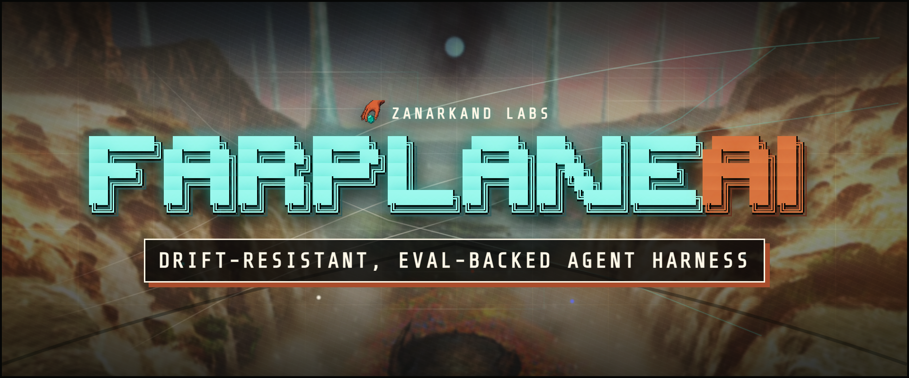
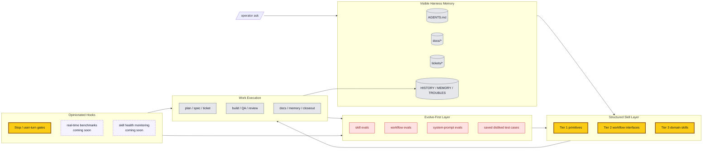

# Farplane

Farplane is a drift-resistant, evolve-first harness for agentic work.

It gives Codex a visible operating system: structured skills, reviewable
workflow artifacts, hooks, evals, benchmarks, and durable repo memory. The
ticket-first autonomous coding loop is one important feature, but Farplane is
broader than tickets: it is a way to keep an AI harness learning without letting
it silently sprawl, forget, or self-approve weak work.

## Architecture

## What Makes It Different

- **Drift-resistant by default.** Farplane keeps work grounded in visible docs,
  tickets, memories, validators, and review artifacts instead of transcript
  vibes.
- **Evolve-first.** Skills, workflows, and prompt behavior are meant to be
  benchmarked, revised, and re-tested as first-class harness surfaces.
- **Structured skills.** Skills are not loose prompt snippets; they have
  contracts, checklists, dependency shape, references, and on-demand plugin
  packaging when users want Codex plugin installs.
- **Opinionated hooks.** Hooks track user intent, stop weak completion claims,
  route review, and will grow into real-time benchmark and skill-health
  monitoring.
- **Test-case memory.** The harness can preserve disliked outputs, misses, and
  benchmark cases so failures become reusable improvement pressure.
- **Human-marked hard cases.** `repent lesson` and `repent hardcase` turn fixed
  agent failures into local lessons, Notion improvement proposals, or sanitized
  hardcase artifacts for future eval and training-data review.
- **Ticket-first autonomy as one mode.** Tickets remain the durable execution
  surface for coding work, but they are not the whole product.

## Repo Index

| Path | Contains |
| --- | --- |
| `AGENTS.md` | Project-local operating contract for developing Farplane itself. |
| `ARCHITECTURE.md` | Deeper system map, ownership boundaries, and read order. |
| `agents/` | Bounded specialist role configs. |
| `bin/` | Hooks, validators, runtime helpers, launchers, and sync scripts. |
| `docs/` | Specs, feature inventory, history, memory, troubles, research, and policies. |
| `docs/features/` | Structured feature registry and feature metadata. |
| `docs/specs/` | Canonical behavior specs and doc-gardening loop. |
| `experiments/` | Smoke runs, eval artifacts, prototypes, and temporary proof. |
| `qa/` | QA cookbook, browser proof paths, and reusable test-entry guidance. |
| `rules/` | Shared policy fragments and prompt-engineering references. |
| `skills/` | Farplane skill packages, references, scripts, and templates. |
| `templates/` | Install-time global Codex templates and config scaffolding. |
| `tickets/` | Active task board, ticket template, artifacts, and archive. |

## Start Here

- Architecture map: [ARCHITECTURE.md](ARCHITECTURE.md)
- Specs index: [docs/specs/README.md](docs/specs/README.md)
- Feature inventory: [harness-techniques.md](docs/specs/harness-techniques.md)
- Structured feature registry: [docs/features/README.md](docs/features/README.md)
- Skill guide: [docs/skills/README.md](docs/skills/README.md)
- Ticket contract: [tickets/README.md](tickets/README.md)
- QA cookbook surface: [qa/README.md](qa/README.md)
- Review scoring: [skills/review/README.md](skills/review/README.md)
- Active queue: [tickets](tickets)

## Current Boundary

Farplane is installed into normal Codex and uses visible repo artifacts as the
control plane. It is not a hidden daemon, hosted scheduler, or parallel
multi-agent dispatcher today. Background hooks for live skill-health benchmarks
and saved disliked-case feedback loops are planned harness surfaces, not fully
shipped behavior yet.

Offline evals and human-marked failure capture are the shipped improvement
primitives today. Broader live skill-health benchmarks remain future work.
