# Farplane

Ticket-first autonomous Codex harness.

Farplane turns fuzzy product asks into visible specs, tickets, execution rounds,
evidence-backed review, and closeout. The harness is strongest today at
single-ticket engineering with explicit proof and Stop-hook judgment, with a
guarded serial `$ralph` dispatcher for prepared filesystem ticket boards. It is
not yet a parallel multi-agent dispatcher.

Farplane is a ticket invocation layer inside normal Codex. Tickets store work
context; explicit invocations express intent to run that work. Creating a
ticket, marking it ready, moving a board card, or changing `compute_target`
does not start an agent by itself.

If a repo does not already have Farplane conventions such as `AGENTS.md`,
`docs/prd.md`, `docs/HISTORY.md`, `docs/MEMORY.md`, `docs/TROUBLES.md`, and
`tickets/`, start with `deep-init-project` before trying to use the full spec,
ticket, and execution workflow.

## Start Here

- Repo-local operating map: [AGENTS.md](/Users/kenjipcx/coding-harness/Farplane/AGENTS.md)
- Architecture map: [ARCHITECTURE.md](/Users/kenjipcx/coding-harness/Farplane/ARCHITECTURE.md)
- Specs index: [docs/specs/README.md](/Users/kenjipcx/coding-harness/Farplane/docs/specs/README.md)
- Farplane V2 capstone: [farplane-v2-milestone.md](/Users/kenjipcx/coding-harness/Farplane/docs/specs/farplane-v2-milestone.md)
- Board, compute, and ticket invocation: [board-compute-orchestration.md](/Users/kenjipcx/coding-harness/Farplane/docs/specs/board-compute-orchestration.md)
- Harness-tuning doctrine: [harness-engineering-doctrine.md](/Users/kenjipcx/coding-harness/Farplane/docs/specs/harness-engineering-doctrine.md)
- Feature inventory: [harness-techniques.md](/Users/kenjipcx/coding-harness/Farplane/docs/specs/harness-techniques.md)
- Structured feature registry: [docs/features/README.md](/Users/kenjipcx/coding-harness/Farplane/docs/features/README.md)
- Human skill selection guide: [docs/skills/README.md](/Users/kenjipcx/coding-harness/Farplane/docs/skills/README.md)
- Ticket contract: [tickets/README.md](/Users/kenjipcx/coding-harness/Farplane/tickets/README.md)
- Private tool context guide: [docs/private-tool-context.md](/Users/kenjipcx/coding-harness/Farplane/docs/private-tool-context.md)
- QA cookbook surface: [qa/README.md](/Users/kenjipcx/coding-harness/Farplane/qa/README.md)
- Review scoring: [skills/review/README.md](/Users/kenjipcx/coding-harness/Farplane/skills/review/README.md)
- CLI cleanup workflow: [skills/desloppify/README.md](/Users/kenjipcx/coding-harness/Farplane/skills/desloppify/README.md)
- Reference grounding primitive: [skills/reference-grounding/README.md](/Users/kenjipcx/coding-harness/Farplane/skills/reference-grounding/README.md)
- Research workflow: [skills/research/README.md](/Users/kenjipcx/coding-harness/Farplane/skills/research/README.md)
- Generic planning interface: [skills/plan/README.md](/Users/kenjipcx/coding-harness/Farplane/skills/plan/README.md)
- Generic execution interface: [skills/execute/README.md](/Users/kenjipcx/coding-harness/Farplane/skills/execute/README.md)
- Best-of-worlds synthesis: [skills/best-of-worlds/SKILL.md](/Users/kenjipcx/coding-harness/Farplane/skills/best-of-worlds/SKILL.md)
- Harness source scouting: [skills/harness-scout/SKILL.md](/Users/kenjipcx/coding-harness/Farplane/skills/harness-scout/SKILL.md)
- Feed source monitoring: [skills/feed-scout/SKILL.md](/Users/kenjipcx/coding-harness/Farplane/skills/feed-scout/SKILL.md)
- PR follow-up runtime workflow: [skills/pr-runtime/README.md](/Users/kenjipcx/coding-harness/Farplane/skills/pr-runtime/README.md)
- Farplane invocation contract: [skills/farplane-invocation/README.md](/Users/kenjipcx/coding-harness/Farplane/skills/farplane-invocation/README.md)
- External CLI delegation: [skills/delegate-cli/README.md](/Users/kenjipcx/coding-harness/Farplane/skills/delegate-cli/README.md)
- Frontend external CLI profile: [skills/delegate-frontend/README.md](/Users/kenjipcx/coding-harness/Farplane/skills/delegate-frontend/README.md)
- Frontend implementation orchestrator: [skills/frontend-craft/SKILL.md](/Users/kenjipcx/coding-harness/Farplane/skills/frontend-craft/SKILL.md)
- Functional UI redesign: [skills/functional-ui/SKILL.md](/Users/kenjipcx/coding-harness/Farplane/skills/functional-ui/SKILL.md)
- Visual design direction: [skills/visual-design/SKILL.md](/Users/kenjipcx/coding-harness/Farplane/skills/visual-design/SKILL.md)
- Landing page planning: [skills/landing-page/SKILL.md](/Users/kenjipcx/coding-harness/Farplane/skills/landing-page/SKILL.md)
- Image generation assets: [skills/image-generation/SKILL.md](/Users/kenjipcx/coding-harness/Farplane/skills/image-generation/SKILL.md)
- Video generation assets: [skills/video-generation/SKILL.md](/Users/kenjipcx/coding-harness/Farplane/skills/video-generation/SKILL.md)
- Remotion render assets: [skills/remotion-render/SKILL.md](/Users/kenjipcx/coding-harness/Farplane/skills/remotion-render/SKILL.md)
- Autoresearch planning: [skills/autoresearch-plan/SKILL.md](/Users/kenjipcx/coding-harness/Farplane/skills/autoresearch-plan/SKILL.md)
- Autoresearch execution: [skills/autoresearch-exec/SKILL.md](/Users/kenjipcx/coding-harness/Farplane/skills/autoresearch-exec/SKILL.md)
- Skill self-improvement: [skills/self-improve/SKILL.md](/Users/kenjipcx/coding-harness/Farplane/skills/self-improve/SKILL.md)
- Serial board drain: [skills/ralph/SKILL.md](/Users/kenjipcx/coding-harness/Farplane/skills/ralph/SKILL.md)
- Active queue: [tickets](/Users/kenjipcx/coding-harness/Farplane/tickets)
- Project bootstrap: [skills/deep-init-project/README.md](/Users/kenjipcx/coding-harness/Farplane/skills/deep-init-project/README.md)

## Documentation Router

Use this section as the shortest route to the right source of truth. Keep it in
sync with [ARCHITECTURE.md](/Users/kenjipcx/coding-harness/Farplane/ARCHITECTURE.md)
whenever the public harness story changes.

| Need | Start Here | Then Check |
| --- | --- | --- |
| Understand the whole repo | [ARCHITECTURE.md](/Users/kenjipcx/coding-harness/Farplane/ARCHITECTURE.md) | [AGENTS.md](/Users/kenjipcx/coding-harness/Farplane/AGENTS.md), [docs/specs/README.md](/Users/kenjipcx/coding-harness/Farplane/docs/specs/README.md) |
| Decide where a harness change belongs | [harness-engineering-doctrine.md](/Users/kenjipcx/coding-harness/Farplane/docs/specs/harness-engineering-doctrine.md) | [harness-techniques.md](/Users/kenjipcx/coding-harness/Farplane/docs/specs/harness-techniques.md), nearest skill README |
| Choose which skill to invoke | [docs/skills/README.md](/Users/kenjipcx/coding-harness/Farplane/docs/skills/README.md) | generated [docs/skills/registry.jsonl](/Users/kenjipcx/coding-harness/Farplane/docs/skills/registry.jsonl), target `skills/*/SKILL.md` |
| Store private tool handles | [docs/private-tool-context.md](/Users/kenjipcx/coding-harness/Farplane/docs/private-tool-context.md) | `~/.codex/private/TOOLS.md`, `~/.codex/private/docs/`, `templates/global/AGENTS.md` |
| Run or resume a ticket | [tickets/README.md](/Users/kenjipcx/coding-harness/Farplane/tickets/README.md) | active `tickets/TASK-*/ticket.md`, [skills/impl-plan/SKILL.md](/Users/kenjipcx/coding-harness/Farplane/skills/impl-plan/SKILL.md), [skills/impl/SKILL.md](/Users/kenjipcx/coding-harness/Farplane/skills/impl/SKILL.md) |
| Close or archive finished work | [skills/close-ticket/SKILL.md](/Users/kenjipcx/coding-harness/Farplane/skills/close-ticket/SKILL.md) | [docs/HISTORY.md](/Users/kenjipcx/coding-harness/Farplane/docs/HISTORY.md), [docs/MEMORY.md](/Users/kenjipcx/coding-harness/Farplane/docs/MEMORY.md), affected module README |
| Check proof quality | [skills/review/README.md](/Users/kenjipcx/coding-harness/Farplane/skills/review/README.md) | [review-gates.md](/Users/kenjipcx/coding-harness/Farplane/docs/specs/review-gates.md), ticket evidence |
| Work on Farplane V2 invocation or adapters | [farplane-v2-milestone.md](/Users/kenjipcx/coding-harness/Farplane/docs/specs/farplane-v2-milestone.md) | [board-compute-orchestration.md](/Users/kenjipcx/coding-harness/Farplane/docs/specs/board-compute-orchestration.md), [symphony-compatible-farplane-runner.md](/Users/kenjipcx/coding-harness/Farplane/docs/specs/symphony-compatible-farplane-runner.md), [board-adapter-conformance.md](/Users/kenjipcx/coding-harness/Farplane/docs/specs/board-adapter-conformance.md) |
| Update docs after a public contract changes | [doc-governance.md](/Users/kenjipcx/coding-harness/Farplane/docs/specs/doc-governance.md) | this README, [ARCHITECTURE.md](/Users/kenjipcx/coding-harness/Farplane/ARCHITECTURE.md), [docs/specs/README.md](/Users/kenjipcx/coding-harness/Farplane/docs/specs/README.md), [tickets/README.md](/Users/kenjipcx/coding-harness/Farplane/tickets/README.md) |

Documentation sync rule:

- `README.md` routes readers.
- `ARCHITECTURE.md` owns the top-level system diagram and ownership map.
- `docs/specs/README.md` indexes canonical behavior specs.
- `tickets/README.md` owns the ticket state-machine contract.
- When one of these changes a public workflow claim, update the others in the
  same pass and run `python3 bin/check_doc_parity.py`.

## Current State

Implemented now:

- discovery-first intake through `brainstorm`, `deep-interview`, `prd`,
  `deep-system-design`, `deep-ui-design`, and `agent-testability-plan`
- `Autonomy Readiness` captured across bootstrap, PRD, design, ticketization,
  implementation planning, and review surfaces
- capability-first ticketization through `spec-to-ticket`
- bootstrap testability defaults propagated into ticket `Agent Contract` and
  `qa/cookbook` seeds through `spec-to-ticket`
- tiered skill dependency loading through the global prompt template and
  direct `SKILL.md` checklists, where Tier 1 covers advice, reference grounding, review, and
  todo discipline; Tier 2 covers `brainstorm`, `research:*`, `plan`, and
  `execute`; and Tier 3 application pipelines implement those interfaces
- per-ticket coding planning through `impl-plan`, which implements the generic
  `plan` interface for Farplane code tickets
- method-addressed research through `research:gap` when net-new or partial
  feature scope depends on production-grade expectations, and
  `research:parity` when the main question is what other products, standards,
  or codebases consistently include
- best-of-worlds synthesis through `best-of-worlds` when the source set is
  known and the work is to extract, score, and adapt the strongest techniques
- structured feature records through `docs/features/registry.jsonl` and
  source-to-feature scouting through `harness-scout` for videos, blogs, repos,
  and transcripts that may contain harness improvements
- tracked-profile source monitoring through `feed-scout`, which discovers new
  content from curated X, YouTube, and blog profiles, dedupes canonical URLs in
  a content/proposal ledger, then routes eligible items to `harness-scout` and
  `best-of-worlds`
- private tool context through `~/.codex/private/TOOLS.md` and
  `~/.codex/private/docs/`, with tracked docs and skills using named handles or
  placeholders instead of embedding personal workspace IDs
- frontend implementation through `frontend-craft`, with `functional-ui` for
  UX/workflow and broken-UI redesign, `visual-design` for look/taste/visual
  systems, and `landing-page` for one-page marketing or scrolltelling surfaces
- metric-driven improvement sessions through `autoresearch-plan` and
  `autoresearch-exec`, with `self-improve` for binary-eval-based skill
  optimization on the same artifact contract
- native Codex Goal preparation through `goal-crafter`, which turns fuzzy
  continuation intent into a paste-ready `/goal` with proof, constraints,
  iteration policy, and blocked-stop rules
- Work Admission through `$work`, which classifies one request, ticket, ticket
  batch, board-selected unit, epic, or metric loop before choosing Goal,
  compute, planning, proof, and downstream skills
- explicit local ticket ranges through `batch-work`, aligned with `$work`
  batch-ledger proof policy
- single-ticket execution through `$impl`
- Goal-backed filesystem-ticket board context through `$ralph`, which selects
  one eligible ticket or safe related tiny-ticket batch and hands it to `$work`
- delegated QA routing for live `$qa` followups plus visible nonce-backed
  completion-review receipts
- anchored `review` rubrics plus evidence-gated completion
- `desloppify` for CLI-driven anti-slop cleanup, with default worker delegation
- documenting and closeout through `close-ticket`
- isolated PR follow-up and concurrent-writer checkout setup plus ticket-scoped
  runtime launch/teardown through `pr-runtime` plus `ticket-runtime`
- local Farplane invocation through `WORKFLOW.md`,
  `FarplaneRunEnvelope`, filesystem `WorkItem`, `ComputeSelector`, and
  `ProofPacket`, so an explicit local or external invocation can route one
  work unit through `$work`, existing skills, and future Symphony workers with
  the same request/result contract
- board/compute invocation doctrine that keeps tickets as context, Codex as
  the execution engine, Farplane as the installed skill/proof layer, and
  Symphony as a future background scheduler/runner rather than a replacement
  for local Farplane use
- external CLI delegation through `delegate-cli`, with `delegate-frontend` as
  the first profile for Pi plus Kimi K2.6 dry-run/live handoffs
- Stop-hook phase routing and current-turn relevance checks
- optional `deep-init-project` scaffolding for `.githooks/`,
  `scripts/pre_commit_check.sh`, `scripts/pre_push_check.sh`, a starter `qa/`
  cookbook surface, and explicit `coderabbit-review`

Partial today:

- same-ticket auto-reentry is real, and `$work` now chooses direct, planned,
  batched, board-drain, reslice, or metric-loop routing; `$ralph` still drains
  serially rather than in parallel
- tmux-backed worker lanes exist, but the runtime is still prototype-weight
- runtime observability doctrine is shipped, while hosted telemetry is still in
  progress in [TASK-0073](/Users/kenjipcx/coding-harness/Farplane/tickets/TASK-0073/ticket.md)
- anti-slop review exists in `review`, but there is not yet a separate
  human-grade report/video proof pack

Still missing:

- standard evidence packs that stop weak proof from counting as done across all
  work types
- compaction-safe reset and handoff discipline so long runs resume from the
  ticket instead of transcript drift
- clearer answer/plan/act routing plus deterministic subagent selection for
  direct user asks
- worktree-backed multi-session execution and a cloud-ready lane boundary
- N-agent parallel Ralph with claims, leases, merge policy, stale-worker
  handling, and batch/release QA
- transparency and ablation evals for measuring whether autonomy changes
  actually improve outcomes

## Whole-System Workflow

```mermaid
flowchart LR
    classDef input fill:#dbeafe,stroke:#2563eb,color:#111827
    classDef surface fill:#e5e7eb,stroke:#4b5563,color:#111827
    classDef discovery fill:#fef3c7,stroke:#b45309,color:#111827
    classDef planning fill:#fde68a,stroke:#92400e,color:#111827
    classDef research fill:#ede9fe,stroke:#7c3aed,color:#111827
    classDef execution fill:#dcfce7,stroke:#15803d,color:#111827
    classDef quality fill:#fee2e2,stroke:#b91c1c,color:#7f1d1d
    classDef closeout fill:#ccfbf1,stroke:#0f766e,color:#111827
    classDef runtime fill:#cffafe,stroke:#0891b2,color:#111827
    classDef future fill:#f5f3ff,stroke:#8b5cf6,color:#111827,stroke-dasharray: 5 3
    classDef callout fill:#facc15,stroke:#854d0e,stroke-width:3px,color:#111827

    req[/operator ask<br/>idea, bug, repo gap, board drain/]:::input

    subgraph Map["Durable Map Surfaces"]
      agents[(AGENTS.md)]:::surface
      readme[(README.md<br/>whole-system map)]:::surface
      arch[(ARCHITECTURE.md<br/>ownership map)]:::surface
      specs[(docs/specs/*)]:::surface
      history[(HISTORY / MEMORY / TROUBLES)]:::surface
    end

    subgraph Intake["1. Discovery + Direction"]
      bootstrap["deep-init-project<br/>repo bootstrap"]:::callout
      fuzzy["brainstorm<br/>deep-interview<br/>prd"]:::discovery
      design["deep-system-design<br/>deep-ui-design<br/>agent-testability-plan"]:::discovery
      advice["advise<br/>functional-ui<br/>visual-design<br/>landing-page<br/>demo-realism"]:::discovery
    end

    subgraph Research["Research + Synthesis Sidecars"]
      grounding["summarize<br/>feed-scout<br/>harness-scout<br/>documentation<br/>external-patterns<br/>find-skills<br/>apify"]:::research
      parity["reference-grounding<br/>research:parity/gap/source-synthesis<br/>best-of-worlds<br/>docs/features registry"]:::research
      improve["autoresearch-plan<br/>autoresearch-exec<br/>self-improve<br/>skill-creator"]:::research
    end

    subgraph Package["2. Package Work"]
      readiness["Autonomy Readiness<br/>inputs, credentials, compute, tools,<br/>QA risk, human gates"]:::callout
      tier2["Tier 2 interfaces<br/>plan + execute"]:::callout
      ticketize["spec-to-ticket<br/>capability-sized tickets"]:::callout
      tickets[(tickets/TASK-*/ticket.md<br/>Plan + Evidence + Blockers)]:::surface
      qaCookbook[(qa/cookbook/*<br/>shortcuts, seeds, probes)]:::surface
    end

    subgraph Plan["3. Per-Ticket Plan"]
      implplan["impl-plan<br/>file map, signatures, proof path"]:::callout
      diagram["diagramming<br/>colored delta maps"]:::planning
    end

    subgraph Dispatch["4. Execution Dispatch"]
      goalCraft["goal-crafter<br/>native /goal preparation"]:::planning
      invoke["farplane-invocation<br/>run envelope + proof"]:::execution
      work["$work<br/>Work Admission"]:::callout
      batchWork["batch-work<br/>explicit ranges/lists"]:::execution
      ralph["$ralph<br/>board context + drain"]:::callout
      impl["$impl<br/>one-ticket build loop"]:::callout
      prRuntime["pr-runtime<br/>isolated checkout + QA target"]:::runtime
    end

    subgraph Build["Build + Specialist Skills"]
      builders["frontend-craft<br/>frontend-design<br/>convex<br/>react-flow<br/>three-js<br/>data-viz"]:::execution
      assetSkills["image-generation<br/>video-generation<br/>remotion-render<br/>imagegen"]:::execution
      uiSkills["functional-ui<br/>visual-design<br/>landing-page<br/>vercel-react-best-practices"]:::execution
      externalCli["delegate-cli<br/>delegate-frontend<br/>external CLI profiles"]:::execution
      debug["runtime-debugging<br/>codebase-analysis<br/>bash-efficiency<br/>repent<br/>agent-browser"]:::execution
    end

    subgraph Proof["5. Proof + Review Gates"]
      qa["qa-tester<br/>qa<br/>testing<br/>visual-qa<br/>web-design-guidelines"]:::quality
      review["review<br/>anchored rubric gate"]:::callout
      heavy["coderabbit-review<br/>desloppify"]:::quality
      stop["Stop hook<br/>mechanical gates"]:::quality
    end

    subgraph Close["6. Closeout + Publishing Prep"]
      close["close-ticket<br/>docs writeback + archive"]:::callout
      finish["commit-message<br/>pr-splitting<br/>demo"]:::closeout
      archive[(tickets/archive<br/>docs writeback)]:::surface
    end

    subgraph Later["Future Scale Boundary"]
      parallel["Parallel Ralph later<br/>leases, worktrees, merge policy,<br/>stale-worker recovery, batch QA"]:::future
    end

    req --> bootstrap
    req --> fuzzy
    req --> design
    req --> grounding

    agents -. guide .-> bootstrap
    readme -. guide .-> fuzzy
    arch -. guide .-> implplan
    specs -. source .-> ticketize
    history -. constraints .-> implplan

    bootstrap --> readiness
    fuzzy --> specs
    design --> readiness
    advice --> specs
    grounding --> specs
    parity --> specs
    improve --> specs

    readiness --> tier2
    tier2 --> ticketize
    specs --> ticketize
    ticketize --> tickets
    ticketize --> qaCookbook
    tickets --> implplan
    qaCookbook -. proof paths .-> implplan
    implplan --> diagram
    diagram --> tickets

    tickets --> invoke
    readiness --> goalCraft
    goalCraft -. native goal .-> invoke
    invoke --> work
    invoke --> batchWork
    invoke --> ralph
    ralph --> work
    batchWork --> work
    work -->|planning warranted| implplan
    work -->|build accepted| impl
    work -->|documenting| close
    tickets --> work
    implplan --> impl
    prRuntime -. isolated writer .-> impl

    impl --> builders
    builders --> assetSkills
    assetSkills -. qa-tester proof .-> qa
    impl --> uiSkills
    impl --> externalCli
    impl --> debug
    builders --> qa
    uiSkills --> qa
    externalCli --> qa
    debug --> qa
    impl --> qa
    qa --> review
    heavy --> review
    review --> stop
    stop -->|revise same ticket| impl
    stop -->|phase: documenting| close
    close --> finish
    close --> archive
    archive --> history
    archive --> tickets
    ralph -. future only .-> parallel
```



Legend:

- `blue` = operator input
- `gray` = durable repo surfaces
- `amber` = discovery, readiness, ticketization, and planning
- `purple` = research, parity, synthesis, and skill improvement
- `green` = execution and build specialists
- `red` = QA, review, and Stop-hook gates
- `teal` = runtime helpers and closeout
- `dashed purple` = future scale boundary, not current behavior

The yellow callout boxes are the main handoff skills/operators: `deep-init-project`,
`spec-to-ticket`, `impl-plan`, `$work`, `$ralph`, `$impl`, `review`, and
`close-ticket`.

## Roadmap

Current capstone:

- [Farplane V2 milestone](/Users/kenjipcx/coding-harness/Farplane/docs/specs/farplane-v2-milestone.md)

The Symphony-inspired V2 pass is now capped at explicit invocation, adapter
conformance, and external compute handoff documentation:

- [TASK-0121: define explicit Farplane invocation triggers](/Users/kenjipcx/coding-harness/Farplane/tickets/archive/TASK-0121/ticket.md)
- [TASK-0123: add board adapter conformance scaffolding](/Users/kenjipcx/coding-harness/Farplane/tickets/archive/TASK-0123/ticket.md)
- [TASK-0122: add external compute handoff recipes](/Users/kenjipcx/coding-harness/Farplane/tickets/archive/TASK-0122/ticket.md)

Do not expand this into a background-agent platform right now:

- [TASK-0081](/Users/kenjipcx/coding-harness/Farplane/tickets/archive/TASK-0081/ticket.md)
  is archived as premature runtime-scaling work.
- Parallel Ralph, hosted telemetry, Linear/Notion adapters, and cloud runners
  stay deferred until real project pressure proves they are worth the cost.

The roadmap above reflects the current audit:

- the intake, per-ticket planning, review, Stop-hook gating, closeout,
  filesystem BoardAdapter, ComputeSelector, invocation envelope, proof packet,
  and serial `$ralph` selector are already live
- invocation triggers, adapter conformance, and external compute handoffs are
  explicit enough for future integrations to reuse without drifting into a
  daemon
- after this V2 capstone, stop investing in this architecture track and return
  to real project work unless a concrete project ticket exposes a new gap

## Setup

### Option A

Clone straight into `~/.codex`:

```bash
git clone <your-remote-url> ~/.codex
cp ~/.codex/config.local.env.example ~/.codex/config.local.env
```

### Option B

Keep the repo elsewhere and link it into `~/.codex`:

```bash
git clone <your-remote-url> ~/src/farplane
cd ~/src/farplane
bash install.sh
```

The installer links the tracked Codex-home surfaces, renders `config.toml` from
the tracked template on every run, and keeps secrets plus machine-local values
out of Git via:

- `~/.codex/config.local.env` for required placeholder values like `CODEX_HOME`
  and `REF_API_KEY`
- `~/.codex/config.local.toml` for trust entries, plugins, and any other
  machine-local TOML you want appended verbatim

The shipped global contract stays in `templates/global/AGENTS.md`.

### Skill Plugins Marketplace

For lightweight skill distribution, use the repo marketplace. Each Farplane
skill is packaged as its own plugin under `plugins/<skill-name>/`, and the
marketplace also includes curated bundle plugins for easier installs:

```bash
git clone <your-remote-url> ~/src/farplane
cd ~/src/farplane
python3 bin/sync_skill_plugins.py --list
python3 bin/sync_skill_plugins.py --plugins farplane-core,farplane-frontend
codex plugin marketplace add ./
codex
/plugins
```

The marketplace only lists installable plugins; Codex does not install every
listed plugin automatically. Use `--plugins` or repeated `--plugin` flags to
publish only the bundles or individual skills you want to see in `/plugins`.
Omit the selector to generate the full marketplace.

For a remote GitHub repo, add it directly:

```bash
codex plugin marketplace add owner/repo --ref main
```

Recommended bundle plugins:

- `farplane-core` - core planning, research, execution, and review skills
- `farplane-coding-workflow` - ticket, build, QA, review, and closeout skills
- `farplane-frontend` - frontend, UI, visual design, landing page, and visual QA skills
- `farplane-research` - source ingestion, scouting, synthesis, and summarization skills
- `farplane-media-content` - image, video, Remotion, social, and product content skills
- `farplane-harness-engineering` - harness, skill maintenance, delegation, and self-improvement skills

Individual skill plugins are still available after the bundles in the same
marketplace for users who want one precise skill.

The marketplace lives at `.agents/plugins/marketplace.json`. Regenerate it and
the per-skill plugin packages after changing `skills/*`:

```bash
python3 bin/sync_skill_plugins.py
python3 bin/sync_skill_plugins.py --plugins farplane-coding-workflow
python3 bin/sync_skill_plugins.py --check
```

```bash
bash install.sh --skills-only --search frontend
bash install.sh --skills-only --skills frontend-craft,visual-qa
```

Official public plugin publishing is still coming soon, so the repo marketplace
is the shareable path today.

## Canonical Surfaces

- Architecture map: [ARCHITECTURE.md](/Users/kenjipcx/coding-harness/Farplane/ARCHITECTURE.md)
- Specs: [docs/specs](/Users/kenjipcx/coding-harness/Farplane/docs/specs)
- Bootstrap brief: [skills/deep-init-project/references/BOOTSTRAP_BRIEF_TEMPLATE.md](/Users/kenjipcx/coding-harness/Farplane/skills/deep-init-project/references/BOOTSTRAP_BRIEF_TEMPLATE.md)
- Harness-tuning doctrine: [harness-engineering-doctrine.md](/Users/kenjipcx/coding-harness/Farplane/docs/specs/harness-engineering-doctrine.md)
- Current execution model: [spec-first-execution-loop.md](/Users/kenjipcx/coding-harness/Farplane/docs/specs/spec-first-execution-loop.md)
- Feature inventory: [harness-techniques.md](/Users/kenjipcx/coding-harness/Farplane/docs/specs/harness-techniques.md)
- Structured feature registry: [docs/features/README.md](/Users/kenjipcx/coding-harness/Farplane/docs/features/README.md)
- Ticket contract: [tickets/README.md](/Users/kenjipcx/coding-harness/Farplane/tickets/README.md)
- QA cookbook surface: [qa/README.md](/Users/kenjipcx/coding-harness/Farplane/qa/README.md)
- Review scoring: [skills/review/README.md](/Users/kenjipcx/coding-harness/Farplane/skills/review/README.md)
- PR follow-up runtime workflow: [skills/pr-runtime/README.md](/Users/kenjipcx/coding-harness/Farplane/skills/pr-runtime/README.md)
- Active queue: [tickets](/Users/kenjipcx/coding-harness/Farplane/tickets)

## Current Limitation

Farplane already has the pieces for a strong spec -> ticket -> plan -> build ->
review loop plus a guarded serial `$ralph` board drain. What it does not yet
have is the parallel operator-trustworthy layer that makes file-level intent,
evidence quality, resume state, claims, leases, merges, and batch QA
consistently trustworthy enough to scale into N-agent ticket automation.
