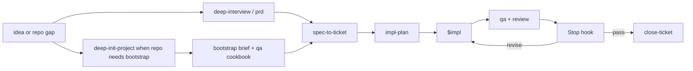

# Codexter

Ticket-first autonomous Codex harness.

Codexter turns fuzzy product asks into visible specs, tickets, execution rounds,
evidence-backed review, and closeout. The harness is strongest today at
single-ticket engineering with explicit proof and Stop-hook judgment. It is not
yet a fully autonomous multi-ticket dispatcher.

If a repo does not already have Codexter conventions such as `AGENTS.md`,
`docs/prd.md`, `docs/HISTORY.md`, `docs/MEMORY.md`, `docs/TROUBLES.md`, and
`tickets/`, start with `deep-init-project` before trying to use the full spec,
ticket, and execution workflow.

## Start Here

- Repo-local operating map: [AGENTS.md](/Users/kenjipcx/coding-harness/Codexter/AGENTS.md)
- Architecture map: [ARCHITECTURE.md](/Users/kenjipcx/coding-harness/Codexter/ARCHITECTURE.md)
- Specs index: [docs/specs/README.md](/Users/kenjipcx/coding-harness/Codexter/docs/specs/README.md)
- Harness-tuning doctrine: [harness-engineering-doctrine.md](/Users/kenjipcx/coding-harness/Codexter/docs/specs/harness-engineering-doctrine.md)
- Feature inventory: [harness-techniques.md](/Users/kenjipcx/coding-harness/Codexter/docs/specs/harness-techniques.md)
- Ticket contract: [tickets/README.md](/Users/kenjipcx/coding-harness/Codexter/tickets/README.md)
- QA cookbook surface: [qa/README.md](/Users/kenjipcx/coding-harness/Codexter/qa/README.md)
- Review scoring: [skills/review/README.md](/Users/kenjipcx/coding-harness/Codexter/skills/review/README.md)
- CLI cleanup workflow: [skills/desloppify/README.md](/Users/kenjipcx/coding-harness/Codexter/skills/desloppify/README.md)
- Parity-comparison workflow: [skills/parity-research/README.md](/Users/kenjipcx/coding-harness/Codexter/skills/parity-research/README.md)
- PR follow-up runtime workflow: [skills/pr-runtime/README.md](/Users/kenjipcx/coding-harness/Codexter/skills/pr-runtime/README.md)
- Frontend implementation orchestrator: [skills/frontend-craft/SKILL.md](/Users/kenjipcx/coding-harness/Codexter/skills/frontend-craft/SKILL.md)
- Functional UI redesign: [skills/functional-ui/SKILL.md](/Users/kenjipcx/coding-harness/Codexter/skills/functional-ui/SKILL.md)
- Visual design direction: [skills/visual-design/SKILL.md](/Users/kenjipcx/coding-harness/Codexter/skills/visual-design/SKILL.md)
- Landing page planning: [skills/landing-page/SKILL.md](/Users/kenjipcx/coding-harness/Codexter/skills/landing-page/SKILL.md)
- Active queue: [tickets](/Users/kenjipcx/coding-harness/Codexter/tickets)
- Project bootstrap: [skills/deep-init-project/README.md](/Users/kenjipcx/coding-harness/Codexter/skills/deep-init-project/README.md)

## Current State

Implemented now:

- discovery-first intake through `brainstorm`, `deep-interview`, `prd`,
  `deep-system-design`, `deep-ui-design`, and `agent-testability-plan`
- capability-first ticketization through `spec-to-ticket`
- bootstrap testability defaults propagated into ticket `Agent Contract` and
  `qa/cookbook` seeds through `spec-to-ticket`
- per-ticket planning through `impl-plan`
- feature-gap research through `gap-analysis` when net-new or partial feature
  scope depends on production-grade expectations
- parity-comparison research through `parity-research` when the main question is
  what other products, standards, or codebases consistently include
- frontend implementation through `frontend-craft`, with `functional-ui` for
  UX/workflow and broken-UI redesign, `visual-design` for look/taste/visual
  systems, and `landing-page` for one-page marketing or scrolltelling surfaces
- single-ticket execution through `$impl`
- anchored `review` rubrics plus evidence-gated completion
- `desloppify` for CLI-driven anti-slop cleanup, with default worker delegation
- same-session bounded persistence through `$loop`
- documenting and closeout through `close-ticket`
- isolated PR follow-up and concurrent-writer checkout setup plus ticket-scoped
  runtime launch/teardown through `pr-runtime` plus `ticket-runtime`
- Stop-hook phase routing and current-turn relevance checks
- optional `deep-init-project` scaffolding for `.githooks/`,
  `scripts/pre_commit_check.sh`, `scripts/pre_push_check.sh`, a starter `qa/`
  cookbook surface, and explicit `coderabbit-review`

Partial today:

- same-ticket auto-reentry is real, but the autonomous loop still centers on one
  selected ticket at a time
- tmux-backed worker lanes exist, but the runtime is still prototype-weight
- runtime observability doctrine is shipped, while hosted telemetry is still in
  progress in [TASK-0073](/Users/kenjipcx/coding-harness/Codexter/tickets/TASK-0073/ticket.md)
- anti-slop review exists in `review`, but there is not yet a separate
  human-grade report/video proof pack

Still missing:

- tighter QA routing and standard evidence packs that stop weak proof from
  counting as done
- compaction-safe reset and handoff discipline so long runs resume from the
  ticket instead of transcript drift
- clearer answer/plan/act routing plus deterministic subagent selection for
  direct user asks
- worktree-backed multi-session execution and a cloud-ready lane boundary
- transparency and ablation evals for measuring whether autonomy changes
  actually improve outcomes

## Core Flow



## Roadmap

Now:

- [TASK-0086: tighten planning around touched files, signature deltas, and oversized-file decisions](/Users/kenjipcx/coding-harness/Codexter/tickets/TASK-0086/ticket.md)
- [TASK-0087: enforce QA routing and evidence packs before completion](/Users/kenjipcx/coding-harness/Codexter/tickets/TASK-0087/ticket.md)
- [TASK-0088: make reset and resume handoffs concise and compaction-safe](/Users/kenjipcx/coding-harness/Codexter/tickets/TASK-0088/ticket.md)
- [TASK-0089: make execution routing default to answer, plan, or act](/Users/kenjipcx/coding-harness/Codexter/tickets/TASK-0089/ticket.md)

Next:

- [TASK-0081: add a worktree-backed multi-session runtime with a cloud-ready boundary](/Users/kenjipcx/coding-harness/Codexter/tickets/TASK-0081/ticket.md)

Later:

- [TASK-0082: add transparency and ablation evals for autonomy changes](/Users/kenjipcx/coding-harness/Codexter/tickets/TASK-0082/ticket.md)

The roadmap above reflects the current audit:

- the intake, per-ticket planning, review, Stop-hook gating, and closeout stack
  are already live
- the main missing product leap is not more mode sprawl; it is making plans,
  proof, and handoffs legible enough that the runtime can be trusted
- bigger runtime scale still matters, but only after the contract-first tickets
  make file ownership, evidence quality, and resume behavior harder to fake

## Setup

### Option A

Clone straight into `~/.codex`:

```bash
git clone <your-remote-url> ~/.codex
cp ~/.codex/config.local.env.example ~/.codex/config.local.env
```

### Option B

Keep the repo elsewhere and link it into `~/.codex`:

```bash
git clone <your-remote-url> ~/src/codexter
cd ~/src/codexter
bash install.sh
```

The installer links the tracked Codex-home surfaces, renders `config.toml` from
the tracked template on every run, and keeps secrets plus machine-local values
out of Git via:

- `~/.codex/config.local.env` for required placeholder values like `CODEX_HOME`
  and `REF_API_KEY`
- `~/.codex/config.local.toml` for trust entries, plugins, and any other
  machine-local TOML you want appended verbatim

The shipped global contract stays in `templates/global/AGENTS.md`.

## Canonical Surfaces

- Architecture map: [ARCHITECTURE.md](/Users/kenjipcx/coding-harness/Codexter/ARCHITECTURE.md)
- Specs: [docs/specs](/Users/kenjipcx/coding-harness/Codexter/docs/specs)
- Bootstrap brief: [skills/deep-init-project/references/BOOTSTRAP_BRIEF_TEMPLATE.md](/Users/kenjipcx/coding-harness/Codexter/skills/deep-init-project/references/BOOTSTRAP_BRIEF_TEMPLATE.md)
- Harness-tuning doctrine: [harness-engineering-doctrine.md](/Users/kenjipcx/coding-harness/Codexter/docs/specs/harness-engineering-doctrine.md)
- Current execution model: [spec-first-execution-loop.md](/Users/kenjipcx/coding-harness/Codexter/docs/specs/spec-first-execution-loop.md)
- Feature inventory: [harness-techniques.md](/Users/kenjipcx/coding-harness/Codexter/docs/specs/harness-techniques.md)
- Ticket contract: [tickets/README.md](/Users/kenjipcx/coding-harness/Codexter/tickets/README.md)
- QA cookbook surface: [qa/README.md](/Users/kenjipcx/coding-harness/Codexter/qa/README.md)
- Review scoring: [skills/review/README.md](/Users/kenjipcx/coding-harness/Codexter/skills/review/README.md)
- PR follow-up runtime workflow: [skills/pr-runtime/README.md](/Users/kenjipcx/coding-harness/Codexter/skills/pr-runtime/README.md)
- Active queue: [tickets](/Users/kenjipcx/coding-harness/Codexter/tickets)

## Current Limitation

Codexter already has the pieces for a strong spec -> ticket -> plan -> build ->
review loop. What it does not yet have is the final operator-trustworthy layer
that makes file-level intent, evidence quality, resume state, and action bias
consistently trustworthy enough to scale into multi-ticket automation.
