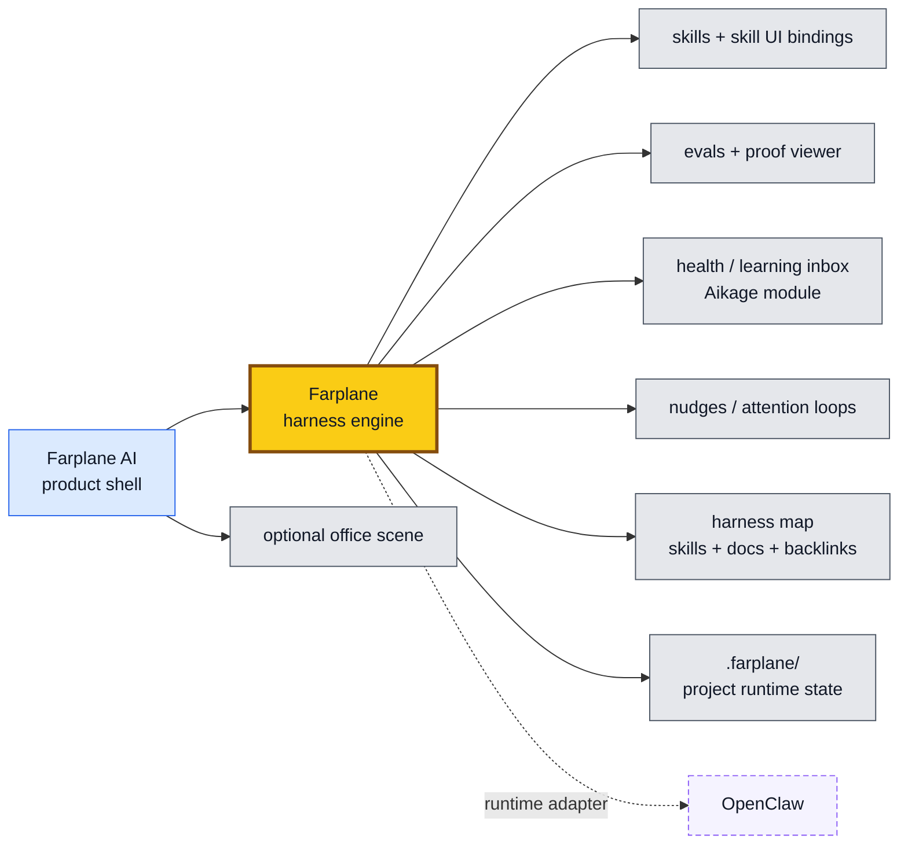

# Farplane

Farplane is the engine behind Zanarkand Labs' Farplane AI: a
drift-resistant, evolve-first harness and product shell for agentic work.

It gives Codex and adjacent agent runtimes a visible operating system:
structured skills, reviewable workflow artifacts, hooks, evals, benchmarks,
durable repo memory, and product-ready UI surfaces. The ticket-first autonomous
coding loop is one important feature, but Farplane is broader than tickets: it
is a way to keep an AI harness learning without letting it silently sprawl,
forget, or self-approve weak work.

## Product Shape

Farplane AI is the main product shell. The repo-owned Farplane harness remains
the engine: skills, hooks, evals, review, memory, runtime state, and proof
contracts. Other app ideas are absorbed as product modules or runtime adapters
instead of staying as separate centers of gravity.

The product rule is:

- **One shell:** Farplane AI owns navigation, shared UI, project/thread context,
  and first-class modules.
- **Skill-owned UI incubation:** a skill may ship a small viewer, panel, or URL
  binding before the workflow is productized.
- **Roll-up when proven:** useful skill UIs graduate into Farplane AI routes
  while keeping a skill binding back to the owning workflow.
- **Adapters stay adapters:** OpenClaw, Telegram paths, external CLIs, and
  future runtimes connect to the engine without becoming the product core.
- **State is Farplane-native:** project-local product/runtime state lives under
  `.farplane/`; global product state can live under `~/.farplane/` when the
  multi-project shell needs it.

## Architecture

## What Makes It Different

- **Drift-resistant by default.** Farplane keeps work grounded in visible docs,
  tickets, memories, validators, and review artifacts instead of transcript
  vibes.
- **Evolve-first.** Skills, workflows, and prompt behavior are meant to be
  benchmarked, revised, and re-tested as first-class harness surfaces.
- **Structured skills.** Skills are not loose prompt snippets; they have
  contracts, checklists, dependency shape, references, and on-demand plugin
  packaging when users want Codex plugin installs.
- **Function-defined harness.** Harness processes can be modeled as functions
  over inputs, visible artifacts, outputs, evidence, and state transitions, so
  skills, evals, hooks, memory drains, and tickets can compose without hidden
  variables.
- **Opinionated hooks.** Hooks track user intent, stop weak completion claims,
  route review, and will grow into real-time benchmark and skill-health
  monitoring.
- **Test-case memory.** The harness can preserve disliked outputs, misses, and
  benchmark cases so failures become reusable improvement pressure.
- **Human-marked hard cases.** Corrections and high-priority misses flow into
  local lessons, Notion improvement proposals, sanitized hardcase artifacts, or
  narrow regression eval rows through `gap-analysis`, `optimize-harness`, and
  `eval`.
- **Ticket-first autonomy as one mode.** Tickets remain the durable execution
  surface for coding work, but they are not the whole product.

## Gamechanging Workflows

- **Ask -> ground -> decide -> act.** Material work starts by checking local
  evidence, peer patterns, official/current docs when needed, and then uses
  advice-shaped decisions before execution.
- **Global prompt stays lean.** The installed AGENTS template carries only
  every-turn behavior; project coding defaults, skill procedures, review rules,
  and workflow detail live in owner files that can be tested and changed
  independently.
- **Skills render their own operating checklist.** Skill `SKILL.md` files own
  first-load todo lists, tiered dependency shape, references, and scripts so the
  agent can recursively compose workflows without stuffing the global prompt.
- **Failures become pressure, not vibes.** Operator corrections fix same-scope
  misses first, then capture a lesson, hardcase, or narrow regression eval when
  the miss is high-priority.
- **Validators can create hardcase seeds.** Deterministic skill-contract checks
  such as todo-tier violations can write deduplicated hardcases automatically,
  so obvious process failures become future eval/self-improvement material.
- **System-prompt behavior is evalable.** Repo-owned eval examples under
  `skills/eval/examples/` cover grounding, context gathering, advice routing,
  proactive action, holdback on risky work, skill todo rendering, correction
  capture, multitopic focus, and validator-triggered hardcase capture.
- **Long threads keep a whole-thread topic ledger.** In multitopic work,
  substantial replies name the root topic, tangents, and current focus, then
  split independently executable follow-ups into new-thread handoffs when the
  current chat is carrying too much.

## Improvement Loop

```mermaid
flowchart LR
  classDef input fill:#dbeafe,stroke:#2563eb,color:#111827
  classDef surface fill:#e5e7eb,stroke:#4b5563,color:#111827
  classDef proof fill:#fee2e2,stroke:#b91c1c,color:#7f1d1d
  classDef learn fill:#ccfbf1,stroke:#0f766e,color:#111827

  ask[/operator ask or correction/]:::input --> ground["reference grounding<br/>local + world evidence"]:::surface
  ground --> decide["advise / placement<br/>choose owning surface"]:::surface
  decide --> change["skill, prompt, doc,<br/>validator, ticket, or agent"]:::surface
  change --> verify["tests, evals,<br/>QA, review"]:::proof
  verify --> capture["lessons, hardcases,<br/>feature registry"]:::learn
  capture --> evals["regression evals<br/>or behavior tests"]:::proof
  evals --> change
```

## Repo Index

| Path | Contains |
| --- | --- |
| `AGENTS.md` | Project-local operating contract for developing Farplane itself. |
| `ARCHITECTURE.md` | Deeper system map, ownership boundaries, and read order. |
| `agents/` | Bounded specialist role configs. |
| `bin/` | Hooks, validators, runtime helpers, launchers, and sync scripts. |
| `docs/` | Specs, feature inventory, history, memory, troubles, lessons, and research. |
| `docs/features/` | Structured feature registry and feature metadata. |
| `docs/specs/` | Canonical behavior specs, meta-harness automation, and doc-gardening loop. |
| `experiments/` | Smoke runs, eval artifacts, prototypes, and temporary proof. |
| `.farplane/` | Ignored project-local runtime, generated, event, and product state. |
| `qa/` | QA cookbook, browser proof paths, and reusable test-entry guidance. |
| `rules/` | Shared policy fragments and prompt-engineering references. |
| `skills/` | Farplane skill packages, references, scripts, and templates. |
| `templates/` | Install-time global Codex templates and config scaffolding. |
| `tickets/` | Active task board, ticket template, artifacts, and archive. |

## Start Here

- Architecture map: [ARCHITECTURE.md](ARCHITECTURE.md)
- Specs index: [docs/specs/README.md](docs/specs/README.md)
- Harness algebra: [docs/specs/harness-algebra.md](docs/specs/harness-algebra.md)
- Self-growing harness map: [docs/specs/meta-harness-automation.md](docs/specs/meta-harness-automation.md)
- Feature inventory: [harness-techniques.md](docs/specs/harness-techniques.md)
- Structured feature registry: [docs/features/README.md](docs/features/README.md)
- Feature registry data: [docs/features/registry.jsonl](docs/features/registry.jsonl)
- Skill guide: [docs/skills/README.md](docs/skills/README.md)
- Ticket contract: [tickets/README.md](tickets/README.md)
- QA cookbook surface: [qa/README.md](qa/README.md)
- Review scoring: [skills/review/README.md](skills/review/README.md)
- Active queue: [tickets](tickets)

## Current Boundary

Farplane is installed into normal Codex and uses visible repo artifacts as the
control plane. It is not a hidden daemon, hosted scheduler, or parallel
multi-agent dispatcher today. Background hooks for live skill-health benchmarks
and saved disliked-case feedback loops are planned harness surfaces, not fully
shipped behavior yet.

Offline evals and human-marked failure capture are the shipped improvement
primitives today. Broader live skill-health benchmarks remain future work.
