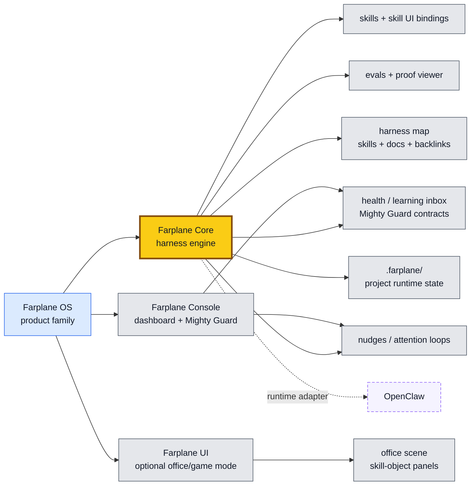

# Farplane


Farplane is Farplane Core: the drift-resistant, evolve-first harness behind
Farplane OS.

Farplane OS gives Codex and adjacent agent runtimes a visible operating system:
structured skills, reviewable workflow artifacts, hooks, evals, benchmarks,
durable repo memory, operational dashboards, and optional immersive UI
surfaces. The ticket-first autonomous coding loop is one important feature, but
Farplane Core is broader than tickets: it is a way to keep an AI harness
learning without letting it silently sprawl, forget, or self-approve weak work.

## Five Developer-Facing Differences

Farplane is for developers who want Codex to do serious work without turning
their repo into a haze of prompts, chat memory, and unverifiable claims.

1. **A local control plane for agent work.** Farplane keeps plans, tickets,
   runtime state, memories, specs, and proof in files that developers can diff,
   review, and repair.
2. **Goal loops that do not drift.** Goal Packets give long-running work a
   `ticket.md`, `program.md`, and `progress.md`; Goal Portfolios add
   `portfolio.md` when a business, product, or multi-agent loop needs a longer
   horizon without becoming one giant prompt.
3. **Completion that requires evidence.** QA, reviewer lanes, browser proof,
   maintainability review, Stop-hook checks, and Done / Proof contracts make
   "done" inspectable instead of self-reported.
4. **Skills that improve like software.** Farplane skills carry checklists,
   references, examples, evals, registries, validators, and maintenance scripts,
   so repeated workflows get better without bloating the global prompt.
5. **Harness health as a product surface.** Farplane Console and Mighty Guard
   turn weak skills, stale docs, failing evals, drift, telemetry, nudges, and
   maintenance findings into visible operator workflows.

## Product Shape

Farplane OS is the parent product family. This repo is Farplane Core: skills,
hooks, evals, review, memory, runtime state, and Done / Proof contracts. Farplane
Console is the practical dashboard for harness health and optimization.
Farplane UI keeps its current name as the optional immersive office/game
surface; Farplane Office is only an alias for that mode.

Current sibling shape:

| Surface | Path | Owns |
| --- | --- | --- |
| Farplane Core | `Farplane/` | Harness contracts, skills, hooks, evals, tickets, review, proof, and repo memory |
| Farplane Console | `Farplane-Console/` | Operational dashboard, activity telemetry, nudges, eval views, and Mighty Guard health workflows |
| Farplane UI | `Farplane-UI/` | Optional immersive office/game experience and skill-object interactions |
| Farplane Office | alias only | The office/game mode inside Farplane UI, not a repo rename |

Other app ideas are absorbed as Console modules, Core contracts, UI surfaces,
skill UIs, or archived experiments instead of staying as separate centers of
gravity.



The product rule is:

- **One product family:** Farplane OS owns the parent story while Core,
  Console, and UI keep clean surface boundaries.
- **Core owns proof:** Farplane Core owns harness semantics, skills, hooks,
  evals, tickets, review, memory, runtime state, and Done / Proof contracts.
- **Console owns operations:** Farplane Console owns the practical dashboard,
  activity telemetry, nudges, and Mighty Guard harness-health workflows.
- **UI stays optional:** Farplane UI owns the immersive office/game mode and
  skill-object interactions. Farplane Office is a mode alias, not a rename.
- **Skill-owned UI incubation:** a skill may ship a small viewer, panel, or URL
  binding before the workflow is productized.
- **Roll-up when proven:** useful skill UIs graduate into Console modules or
  Farplane UI surfaces while keeping a skill binding back to the owning
  workflow.
- **Adapters stay adapters:** OpenClaw, Telegram paths, external CLIs, and
  future runtimes connect to the engine without becoming the product core.
- **State is Farplane-native:** project-local product/runtime state lives under
  `.farplane/`; global product state can live under `~/.farplane/` when the
  multi-project shell needs it.

## Architecture


## Operating Loop

Farplane turns each material request into a visible loop:

```text
ask -> ground -> choose the owner -> act -> prove -> learn
```

The global prompt stays lean; durable behavior lives in skills, specs, tickets,
validators, subagents, evals, and review gates. When work fails, the correction
can become a lesson, hardcase, eval row, skill update, or harness-placement
decision instead of disappearing into chat history.

## Improvement Loop

```mermaid
flowchart LR
  classDef input fill:#dbeafe,stroke:#2563eb,color:#111827
  classDef surface fill:#e5e7eb,stroke:#4b5563,color:#111827
  classDef proof fill:#fee2e2,stroke:#b91c1c,color:#7f1d1d
  classDef learn fill:#ccfbf1,stroke:#0f766e,color:#111827

  ask[/operator ask or correction/]:::input --> ground["reference grounding<br/>local + world evidence"]:::surface
  ground --> decide["advise / placement<br/>choose owning surface"]:::surface
  decide --> change["skill, prompt, doc,<br/>validator, ticket, or agent"]:::surface
  change --> verify["tests, evals,<br/>QA, review"]:::proof
  verify --> capture["lessons, hardcases,<br/>feature registry"]:::learn
  capture --> evals["regression evals<br/>or behavior tests"]:::proof
  evals --> change
```



## Repo Index

| Path | Contains |
| --- | --- |
| `AGENTS.md` | Project-local operating contract for developing Farplane itself. |
| `ARCHITECTURE.md` | Deeper system map, ownership boundaries, and read order. |
| `agents/` | Bounded specialist role configs. |
| `assets/` | Repo-level media and generated assets. |
| `bin/` | Hooks, runtime helpers, compatibility validator wrappers, launchers, and sync scripts. |
| `bin/validators/` | Testable repo-wide validators for docs, harness invariants, skills, tiers, and registries. |
| `docs/` | Specs, feature inventory, history, memory, troubles, lessons, and research. |
| `docs/features/` | Structured feature registry and feature metadata. |
| `docs/fundamentals/` | Harness theory, doctrine, and cross-surface best practices. |
| `docs/specs/` | Buildable behavior contracts, lifecycle specs, runtime adapters, and proof gates. |
| `experiments/` | Smoke runs, eval artifacts, prototypes, and temporary proof. |
| `.farplane/` | Ignored project-local runtime, generated, event, and product state. |
| `qa/` | QA cookbook, browser proof paths, and reusable test-entry guidance. |
| `rules/` | Machine-readable local rule files. Durable best-practice docs live under `docs/specs/`. |
| `skills/` | Farplane skill packages, references, scripts, and templates. |
| `templates/` | Install-time global Codex templates and config scaffolding. |
| `tickets/` | Active task board, ticket template, artifacts, and archive. |

## Start Here

- Architecture map: [ARCHITECTURE.md](ARCHITECTURE.md)
- Fundamentals: [docs/fundamentals/README.md](docs/fundamentals/README.md)
- Specs index: [docs/specs/README.md](docs/specs/README.md)
- Harness algebra: [docs/fundamentals/harness-algebra.md](docs/fundamentals/harness-algebra.md)
- Prompt engineering: [docs/fundamentals/prompt-engineering.md](docs/fundamentals/prompt-engineering.md)
- Self-growing harness map: [docs/specs/harness-techniques.md](docs/specs/harness-techniques.md#self-growing-harness-map)
- Feature inventory: [harness-techniques.md](docs/specs/harness-techniques.md)
- Structured feature registry: [docs/features/README.md](docs/features/README.md)
- Feature registry data: [docs/features/registry.jsonl](docs/features/registry.jsonl)
- Skill guide: [docs/skills/README.md](docs/skills/README.md)
- Skill best practices: [docs/skills/best-practices.md](docs/skills/best-practices.md)
- Ticket contract: [tickets/README.md](tickets/README.md)
- Goal loop contract: [docs/specs/goal-loop-contract.md](docs/specs/goal-loop-contract.md)
- QA cookbook surface: [qa/README.md](qa/README.md)
- Review scoring: [skills/review/README.md](skills/review/README.md)
- Maintainability code review: [skills/code-review/README.md](skills/code-review/README.md)
- Active queue: [tickets](tickets)

## Current Boundary

Farplane is installed into normal Codex and uses visible repo artifacts as the
control plane. It is not a hidden daemon, hosted scheduler, or parallel
multi-agent dispatcher today. Background hooks for live skill-health benchmarks
and saved disliked-case feedback loops are planned harness surfaces, not fully
shipped behavior yet.

Offline evals and human-marked failure capture are the shipped improvement
primitives today. Broader live skill-health benchmarks remain future work.
