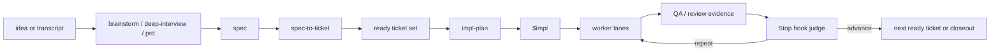
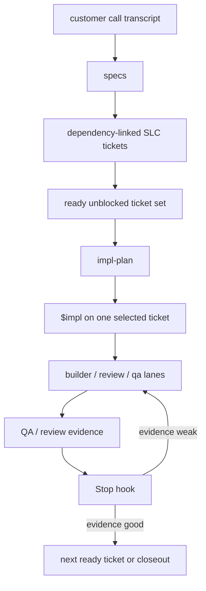
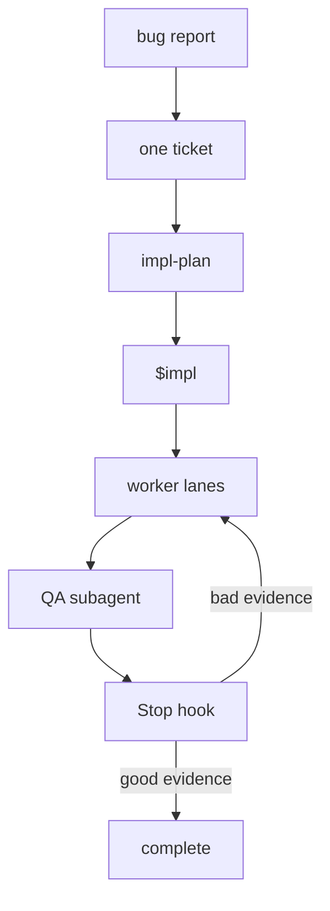
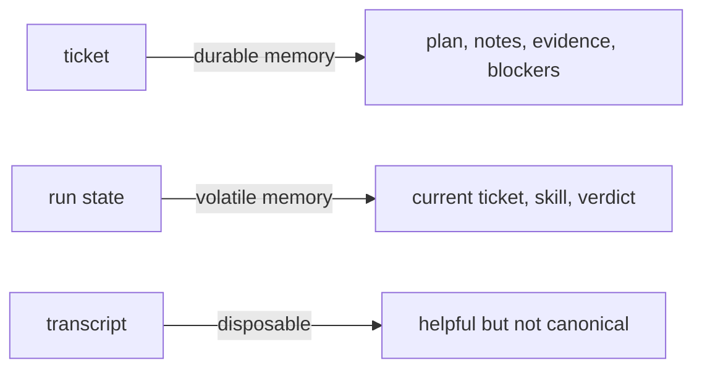
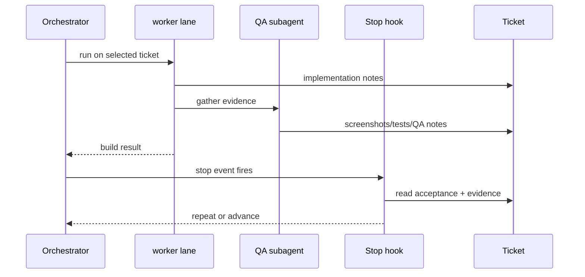

# Codexter

Ticket-first autonomous Codex harness.

If a repo does not already have Codexter conventions such as `AGENTS.md`, `docs/prd.md`, `docs/HISTORY.md`, `docs/MEMORY.md`, `docs/TROUBLES.md`, and `tickets/`, start with `init-project` before trying to use the full spec, ticket, and execution workflow.

The core idea is simple:

- `brainstorm` explores options before commitment
- `deep-interview` sharpens vague inputs into clear product requirements
- humans think in specs and tickets
- `spec-to-ticket` turns a coherent spec into dependency-linked work items
- `impl-plan` plans one selected ticket for execution
- `$impl` orchestrates one selected ticket through builder/reviewer/QA/evidence-check lanes
- the reviewer writes an anchored rubric-based `Review Packet`
- worker lanes such as `ralph` implement the selected ticket and gather evidence
- a `Stop` `hook` judges the evidence and current-turn intent alignment
- the orchestrator decides whether to repeat, advance, block, complete, or move to the next ready ticket

## One Picture



## Phase Model

The intended system has five broad phases.

### 1. Spec Phase

This is the fuzzy-input funnel.

- `brainstorm` explores options when the request is still loose
- `deep-interview` narrows scope and constraints
- `prd` writes the product or feature brief when needed
- the output is one coherent spec, not executable tickets yet

This phase should be good at:

- turning vague requests into something real
- deciding whether the work is one slice or many
- clarifying success criteria before execution starts

### 2. Ticketization Phase

This is where a coherent spec becomes executable work.

- `spec-to-ticket` should split the spec into dependency-linked tickets
- tickets should stay small enough to execute, but large enough to be meaningful
- dependencies should make the next ready set obvious

The key output is:

- a Markdown ticket board in `tickets/*.md`
- explicit `depends_on`
- explicit readiness/blocking state

### 3. Planning Phase

This is per-ticket, not per-spec.

- `impl-plan` plans one selected ticket for execution
- the ticket should end this phase with a concrete execution plan and proof target

Important boundary:

- broad decomposition belongs before this phase
- this phase should plan one ticket, not explode a whole spec into many tickets

### 4. Build Orchestration Phase

This is the per-ticket orchestration layer.

The goal is simple:

- read one selected approved ticket
- launch the right worker lanes
- keep the ticket as the visible progress surface
- let the Stop hook decide continuation vs completion

In the smallest useful form, `$impl` should:

- take an explicit ticket selector, or fall back to the active ticket only when state is unambiguous
- launch builder/reviewer/QA/evidence-check lanes
- integrate their outputs into the ticket
- exit after the round

This does not require cloud by default.
Execution lanes could be:

- local tmux panes
- local worktrees
- prompt-mode worker processes
- cloud runners later if ever needed

### 5. Build / Proof / Review Phase

This is the long-running per-ticket execution loop.

For one selected ticket, the worker lanes should:

1. build
2. prove
3. review
4. fix if needed
5. gather evidence
6. hand results to the judge

This is where the multi-step work lives:

- implementation
- debloating/refinement
- code review
- tests/typecheck/lint
- QA subagents
- visual or runtime evidence collection
- repeated repair until the judge accepts the result

After the judge accepts the ticket, closeout can include:

- commit
- PR
- final documentation writeback
- archive when the ticket is fully processed

## Why This Exists

Long-running agent work fails in four predictable ways:

- vague work starts too early
- one giant transcript drifts
- evidence is logged but not sanity-checked
- humans cannot tell what happened later

Codexter solves that by making the **ticket** the canonical memory object and keeping sessions disposable.

## Front-End Funnel


## Story: Greenfield



Minimal interpretation:

1. You ingest a messy idea.
2. It becomes specs.
3. Specs become dependency-aware tickets.
4. The next unblocked ticket set becomes available.
5. A selected ticket gets planned.
6. `$impl` orchestrates the selected ticket.
7. Evidence is gathered.
8. The hook either forces another pass or lets the system move on.

## Story: Brownfield



This is the same system, just with one ticket instead of many.

## The Important Boundary



- **ticket** = durable task memory
- **run state** = machine-readable current step
- **transcript** = disposable

That is why the system can recover from resets without losing the real task state.

## Evidence Gate



This is the whole philosophy:

- the `skill` produces evidence
- the `hook` decides whether that evidence is actually good enough

## Target Loop

The target end-to-end loop is:

1. input arrives as an idea, bug, spec, or board item
2. spec-stage skills clarify it until success is legible
3. ticketization converts it into dependency-linked tickets
4. planning writes an execution-ready plan into one selected ticket
5. `$impl` selects one approved ticket and launches the worker lanes
6. worker lanes run the selected ticket
7. QA/review/test evidence is collected
8. the Stop hook judges whether the evidence is good enough
9. accepted tickets move to closeout, commit/PR, and eventual archive
10. remaining unblocked tickets are selected next

This is the intended final shape.

The current prototype is narrower:

- single-ticket `$impl`-style orchestration is now the intended public direction
- single-ticket bounded Ralph loops are still the main worker/runtime surface
- live Stop-hook continuation is real
- anchored review rubrics and ticket `Review Packet` gates are real
- current-turn intent capture now feeds Stop-hook relevance checks
- tmux visibility is real
- board-wide dispatch and archival are still future slices

## What Is Canonical Today

- Specs: [docs/specs](/Users/kenjipcx/coding-harness/Codexter/docs/specs)
- Current execution spec: [spec-first-execution-loop.md](/Users/kenjipcx/coding-harness/Codexter/docs/specs/spec-first-execution-loop.md)
- V2 direction: [ralph-v2-direction.md](/Users/kenjipcx/coding-harness/Codexter/docs/specs/ralph-v2-direction.md)
- Intake skills: [skills/brainstorm](/Users/kenjipcx/coding-harness/Codexter/skills/brainstorm), [skills/deep-interview](/Users/kenjipcx/coding-harness/Codexter/skills/deep-interview), [skills/prd](/Users/kenjipcx/coding-harness/Codexter/skills/prd)
- Ticketization: [skills/spec-to-ticket](/Users/kenjipcx/coding-harness/Codexter/skills/spec-to-ticket)
- Planning: [skills/impl-plan](/Users/kenjipcx/coding-harness/Codexter/skills/impl-plan)
- Execution and review skills: [skills/impl](/Users/kenjipcx/coding-harness/Codexter/skills/impl), [skills/ralph](/Users/kenjipcx/coding-harness/Codexter/skills/ralph), [skills/review](/Users/kenjipcx/coding-harness/Codexter/skills/review), [skills/docs-closeout](/Users/kenjipcx/coding-harness/Codexter/skills/docs-closeout)
- Feature inventory: [harness-techniques.md](/Users/kenjipcx/coding-harness/Codexter/docs/specs/harness-techniques.md)
- Runtime scripts: [bin](/Users/kenjipcx/coding-harness/Codexter/bin)
- Active queue: [tickets](/Users/kenjipcx/coding-harness/Codexter/tickets) is the live board; do not rely on hardcoded queue summaries here
- Archived prototypes/history: [archive](/Users/kenjipcx/coding-harness/Codexter/tickets/archive)
- Experiments: [experiments](/Users/kenjipcx/coding-harness/Codexter/experiments)

## Harness Techniques

The canonical inventory of techniques now lives in:

- [harness-techniques.md](/Users/kenjipcx/coding-harness/Codexter/docs/specs/harness-techniques.md)

Main live techniques today:

- discovery-first intake before execution
- spec-first ticketization with proof/testability contracts
- per-ticket planning via `impl-plan`, with approval-first default mode and consensus mode when stronger challenge is needed
- single-ticket orchestration via `$impl`
- separated builder, reviewer, QA, and evidence-check roles
- Stop-hook judgment as the final continuation/completion gate
- tickets as durable task memory plus `HISTORY` / `MEMORY` / `TROUBLES` writeback
- skills and subagents as the main reusable operating surfaces

The full doc also distinguishes which techniques are only proposed experiments,
so the repo does not blur current behavior with future ideas.

## Current Prototype Status

What is proven:

- planning now routes through one public planner surface: `impl-plan`
- `ralph` with missing evidence gets repeated
- review now uses anchored rubric families plus hard `evidence-quality` and `integration-readiness` gates
- ticket `Review Packet` state is part of Ralph completion gating
- project-local `current-run.json` is enough for replay-level hook selection
- current-turn user intent can be captured and used for Stop-hook relevance checks
- real Codex sessions now fire the `Stop` `hook`
- live sessions can produce `hook: Stop Blocked`
- tmux-backed Ralph lanes can run as real interactive Codex sessions
- live Stop-hook repeats can keep the same tmux pane active instead of falling back to a fresh wrapper lane
- `python3 skills/impl/scripts/tmux_helper.py status` now centralizes the active lane, session id, judge verdict, next phase, and latest hook summary

Where to see that:

- [2026-04-05-stop-hook-smoke.md](/Users/kenjipcx/coding-harness/Codexter/experiments/2026-04-05-stop-hook-smoke.md)
- [latest-runs.json](/Users/kenjipcx/coding-harness/Codexter/experiments/latest-runs.json)
- [stop-hook.jsonl](/Users/kenjipcx/coding-harness/Codexter/.ralph/logs/stop-hook.jsonl)

Main remaining gap:

- long-running multi-ticket client work is not proven yet
- there is still no durable multi-ticket dispatcher or OMX-style mailbox/claim/worktree runtime

## Setup

### Option A: Clone straight into `~/.codex`

```bash
git clone <your-remote-url> ~/.codex
cp ~/.codex/config.toml.example ~/.codex/config.toml
```

Then replace placeholders and local secrets in `~/.codex/config.toml`.

### Option B: Keep the repo elsewhere and link it into `~/.codex`

```bash
git clone <your-remote-url> ~/src/codex-harness
cd ~/src/codex-harness
bash install.sh
```

The installer:

- links `templates/global/AGENTS.md` into `~/.codex/AGENTS.md`
- links tracked files into `~/.codex`
- seeds `config.toml` if missing
- links `hooks.json` when present

Inside this repo, root [AGENTS.md](/Users/kenjipcx/coding-harness/Codexter/AGENTS.md) is now project-local context for working on Codexter itself, not the shipped global install artifact.

## Bootstrap Checklist

1. Copy `config.toml.example` to `config.toml`.
2. Replace `__CODEX_HOME__` with the real absolute path.
3. Add secret MCP URLs locally only.
4. Add trust entries locally only.
5. Run:

```bash
python3 -m py_compile bin/notify.py
bash -n install.sh
```

## If You Only Read One More Thing

Read the visual walkthrough:

- [ralph-flow-examples.md](/Users/kenjipcx/coding-harness/Codexter/docs/specs/ralph-flow-examples.md)
