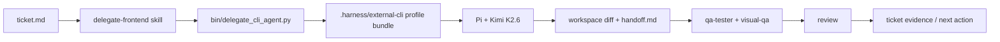

# External CLI Delegation Proposal

Date: 2026-05-05 01:44 +0800

## Summary

Codexter should add a generalized external CLI delegation layer,
`delegate-cli`, then ship `delegate-frontend` as the first concrete profile.
The point is not "delegate frontend only." The point is a stable way to route
work to the CLI/model/harness combination that is strongest for that work while
Codexter keeps ticket ownership, review, QA, artifact capture, and final
integration authority.

The first target profile should be Pi, the Mario Zechner CLI agent, configured
with Kimi K2.6 for UI-heavy work. Frontend is the first proving ground because
it is the pain the operator named, not because the architecture should stop
there.

The important naming correction from research: the Mario Zechner tool is
`pi`, not `py`. The "Bored Games Lab" clue appears to point to either
`badlogic/pi-mono` / `badlogicgames` for Pi, or to `bogware/bog-agents` for a
Python/LangGraph CLI agent. The architecture should support both through
adapters, but the frontend-first path is strongest with Pi because it already
loads `AGENTS.md`, uses the Agent Skills format, supports project-local skill
paths, and exposes print, JSON, RPC, model, tool, and skill flags.

## Research Facts

### Pi by Mario Zechner

- Source repo: <https://github.com/badlogic/pi-mono>
- Package: `@mariozechner/pi-coding-agent`
- Current package metadata checked locally via npm: version `0.72.1`, binary
  `pi`, repo directory `packages/coding-agent`.
- Install path: `npm install -g @mariozechner/pi-coding-agent`.
- Non-interactive execution: `pi -p "prompt"` or `pi --mode json`.
- Programmatic integration: `pi --mode rpc` or SDK from
  `@mariozechner/pi-coding-agent`.
- Model selection: `--provider <name>`, `--model <pattern-or-id>`,
  `--thinking <off|minimal|low|medium|high|xhigh>`.
- Tool restriction: `--tools read,bash,edit,write,grep,find,ls` or narrower
  read-only allowlists.
- Skill loading: Pi supports Agent Skills and can load skills from
  `~/.pi/agent/skills`, `.pi/skills`, `.agents/skills`, `settings.json`, or
  repeated `--skill <path>`.
- Context loading: Pi loads `AGENTS.md` from global, parent, and current
  directories.
- Package/resource loading: `.pi/settings.json` can declare `skills`,
  `extensions`, `prompts`, `themes`, and packages.
- Pi's own README says it intentionally skips built-in subagents and plan mode;
  those are meant to be built through extensions, tmux, skills, or packages.

### Bog Agents CLI

- Source repo: <https://github.com/bogware/bog-agents>
- Package: `bog-agents-cli`
- Current package metadata checked locally via pip index: version `0.8.1`.
- Install path: `pipx install bog-agents-cli` or `pip install bog-agents-cli`.
- Non-interactive execution: `bog-agents -n "task" --auto-approve`.
- Pipe-friendly execution: `bog-agents -p "prompt"`.
- JSON output: `--json`.
- Model selection: repo README shows `bog-agents -M <provider:model>`, with
  OpenRouter support via `openrouter:<model-id>`.
- Built on LangGraph, with richer built-in planning, subagents, QA, memory,
  MCP, and sandbox middleware than Pi.
- It is a credible second adapter, especially if the operator meant a Python
  CLI rather than Pi.

### Kimi K2.6

- OpenRouter model id: `moonshotai/kimi-k2.6`.
- Pi model page lists provider `openrouter`, API `openai-completions`, base URL
  `https://openrouter.ai/api/v1`, text/image input, reasoning support, a
  262,142-token context window, and pricing at $0.74/M input and $3.49/M
  output at the checked page.
- OpenRouter describes Kimi K2.6 as aimed at long-horizon coding, UI/UX
  generation, multimodal input, and multi-agent orchestration.

## Self-Interview Brief

- `Intent:` Codex is strong at code integration and review but often produces
  bland or misjudged frontend design. The user wants a better taste and UI
  implementation lane without throwing away Codexter's ticket/review system.
- `Outcome:` A single Codexter command or skill can hand a UI ticket to an
  external CLI agent using the right adapter/profile, pass the needed
  skills/context, collect the resulting diff and handoff notes, then route the
  result back through Codexter QA/review.
- `Scope:` First slice builds the reusable `delegate-cli` adapter/profile
  contract and proves it with frontend implementation/design-polish through
  Pi + Kimi K2.6. It does not build a full multi-agent scheduler.
- `Non-goals:` Do not replace Codexter's ticket lifecycle, Stop hook, visual
  QA, review, or final integration authority. Do not silently auto-publish or
  push external CLI results.
- `Decision boundaries:` Codexter may choose adapter shape, artifact paths, and
  generated config format. The operator still chooses whether Pi or Bog Agents
  is the default once a real smoke run compares them.
- `Success criteria:` From an active UI ticket, Codexter can run one command,
  stage the external agent environment, call the external CLI with the ticket
  context and frontend skills, capture logs/artifacts, and leave a reviewable
  diff plus handoff note.

## Brainstorm

### Direction A: Dedicated Pi Frontend Subagent Profile

Package only the frontend path:

- `skills/delegate-frontend/`
- `bin/delegate_frontend_pi.py`
- project-local `.pi/settings.json` generation
- copied or symlinked frontend skill subset
- Pi command pinned to Kimi K2.6

`User value:` fastest path to the exact stated problem.

`Implementation risk:` medium; Pi's frontend behavior still needs a real smoke
run and guardrails.

`Speed to first lovable slice:` high.

`Dependency cost:` Node/npm plus OpenRouter or Kimi provider credentials.

### Direction B: General External CLI Router With Frontend As First Profile

Build `delegate-cli` as the stable primitive and define `frontend-pi-kimi` as
the first adapter/profile. Add adapters such as `bog-*`, `opencode-*`,
`kimi-cli-*`, or `claude-*` only after the primitive proves it can set up,
launch, capture artifacts, and hand results back through Codexter review.

`User value:` solves today's frontend delegation problem and gives Codexter a
clean way to route future weak spots to stronger CLIs.

`Implementation risk:` moderate; the abstraction must stay small and artifact
driven.

`Speed to first lovable slice:` high if the first implementation only supports
one adapter/profile while preserving the general profile schema.

`Dependency cost:` wrapper script plus profile templates.

### Direction C: Bog Agents Python Frontend Worker

Use `bog-agents-cli` as the target because it is Python-native and already has
subagents, planning, QA, MCP, memory, and sandbox affordances.

`User value:` best match if the operator truly meant a Python CLI called "Py".

`Implementation risk:` medium-high; it has more machinery, and its skills /
agent prompt formats need repo-level validation before Codexter relies on it.

`Speed to first lovable slice:` medium.

`Dependency cost:` Python 3.11+, pipx/uv, provider extras, settings/profile
mapping.

### Recommendation

Choose Direction B. Implement it as "general primitive, Pi-first profile." This
keeps the system honest: the first shippable feature is still frontend
delegation to Pi + Kimi K2.6, but the primary artifact is a reusable external
CLI delegation contract that future profiles can share.

## Advice Decisions

### Decision 1: Dedicated Frontend Skill Or General CLI Delegation Skill?

`Options:`

1. `delegate-frontend` only.
   - Pros: easy to explain, hard to misuse, fastest to ship.
   - Cons: future CLI delegation repeats the same plumbing.
2. `delegate-cli` only.
   - Pros: flexible and reusable.
   - Cons: too abstract for the immediate frontend pain; agents may route too
     much work away from Codex.
3. `delegate-cli` platform plus `delegate-frontend` public profile skill.
   - Pros: clean primitive, clear first use case, controlled routing.
   - Cons: slightly more files and naming to maintain.

`Recommendation:` option 3. The user-facing command should be
`delegate-frontend` for this first workflow, but the shipped architecture should
center `delegate-cli` as the reusable platform.

`Tradeoff accepted:` a small amount of upfront structure to avoid a pile of
single-purpose wrappers later.

### Decision 2: Pi, Bog Agents, Or Kimi CLI First?

`Options:`

1. Pi with Kimi K2.6.
   - Pros: directly matches Mario Zechner clue, Agent Skills compatible,
     `AGENTS.md` aware, supports `-p`, JSON, RPC, explicit skill loading, and
     OpenRouter Kimi K2.6 config.
   - Cons: no built-in subagents; we must treat the whole Pi run as the
     delegated subagent.
2. Bog Agents CLI with Kimi K2.6 through OpenRouter.
   - Pros: Python-native, built-in planning/subagents/QA/sandboxes.
   - Cons: heavier, more moving parts, and less directly aligned with the
     existing Codexter skill format until tested.
3. Moonshot/Kimi CLI directly.
   - Pros: likely most native Kimi behavior.
   - Cons: not enough researched integration surface yet, and it would skip the
     Pi/Bog harness affordances.

`Recommendation:` option 1 for v1, with option 2 as a planned experimental
adapter. Keep Kimi CLI as a research target, not the first integration.

`Tradeoff accepted:` Pi's minimalism means Codexter owns the orchestration
contract explicitly, which is actually aligned with Codexter's artifact-first
design.

### Decision 3: How Should Skills Transfer?

`Options:`

1. Symlink Codexter frontend skills into `.pi/skills`.
   - Pros: zero copy drift.
   - Cons: brittle across machines and risky if target CLI mutates files.
2. Generate a managed external-agent bundle under `.harness/external-cli/`.
   - Pros: explicit, disposable, can include adapted prompts and only the
     allowed skills.
   - Cons: generated state must stay ignored and reproducible.
3. Make a versioned Pi package from Codexter frontend skills.
   - Pros: clean distribution once stable.
   - Cons: premature; adds publishing/package concerns before smoke proof.

`Recommendation:` option 2 for v1. The setup script should create a managed
bundle from repo-owned templates and selected skill sources, then launch Pi with
`--skill` flags or a generated `.pi/settings.json`.

`Tradeoff accepted:` generated bundle logic is slightly more work, but it gives
Codexter an audit boundary and avoids hidden global state.

### Decision 4: Shared Checkout Or Isolated Worktree?

`Options:`

1. Run external CLI directly in the current checkout.
   - Pros: simplest.
   - Cons: contention risk if Codex is also editing.
2. Always create a worktree.
   - Pros: safer for concurrent writers.
   - Cons: more setup and merge complexity for small edits.
3. Support both, defaulting to current checkout for manual runs and worktree
   for `$impl`/ticketed execution.
   - Pros: ergonomic and safe where it matters.
   - Cons: wrapper must carry checkout metadata.

`Recommendation:` option 3. The first script can support `--checkout shared`
and `--checkout worktree`; `delegate-frontend` should recommend worktree mode
inside active ticket execution.

`Tradeoff accepted:` more CLI flags now to avoid designing around one runtime
mode later.

## Proposed System

### Owning Surfaces

- `skills/delegate-frontend/`: public skill for frontend asks that should leave
  Codex and run through a configured external CLI profile.
- `skills/delegate-cli/`: reusable workflow for routing work to configured CLI
  adapters and profiles. This should exist in v1, even if `delegate-frontend`
  is the first documented happy path.
- `bin/delegate_cli_agent.py`: deterministic launcher and artifact collector.
- `templates/external-cli/profiles/frontend-pi-kimi/`: prompt, settings, and
  bundle templates for Pi frontend runs.
- `templates/external-cli/adapters/pi/`: Pi command construction, settings
  hints, and result parsing expectations.
- `templates/external-cli/adapters/bog/`: deferred until after Pi smoke proof.
- `.harness/external-cli/<profile>/<run-id>/`: ignored runtime bundle, logs,
  generated settings, copied skills, prompt file, and result note.
- `tickets/TASK-*/artifacts/external-cli/<run-id>/`: durable ticket-linked
  output copied from the runtime bundle.

### Setup Script Shape

Recommended command:

```bash
python3 bin/delegate_cli_agent.py setup \
  --profile frontend-pi-kimi \
  --model openrouter/moonshotai/kimi-k2.6 \
  --skills frontend-craft,functional-ui,visual-design,landing-page,frontend-design
```

Setup responsibilities:

1. Verify `pi` is installed or print the exact install command.
2. Verify `OPENROUTER_API_KEY` or target provider auth exists.
3. Create `.harness/external-cli/profiles/frontend-pi-kimi/`.
4. Generate Pi settings or launch metadata with Kimi K2.6 as default.
5. Copy or materialize the selected frontend skill directories into the managed
   bundle.
6. Generate a frontend-agent instruction file that says the external CLI is a
   delegated builder, not the final reviewer.
7. Run a dry doctor check such as `pi --version` and optionally
   `pi --list-models kimi`.

### Delegation Command Shape

Recommended command:

```bash
python3 bin/delegate_cli_agent.py run \
  --profile frontend-pi-kimi \
  --ticket tickets/TASK-XXXX/ticket.md \
  --checkout worktree \
  --prompt "Implement the frontend plan and write the handoff note."
```

The Pi adapter should launch something close to:

```bash
PI_TELEMETRY=0 \
pi --model openrouter/moonshotai/kimi-k2.6 \
  --thinking high \
  --skill .harness/external-cli/profiles/frontend-pi-kimi/skills/frontend-craft \
  --skill .harness/external-cli/profiles/frontend-pi-kimi/skills/functional-ui \
  --skill .harness/external-cli/profiles/frontend-pi-kimi/skills/visual-design \
  --skill .harness/external-cli/profiles/frontend-pi-kimi/skills/landing-page \
  --skill .harness/external-cli/profiles/frontend-pi-kimi/skills/frontend-design \
  -p @.harness/external-cli/runs/<run-id>/prompt.md
```

For machine parsing, prefer `--mode json` once the adapter needs stable event
capture. Use `-p` for the first smoke run because it is easier to debug.

### Prompt Contract

The external CLI prompt should include:

- ticket path and summary
- exact owning files or feature scope
- Codexter frontend skill bundle path
- expected output artifact:
  `tickets/TASK-XXXX/artifacts/external-cli/<run-id>/handoff.md`
- instruction to preserve unrelated user changes
- instruction that Codexter owns final review, QA, and integration
- instruction to run local tests/builds when available and report exact
  commands/results
- instruction to avoid push/deploy/publish/destructive actions

### Result Contract

Every run should end with a structured handoff:

```markdown
# External CLI Handoff

Profile: frontend-pi-kimi
Adapter: pi
Model: openrouter/moonshotai/kimi-k2.6
Ticket: tickets/TASK-XXXX/ticket.md

## Changed Files
- path

## Behavior Built
- before -> after

## Verification
- command -> result

## Risks / Followups
- item
```

The launcher should also capture:

- `prompt.md`
- `stdout.log`
- `stderr.log`
- `exit_code.txt`
- optional JSON events
- optional `git diff --stat`
- optional `git diff` patch for review

### Codexter Loop



Codexter remains the final orchestrator. The external CLI is a builder lane.

## Placement Analysis

### Repo-local `AGENTS.md`

Good for adding one durable routing rule after the workflow is proven:
frontend implementation may route to `delegate-frontend` when the ticket calls
for external CLI delegation. Not the primary first surface because this needs a
repeatable workflow and a script, not a root-policy expansion.

### `templates/global/AGENTS.md`

Not first. This is not yet a cross-repo default; it depends on local CLI
installation, credentials, and Codexter-specific ticket/evidence surfaces.

### `skills/*`

Primary surface. The operator-facing behavior is procedural: decide when to
delegate, prepare the prompt bundle, run the adapter, and bring results back
through ticket evidence/review.

### `agents/*.toml`

Not primary for Pi because Pi does not have native subagents. For Bog Agents,
profile/agent definitions may belong in generated settings later, but the
Codexter-owned wrapper should still be a skill plus script.

### Hooks / `bin/*`

Secondary required surface. The deterministic behavior belongs in
`bin/delegate_cli_agent.py`: setup, launch, logs, exit codes, artifact copying,
and future adapter dispatch.

## First Implementation Plan

1. Add `skills/delegate-cli/` with the generic adapter/profile contract,
   setup/run/doctor workflow, prompt/result contract, and safety boundaries.
2. Add `skills/delegate-frontend/` as a thin profile skill that routes frontend
   implementation/design-polish work to `delegate-cli --profile frontend-pi-kimi`.
3. Add `templates/external-cli/profiles/frontend-pi-kimi/` with:
   - `APPEND_SYSTEM.md`
   - `prompt.md.tpl`
   - `handoff.md.tpl`
   - `settings.json.tpl`
4. Add `templates/external-cli/adapters/pi/` with the Pi command contract.
5. Add `bin/delegate_cli_agent.py` with `setup`, `run`, and `doctor` subcommands.
6. Add `.gitignore` coverage for `.harness/external-cli/` runtime bundles if
   not already covered.
7. Add a smoke fixture that runs `--dry-run` without calling Pi and validates
   generated prompt/settings/artifact paths.
8. Add a real manual smoke command documented in the skill:
   `pi -p @prompt.md` against a tiny frontend fixture.
9. Update `README.md`, `ARCHITECTURE.md`, and
   `docs/specs/harness-techniques.md` only after the dry-run proof exists.

## Open Questions For The Next Plan

1. Should the first smoke run use Pi through OpenRouter, Kimi For Coding, or
   the direct Moonshot provider? Recommendation: OpenRouter first because both
   Pi and Bog Agents document clear model id paths for it.
2. Should external CLI runs be allowed to edit in the main checkout? Recommendation:
   yes for manual one-shot runs, no for `$impl` by default.
3. Should the frontend skill bundle be copied or referenced in place?
   Recommendation: copy into `.harness/external-cli/` for the first run, then
   consider symlinks or packages only if drift becomes painful.
4. Should Bog Agents be implemented in the same ticket? Recommendation: no.
   Add the adapter interface so Bog can plug in, but prove Pi first.

## Sources

- Pi coding agent docs: <https://pi.dev/docs/latest/skills>
- Pi coding agent README: <https://github.com/badlogic/pi-mono/blob/main/packages/coding-agent/README.md>
- Pi monorepo: <https://github.com/badlogic/pi-mono>
- Pi Kimi K2.6 model page: <https://pi.dev/models/openrouter/moonshotai-kimi-k2-6>
- OpenRouter Kimi K2.6 page: <https://openrouter.ai/moonshotai/kimi-k2.6/api>
- Bog Agents PyPI page: <https://pypi.org/project/bog-agents-cli/>
- Bog Agents repo: <https://github.com/bogware/bog-agents>
