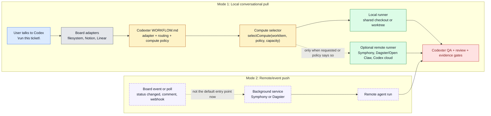

# Architecture Note: Codexter, Symphony, Dagster, and Kanban Compute Selection

Date: 2026-05-05

Update:

- This memo captured an intermediate architecture discussion and over-emphasized
  Open Claw after it was used as an example.
- The corrected implementation target is
  [docs/specs/symphony-compatible-codexter-runner.md](/Users/kenjipcx/coding-harness/Codexter/docs/specs/symphony-compatible-codexter-runner.md):
  make Codexter easy for Symphony or another external runner to invoke while
  preserving local Codex execution.
- Treat Open Claw as context only, not as the primary integration focus.

## Decision

Codexter should become the policy and quality layer over multiple board and
compute backends, not the only runtime.

Recommended architecture:

- Codexter owns the work contract, skill routing, evidence gates, review, and
  compute-selection policy.
- Symphony owns long-running background-agent service mechanics where available:
  polling, claiming, retries, app-server sessions, workspaces, and runtime
  observability.
- Dagster/Open Claw owns existing scheduled Notion-board automation where it is
  already reliable.
- Codex app primitives own platform execution when they are the reliable path:
  cloud tasks, worktrees, local environments, Linear integration, skills,
  subagents, app-server/SDK.
- Board adapters translate local tickets, Notion, Linear, GitHub, or later
  systems into one Codexter `WorkItem` shape.

This makes Codexter an adapter and quality-control layer. It can still run
fully locally, but it does not need to own every distributed runtime primitive.

## Two Operating Modes

The current desired default is not "move a ticket in Notion and spawn an
agent." The desired default is "talk to the agent, point at a board item, and
choose where the work should run."



Legend:

- blue = operator entry point
- gray = board data source
- amber = Codexter policy/control
- green = compute execution
- red = Codexter quality gate
- dashed purple = later event/listener mode

Interpretation:

- Local mode is pull-based: the operator talks to Codex, Codex reads the board,
  then Codexter decides where to run the selected ticket.
- Symphony mode is push/poll-based: a board event or poll tells a background
  service to start work.
- Both modes should eventually emit the same proof and review artifacts.

## Open Claw Boundary

Open Claw is not just another Kanban adapter inside Codexter.

Open Claw is a separate higher-level workflow/orchestrator. It may use Notion
as its opportunity/delegation board, Dagster as its scheduler, Codex as its
agent runtime, and Codexter as its coding-task implementation engine.

Therefore:

- Codexter should not absorb Open Claw's Notion board as "the Notion adapter"
  for project-level coding tickets.
- Open Claw should be treated as a separate workflow that can call Codexter.
- Codexter's core job remains:
  1. select or receive a coding work item,
  2. choose where compute should run,
  3. execute the ticket through the configured skills,
  4. produce proof/review artifacts.
- Open Claw's core job remains:
  1. discover or propose valuable background work,
  2. decide whether to delegate it,
  3. call Codexter when the delegated work is a coding ticket,
  4. collect the result in its own workflow context.

Project-level coding tickets should normally live in:

- filesystem tickets for local/solo project work,
- Linear for team/shared project work.

Notion/Open Claw remains the higher-level delegation and opportunity surface,
not the default project ticket store.

## Why This Direction

The operator's core stress is accountability: deciding what we must build and
maintain ourselves versus what we can trust.

Codexter should be accountable for the pieces that make the system uniquely
valuable:

- strong skills,
- ticket semantics,
- proof expectations,
- review and QA gates,
- stop/continue judgment,
- local-first fallback,
- board-independent orchestration policy.

Codexter should avoid owning heavy runtime mechanics when a reliable substrate
already exists:

- cloud job lifecycle,
- low-level app-server session protocol,
- hosted polling/retry worker pools,
- external board API plumbing when Symphony/Open Claw already handles it,
- scheduled infrastructure when Dagster already provides it.

## Responsibility Split

| Layer | Primary Owner | Codexter responsibility | Offloaded responsibility |
| --- | --- | --- | --- |
| Work semantics | Codexter | Define `WorkItem`, ticket phases, readiness, proof, skill routing | None |
| Board adapters | Codexter contract, adapter implementation varies | Normalize local/Notion/Linear/GitHub into `WorkItem` | Let Linear/Notion/GitHub APIs or Symphony clients handle source-specific transport |
| Workflow profile | Codexter | Own `WORKFLOW.md` as control tower: adapter, compute, routing, quality gates | Avoid restating all skill internals |
| Local orchestration | Codexter | Local Kanban `$ralph`, Stop-hook events, local worker coordination | None for local mode |
| Cloud/background orchestration | Symphony/Codex cloud when chosen | Submit work, map results/evidence back, enforce quality contract | Polling, claims, retries, workspace lifecycle, app-server session lifecycle |
| Open Claw delegation workflow | Dagster/Open Claw | Expose Codexter as a callable coding-ticket executor | Notion opportunity board, Cron, run history, proposal loop, scheduled execution |
| Compute selection | Codexter | Decide target per ticket from labels/risk/capacity/secrets/human gates | The target executes after selection |
| QA/review/completion | Codexter | Require proof packet, QA verdict, review receipt, final completion gate | Runner may gather raw logs/events, but does not own "done" |

## The Core Interfaces

### `WorkItem`

Normalized board item:

```ts
type WorkItem = {
  source: "filesystem" | "notion" | "linear" | "github";
  id: string;
  identifier: string;
  title: string;
  description: string;
  state: string;
  priority?: number;
  labels: string[];
  blockedBy: WorkItemRef[];
  url?: string;
  createdAt?: string;
  updatedAt?: string;
  localTicketPath?: string;
  metadata: Record<string, unknown>;
};
```

### `BoardAdapter`

Minimum Kanban interface:

```ts
interface BoardAdapter {
  fetchCandidates(policy: DispatchPolicy): Promise<WorkItem[]>;
  readWorkItem(id: string): Promise<WorkItem>;
  claim(id: string, claim: Claim): Promise<ClaimResult>;
  update(id: string, patch: WorkItemPatch): Promise<void>;
  release(id: string, reason: string): Promise<void>;
  fetchRunningClaims(): Promise<Claim[]>;
}
```

The first adapter should be filesystem tickets. Notion, Linear, and GitHub come
later.

### `ComputeTarget`

Where the work runs:

```ts
type ComputeTarget =
  | "local_shared"
  | "local_worktree"
  | "codex_cloud"
  | "symphony"
  | "dagster_open_claw"
  | "ssh"
  | "container";
```

### `ComputeSelector`

Policy-owned decision:

```ts
function selectCompute(item: WorkItem, policy: WorkflowPolicy, capacity: CapacitySnapshot): ComputeDecision
```

Decision criteria:

- `hands-on` -> local shared or local worktree
- `delegatable` / `low-priority` / `background` -> Symphony or Codex cloud
- Open Claw calls Codexter when its delegated task becomes a coding work item
- secrets or local-only tooling required -> local
- high-risk cross-module work -> local or local worktree until trust improves
- parallel-safe small work -> cloud or worktree
- missing QA hook or human gate -> do not dispatch

## Ticket-Level Compute Override

The ticket should be able to request a compute target directly. The workflow
policy should still validate whether that request is allowed.

```yaml
compute_target: local_shared | local_worktree | symphony | dagster_open_claw | codex_cloud
compute_reason: hands-on | delegatable | low-priority | background | isolated-qa | user-requested-cloud
```

Selection order:

1. explicit user command, such as "run this ticket on the cloud";
2. ticket `compute_target` if present and allowed by `WORKFLOW.md`;
3. workflow policy based on labels, risk, board source, capacity, and gates;
4. safe default, usually local.

This means compute selection stays configurable per ticket without turning
board movement into automatic execution.

## `WORKFLOW.md` as the Control Plane

Codexter should use a `WORKFLOW.md`-style file as the central policy surface.

It should configure:

- board adapter,
- active/terminal states,
- labels that mean delegatable or human-gated,
- dispatch mode and max concurrency,
- claim TTL and retry policy,
- compute target rules,
- skill routing,
- quality gates,
- prompt templates.

It should not duplicate:

- full `impl-plan` behavior,
- `$impl` behavior,
- QA tester instructions,
- review rubrics,
- Stop-hook internals.

The workflow file says "use these contracts." The owning skill/spec still
defines the contract.

## Ralph Over a Kanban Board

Local `$ralph` should become one runner over a `BoardAdapter`.

Algorithm:

1. Load `WORKFLOW.md`.
2. Ask adapter for candidate work items.
3. Ask run registry for current active claims/capacity.
4. Filter candidates:
   - active state,
   - ready,
   - not blocked,
   - not claimed,
   - dependencies satisfied,
   - no human gate,
   - proof/readiness sufficient.
5. Sort candidates by workflow policy.
6. Claim up to `max_concurrent_agents`.
7. For each claimed item, run `selectCompute`.
8. Dispatch:
   - `local_shared` -> current checkout worker,
   - `local_worktree` -> `pr-runtime` / ticket-runtime,
   - `symphony` -> Symphony work submission,
   - `dagster_open_claw` -> only when a Codexter ticket explicitly delegates
     outward to Open Claw; normally Open Claw calls Codexter, not vice versa,
   - `codex_cloud` -> Codex cloud/background task.
9. Reconcile events/results back to the board item.
10. Require Codexter proof/review gates before marking done.

Local mode can use Stop hook events. Cloud/Symphony mode can use Symphony
events/logs plus board state refresh. Both should emit the same normalized
run events.

## Event Model

Use one event vocabulary across local, Symphony, Dagster, and cloud:

- `work_item_discovered`
- `claim_created`
- `claim_released`
- `dispatch_started`
- `plan_started`
- `plan_ready`
- `build_started`
- `agent_event`
- `qa_started`
- `qa_passed`
- `qa_failed`
- `review_started`
- `review_passed`
- `review_failed`
- `completion_requested`
- `completion_passed`
- `completion_failed`
- `work_item_done`
- `worker_stalled`
- `worker_retried`

This is where serverless/Symphony-style coordination helps the local system:
local Stop-hook events and cloud runner events can both reduce to the same
state machine.

## Polling and Events

Do not overbuild events first.

Recommended progression:

1. Polling:
   - every N minutes,
   - capacity-aware,
   - claim-aware,
   - easy to reason about.
2. Webhook acceleration:
   - Linear/Notion/GitHub events enqueue an immediate refresh.
3. Hybrid:
   - webhooks for speed,
   - polling as recovery backstop.

This aligns with both Symphony and Open Claw. A cron loop is not primitive; it
is a valid first reliability layer.

## Three Options

### Option A: Symphony-first

Use Symphony as the primary orchestrator. Codexter contributes only prompts,
skills, and post-run quality checks.

Pros:

- fastest path to distributed background agents,
- least local runtime maintenance,
- strong polling/retry/workspace mechanics if Symphony is reliable.

Cons:

- Codexter risks becoming a loose prompt pack,
- local mode becomes second-class,
- compute selection may get trapped in Symphony's assumptions.

### Option B: Codexter control plane with pluggable runners

Codexter owns `WORKFLOW.md`, adapters, compute selection, and proof gates.
Symphony, Dagster/Open Claw, Codex cloud, and local worktrees are compute
targets.

Pros:

- preserves local mode,
- uses Symphony where it is strongest,
- treats Open Claw as an asset instead of a competing system,
- makes compute selection per ticket first-class,
- keeps quality/accountability in Codexter.

Cons:

- requires designing a clean runner interface,
- more initial architecture work than just adopting Symphony.

### Option C: Local-first parallel Ralph, then integrate Symphony

Build parallel `$ralph` locally first, then add Symphony/Dagster as later
execution targets.

Pros:

- maximum control,
- strong fit with current tickets and Stop hook.

Cons:

- highest maintenance burden,
- risks rebuilding Symphony poorly,
- delays distributed background-agent value.

## Recommendation

Choose Option B.

Codexter should be the board/workflow/quality control plane, while Symphony,
Dagster/Open Claw, and Codex cloud become execution backends.

The key tradeoff:

- Codexter accepts responsibility for clean abstractions and quality gates.
- Codexter does not accept responsibility for every background-agent runtime.

## Implementation Sequence

### 1. Spec the contracts

Write the canonical spec for:

- `WORKFLOW.md`,
- `WorkItem`,
- `BoardAdapter`,
- `ComputeTarget`,
- `ComputeSelector`,
- `RunEvent`,
- `ProofPacket`.

No daemon yet.

### 2. Implement filesystem adapter

Make current local tickets go through the adapter. This proves the abstraction
without changing the operator workflow.

### 3. Implement local Kanban `$ralph`

Replace direct filesystem-specific selection with:

- `BoardAdapter.fetchCandidates`,
- capacity snapshot,
- `ComputeSelector`,
- local dispatch.

Still serial or very small-pool first.

### 4. Add claim/lease registry

Move beyond human-facing `claimed_by`:

- machine claim id,
- owner,
- target,
- lease TTL,
- heartbeat,
- stale release,
- board writeback.

### 5. Add runner adapters

Add execution backends one at a time:

1. `local_shared`
2. `local_worktree`
3. `dagster_open_claw`
4. `symphony`
5. `codex_cloud`

### 6. Add external board adapters

Suggested order:

1. Notion, because Open Claw already exists.
2. Linear, because Symphony is Linear-shaped and Codex has a native Linear
   integration.
3. GitHub issues/PRs if useful.

### 7. Add webhook acceleration

Keep polling as the fallback. Add webhooks only after claims and reconciliation
are reliable.

## Accountability Rule

Codexter should only claim reliability for what it can validate.

Trust Symphony for:

- background service execution,
- retries,
- workspace lifecycle,
- app-server session handling,
- runtime events.

Validate Symphony with Codexter for:

- did it work on the right ticket?
- did it use the right skill route?
- did it produce evidence?
- did QA pass?
- did review pass?
- should the board item move state?

That gives the best of both worlds: offload runtime stress, keep quality
accountability local and explicit.
