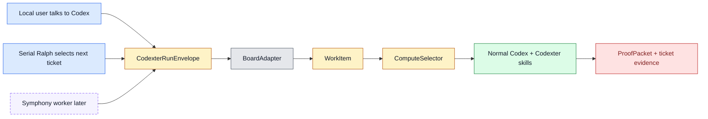
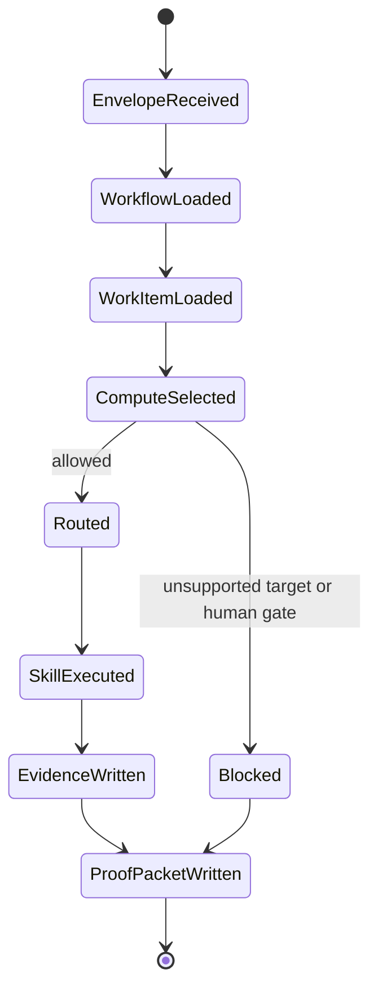
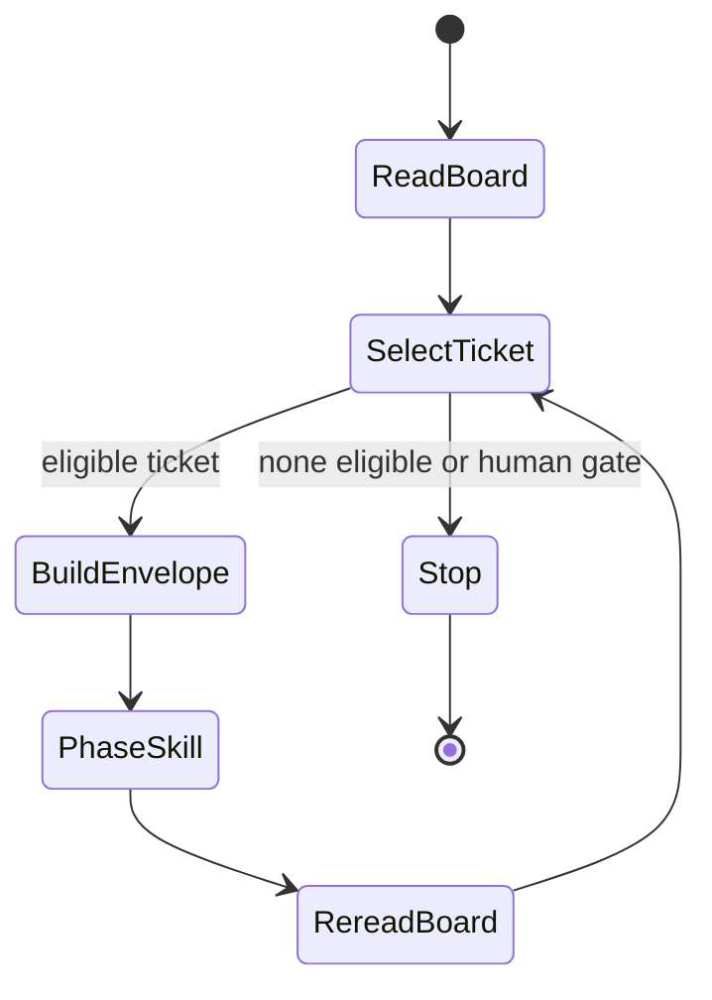
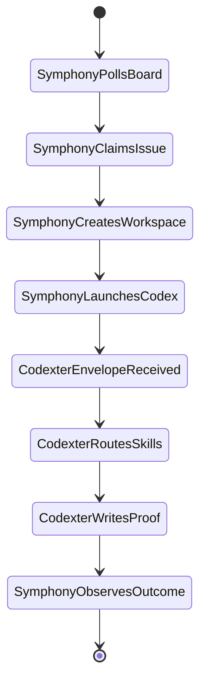

# Board And Compute Orchestration

Status: Draft v1

Purpose: Define how Codexter should read coding work from local or shared board
surfaces, decide where the work should run, route normal Codex through installed
Codexter skills, and produce proof that local or future external runners can
trust.

## 1. Core Decision

Codexter should be the work-contract, skill-routing, QA/review, and proof layer
inside normal Codex. Symphony, Codex cloud, local worktrees, or future services
may be compute substrates.

The user's current priority is local, conversational execution:

1. The user talks to Codex.
2. Codex reads a board item, usually a filesystem ticket.
3. Codexter policy selects where the work should run.
4. Codex routes through existing skills such as `impl-plan`, `impl`, `qa`,
   `review`, and `close-ticket`.
5. Codexter writes ticket evidence and a machine-readable `ProofPacket`.

The future Symphony path is intentionally compatible with that same contract:

1. Symphony launches normal Codex.
2. The workspace has Codexter installed.
3. The prompt or file includes a `CodexterRunEnvelope`.
4. Codexter routes through existing skills.
5. Codexter writes a machine-readable `ProofPacket`.

Symphony can own background service mechanics later. Codexter should not rebuild
Symphony's polling/retry/workspace daemon unless a later ticket proves the need.

## 2. Goals

- Keep local filesystem tickets as the first coding-ticket board.
- Define a `BoardAdapter` contract that can later support Linear, Notion,
  GitHub, or other boards without changing Codexter's skill/proof layer.
- Define a `ComputeSelector` that makes target choice explicit per ticket/run.
- Preserve the boundary between Codex, Codexter, and Symphony.
- Make local conversational execution, serial Ralph, and future Symphony-worker
  execution share the same `CodexterRunEnvelope` and `ProofPacket` contracts.
- Keep PRD user-story oriented while system specs carry state, config, failure,
  observability, and conformance detail.

## 3. Non-Goals

- No new daemon in this spec.
- No Linear, Notion, GitHub, or cloud adapter implementation here.
- No hidden board listener that auto-spawns agents when a ticket state changes.
- No parallel Ralph implementation here.
- No replacement for `impl-plan`, `impl`, `qa`, `review`, or `close-ticket`.
- No standalone `codexter run` product claim. Codexter remains normal Codex
  with installed skills, hooks, templates, and repo-owned rules.

## 4. Ownership Model

| Layer | Owner | Responsibility | Does not own |
| --- | --- | --- | --- |
| Codex | OpenAI Codex runtime | Model session, tool use, file edits, subagents, app/worktree/cloud primitives | Codexter ticket semantics or proof policy |
| Codexter | This repo installed into Codex | Skills, tickets, board contracts, compute policy, QA/review gates, ProofPacket | Long-running external scheduler mechanics |
| Symphony | Future external runner | Polling, claims, retries, workspace/process lifecycle, daemon observability | Codexter skill internals or proof quality decisions |
| Board systems | Filesystem now, Linear/Notion later | Store work item data and status/comment/evidence fields | Decide Codexter skill routing or quality gates |

### Best-Of-Worlds Import

| Source | Adopt | Adapt | Reject / defer |
| --- | --- | --- | --- |
| Symphony spec | Workspaces, claims, retry/reconcile vocabulary, `WORKFLOW.md` discipline, conformance matrix | Treat Symphony as a future caller through the envelope/proof contract | Do not copy the daemon for local mode now |
| Codex app primitives | Skills, subagents, worktrees, automations, cloud/local execution as trusted runtime primitives | Route compute targets to these primitives when available | Do not pretend Codexter is a separate execution engine |
| Codexter current system | Tickets, skills, Stop-hook proof, review gates, Ralph serial dispatcher | Generalize ticket reading through `BoardAdapter` and compute choice through `ComputeSelector` | Do not put all workflow logic into one giant prompt |

### Advise Decision

Decision: where should coordination authority live?

Options:

| Option | Pros | Cons |
| --- | --- | --- |
| Copy Symphony as Codexter daemon | Strong scheduler parity; one service could own polling and retries | High maintenance; duplicates a thing Symphony already specializes in; weakens local conversational fit |
| Codexter as contract/quality layer with pluggable compute | Preserves current local use, integrates with Symphony later, keeps proof/review unique to Codexter | Requires crisp adapters and compute selection before cloud mode feels real |
| Keep only local filesystem tickets | Lowest complexity and best current reliability | Delays Linear/Symphony integration and compute selection clarity |

Recommendation: Codexter should be the contract/quality layer with pluggable
compute. The accepted tradeoff is that Codexter must maintain clean interfaces,
but avoids owning every background runtime primitive.

## 5. Mode Map



### `local_conversational`

The user explicitly asks Codex to run or prepare one ticket. This is the default
mode for solo coding work.

### `local_ralph`

Ralph serially selects one eligible filesystem ticket and hands it to
`impl-plan`, `impl`, or `close-ticket`. Ralph remains serial until a later
parallel lease/worktree/merge policy lands.

### `shared_board_adapter`

A future local Codex session reads a shared board such as Linear or Notion
through the same adapter interface. The entry point is still conversational
unless a runner explicitly owns polling or events.

### `symphony_worker`

Symphony owns polling, claims, retries, workspace lifecycle, and Codex launch.
Codexter owns the run envelope, skill routing, evidence, review, and proof
inside the launched Codex workspace.

## 6. Domain Model

### `BoardAdapter`

```ts
type BoardAdapter = {
  kind: "filesystem" | "linear" | "notion" | "github";
  listCandidates(filter: CandidateFilter): WorkItemSummary[];
  readWorkItem(selector: WorkItemSelector): WorkItem;
  writeEvidence(item: WorkItemRef, evidence: EvidencePatch): WriteResult;
  transitionState(item: WorkItemRef, transition: StateTransition): WriteResult;
  normalize(raw: unknown): WorkItem;
};
```

Requirements:

- `filesystem` is the only implemented adapter today.
- The live filesystem implementation is `bin/codexter_boards.py`:
  `FileTicketAdapter` reads `tickets/TASK-*/ticket.md`, rejects selectors
  outside the configured board source, and returns a normalized `WorkItem`.
- External adapters must normalize into the same `WorkItem` shape.
- Adapter writes must be explicit and traceable; Codexter should not silently
  mutate external board state as a side effect of reading.
- BoardAdapter v1 keeps evidence writeback manual. Future writeback support must
  reuse ticket metadata rules and produce a traceable `WriteResult`.

### `WorkItem`

```ts
type WorkItem = {
  source: "filesystem" | "linear" | "notion" | "github";
  id: string;
  identifier: string;
  title: string;
  description: string;
  state: string;
  phase?: "planning" | "building" | "qa" | "review" | "documenting" | "complete" | "failed";
  status?: "todo" | "review" | "building" | "blocked" | "done" | "failed";
  priority?: "critical" | "high" | "medium" | "low" | number;
  labels: string[];
  blockedBy: WorkItemRef[];
  dependsOn: string[];
  ready: boolean;
  approvalRequired: boolean;
  requiresQa: boolean;
  requiresDemo: boolean;
  computeTarget?: ComputeTarget;
  localTicketPath?: string;
  artifactsPath?: string;
  url?: string;
  metadata: Record<string, unknown>;
};
```

### `ComputeTarget`

```ts
type ComputeTarget =
  | "local_shared"
  | "local_worktree"
  | "symphony"
  | "codex_cloud";
```

- `local_shared`: run in the current checkout. Best for hands-on local work.
- `local_worktree`: run in an isolated checkout. Best for concurrent writers or
  branch/PR follow-up.
- `symphony`: future background runner. Block locally until a real adapter is
  configured.
- `codex_cloud`: future cloud task runner. Block locally until a real adapter is
  configured.

### `ComputeDecision`

```ts
type ComputeDecision = {
  allowed: boolean;
  target: ComputeTarget;
  reason: string;
  blockers: string[];
  runtimeHints: string[];
  requiredHumanGate?: string;
  proofPacketPath: string;
};
```

Selector precedence:

1. explicit envelope override,
2. ticket `compute_target`,
3. `WORKFLOW.md` default,
4. implementation default `local_shared`.

The selector must not silently fall back from an unsupported target to a
different target. Unsupported compute returns `allowed: false` with blockers.

### `CodexterRunEnvelope`

```ts
type CodexterRunEnvelope = {
  workflowPath: string;
  workItemId?: string;
  workItemPath?: string;
  computeTarget?: ComputeTarget;
  phase?: "planning" | "building" | "qa" | "review" | "documenting";
  mode: "local_codex" | "local_ralph" | "symphony_worker" | "external_runner";
  requestedBy: string;
  requestedAt: string;
  proofPacketPath: string;
};
```

### `ProofPacket`

```ts
type ProofPacket = {
  schemaVersion: 1;
  runId: string;
  workItem: {
    source: string;
    id: string;
    identifier: string;
    title: string;
    path?: string;
    url?: string;
  };
  compute: ComputeDecision;
  phases: Record<string, PhaseResult>;
  artifacts: string[];
  commands: string[];
  verdict: "pass" | "revise" | "block" | "failed";
  nextAction: string;
  completedAt: string;
};
```

## 7. Configuration

`WORKFLOW.md` is the local policy file. It should stay small and point to
skills/specs for detail.

Core keys:

- `board.adapter`: `filesystem` now; future `linear`, `notion`, `github`.
- `board.source`: local folder or adapter-specific board identifier.
- `board.active_phases`: phases considered runnable.
- `board.terminal_statuses`: statuses that stop selection.
- `compute.default`: default compute target.
- `compute.allowed`: allowed local targets.
- `compute.ticket_override_field`: ticket metadata field for compute override.
- `routing`: phase-to-skill mapping.
- `quality`: proof, review, QA, and evidence requirements.

Ticket-level `compute_target` may request a target, but it is not authority to
execute. The selector still checks workflow policy, dependencies, blockers,
approval gates, and implementation support.

## 8. State Machines

### Local Conversational Run



### Local Ralph

Ralph is a selector and handoff loop, not an executor replacement.



### Future Symphony Worker



Symphony may retry, cancel, or reconcile runs around Codexter. Codexter should
keep proof and ticket evidence valid no matter which runner initiated the run.

## 9. Failure Model

| Failure | Local behavior | Future Symphony behavior | Proof requirement |
| --- | --- | --- | --- |
| Missing `WORKFLOW.md` | block run | worker failure | proof packet when possible, otherwise clear error |
| Invalid ticket/work item | block run | worker failure | error with selector and adapter details |
| Approval required | stop before execution | release or defer claim | blocker in ticket/proof |
| Unsupported compute target | block, do not fall back | runner may requeue or mark unsupported | blocker names target and required adapter |
| Skill route missing | block | worker failure | route error and next action |
| QA/review fails | verdict `revise` or `block` | Symphony observes non-pass proof | linked review/QA artifact |
| Runner crashes | local transcript/error | Symphony retry policy | stale/partial proof if available |
| External board write fails | keep local proof, report write failure | retry or operator-visible error | evidence write failure included |

## 10. Observability And Proof

Minimum local observability:

- `ProofPacket` path from the envelope.
- ticket Evidence links to review/QA/proof artifacts.
- command outputs summarized in the ticket.
- blockers captured in ticket `## Blockers` and, for this ticket train,
  `blockers.md`.

Future runner observability:

- Symphony may add session IDs, logs, token totals, retry queues, rate limits,
  and workspace paths.
- Codexter should not depend on a Symphony dashboard for correctness.
- Codexter proof must remain inspectable from the repo artifacts.

## 11. Safety Rules

- Codexter helpers must not launch Codex, poll boards, own retry queues, or
  present Codexter as a standalone CLI.
- External board adapters must not expose raw credentials to Codex prompts.
- Compute selection must never silently downgrade from a requested remote/cloud
  target to local.
- Parallel Ralph must not ship until leases, isolated checkouts, merge policy,
  stale recovery, and batch QA exist.
- PRD remains user-story and product-intent oriented; system specs carry
  models, state, failure, and tests; tickets carry execution proof.

## 12. Conformance Matrix

| Area | Requirement | Profile | Proof |
| --- | --- | --- | --- |
| Workflow loading | `WORKFLOW.md` parses and exposes board, compute, routing, and quality policy | core | invocation helper tests |
| Board adapter | filesystem tickets normalize into `WorkItem` | core | `TASK-0113` tests |
| Compute selection | precedence is envelope, ticket, workflow, default | core | `TASK-0114` tests |
| Unsupported compute | `symphony` and `codex_cloud` block locally until adapters exist | core | prepare JSON fixtures |
| Local conversational | one envelope routes to the expected skill and proof path | core | invocation prepare/write-proof tests |
| Ralph | serial selector hands one eligible ticket to phase skill and stops on human gates | core | Ralph selector tests |
| Symphony shim | example workflow/prompt shows Symphony launching normal Codex with Codexter installed | extension | `TASK-0112` smoke |
| Parallel Ralph | leases, worktrees, merge policy, stale recovery, batch QA specified before implementation | extension | `TASK-0115` design review |
| Spec discipline | complex specs include domain model, state, config, failures, observability, and tests | governance | `TASK-0116` template |

## 13. Follow-Up Ticket Map

| Ticket | Purpose | Depends on | Expected output |
| --- | --- | --- | --- |
| `TASK-0112` | Add Symphony integration shim | `TASK-0107`, `TASK-0111` | example `WORKFLOW.md`/prompt/envelope showing Symphony-to-Codexter handoff |
| `TASK-0113` | Define BoardAdapter v1 | `TASK-0111` | filesystem adapter interface and tests |
| `TASK-0114` | Implement compute selector v2 | `TASK-0111`, `TASK-0113` | admission policy, blocker reasons, runtime hints, fixtures |
| `TASK-0115` | Design parallel Ralph leases and merge policy | `TASK-0111`, `TASK-0113`, `TASK-0114`, `TASK-0081` | design-only lease/worktree/merge/batch-QA spec |
| `TASK-0116` | Add Symphony-style spec template and conformance matrix | none | reusable spec authoring contract |

## 14. Implementation Checklist

- Keep `bin/codexter_invocation.py` diagnostic and artifact-oriented.
- Add `BoardAdapter` as an interface before adding external board clients.
- Add `ComputeSelector` tests before allowing non-local targets.
- Add Symphony examples only as shims, not as a local daemon.
- Add parallel Ralph only after the lease/worktree/merge design is approved.
- Review each implementation against the user story groups:
  - solo local operator,
  - future Symphony integration builder,
  - team/shared-board user,
  - reviewer/maintainer auditing proof.

## 15. References

- `WORKFLOW.md`
- `docs/specs/symphony-compatible-codexter-runner.md`
- `skills/codexter-invocation/SKILL.md`
- `skills/ralph/SKILL.md`
- `docs/research/web-research/2026-05-04_symphony-codexter-benchmark.md`
- `docs/research/web-research/2026-05-05_symphony-dagster-codexter-integration.md`
- `docs/sources/registry.jsonl`
