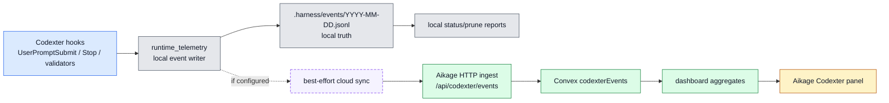
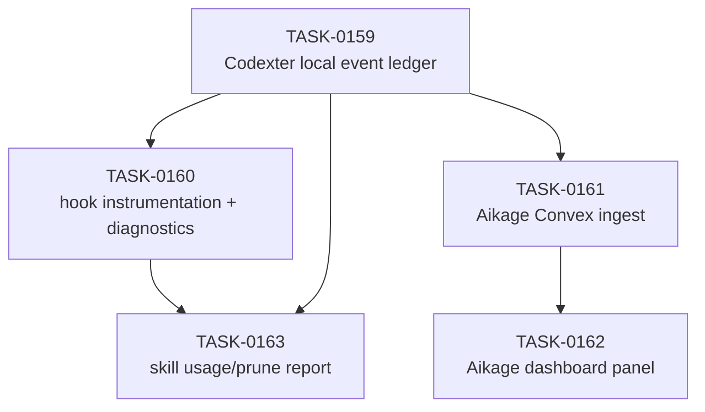

# Codexter Aikage Telemetry Sync Spec

Date: 2026-05-21
Status: planning

## Summary

Codexter should emit a local-first telemetry ledger for harness events, then
optionally sync sanitized summaries into Aikage. Aikage should keep
agent-hours as the primary product metric and add Codexter telemetry as a
secondary diagnostics layer for hooks, skill routing, tickets, validators, and
self-improvement loops.

The key architectural decision is local truth first, cloud dashboard second.
Codexter must remain useful without Aikage. Aikage should visualize and
aggregate events when configured, not become the control plane.

## Current State

Codexter:

- `bin/runtime_telemetry.py` can POST one hook telemetry payload when
  `CODEXTER_TELEMETRY_API_URL` is configured.
- `bin/capture_user_turn.py` and `bin/stop_hook.py` call telemetry helpers.
- `.harness/logs/stop-hook.jsonl` exists but is hook-specific and not a
  general event ledger.
- `.harness/state/self-improve/windows/` exists, while
  `.harness/state/self-improve/applications/` may be empty even when windows
  exist.
- Skill topology is generated in `docs/skills/registry.jsonl` and graph files.

Aikage:

- Convex schema has `activityPings`, `agentPosts`, and ingest credentials.
- HTTP endpoints exist for `/api/activity/ping` and `/api/posts/create`.
- Dashboard uses bento panels, square cards, JetBrains Mono display headings,
  theme variables, and Recharts/shadcn primitives.
- Dashboard query already aggregates agent-hours, sessions, machines,
  projects, activity rows, diagnostics, and parallel capacity.

## Target Architecture



## Event Contract

### `CodexterEvent`

```ts
type CodexterEvent = {
  schema_version: 1;
  event_id: string;
  event_type:
    | "turn_start"
    | "turn_end"
    | "hook_run"
    | "hook_result"
    | "control_surface_detected"
    | "skill_requested"
    | "skill_routed"
    | "ticket_transition"
    | "validator_run"
    | "learning_window_updated"
    | "learning_review_skipped"
    | "learning_review_launched"
    | "telemetry_sync";
  timestamp: string;
  source: "capture_user_turn" | "stop_hook" | "validator" | "manual" | string;
  project_root: string;
  project_name?: string;
  session_id?: string;
  turn_id?: string;
  ticket_id?: string;
  skill_name?: string;
  hook_name?: string;
  phase?: string;
  status?: string;
  outcome?: string;
  summary?: string;
  counts?: Record<string, number>;
  metadata?: Record<string, string | number | boolean | null>;
  privacy: {
    prompt_included: false;
    raw_transcript_included: false;
    redaction_version: 1;
  };
};
```

Rules:

- `event_id` is generated locally and stable within one write attempt.
- `timestamp` uses UTC ISO format.
- `project_root` is local-only by default; Aikage may receive either full path
  or sanitized hash/display label depending on sync settings.
- `summary` is short and sanitized.
- No raw transcript, full prompt, assistant response, env var, token, or file
  body is included.

## Local Files

- `.harness/events/YYYY-MM-DD.jsonl`: append-only local events.
- `.harness/events/sync-state.json`: optional cursor/checkpoint for Aikage
  sync.
- `.harness/events/failed-sync.jsonl`: optional bounded local record of failed
  sync attempts.

## Codexter Changes

### Runtime telemetry helper

Add or refactor in `bin/runtime_telemetry.py`:

- `build_event(...) -> dict[str, object]`
- `write_local_event(project_root: Path, event: Mapping[str, object]) -> Path`
- `emit_codexter_event(...) -> bool`
- `emit_hook_telemetry(...)` should call local write first, then network sync.

The existing POST path can stay for backward compatibility, but the new
envelope should be the internal source of truth.

### Hook integration

`bin/capture_user_turn.py` should emit:

- `turn_start` or `user_prompt_submit`
- `control_surface_detected` when `$impl`, `$impl-plan`, `$prd`, `$batch-work`,
  or another known control surface is visible in the user prompt.
- `skill_requested` for explicit `$skill` mentions where detectable.

`bin/stop_hook.py` should emit:

- `turn_end`
- `hook_result`
- `learning_window_updated`
- `learning_review_skipped` or `learning_review_launched`
- `telemetry_sync` after network attempts.

### Diagnostics

Add `bin/codexter_telemetry_status.py`:

- Reads `.harness/events/*.jsonl`.
- Summarizes counts by event type, skill, hook, ticket, status, and sync result.
- Reads `.harness/state/self-improve/windows/` and
  `.harness/state/self-improve/applications/`.
- Flags when windows exist but application reports are zero.
- Supports JSON output for Aikage/debug tooling.

Add `bin/codexter_skill_usage_report.py`:

- Reads `docs/skills/registry.jsonl`.
- Reads local events.
- Produces prune candidates without mutating skills.
- Distinguishes static Markdown refs from observed request/routing events.

## Aikage Changes

### Convex schema

Add `codexterEvents`:

```ts
export const codexterEvents = defineTable({
  userId: v.id("users"),
  eventId: v.string(),
  eventType: v.string(),
  source: v.string(),
  projectName: v.optional(v.string()),
  projectDirectory: v.optional(v.string()),
  sessionId: v.optional(v.string()),
  turnId: v.optional(v.string()),
  ticketId: v.optional(v.string()),
  skillName: v.optional(v.string()),
  hookName: v.optional(v.string()),
  phase: v.optional(v.string()),
  status: v.optional(v.string()),
  outcome: v.optional(v.string()),
  summary: v.optional(v.string()),
  countsJson: v.optional(v.string()),
  metadataJson: v.optional(v.string()),
  receivedAt: v.number(),
  occurredAt: v.number(),
})
  .index("by_userId_and_receivedAt", ["userId", "receivedAt"])
  .index("by_userId_eventType_receivedAt", ["userId", "eventType", "receivedAt"])
  .index("by_userId_skillName_receivedAt", ["userId", "skillName", "receivedAt"]);
```

### HTTP route

Add `POST /api/codexter/events`.

Use the existing private ingest key pattern:

- `?key=...`
- `x-aikage-key`
- `Authorization: Bearer ...`
- body `key`

Return `ok`, `receivedAt`, and a bounded error code.

### Dashboard query

Add safe aggregate fields to `getDashboard` or a separate query:

- total Codexter events in selected window
- hook result counts
- top skill requests/routed skills
- learning review launched/skipped counts
- failed sync count
- recent sanitized event rows

Do not return raw prompt text or raw local paths in the default dashboard
payload unless the existing Aikage privacy rules allow it.

### Dashboard UI

Use existing Aikage style:

- `BentoItem` / `BentoStack`
- `Panel`, `PanelEyebrow`, `MetricTile`, `StatusBadge`
- square cards and borders
- `var(--color-panel)`, `var(--color-line-strong)`,
  `var(--color-accent)`, `var(--color-muted)`
- JetBrains Mono display headings

Suggested panel:

- Header: `CODEXTER TELEMETRY`
- Metrics: `events`, `hook pass`, `top skill`, `learning reviews`
- Body: top skills/control surfaces, hook health, self-improvement status,
  recent sanitized rows
- Diagnostics link: existing diagnostics dialog or a local expansion

## Security And Privacy

- Local JSONL may include local project roots because it stays local.
- Aikage sync should send display project names and optional hashed directory
  identifiers by default.
- Never sync full prompt, assistant response, transcript path, secrets, token,
  local env, or file bodies.
- Truncate all string fields at the HTTP boundary.
- Store `countsJson` and `metadataJson` only for bounded sanitized metadata.

## Ticket Breakdown



## Acceptance Criteria

- Codexter can emit and parse local event JSONL without Aikage configured.
- Hook tests prove event writing does not block or leak sensitive content.
- Aikage can ingest a fixture Codexter event through Convex HTTP.
- Aikage dashboard can show aggregate Codexter telemetry with the current
  visual language.
- Skill usage report distinguishes static topology from observed usage.

## Verification

Codexter:

```bash
python3 -m unittest bin/test_runtime_state.py bin/test_stop_hook.py
python3 -m unittest bin/test_runtime_telemetry.py
python3 bin/codexter_telemetry_status.py --json
python3 bin/codexter_skill_usage_report.py --json
python3 tickets/scripts/check_ticket_metadata.py
git diff --check
```

Aikage:

```bash
pnpm lint
pnpm exec tsc -b
pnpm build
bash scripts/pre_push_check.sh
```

Manual proof:

- Start Aikage locally.
- Send one fixture Codexter event to `/api/codexter/events`.
- Confirm dashboard panel renders with Aikage styling.
- Capture one screenshot for the Aikage ticket evidence.

## Open Questions

- Whether Aikage should store full local project paths or only sanitized labels
  by default. Recommendation: sanitized labels for cloud; local JSONL keeps
  full paths.
- Whether live Convex smoke is required in the first implementation pass.
  Recommendation: make it optional and block live smoke on credentials.
- Whether `skill_requested` should include all `$skill` mentions or only known
  installed skills. Recommendation: include both, with `known_skill: true|false`.
