# Codexter V2 Milestone

Status: Active capstone plan
Date: 2026-05-07

## Purpose

Codexter V2 is the capped follow-through from the Symphony comparison. It does
not make Codexter a background-agent daemon. It finishes the smallest useful
shape: normal Codex plus Codexter skills can run one explicitly invoked ticket,
prove what happened, and stay easy for Codex Cloud, Symphony, Linear, Notion, or
another board caller to integrate later.

The milestone should end after the remaining invocation and adapter-contract
tickets land. Further background scheduling, parallel agents, hosted telemetry,
and cloud orchestration should wait for real project pressure.

## Current Decision

Codexter owns:

- ticket/work-item normalization,
- explicit invocation contracts,
- compute admission,
- skill routing,
- QA/review/proof conventions.

Codexter does not own:

- board polling,
- remote claims and retries,
- Codex Cloud execution,
- Symphony worker lifecycle,
- N-agent parallel dispatch,
- a hosted control plane.

## Shape

```mermaid
flowchart LR
  classDef context fill:#e5e7eb,stroke:#4b5563,color:#111827
  classDef trigger fill:#dbeafe,stroke:#2563eb,color:#111827
  classDef contract fill:#fef3c7,stroke:#b45309,color:#111827
  classDef run fill:#dcfce7,stroke:#15803d,color:#111827
  classDef proof fill:#fee2e2,stroke:#b91c1c,color:#7f1d1d
  classDef future fill:#f5f3ff,stroke:#8b5cf6,color:#111827,stroke-dasharray: 5 3

  Ticket["Ticket or board item<br/>context only"]:::context
  Invoke["Explicit invocation<br/>local chat, Ralph, comment, cloud, Symphony"]:::trigger
  Envelope["CodexterRunEnvelope<br/>one work item, phase, compute, proof path"]:::contract
  Adapter["BoardAdapter contract<br/>filesystem now, shared boards later"]:::contract
  Compute["ComputeSelector<br/>admit or block target"]:::contract
  Codex["Normal Codex<br/>Codexter skills installed"]:::run
  Proof["ProofPacket<br/>ticket evidence + review"]:::proof
  External["External runner later<br/>Codex Cloud / Symphony"]:::future

  Ticket --> Invoke --> Envelope --> Adapter --> Compute --> Codex --> Proof
  External -. "supplies same envelope" .-> Envelope
  Proof -. "external caller can inspect" .-> External
```

## Remaining Tickets

### `TASK-0121`: Define Explicit Codexter Invocation Triggers

Why it matters now:

- It turns the most important new rule into a concrete vocabulary: ticket
  existence is context, invocation is intent.
- It prevents future agents from reintroducing hidden board listeners or
  auto-runs when they see `ready: true`.
- It makes local chat, `$ralph`, ticket comments, Codex Cloud payloads, and
  Symphony payloads speak the same trigger language.

Why not later:

- Every adapter or handoff recipe depends on knowing what counts as "start
  work." If this stays fuzzy, the next tickets will repeat the same argument.

Expected output:

- `InvocationTrigger` reference.
- Updated `CodexterRunEnvelope` examples.
- Comment-trigger examples that remain conventions for callers, not a watcher.

### `TASK-0123`: Add Board Adapter Conformance Scaffolding

Why it matters now:

- It makes future Linear, Notion, GitHub, or custom adapters cheap to add
  without making any one adapter real today.
- It protects the new invocation invariant at the adapter boundary: adapters
  read and write work context; they do not decide to run agents.
- It keeps the filesystem adapter as the reference implementation and avoids
  re-learning the normalization contract later.

Why not later:

- Adapter work is exactly where accidental over-engineering tends to enter.
  A tiny conformance scaffold now is cheaper than debugging a half-compatible
  Linear or Notion adapter later.

Expected output:

- Board adapter checklist or fixture reference.
- Required fields and normalization examples.
- Evidence-writeback expectations.
- No real Linear/Notion/GitHub client.

### `TASK-0122`: Add External Compute Handoff Recipes

Why it matters now:

- It gives the operator a practical answer for "run this ticket on the cloud"
  without building a cloud orchestrator.
- It documents the difference between Codexter, Codex Cloud, and Symphony:
  Codexter prepares and validates the contract; the external runner owns the
  compute lifecycle.
- It creates reusable handoff templates for future automation while preserving
  manual review and ProofPacket expectations.

Why not later:

- This is the minimum bridge from local-only use to external compute. Without
  it, future cloud work will either copy Symphony too much or invent ad hoc
  prompts again.

Expected output:

- Codex Cloud handoff recipe.
- Symphony handoff recipe.
- Expected result contract: diff, evidence, review, ProofPacket.
- No Codex Cloud wrapper, no daemon, no auto-apply.

## Parked Or Deferred

- `TASK-0081` selective branch runtime scaling: archived as premature. Use
  manual worktrees or Codex Cloud directly until isolated QA/runtime setup
  becomes repeated pain.
- Parallel Ralph / N-agent dispatch: defer until leases, isolated checkouts,
  merge policy, stale-worker recovery, and batch QA are genuinely needed.
- Hosted telemetry and dashboards: useful later, but not needed to finish the
  invocation layer.
- Transparency/ablation evals, skill-opportunity reviewers, and hook-reminder
  experiments: keep as future harness-quality work, not part of the V2 cap.

## Done Criteria

Codexter V2 is done when:

- explicit invocation triggers are documented,
- board adapter conformance is documented,
- external compute handoff recipes exist,
- README and architecture point to this capstone,
- no active roadmap claims Codexter should rebuild Symphony or implement
  background agents now.

Stop there unless a real project ticket proves that another runtime layer is
worth the cost.
