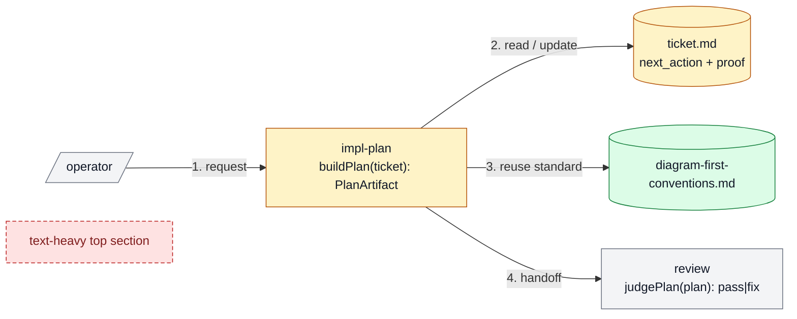
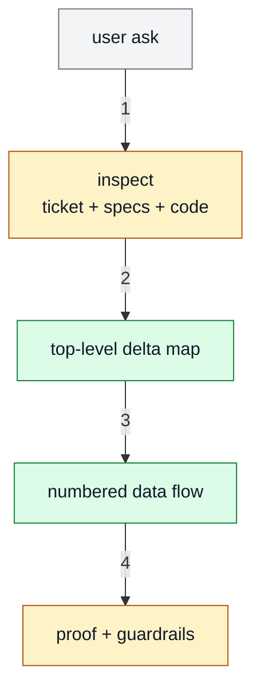

# Diagram-First Conventions

Date: 2026-04-11

## Goal

Make spec and ticket approval surfaces faster to understand by defaulting to
compact Mermaid diagrams for system shape, delta, and data flow before prose.

For standalone diagram work outside planning, use
[`skills/diagramming/SKILL.md`](../../skills/diagramming/SKILL.md).

## Approval Surface

Use a tiered visual summary for any material, cross-module, workflow/tooling,
or architecture-facing change.

1. `Tier 1:` one top-level delta diagram
2. `Tier 2:` one optional zoom-in or data-flow diagram
3. `Tier 3:` short prose for recommendation, proof, and guardrails

If the reviewer can approve from Tier 1 and Tier 2 alone, the approval surface
is working. The prose exists to tighten confidence, not to carry the whole
plan.

## When Required

Required when:

- the ticket changes more than one component or module
- before/after behavior is easier to show than describe
- the change depends on a visible data flow
- the plan introduces or changes an interface, contract, or ownership boundary
- the ticket is a workflow/tooling/spec change that would otherwise read like an
  essay

Optional when:

- the work is a truly localized fix in one file or one symbol
- the delta is obvious from a short code reference and 3-5 lines of prose

## Rules

### 1. Start Top-Level

Lead with the system map first. Show the whole change in one compact view
before drilling into a component-specific zoom-in.

### 2. Prefer One Delta Diagram

Do not maintain separate `Before` and `After` diagrams by default.

Use one Mermaid delta diagram with:

- `keep`
- `change`
- `add`
- `remove`

Only split into separate before/after diagrams when the single-delta view is
less clear than two simple pictures.

### 3. Encode Delta With Class + Legend

Color helps, but color alone is not enough.

Every delta diagram should include:

- class-based styling
- a short text legend
- labels that still make sense if the colors are lost

### 4. Put Signatures Inside Nodes When They Matter

If the important thing is the API or ownership boundary, put the short
signature directly in the node label instead of forcing the reader to jump to a
detached list below the diagram.

Good:

- `impl-plan / buildPlan(ticket): PlanArtifact`
- `review / judgePlan(plan): pass|fix`
- `ticket.md / next_action: string`

Bad:

- large raw type dumps inside nodes
- a separate signature appendix when 1-2 short labels would make the diagram
  self-explanatory

### 5. Show Data Flow Explicitly

When the change is flow-sensitive, add a second diagram with numbered arrows
for:

- read path
- write path
- control handoff
- proof/verification path

Keep it to the critical path only.

### 6. Use Shape Cues

Use Mermaid shapes to hint at role:

- process/service: rectangle
- entrypoint or operator surface: slanted shape if useful
- stored state or file: database/cylinder shape
- grouped subsystem: `subgraph`

Do not chase perfect notation. The point is human legibility.

### 7. Keep Labels Tight

A good diagram is compact. Prefer:

- short node names
- one short signature
- one short edge label

If a diagram turns into paragraphs inside boxes, split it or cut detail.

## Canonical Style

Legend:

- `gray = keep`
- `amber = change`
- `green = add`
- `red dashed = remove`

## Common Patterns

### System Delta Map

Use for:

- ticket approval surfaces
- spec updates
- architecture or workflow changes

Must show:

- the main components
- what changed
- where proof will be attached or checked

### Data-Flow Trace

Use for:

- request/response flow
- runtime state mutations
- review/QA/control handoffs

Recommended shape:

### Zoom-In

Only add a zoom-in when the top-level diagram cannot answer one critical
question, for example:

- how a component's read/write path changes
- how one subsystem's interfaces are being rearranged
- how UI state or backend data is routed inside one boundary

The zoom-in should inherit the same legend/classes as the top-level map.

## Authoring Checklist

Before you hand off a plan or spec, check:

- can a reviewer understand the change from the top diagram alone?
- does the legend explain keep/change/add/remove clearly?
- are signatures inline where interface shape matters?
- is there a numbered data-flow view when the flow is the point?
- did you avoid redundant before/after diagrams?
- did you keep the prose below the diagram shorter than the diagram's value?
