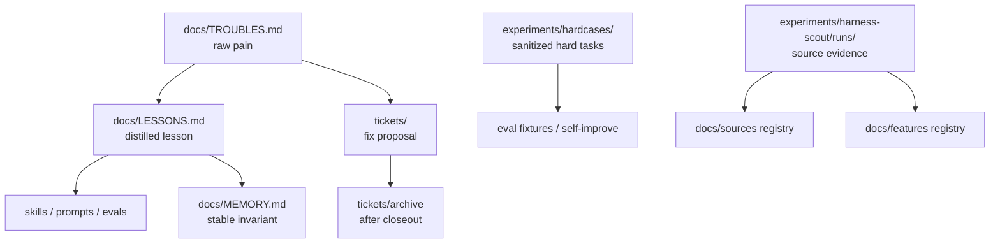

# Filesystem Lifecycle

Status: active contract

Purpose: define how Farplane's durable filesystem surfaces are written, read,
drained, archived, or deleted without turning every ledger into another
always-read document.

This file is a router. Detailed rules stay with the owning surface.

## Principle

Use the smallest durable surface that matches the state:

- raw signal goes to raw ledgers
- distilled rules go to durable ledgers or owning skills
- proof stays near the ticket, experiment, or skill that produced it
- stale or superseded material is archived, marked superseded, or deleted

Normal agents should read recent or topic-matched entries first. Drain and audit
passes may scan full files.

## Lifecycle Table

| Surface | Role | Write Trigger | Read Default | Drain / Cleanup | Owner |
| --- | --- | --- | --- | --- | --- |
| `docs/HISTORY.md` | meaningful project timeline and case memory | shipped milestone, migration, cleanup, governance shift | `tail -n 20` or `rg` by topic | no routine drain; enforce stricter admission, archive eras only if size becomes harmful | doc governance |
| `docs/MEMORY.md` | current durable invariants | stable rule future work must obey | `rg` by tag/topic; avoid full reads by default | prune or supersede old rules when no longer current; keep only important invariants | doc governance |
| `docs/TROUBLES.md` | raw pain log | repeated miss, blocker, user correction, preventable process failure | `tail -n 30` plus `rg` by area | weekly/periodic review into `docs/LESSONS.md`, tickets, skill proposals, or closure | harness-advisor / review |
| `docs/LESSONS.md` | distilled post-fix learning | `repent`, review, hardcase, or trouble-drain pass produced a reusable lesson | `tail -n 30` plus `rg` by area | promote into skills, prompts, evals, `docs/MEMORY.md`, or tickets; archive solved noise when needed | repent / self-improve |
| `tickets/TASK-*/ticket.md` | active task memory | planned or active work | selected active ticket only | archive after closeout and durable writeback | ticket workflow |
| `tickets/TASK-*/artifacts/` | task-scoped proof | QA, review, demo, smoke, or implementation evidence | linked from ticket evidence | keep with ticket archive; do not promote bulky proof into docs | ticket workflow |
| `docs/features/registry.jsonl` | harness feature inventory | feature is shipped, planned, partial, retired, or needs dedupe | query by feature/status/surface | update status, evidence, limits, or mark retired; do not delete stable IDs | harness-advisor / feature registry |
| `docs/sources/registry.jsonl` | external source provenance | source is ingested or reused | query by URL/key/source ID | mark archived, superseded, or sensitive-redacted; keep canonical IDs | harness-scout |
| `experiments/harness-scout/runs/` | source-ingestion evidence | source run, scorecard, decision matrix, handoff | only when linked by source/feature/ticket | promote compact outcomes to source/feature registry or tickets; delete/redact unsafe bulky extracts | harness-scout |
| `experiments/hardcases/` | sanitized benchmark seeds | `repent hardcase` after a fixed episode, or a deterministic validator captures a clear contract violation | only when building evals or self-improvement | promote into eval fixtures or skill tests; keep sanitized source case | repent / self-improve / eval / validators |
| other `experiments/` | scratch proof, smoke runs, prototype evidence | bounded experiment or temporary proof | only when linked by ticket/source/feature | promote outcome or delete/archive stale scratch evidence | owning skill |
| `docs/specs/*.md` | current behavior contracts | stable feature, doctrine, schema, lifecycle, or execution flow | spec index first, then relevant file | merge duplicates, delete superseded plans, move skill-owned contracts to skills | doc governance |
| `docs/research/**` | research and comparison evidence | research pass or external comparison | only by topic/source need | keep as historical evidence; do not promote raw research into active contracts | research / harness-scout |

## Read Rules

- For normal work, read the selected ticket, relevant specs, `docs/MEMORY.md`
  by topic, and recent rows from `docs/TROUBLES.md` / `docs/LESSONS.md`.
- For ledgers with newest rows at the bottom, start with `tail`.
- Use `rg` for topic/tag lookup before full-file reads.
- Full scans are for drain, audit, migration, or explicit historical review.

## Weekly Drain

Run a weekly or periodic drain when the ledgers stop being easy to use:

1. Review recent `docs/TROUBLES.md` rows and close, ticket, or distill them into
   `docs/LESSONS.md`.
2. Review `docs/LESSONS.md` rows and promote stable prevention rules into the
   owning skill, eval, prompt contract, `docs/MEMORY.md`, or a ticket.
3. Review `docs/MEMORY.md` for superseded or low-value invariants; keep only
   rules that are current and worth consulting.
4. Review `docs/HISTORY.md` only for admission quality. Do not drain ordinary
   history into actions; archive eras only if file size hurts usability.
5. Validate `docs/features/registry.jsonl` and `docs/sources/registry.jsonl`;
   fix missing refs, mark stale rows superseded, or open cleanup tickets.

Promote only the smallest durable rule needed. If a rule must affect every turn,
put it in the always-loaded owner surface such as `AGENTS.md`,
`templates/global/AGENTS.md`, or the relevant skill checklist. Otherwise keep it
in `docs/MEMORY.md` or the owner doc and retrieve it by topic.

## Drain Flows

## Keep / Delete Rules

- Keep current operating rules, active feature contracts, linked evidence, and
  stable IDs.
- Delete or archive superseded migration plans, duplicate specs, stale scratch
  outputs, and unlinked bulky experiment evidence.
- Do not delete stable registry IDs; mark status instead.
- Do not move raw private transcripts, secrets, credentials, or unrelated user
  data into tracked docs or hardcases.
- Do not turn `experiments/` into canonical memory. Promote the outcome to the
  owning surface or leave the experiment as linked evidence.
