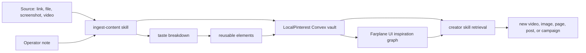

# Inspiration Vault

## Intent

Farplane should treat saved inspiration as a first-class grounding source for
future creative work. The operator can paste a link, screenshot, file, or media
reference into Codex; `ingest-content` breaks it down; LocalPinterest stores
the structured record; Farplane UI later exposes the collection as a browsable,
graphable inspiration vault.

This feature exists because design, video, product, and content work often
starts from references. The valuable unit is not just the raw asset, but the
analyzed reason it works and the reusable levers a future agent can retrieve.

```text
inspiration_vault(source, note?, project_context?)
  -> saved_reference + taste_breakdown + reusable_elements + retrieval_handle
```

## Placement Decision

Primary owner:

- `skills/ingest-content`: capture workflow, source reading route, analysis
  packet, tag taxonomy, Convex write, and retrieval proof.

Secondary owners:

- `/Users/kenjipcx/Documents/LocalPinterest`: Convex-backed storage and query
  functions for content items, assets, analyses, and notes.
- `../Farplane-UI`: future browsing, graph, search, and recall surface that
  makes saved references visible inside the operator experience.
- Future creator skills: retrieval consumers that ask for top matching
  references and reuse their levers in new videos, images, pages, or campaigns.

Rejected primary owners for v1:

- Browser extension: useful later for capture convenience, but it adds app
  maintenance before proving the Codex-native pipeline.
- Root prompt or global policy: too broad; this is a product capability, not an
  every-turn rule.
- Autonomous posting loop: valuable later, but it needs separate metrics,
  safety, scheduling, and feedback-loop contracts.

## Feature Shape

The vault has four layers:

1. Capture: operator gives Codex a source and optional note.
2. Understanding: Codex extracts source facts, taste breakdown, reusable levers,
   tags, and remix constraints.
3. Usefulness extraction: Codex turns the breakdown into reusable elements,
   such as styles, layouts, segments, images, prompts, patterns, and recipes.
4. Storage: LocalPinterest stores content, assets, analyses, notes, and, in a
   future richer schema, first-class segments/elements/styles.
5. Recall: Farplane UI and creator skills retrieve relevant references by goal,
   tag, project, recency, format, or graph neighborhood.



## Data Contract

Minimum saved record:

- source identity: URL, local path, platform, author/title when visible
- content item: title, kind, status, normalized tags
- assets: original URL/file, screenshot, thumbnail, selected frame, transcript,
  or attachment when available
- analyses: summary, why it works, reusable elements/levers, tags, prompt guess,
  source skill
- notes: user intent, Codex observations, follow-up todo
- retrieval handle: item ID plus enough tags and levers for future query

Desired Convex storage expansion:

- `segments`: source-linked clips, time ranges, selected frames, transcript
  spans, page sections, or image regions mentioned by the operator note.
- `elements`: extracted reusable styles, layouts, assets, patterns, prompt
  recipes, and remix constraints.
- `collections`: project/campaign/use-case grouping across references.
- `searchMetadata`: semantic embeddings, tag weights, recency, and retrieval
  reasons for grounding.

Future retrieval function shape:

```text
retrieve_inspiration(goal, tags?, project?, output_type?, recency?, count?)
  -> matches[{item_id, title, why_relevant, reusable_elements, attribution}]
```

Pipeline contract:

```text
ingest_content(url | image | video | file | note, note?)
  -> read_content
  -> breakdown_content
  -> extract_usefulness
  -> store_content
```

The personal note steers all phases. For example, "I like the image used in the
first few seconds" should produce a video segment/frame extraction and an asset
or style element, while "I want to make a video like this" should produce a
format/style/shot recipe for later creator skills.

## Farplane UI Requirements

The first UI slice should be an inspection and recall surface, not a full asset
management app:

- searchable grid/list of saved references
- detail view showing source, note, analysis, reusable elements, tags, and assets
- graph view connecting tags, projects, formats, skills, and references
- "use as inspiration" action that copies or hands a retrieval packet to a
  creator skill
- filters for recency, project, content kind, platform, format, and intent
- clear attribution and remix-constraint display

Non-goals for the first UI slice:

- right-click browser capture
- automatic scraping feeds
- public gallery publishing
- autonomous posting and metric learning
- bulk raw media storage

## Grounding Engine Role

Saved references can become a creative grounding corpus:

- They ground subjective taste in concrete examples.
- They let agents ask for "top 5 references like this" instead of inventing
  visual direction from scratch.
- They preserve why an asset or style was saved, not only what the source is.
- They connect current projects to past taste decisions through tags and notes.

Grounding rule:

```text
creative_grounding(task, inspiration_matches)
  -> cite_or_summarize_matches + adapt_elements + preserve_attribution
```

Agents should use the vault as inspiration and evidence, not as permission to
copy protected work verbatim.

## Proof Path

1. Use `ingest-content` on three real sources: one image/screenshot, one video
   or social link, and one webpage/article.
2. Verify LocalPinterest records include assets, analyses, notes, tags, and
   retrieval handles.
3. For one video, save a note-specific segment such as "first few seconds" and
   verify the selected frames or segment description are represented.
4. Prototype one retrieval query for a future content task such as "make a 2x2
   collage short-form video".
5. Build a Farplane UI read-only vault slice against the stored records.
6. Run visual QA on grid, detail, graph, and handoff states.

## Open Questions

- Should Farplane UI read directly from LocalPinterest Convex, or should
  Farplane own a normalized cross-project inspiration index later?
- Should retrieval ranking start tag-based, embedding-based, or hybrid?
- What is the smallest "use as inspiration" handoff that creator skills can
  consume without needing a full UI integration?
