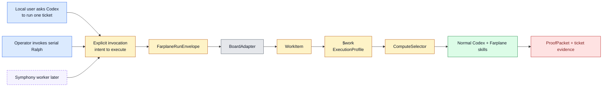
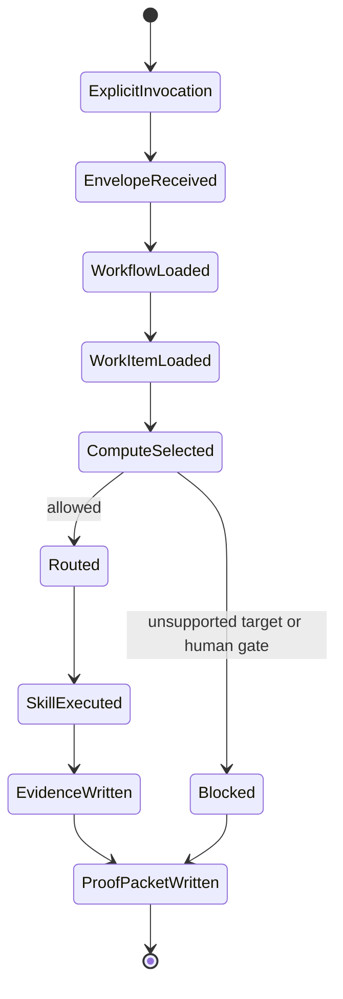
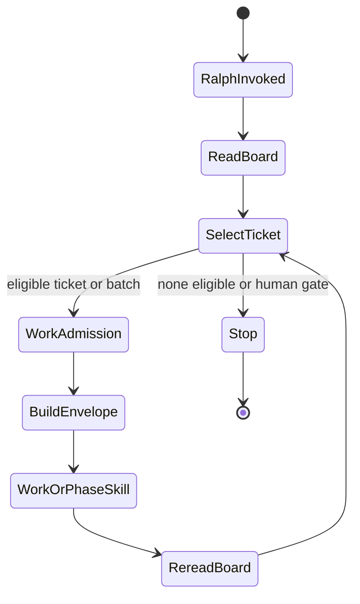
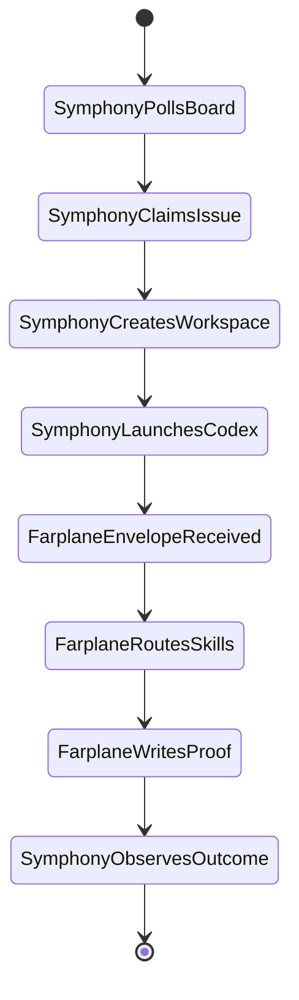

# Invocation And Adapters

Status: active contract

Purpose: define the single active contract for explicit Farplane invocation,
board adapter conformance, compute selection, local Codex execution, and future
external-runner compatibility.

This file replaces the earlier split specs for board/compute orchestration,
board adapter conformance, Farplane V2 milestone notes, and
Symphony-compatible runner planning. Keep historical ticket evidence in
`tickets/archive/`; keep this file focused on the current feature contract.

## 1. Core Decision

Farplane should be the work-contract, skill-routing, QA/review, and proof layer
inside normal Codex. Symphony, Codex cloud, local worktrees, or future services
may be compute substrates.

Farplane is a ticket invocation layer, not a board daemon. A ticket existing,
becoming ready, or moving state is not by itself permission to start an agent.
Execution starts only when a human or external runner makes an explicit
invocation, such as a local Codex request, an operator-invoked `$ralph` run, a
recognized ticket comment, a Codex Cloud task payload, or a Symphony worker
payload.

The user's current priority is local, conversational execution:

1. The user talks to Codex.
2. Codex reads a board item, usually a filesystem ticket.
3. `$work` classifies the work unit and chooses Goal policy, compute,
   planning, proof, and route.
4. Farplane policy selects where the accepted work should run.
5. Codex routes through existing skills such as `impl-plan`, `impl`, `qa`,
   `review`, `batch-work`, `$ralph`, and `close-ticket`.
6. Farplane writes ticket evidence and a machine-readable `ProofPacket`.

The future Symphony path is intentionally compatible with that same contract:

1. Symphony launches normal Codex.
2. The workspace has Farplane installed.
3. The prompt or file includes a `FarplaneRunEnvelope`.
4. Farplane routes through existing skills.
5. Farplane writes a machine-readable `ProofPacket`.

Symphony can own background service mechanics later. Farplane should not rebuild
Symphony's polling/retry/workspace daemon unless a later ticket proves the need.

## 2. Goals

- Keep local filesystem tickets as the first coding-ticket board.
- Define a `BoardAdapter` contract that can later support Linear, Notion,
  GitHub, or other boards without changing Farplane's skill/proof layer.
- Define a `ComputeSelector` that makes target choice explicit per work unit
  after Work Admission.
- Preserve the boundary between Codex, Farplane, and Symphony.
- Make local conversational execution, serial Ralph, and future Symphony-worker
  execution share the same `FarplaneRunEnvelope` and `ProofPacket` contracts.
- Keep PRD user-story oriented while system specs carry state, config, failure,
  observability, and conformance detail.

## 3. Non-Goals

- No new daemon in this spec.
- No Linear, Notion, GitHub, or cloud adapter implementation here.
- No hidden board listener that auto-spawns agents when a ticket state changes.
- No automatic execution from ticket creation, readiness, or status movement
  alone.
- No parallel Ralph implementation here.
- No replacement for `$work`, `impl-plan`, `impl`, `qa`, `review`, or
  `close-ticket`.
- No standalone `farplane run` product claim. Farplane remains normal Codex
  with installed skills, hooks, templates, and repo-owned rules.

## 4. Ownership Model

| Layer | Owner | Responsibility | Does not own |
| --- | --- | --- | --- |
| Codex | OpenAI Codex runtime | Model session, tool use, file edits, subagents, app/worktree/cloud primitives | Farplane ticket semantics or proof policy |
| Farplane | This repo installed into Codex | Skills, tickets, board contracts, invocation policy, compute admission, QA/review gates, ProofPacket | Long-running external scheduler mechanics |
| Symphony | Future external runner | Polling, claims, retries, workspace/process lifecycle, daemon observability | Farplane skill internals or proof quality decisions |
| Board systems | Filesystem now, Linear/Notion later | Store work item data and status/comment/evidence fields, including optional invocation comments for a runner to interpret | Decide that Farplane should run without an explicit invocation |

### Best-Of-Worlds Import

| Source | Adopt | Adapt | Reject / defer |
| --- | --- | --- | --- |
| Symphony spec | Workspaces, claims, retry/reconcile vocabulary, `WORKFLOW.md` discipline, conformance matrix | Treat Symphony as a future caller through the envelope and Done / Proof contract | Do not copy the daemon or state-polling trigger model for local mode now |
| Codex app primitives | Skills, subagents, worktrees, automations, cloud/local execution as trusted runtime primitives | Route compute targets to these primitives when available | Do not pretend Farplane is a separate execution engine |
| Farplane current system | Tickets, skills, Work Admission, Stop-hook proof, review gates, Ralph board context | Generalize ticket reading through `BoardAdapter`, explicit invocation, and compute choice through `ComputeSelector` | Do not put all workflow logic into one giant prompt |

### Advise Decision

Decision: where should coordination authority live?

Options:

| Option | Pros | Cons |
| --- | --- | --- |
| Copy Symphony as Farplane daemon | Strong scheduler parity; one service could own polling and retries | High maintenance; duplicates a thing Symphony already specializes in; weakens local conversational fit |
| Farplane as invocation/contract/quality layer with pluggable compute | Preserves current local use, integrates with Symphony later, keeps proof/review unique to Farplane | Requires crisp adapters, trigger semantics, and compute selection before cloud mode feels real |
| Keep only local filesystem tickets | Lowest complexity and best current reliability | Delays Linear/Symphony integration and compute selection clarity |

Recommendation: Farplane should be the explicit invocation, contract, and
quality layer with pluggable compute. The accepted tradeoff is that Farplane
must maintain clean interfaces, but avoids owning every background runtime
primitive.

## 5. Mode Map



### `local_conversational`

The user explicitly asks Codex to run or prepare one ticket. This is the default
mode for solo coding work.

### `local_ralph`

Ralph selects one eligible filesystem ticket or a safe related tiny-ticket
batch only after the operator invokes `$ralph`. It then hands the selected work
unit to `$work`, which chooses `impl-plan`, `impl`, `close-ticket`, direct
work, reslicing, or autoresearch. Ralph remains serial until a later parallel
lease/worktree/merge policy lands.

### `shared_board_adapter`

A future local Codex session reads a shared board such as Linear or Notion
through the same adapter interface. The entry point is still conversational
unless an external runner explicitly owns polling or events and converts a
board signal into a `FarplaneRunEnvelope`.

### `symphony_worker`

Symphony owns polling, claims, retries, workspace lifecycle, and Codex launch.
Farplane owns the run envelope, skill routing, evidence, review, and proof
inside the launched Codex workspace.

## 6. Domain Model

### `InvocationTrigger`

An `InvocationTrigger` is the human or runner intent that starts one Farplane
run. It is not stored board state and it is not produced automatically by
ticket creation, readiness, status movement, or `compute_target` edits.

```ts
type InvocationTrigger = {
  kind:
    | "local_chat"
    | "local_ralph"
    | "ticket_comment"
    | "codex_cloud_task"
    | "symphony_worker";
  command: "plan" | "implement" | "qa" | "review" | "close";
  workItemRef: {
    id?: string;
    path?: string;
    url?: string;
  };
  actor: string;
  source: "filesystem" | "linear" | "notion" | "github" | "external";
  requestedAt: string;
};
```

Trigger examples:

| Kind | Example | Who converts it to an envelope |
| --- | --- | --- |
| `local_chat` | "Run `TASK-0123` locally" | the current Codex session |
| `local_ralph` | operator invokes `$ralph` | Ralph serial selector |
| `ticket_comment` | `@farplane implement` | future board adapter or external runner |
| `codex_cloud_task` | Codex Cloud task prompt includes the ticket and envelope | operator or future cloud adapter |
| `symphony_worker` | Symphony claims a work item and writes an envelope file | Symphony worker |

Important boundary:

- A `ticket_comment` is a convention for a caller to interpret. Farplane does
  not watch Linear, Notion, GitHub, or filesystem comments in v1.
- A `codex_cloud_task` means Codex Cloud owns the remote execution lifecycle.
  Farplane only owns the contract inside the launched Codex task.
- A `symphony_worker` means Symphony owns polling, claim, retry, workspace, and
  Codex launch behavior. Farplane only receives the already-made invocation.

### `BoardAdapter`

```ts
type BoardAdapter = {
  kind: "filesystem" | "linear" | "notion" | "github";
  listCandidates(filter: CandidateFilter): WorkItemSummary[];
  readWorkItem(selector: WorkItemSelector): WorkItem;
  writeEvidence(item: WorkItemRef, evidence: EvidencePatch): WriteResult;
  transitionState(item: WorkItemRef, transition: StateTransition): WriteResult;
  normalize(raw: unknown): WorkItem;
};
```

Requirements:

- `filesystem` is the only implemented adapter today.
- The live filesystem implementation is `bin/farplane_boards.py`:
  `FileTicketAdapter` reads `tickets/TASK-*/ticket.md`, rejects selectors
  outside the configured board source, and returns a normalized `WorkItem`.
- New adapters must satisfy
  `docs/specs/invocation-and-adapters.md` before they are treated as live.
- External adapters must normalize into the same `WorkItem` shape.
- Adapter writes must be explicit and traceable; Farplane should not silently
  mutate external board state as a side effect of reading.
- BoardAdapter v1 keeps evidence writeback manual. Future writeback support must
  reuse ticket metadata rules and produce a traceable `WriteResult`.

### `WorkItem`

```ts
type WorkItem = {
  source: "filesystem" | "linear" | "notion" | "github";
  id: string;
  identifier: string;
  title: string;
  description: string;
  state: string;
  phase?: "planning" | "building" | "qa" | "review" | "documenting" | "complete" | "failed";
  status?: "todo" | "review" | "building" | "blocked" | "done" | "failed";
  priority?: "critical" | "high" | "medium" | "low" | number;
  labels: string[];
  blockedBy: WorkItemRef[];
  dependsOn: string[];
  ready: boolean;
  approvalRequired: boolean;
  requiresQa: boolean;
  requiresDemo: boolean;
  computeTarget?: ComputeTarget;
  localTicketPath?: string;
  artifactsPath?: string;
  url?: string;
  metadata: Record<string, unknown>;
};
```

### `ComputeTarget`

```ts
type ComputeTarget =
  | "local_shared"
  | "local_worktree"
  | "symphony"
  | "codex_cloud";
```

- `local_shared`: run in the current checkout. Best for hands-on local work.
- `local_worktree`: run in an isolated checkout. Best for concurrent writers or
  branch/PR follow-up.
- `symphony`: future background runner. Block locally until a real adapter is
  configured.
- `codex_cloud`: future cloud task runner. Block locally until a real adapter is
  configured.

### `ComputeDecision`

```ts
type ComputeDecision = {
  allowed: boolean;
  target: ComputeTarget;
  reason: string;
  blockers: string[];
  blockerCodes: string[];
  runtimeHints: string[];
  requiredSetup: string[];
  handoff: string;
  capability: ComputeCapability;
  requiredHumanGate?: string;
  proofPacketPath: string;
};
```

Selector precedence:

1. explicit envelope override,
2. ticket `compute_target`,
3. `WORKFLOW.md` default,
4. implementation default `local_shared`.

The selector must not silently fall back from an unsupported target to a
different target. Unsupported compute returns `allowed: false` with blockers.

The live selector is `bin/farplane_compute.py`. It is an admission policy, not a
runner:

- `local_shared` is implemented and needs no runtime record.
- `local_worktree` is implemented only when a ticket runtime record already
  exists at `.farplane/state/tickets/<ticket>.runtime.json`; otherwise it returns
  `missing_worktree_runtime` and a `bin/ticket_runtime.py ensure ...` setup
  hint.
- `symphony` and `codex_cloud` always return `unsupported_target` until real
  external adapters exist. They must still launch normal Codex with Farplane
  installed and exchange a `FarplaneRunEnvelope` plus `ProofPacket`.
- Approval, blocked status, blocker tickets, and unresolved dependencies block
  non-planning phases.

### `FarplaneRunEnvelope`

```ts
type FarplaneRunEnvelope = {
  workflowPath: string;
  workItemId?: string;
  workItemPath?: string;
  computeTarget?: ComputeTarget;
  phase?: "planning" | "building" | "qa" | "review" | "documenting";
  mode: "local_codex" | "local_ralph" | "symphony_worker" | "external_runner";
  requestedBy: string;
  requestedAt: string;
  proofPacketPath: string;
};
```

### `ProofPacket`

```ts
type ProofPacket = {
  schemaVersion: 1;
  runId: string;
  workItem: {
    source: string;
    id: string;
    identifier: string;
    title: string;
    path?: string;
    url?: string;
  };
  compute: ComputeDecision;
  phases: Record<string, PhaseResult>;
  artifacts: string[];
  commands: string[];
  verdict: "pass" | "revise" | "block" | "failed";
  nextAction: string;
  completedAt: string;
};
```

## 7. Configuration

`WORKFLOW.md` is the local policy file. It should stay small and point to the
owning skills and specs for detail.

Core keys:

- `board.adapter`: `filesystem` now; future `linear`, `notion`, `github`.
- `board.source`: local folder or adapter-specific board identifier.
- `board.active_phases`: phases considered runnable.
- `board.terminal_statuses`: statuses that stop selection.
- `compute.default`: default compute target.
- `compute.allowed`: allowed local targets.
- `compute.ticket_override_field`: ticket metadata field for compute override.
- `routing`: phase-to-skill mapping.
- `quality`: proof, review, QA, and evidence requirements.

Ticket-level `compute_target` may request a target, but it is not authority to
execute. The selector still checks workflow policy, dependencies, blockers,
approval gates, implementation support, and the presence of an explicit
invocation.

## 7b. Runtime Surface

The active runtime surface is intentionally narrow:

- `$work` admits one request, ticket, batch, board-selected unit, epic, or
  metric loop before choosing Goal, compute, planning, proof, and route.
- `impl-plan` plans one selected work package when material planning is needed.
- `$impl` is the public build-phase orchestrator for one selected ticket.
- `$ralph` is an operator-invoked serial board context selector that hands one
  eligible ticket or safe tiny-ticket batch to `$work`.
- native `/goal` owns semantic continuation when outcome, verification surface,
  constraints, iteration policy, and blocked stop condition can be expressed as
  a Goal.
- `stop_hook.py` remains a mechanical active-ticket artifact, phase, review,
  and nonce gate.

There is no separate public retired execution surface anymore. Same-ticket
repeats re-enter `$impl`; serial board drains enter through `$ralph` and then
`$work`; future external runners enter through an explicit invocation envelope.

Public docs should describe `.farplane/` as the canonical live runtime root.
Runtime-only records may live under `.farplane/state/**`, including ticket
runtime records such as `.farplane/state/tickets/TASK-XXXX.runtime.json`.
Tickets remain durable truth; runtime records only carry transient checkout,
branch, target, port, command, launch, and owner-session metadata.

Runtime docs should preserve these boundaries:

- `capture_user_turn.py`, `skills/impl/scripts/tmux_helper.py`, and
  `stop_hook.py` are operator/runtime shims, not a public control plane.
- `ticket_runtime.py` is a narrow ticket-runtime shim for isolated checkout,
  declared runtime launch/stop, and live QA target setup.
- `current-run.json` is control-session-owned state, not a generic sink for
  every prompt-bearing session.
- tmux `auto_continue` is lane-follow-up plumbing, not the source of truth for
  whether a `$impl` loop is active.
- Stop hook is a mechanical protocol/artifact gate, not the autonomy brain for
  Goal-backed work.
- retired prototype dot-directories and old wrappers such as
  `ralph_orchestrate.py` and `ralph_worker.sh` belong only in historical
  surfaces, not live runtime docs.

## 8. State Machines

### Local Conversational Run



### Local Ralph

Ralph is an operator-invoked selector and board-context loop, not an executor
replacement and not a background queue runner.



### Future Symphony Worker



Symphony may retry, cancel, or reconcile runs around Farplane. Farplane should
keep proof and ticket evidence valid no matter which runner initiated the run.

## 9. Failure Model

| Failure | Local behavior | Future Symphony behavior | Proof requirement |
| --- | --- | --- | --- |
| Missing `WORKFLOW.md` | block run | worker failure | proof packet when possible, otherwise clear error |
| Invalid ticket/work item | block run | worker failure | error with selector and adapter details |
| Approval required | stop before execution | release or defer claim | blocker in ticket/proof |
| No explicit invocation | do not run | runner should not create envelope | no proof required unless a prepare attempt already started |
| Unsupported compute target | block, do not fall back | runner may requeue or mark unsupported | blocker names target and required adapter |
| Skill route missing | block | worker failure | route error and next action |
| Work Admission cannot classify | block or reslice | worker records blocked proof | blocker names missing scope, proof, or decision |
| QA/review fails | verdict `revise` or `block` | Symphony observes non-pass proof | linked review/QA artifact |
| Runner crashes | local transcript/error | Symphony retry policy | stale/partial proof if available |
| External board write fails | keep local proof, report write failure | retry or operator-visible error | evidence write failure included |

## 10. Observability And Proof

Minimum local observability:

- `ProofPacket` path from the envelope.
- ticket Evidence links to review/QA/proof artifacts.
- command outputs summarized in the ticket.
- blockers captured in ticket `## Blockers` and, for this ticket train,
  `blockers.md`.

Future runner observability:

- Symphony may add session IDs, logs, token totals, retry queues, rate limits,
  and workspace paths.
- Farplane should not depend on a Symphony dashboard for correctness.
- Farplane proof must remain inspectable from the repo artifacts.

## 11. Safety Rules

- Farplane helpers must not launch Codex, poll boards, own retry queues, or
  present Farplane as a standalone CLI.
- Ticket creation, `ready: true`, status movement, and `compute_target` changes
  are not run triggers by themselves.
- External board adapters must not expose raw credentials to Codex prompts.
- Compute selection must never silently downgrade from a requested remote/cloud
  target to local.
- Parallel Ralph must not ship until leases, isolated checkouts, merge policy,
  stale recovery, and batch QA exist.
- PRD remains user-story and product-intent oriented; system specs carry
  models, state, failure, and tests; tickets carry execution proof.

## 12. Conformance Matrix

| Area | Requirement | Profile | Proof |
| --- | --- | --- | --- |
| Workflow loading | `WORKFLOW.md` parses and exposes board, compute, routing, and quality policy | core | invocation helper tests |
| Board adapter | filesystem tickets normalize into `WorkItem` and satisfy the conformance scaffold | core | `TASK-0123` conformance doc plus board tests |
| Compute selection | precedence is envelope, ticket, workflow, default | core | `TASK-0114` tests |
| Work Admission | request, ticket, batch, board unit, epic, or metric loop is classified before compute-heavy execution | core | `$work` skill contract plus skill registry checks |
| Explicit invocation | tickets and board states are context until local Codex, Ralph, Codex Cloud, Symphony, or another runner passes an invocation envelope | core | `TASK-0121` trigger docs plus invocation tests |
| Unsupported compute | `symphony` and `codex_cloud` block locally until adapters exist | core | prepare JSON fixtures |
| Local conversational | one envelope routes to the expected skill and proof path | core | invocation prepare/write-proof tests |
| Ralph | serial selector hands one eligible ticket or safe batch to `$work` and stops on human gates | core | Ralph selector tests |
| Symphony shim | example workflow/prompt shows Symphony launching normal Codex with Farplane installed | extension | `skills/farplane-invocation/templates/symphony-run-envelope.json` and `TASK-0112` smoke |
| Parallel Ralph | leases, worktrees, merge policy, stale recovery, batch QA specified before implementation | extension | `skills/ralph/references/parallel-ralph.md` and `TASK-0115` design review |
| Spec discipline | complex specs include domain model, state, config, failures, observability, and tests | governance | `TASK-0116` template |

## 13. Completed V2 Ticket Map

| Ticket | Purpose | Depends on | Expected output |
| --- | --- | --- | --- |
| `TASK-0121` | Define explicit invocation triggers | `TASK-0120` | local chat, `$ralph`, comment convention, Codex Cloud, and Symphony trigger vocabulary |
| `TASK-0123` | Add board adapter conformance scaffolding | `TASK-0120` | checklist/fixtures that prove adapters normalize work and preserve invocation semantics |
| `TASK-0122` | Add external compute handoff recipes | `TASK-0121` | Codex Cloud and Symphony handoff recipes with diff/evidence/ProofPacket expectations |

Completed foundation tickets are archived: `TASK-0112`, `TASK-0113`,
`TASK-0114`, `TASK-0115`, `TASK-0116`, `TASK-0119`, and `TASK-0120`.
`TASK-0081` is archived as premature runtime-scaling work.

## 14. Implementation Checklist

- Keep `bin/farplane_invocation.py` diagnostic and artifact-oriented.
- Keep `BoardAdapter` and `ComputeSelector` as admission and normalization
  surfaces; do not turn them into launchers.
- Add external board clients only after their conformance scaffolding exists.
- Add Symphony and Codex Cloud examples only as handoff recipes, not as local
  daemons.
- Add parallel Ralph only after a fresh ticket proves leases, worktrees, merge
  policy, stale recovery, and batch QA are worth the cost.
- Review each implementation against the user story groups:
  - solo local operator,
  - future Symphony integration builder,
  - team/shared-board user,
  - reviewer/maintainer auditing proof.

## 15. References

- `WORKFLOW.md`
- `docs/specs/invocation-and-adapters.md`
- `skills/farplane-invocation/SKILL.md`
- `skills/ralph/SKILL.md`
- `skills/farplane-invocation/references/codex-cloud.md`
- `docs/sources/registry.jsonl`
