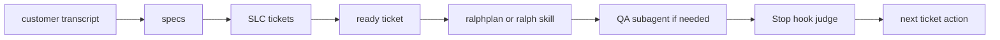
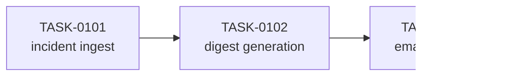
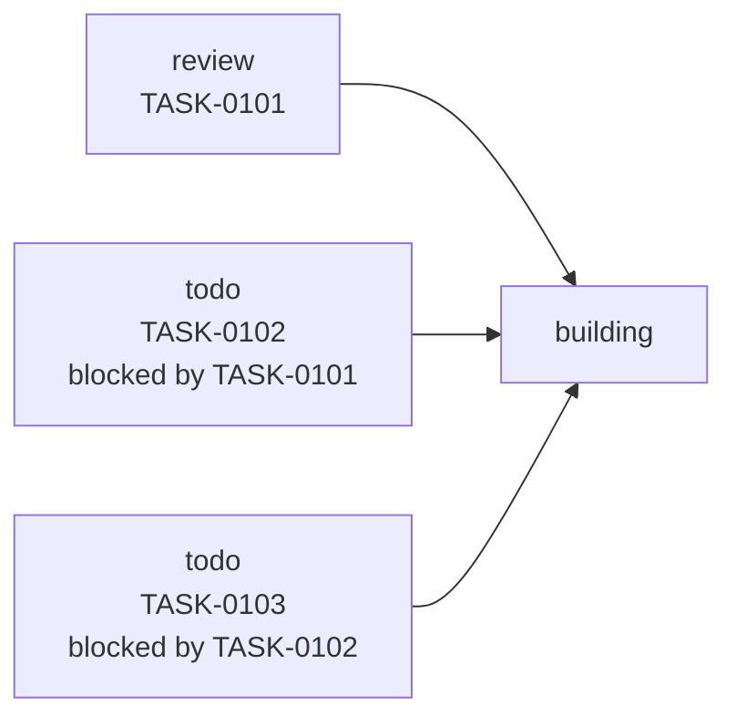
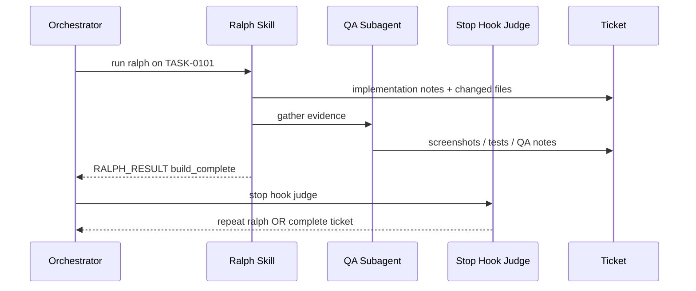
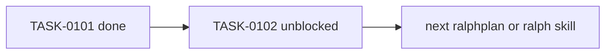
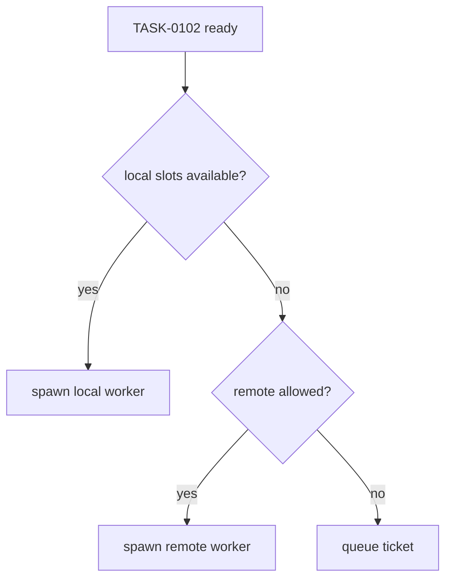
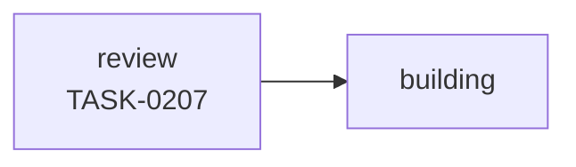
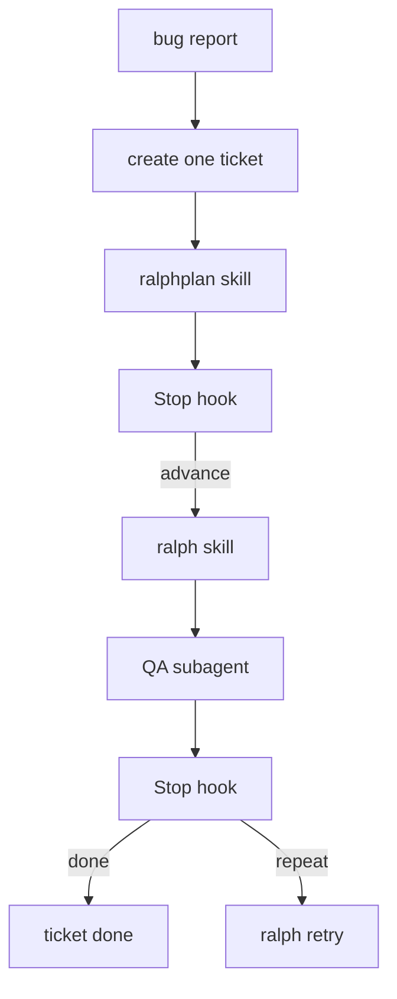
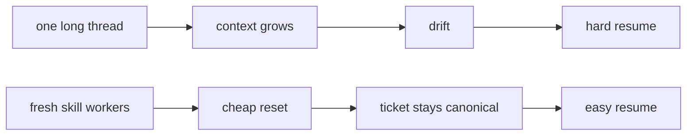
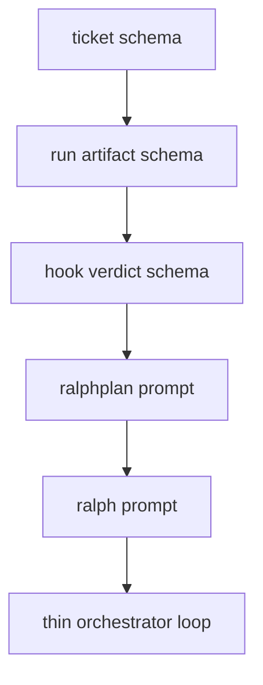

# Dry Runs: Ralph Greenfield And Brownfield

Date: 2026-04-05

## Read This First

This file is the **visual walkthrough**.

If you want the deeper system spec, read:

- `ralph-orchestration-blueprint.md`

If you want to understand Ralph quickly, read only this file.

## Legend

- **Board** = human view
- **Ticket** = canonical work item
- **Run** = runtime state for one active phase
- **Skill** = one fresh `codex exec` workflow
- **Subagent** = bounded helper invoked by a `skill`
- **Hook** = `Stop` `hook` verifier/classifier
- **Orchestrator** = picks the next ticket/phase

---

## Dry Run A: Greenfield

### Operator input

```text
Build a first lovable release for an internal incident digest tool.
It should collect incident notes, summarize them, and email a daily digest.
```

### Step 0: What gets created



### Specs created

```text
docs/prd.md
docs/specs/incident-ingest.md
docs/specs/digest-generation.md
docs/specs/email-delivery.md
```

### Tickets created

```text
TASK-0101 incident ingest UI + storage
TASK-0102 digest generation pipeline
TASK-0103 daily email delivery
```

### Dependency graph



### Board snapshot



### Kanban row for the first ticket

| Field | Value |
| --- | --- |
| Ticket | `TASK-0101` |
| Lane | `review` |
| Phase | `planning` |
| Depends on | none |
| Blocked by | none |
| Next action | write impl plan |
| Last verification | none |

### Ticket frontmatter

```yaml
---
ticket_id: TASK-0101
title: incident ingest ui + storage
phase: planning
status: active
depends_on: []
blocked_by: []
ready: true
approval_required: false
next_action: write the bounded implementation plan
last_verification: none
linked_docs:
  - docs/specs/incident-ingest.md
---
```

---

## Greenfield Timeline

| Tick | Who runs | Reads | Writes | Verdict |
| --- | --- | --- | --- | --- |
| 1 | `ralphplan` `skill` | PRD + spec + ticket | plan in ticket | `plan_ready` |
| 2 | `Stop` `hook` | ticket + result | verdict JSON | `advance -> building` |
| 3 | `ralph` `skill` | ticket + spec + prompt | code + ticket notes | `build_complete` |
| 4 | QA `subagent` | changed code + ticket | evidence | evidence attached |
| 5 | `Stop` `hook` | ticket + evidence + result | verdict JSON | `repeat ralph` or `done` |

---

## Greenfield Phase Handoff

### Orchestrator -> `ralphplan` `skill`

Canonical version:

```bash
RALPH_TICKET="tickets/TASK-0101-incident-ingest-ui-storage.md" \
RALPH_RUN_STATE=".harness/runs/run-0101-plan-01.json" \
codex exec --skip-git-repo-check -C "$ROOT" - < prompts/ralphplan.md
```

What that means:

- `prompts/ralphplan.md` contains the whole `skill` contract
- the wrapper only passes runtime context
- the ticket path is the key input

### Worker output

```text
RALPH_RESULT: status=plan_ready next=building
```

### Run artifact after worker spawn

```json
{
  "run_id": "run-0101-plan-01",
  "ticket_id": "TASK-0101",
  "phase": "planning",
  "status": "running",
  "session_id": "sess_plan_0101",
  "prompt_file": "prompts/ralphplan.md",
  "compute_class": "local",
  "parallel_slots_reserved": 1
}
```

### Judge output

```json
{
  "decision": "advance_ticket",
  "next_phase": "building",
  "reason": "implementation plan present and scoped",
  "orchestrator_message": "launch ralph for TASK-0101"
}
```

### Orchestrator reaction

```text
ticket phase = building
spawn next worker
```

---

## Greenfield `ralph` Loop



### Ticket after `ralph` + QA

```yaml
phase: building
next_action: wait for hook verdict on collected evidence
last_verification: targeted tests and manual ingest flow passed
```

```md
## Evidence
- [x] Tests
- [x] Typecheck
- [x] Lint
- [x] QA / manual verification
```

### Run artifact after `ralph`

```json
{
  "run_id": "run-0101-build-02",
  "ticket_id": "TASK-0101",
  "phase": "building",
  "status": "waiting_for_worker",
  "attempt": 1,
  "compute_class": "local",
  "last_judge_verdict": "advance_ticket",
  "next_phase": "done"
}
```

### After completion



### If local compute is full



---

## Dry Run B: Brownfield Bug Fix

### Operator input

```text
Fix the auth redirect loop after login.
The bug only happens on expired sessions.
```

### What gets created

Not a full spec tree. Just one ticket.

```text
TASK-0207 fix expired-session redirect loop
```

### Canonical worker wrapper

```bash
RALPH_TICKET="tickets/TASK-0207-fix-expired-session-redirect-loop.md" \
RALPH_RUN_STATE=".harness/runs/run-0207-build-02.json" \
codex exec --skip-git-repo-check -C "$ROOT" - < prompts/ralph.md
```

### Board snapshot



### Ticket summary

| Field | Value |
| --- | --- |
| Ticket | `TASK-0207` |
| Lane | `review` |
| Phase | `planning` |
| Depends on | none |
| Blocked by | none |
| Next action | inspect auth flow and write minimal fix plan |

---

## Brownfield Timeline

| Tick | Who runs | Goal | Output |
| --- | --- | --- | --- |
| 1 | `ralphplan` `skill` | inspect auth flow | minimal fix plan |
| 2 | `Stop` `hook` | check plan exists | `advance -> building` |
| 3 | `ralph` `skill` | patch expired-session bug | implementation notes |
| 4 | QA `subagent` | run targeted tests/manual repro | proof |
| 5 | `Stop` `hook` | decide next step | `repeat ralph` or `done` |

---

## Brownfield Flow



### Example judge failure

```json
{
  "decision": "repeat_ralph",
  "next_phase": "building",
  "reason": "proof missing expired-session repro evidence",
  "orchestrator_message": "rerun ralph with explicit repro coverage"
}
```

### Orchestrator reaction

```text
keep same ticket active
increment attempt count
spawn next `ralph` skill
```

---

## What Lives Where

### Board

```text
TASK-0207 | review | planning | next: write fix plan
```

### Ticket

```text
scope
acceptance criteria
implementation plan
evidence
blockers
handoff notes
```

### Run artifact

```json
{
  "ticket_id": "TASK-0207",
  "phase": "building",
  "attempt": 2,
  "session_id": "sess_xyz",
  "compute_class": "local",
  "parallel_slots_reserved": 1,
  "last_judge_verdict": "repeat_ralph"
}
```

### Same ticket on remote compute

```bash
RALPH_TICKET="tickets/TASK-0207-fix-expired-session-redirect-loop.md" \
RALPH_RUN_STATE=".harness/runs/run-0207-build-03.json" \
RALPH_EXECUTOR_TARGET="vm-eu-west-1-build-03" \
codex exec --skip-git-repo-check -C "$ROOT" - < prompts/ralph.md
```

```json
{
  "ticket_id": "TASK-0207",
  "phase": "building",
  "status": "running",
  "session_id": "sess_remote_0207",
  "compute_class": "remote_vm",
  "executor_target": "vm-eu-west-1-build-03",
  "parallel_slots_reserved": 2
}
```

### Worker transcript

```text
disposable
debug-only
not canonical memory
```

---

## Agent Experience

The `skill` experience should feel like this:

1. read one ticket
2. run one `skill`
3. call `subagents` only when needed
4. write back to ticket
5. emit one result line
6. exit

That is the whole model.

---

## Why This Is Better Than One Long Ticket Thread



Benefits:

- cheap resets
- explicit handoffs
- visible proof
- better dependency tracking
- easier future investigation

---

## Prompt File Split

```text
prompts/ralphplan.md
prompts/ralph.md
```

The ticket gives task-specific context.
The prompt file gives `skill`-specific behavior.

---

## Build This First



Minimal proof of concept:

1. one ticket schema
2. one run artifact schema
3. one hook verdict schema
4. one `ralphplan` `skill`
5. one `ralph` `skill`
6. one orchestrator that handles:
   - `planning -> building -> done|blocked`
