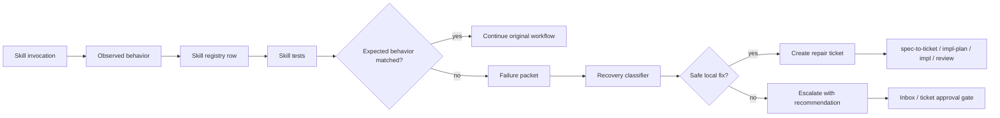

# Skill Self-Healing Pipeline

Status: Draft v1

Purpose: define how Codexter should notice when an invoked skill fails to
behave as expected, collect enough evidence to repair it, and hand that repair
to the existing ticket pipeline instead of asking the user to debug the harness.

This is not a scheduler feature. Codex may invoke this from scheduled
automation, normal chat, `$ralph`, `$impl`, or any other workflow that uses a
skill. The trigger is skill failure or skill-missing-value, not the runtime
mode.

## Core Decision

Skill self-healing should be a Tier 3 meta pipeline over existing skills:

- `skills/self-improve` owns the broad skill-improvement workflow.
- `skills/skill-maintenance` owns skill registry, metadata, and generated
  skill-system checks.
- `spec-to-ticket`, `impl-plan`, `impl`, and `review` own the actual repair
  work once a repair ticket exists.

Do not add a new scheduler or long-running owner. The missing lever is a
skill-failure-to-ticket handoff with enough structured evidence and priority
context that the existing ticket pipeline can fix the problem autonomously.

## Goals

- Detect when a used skill does not match its advertised operation.
- Keep expected behavior close to the owning skill, not in a global prose file.
- Record small sanity tests for high-value skills, especially external API/MCP
  wrappers.
- Create a repair ticket automatically when the fix is local and non-destructive.
- Do not directly edit installed or external skill bodies unless the operator
  explicitly requests that specific external-skill edit.
- Escalate only when permission, external mutation, billing, publishing,
  destructive cleanup, or ambiguous user-value judgment is required.
- Support future value inference without letting the agent invent risky work.

## Non-Goals

- No Codex scheduler implementation.
- No hidden daemon.
- No automatic external board mutation.
- No blanket authority over personal-life priorities.
- No giant required test suite for every skill before this proves useful.
- No bulky expected outputs in `docs/skills/registry.jsonl`.

## Trigger Model

The pipeline triggers when one of these happens:

1. A named skill operation fails at runtime.
2. A skill's expected tool, MCP server, file, registry row, or command is
   missing.
3. A skill returns a wrapper gap where the user reasonably expected a working
   operation.
4. A repeated user correction indicates the skill failed its job.
5. A high-value missing capability is inferred from current user goals and
   existing registry context.

The first four are repair triggers. The fifth is an opportunity trigger and
must create a proposal ticket unless the action is clearly same-scope and safe.

## Data Map



## Records

### `SkillCapability`

Stored as small JSON fixtures under:

- repo-owned skills: `skills/<skill>/tests/`
- installed or external skills: `tests/<skill>/`

```ts
type SkillCapability = {
  skill: string;
  operation: string;
  kind:
    | "mcp_query"
    | "local_script"
    | "file_contract"
    | "generated_registry"
    | "external_connector";
  expected: string;
  observed_failure?: string;
  expected_recovery: (
    | "continue"
    | "fallback"
    | "repair_ticket"
    | "escalate"
    | "no_action"
  )[];
  forbidden_actions: string[];
  priority_hint: "low" | "medium" | "high";
  user_value_reason: string;
};
```

### `SkillFailurePacket`

Written into a repair ticket or ticket artifact.

```ts
type SkillFailurePacket = {
  skill: string;
  operation: string;
  invoked_from: "chat" | "scheduled_automation" | "ralph" | "impl" | "other";
  expected: string;
  observed: string;
  failure_class:
    | "tool_missing"
    | "connector_contract_mismatch"
    | "auth_or_permission"
    | "wrapper_gap"
    | "stale_registry"
    | "ambiguous_value";
  safe_local_fix_available: boolean;
  suggested_ticket_title: string;
  suggested_owner_skill: string;
  evidence_refs: string[];
};
```

### `UserValueSignal`

Used only for opportunity tickets, not direct autonomous execution.

```ts
type UserValueSignal = {
  goal_ref?: string;
  repeated_failure_count: number;
  blocked_workflows: string[];
  affected_skills: string[];
  manual_intervention_cost: "low" | "medium" | "high";
  confidence: "low" | "medium" | "high";
  action_policy: "auto_ticket" | "recommend" | "ask";
};
```

## Levers

| Lever | Use it for | Do not use it for |
| --- | --- | --- |
| `skills/<skill>/tests/` | repo-owned skill sanity fixtures | global policy or bulky outputs |
| `tests/<skill>/` | installed/external skill sanity mirrors | canonical ownership for repo-owned skills or permission to edit external skill bodies |
| `docs/skills/registry.jsonl` | generated discovery handles | storing expected result payloads |
| `bin/check_skill_capabilities.py` | deterministic validation and fixture scoring | broad judgment about user goals |
| `skills/self-improve` | improving an existing skill from evidence | live repair execution without a ticket |
| `skills/skill-maintenance` | registry/test metadata and generated checks | product judgment or user-value inference |
| `spec-to-ticket` | creating the visible repair ticket | hidden background repair |
| `impl-plan` / `impl` / `review` | executing and proving the repair | selecting personal-life priorities |
| root/global prompts | one routing rule to use the pipeline | full SOP details |

## Skills Needed

- `self-improve`: top-level self-healing method for a broken skill.
- `skill-maintenance`: capability fixture format, registry discovery handles,
  and validation.
- `runtime-debugging`: only when the broken skill needs live repro or tool
  diagnosis.
- `spec-to-ticket`: create a repair ticket with the failure packet.
- `impl-plan`: plan the repair ticket.
- `impl`: implement the repair.
- `review`: gate the repair before claiming it is fixed.
- `advise`: decide when a missing feature is valuable enough to ticket.
- `harness-advisor`: place new self-healing surfaces when the right owner is
  unclear.

## Minimal Prompt Rule

Add a short rule later, after the checker exists:

> When an invoked skill fails or contradicts its advertised behavior, collect a
> skill failure packet. If the repair is safe and local, create or update a
> visible repair ticket and continue through the existing ticket pipeline,
> targeting repo-owned wrappers, fixtures, registry rows, or docs. Do not edit
> installed or external skill bodies unless the operator explicitly requests
> that specific external-skill edit. If the failure requires external mutation,
> billing, publishing, destructive cleanup, or ambiguous user-value judgment,
> escalate with a recommendation.

Do not put the full pipeline in root or global prompts.

## First Implementation Batch

1. `TASK-0155`: add skill capability fixture format and checker.
2. `TASK-0156`: add skill-failure-to-ticket handoff.
3. `TASK-0157`: add user-value signal policy for missing high-value skill
   capabilities.

This order intentionally fixes broken existing skills before attempting to
infer new work the user would value.
