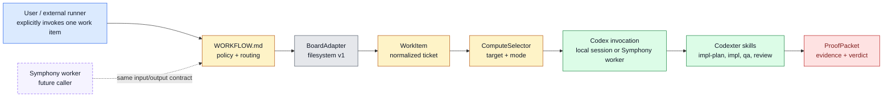

# Symphony-Compatible Codexter Invocation Contract

Date: 2026-05-05
Status: Draft system design

## Goal

Make Codexter easy to use in a local Codex session today and easy for Symphony
or another background-agent service to invoke later through normal Codex
execution.

Codexter is not a separate CLI product. Codexter is Codex equipped with
repo-owned skills, prompts, hooks, ticket contracts, and proof conventions. If
Symphony can launch Codex in a workspace where Codexter has been installed, it
can run Codexter.

The target is not to copy Symphony's daemon. The target is to expose an
installed Codexter invocation contract with stable inputs, explicit trigger
semantics, compute selection, skill routing, and proof outputs.

Ticket storage and ticket readiness are not run triggers. A filesystem ticket,
Linear issue, Notion card, or other board item becomes executable only when a
human or external runner explicitly invokes Codexter for that item.

## Design Decision

Build the installed Codexter invocation contract first.

Codexter owns:

- `WORKFLOW.md` as the repo-local control tower,
- normalized `WorkItem` contracts,
- board adapter contracts,
- compute selection,
- skill routing,
- proof/review outputs,
- local Codex execution fallback.

Symphony or another external system may later own:

- polling,
- background scheduling,
- retries,
- remote workspaces,
- app-server session lifecycle,
- remote observability.

Therefore the first implementation is:

> A `CodexterRunEnvelope` that a local Codex session or a future Symphony
> worker can pass to Codex, plus a `ProofPacket` path that the run must write.

## Non-Goals

- Do not build a long-running daemon in the first slice.
- Do not build the Linear adapter in the first slice.
- Do not build Notion/Open Claw integration in this slice.
- Do not make board status movement auto-spawn agents.
- Do not make ticket creation, readiness, or compute-target edits start work by
  themselves.
- Do not replace `impl-plan`, `$impl`, QA, review, or Stop hook with one giant
  prompt.
- Do not store raw app-server session ids in ticket frontmatter.

## Decision Boundaries

- Local filesystem tickets remain the first board adapter.
- Linear is the future team/shared coding board adapter.
- Notion/Open Claw is not the target of this design pass.
- Symphony integration means "Symphony launches Codex with Codexter installed
  and passes the Codexter run envelope," not "Codexter becomes Symphony."
- The local operator entry point remains conversational: "run this ticket."
- `$ralph` is also an explicit invocation: the operator starts a serial board
  drain, then Ralph selects one eligible ticket at a time.
- Event-driven/polling dispatch belongs to an external runner such as Symphony,
  Codex Cloud, or a future adapter once it can produce a run envelope.

## Top-Level Flow



## Core Entities

### `WorkflowPolicy`

Source: `WORKFLOW.md`.

Owns the repo's execution policy:

```ts
type WorkflowPolicy = {
  workflow: { name: string; version: number };
  board: BoardPolicy;
  dispatch: DispatchPolicy;
  compute: ComputePolicy;
  routing: RoutingPolicy;
  quality: QualityPolicy;
  prompts?: PromptPolicy;
};
```

### `WorkItem`

Normalized ticket/task model:

```ts
type WorkItem = {
  source: "filesystem" | "linear";
  id: string;
  identifier: string;
  title: string;
  description: string;
  state: string;
  phase?: string;
  status?: string;
  priority?: "critical" | "high" | "medium" | "low" | number;
  labels: string[];
  blockedBy: WorkItemRef[];
  dependsOn: string[];
  ready: boolean;
  approvalRequired: boolean;
  requiresQa: boolean;
  requiresDemo: boolean;
  computeTarget?: ComputeTarget;
  localTicketPath?: string;
  artifactsPath?: string;
  url?: string;
  metadata: Record<string, unknown>;
};
```

### `ComputeDecision`

```ts
type ComputeTarget =
  | "local_shared"
  | "local_worktree"
  | "symphony"
  | "codex_cloud";

type ComputeDecision = {
  target: ComputeTarget;
  reason: string;
  allowed: boolean;
  blockers: string[];
  runtimeRecordPath?: string;
};
```

### `CodexterRunEnvelope`

Structured input contract for local and future external execution. This may be
embedded directly in the Codex prompt, referenced as a file path, or provided by
a Symphony workflow template. It is not a separate Codexter CLI command.

```ts
type CodexterRunEnvelope = {
  workflowPath: string;
  workItemId?: string;
  workItemPath?: string;
  computeTarget?: ComputeTarget;
  phase?: "planning" | "building" | "qa" | "review" | "documenting";
  mode: "local_codex" | "symphony_worker" | "external_runner";
  requestedBy: string;
  requestedAt: string;
  proofPacketPath: string;
};
```

### `RunEvent`

Portable event vocabulary:

```ts
type RunEvent = {
  runId: string;
  workItemId: string;
  event:
    | "run_started"
    | "work_item_loaded"
    | "compute_selected"
    | "phase_started"
    | "agent_event"
    | "qa_completed"
    | "review_completed"
    | "proof_packet_written"
    | "run_failed"
    | "run_completed";
  at: string;
  message?: string;
  payload?: Record<string, unknown>;
};
```

### `ProofPacket`

Output contract for local and future external callers:

```ts
type ProofPacket = {
  schemaVersion: 1;
  runId: string;
  workItem: {
    source: string;
    id: string;
    identifier: string;
    title: string;
    path?: string;
    url?: string;
  };
  compute: ComputeDecision;
  phases: {
    planning?: PhaseResult;
    building?: PhaseResult;
    qa?: PhaseResult;
    review?: PhaseResult;
    documenting?: PhaseResult;
  };
  artifacts: string[];
  commands: string[];
  verdict: "pass" | "revise" | "block" | "failed";
  nextAction: string;
  completedAt: string;
};
```

## Component Contracts

| Component | Responsibility | Trigger | Runs where | Sync/async |
| --- | --- | --- | --- | --- |
| `WorkflowLoader` | Parse and validate `WORKFLOW.md` | Codexter run envelope received | local Codex session or future Symphony worker | sync |
| `BoardAdapter` | Load/update normalized work items | run startup and phase writeback | local process or future worker | sync in v1 |
| `FileTicketAdapter` | Map `tickets/TASK-*/ticket.md` to `WorkItem` | v1 board adapter | local filesystem | sync |
| `ComputeSelector` | Decide where the ticket should run | after work item load | local process or future worker | sync |
| `CodexInvocation` | Execute selected phase route inside Codex | after compute decision | local Codex session v1, Symphony-launched Codex later | sync wrapper around agent work |
| `SkillRouter` | Map phase to skill command/prompt | per phase | Codex session | sync |
| `ProofWriter` | Write `ProofPacket` and link ticket evidence | end of run or failure | local filesystem | sync |

## Interface Map

### Invocation Surfaces

Local:

- The operator starts Codex normally in a repo where Codexter is installed.
- The operator asks Codex to run a ticket, usually by naming a ticket path or
  ID and optional compute target.
- Codexter skills and repo policy interpret that as a `CodexterRunEnvelope`.
- Creating or editing the ticket is drafting work only. It does not imply a
  run should begin.

Future Symphony:

- Symphony launches Codex through its normal app-server/session mechanism.
- The workspace has Codexter installed, or the Symphony workflow bootstraps the
  Codexter install before the run.
- The Symphony prompt includes or references a `CodexterRunEnvelope`.
- Codex writes the requested `ProofPacket`.
- Symphony owns the decision to claim/poll/retry. Codexter only receives the
  already-made invocation.

### Internal signatures

```ts
parseRunEnvelope(input: PromptOrFile): CodexterRunEnvelope
loadWorkflow(path: string): WorkflowPolicy
loadWorkItem(adapter: BoardAdapter, selector: WorkItemSelector): WorkItem
selectCompute(item: WorkItem, policy: WorkflowPolicy, capacity: CapacitySnapshot): ComputeDecision
routePhase(item: WorkItem, policy: WorkflowPolicy): SkillRoute
runPhase(route: SkillRoute, item: WorkItem, decision: ComputeDecision): PhaseResult
writeProofPacket(result: RunResult, path: string): ProofPacket
```

## `WORKFLOW.md` v1 Shape

```yaml
---
workflow:
  name: codexter-invocation
  version: 1

board:
  adapter: filesystem
  source: tickets/
  active_phases: ["planning", "building", "documenting"]
  terminal_statuses: ["done", "failed"]

compute:
  default: local_shared
  allowed: ["local_shared", "local_worktree"]
  ticket_override_field: compute_target

routing:
  planning: impl-plan
  building: impl
  qa: qa
  review: review
  documenting: close-ticket

quality:
  requires_ticket_evidence: true
  requires_review: true
  requires_qa_from_ticket: true
  writes_proof_packet: true
---

# Codexter Invocation Workflow

Use this file as the invocation policy for an explicitly requested run. Do not
restate the skill contracts here. The selected ticket remains the task-local
source of truth, but ticket existence is not itself invocation.
```

## Storage and State

Durable:

- `WORKFLOW.md` for invocation policy.
- `tickets/TASK-*/ticket.md` for filesystem board cards.
- `tickets/TASK-*/artifacts/` for evidence.
- `docs/specs/symphony-compatible-codexter-runner.md` for this system design.

Runtime-only:

- `.harness/state/runs/<run_id>.json` for local run state.
- `.harness/state/tickets/<ticket_id>.runtime.json` for checkout/runtime target.
- `.harness/requests/<run_id>.json` for optional file-based external run
  envelopes.
- `.harness/results/<run_id>.proof.json` for portable proof output.

## Execution Model

### Local v1

1. Operator starts Codex normally in a Codexter-installed repo.
2. Operator asks Codex to run one ticket, with optional compute override.
3. Codexter interprets the request as a `CodexterRunEnvelope`.
4. Codexter loads `WORKFLOW.md`.
5. File ticket adapter loads one ticket.
6. Compute selector chooses `local_shared` or `local_worktree`.
7. Skill router calls the existing phase skill:
   - `planning` -> `impl-plan`
   - `building` -> `$impl`
   - `documenting` -> `close-ticket`
8. Existing QA/review/Stop-hook behavior remains the authority for completion.
9. Proof writer emits a `ProofPacket`.

### Future Symphony caller

1. Symphony claims/polls/retries using its own service loop.
2. Symphony launches a worker in a workspace.
3. Worker launches Codex with Codexter installed and passes a
   `CodexterRunEnvelope` in the prompt or as a referenced file.
4. Codexter-equipped Codex writes a `ProofPacket`.
5. Symphony can attach or link the proof back to Linear, but Codexter's proof
   gate decides whether the ticket is actually done.

The concrete v1 shim lives in:

- `skills/codexter-invocation/templates/symphony-run-envelope.json`
- `skills/codexter-invocation/references/symphony.md`

The template uses `mode: "symphony_worker"` and `computeTarget:
"local_shared"`. This is intentional: once Symphony has launched a per-ticket
workspace, Codexter's local view of that workspace is shared/local. The
`symphony` compute target remains blocked until a real adapter exists.

## Reliability Policy

V1 local:

- Fail fast on missing `WORKFLOW.md`, invalid ticket, blocked ticket, or
  disallowed compute target.
- Do not auto-retry failed phases.
- Preserve ticket evidence and write a failed `ProofPacket`.
- Keep local Stop-hook continuation behavior unchanged.

Future external caller:

- Let Symphony own polling, retries, stall detection, and workspace cleanup.
- Require Symphony to pass Codexter's run envelope.
- Require Codexter to emit proof even on failure when possible.
- Do not require Codexter to watch the remote board after the envelope has been
  handed off.

## Parallelism

V1:

- one ticket per `CodexterRunEnvelope`.
- no queue-wide parallel dispatcher.

Later:

- queue runner may launch Codex with one `CodexterRunEnvelope` for each claimed
  ticket.
- parallel safety requires claim/lease registry, worktree isolation, merge
  policy, and batch QA.

## Autonomy Readiness

Required before unattended or remote execution:

- ticket has no unresolved blockers,
- ticket does not require human approval,
- compute target is allowed,
- credentials and local-only tools are named,
- QA requirement is explicit,
- proof packet path is writable,
- remote runner can access the workspace or receives a prepared workspace.

## Implementation Status And Cap

Implemented foundation:

- `WORKFLOW.md` exists as the repo-local invocation policy.
- Filesystem tickets normalize into `WorkItem` through `FileTicketAdapter`.
- Compute admission is handled by `ComputeSelector`.
- Local Codex can prepare one `CodexterRunEnvelope` and write a `ProofPacket`.
- Symphony examples exist as a shim, not as a Codexter-owned daemon.
- Ralph selection now reads through BoardAdapter and ComputeSelector while
  remaining serial.

Remaining V2 tickets:

| Ticket | Why now | Stop line |
| --- | --- | --- |
| `TASK-0121` | lock explicit invocation trigger vocabulary before any adapter or handoff work repeats the same ambiguity | no listener, webhook, or daemon |
| `TASK-0123` | give future board adapters a tiny conformance scaffold before Linear/Notion/GitHub work starts | no real external board client |
| `TASK-0122` | document practical Codex Cloud and Symphony handoffs without rebuilding background agents | no cloud wrapper, no auto-apply |

Deferred:

- Parallel Ralph, leases, worktree pools, merge queues, and batch QA.
- Hosted dashboards and telemetry.
- First-class Linear/Notion/GitHub adapters.
- A Symphony replacement or scheduler inside Codexter.

## Acceptance Criteria for V2 Close

- Explicit invocation triggers are documented.
- Board adapter conformance expectations are documented.
- External compute handoff recipes are documented.
- The README and architecture map point to the capped V2 milestone.
- No active roadmap claims Codexter should rebuild Symphony, own polling, or
  auto-run draft tickets.
