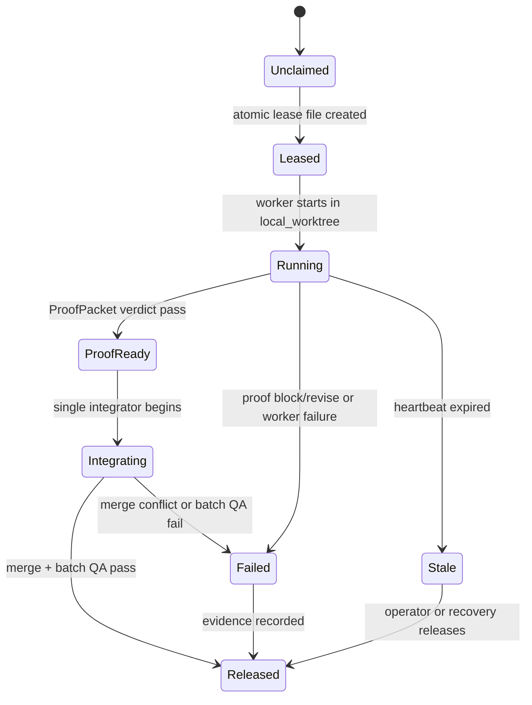

# Parallel Ralph Design

Status: design-only. This does not ship a parallel dispatcher.

Serial `$ralph` remains the public runnable skill today. Parallel Ralph becomes
safe only after leases, isolated checkouts, merge policy, stale recovery, and
batch QA are implemented and reviewed.

## User Story

As the Codexter operator, I want to say "Ralph, run up to N ready tickets" and
have each ticket run in an isolated, inspectable lane, without losing the
current Codexter guarantees around tickets, review, QA, and proof.

As a future maintainer, I need every parallel claim, workspace, proof packet,
merge, and release decision to be visible in files so a failed batch can be
debugged without transcript archaeology.

## Non-Goals

- No hidden worker farm.
- No automatic merges to the main branch.
- No shared-checkout concurrent writers.
- No cloud or Symphony backend inside Ralph.
- No replacement for `impl-plan`, `impl`, `qa`, `review`, or `close-ticket`.

## Data Model

```ts
type ParallelBatch = {
  batch_id: string;
  board_adapter: "filesystem";
  requested_by: string;
  max_parallel: number;
  selector: CandidateFilter;
  merge_policy: "serial_integrate" | "independent_prs" | "manual_review";
  qa_policy: "per_ticket_then_batch" | "manual_batch_only";
  started_at: string;
  stopped_at?: string;
  stop_reason?: StopReason;
};

type LeaseRecord = {
  ticket_id: string;
  holder: string;
  batch_id: string;
  compute_target: "local_worktree";
  checkout_path: string;
  branch_name: string;
  write_scope: WriteScope;
  state:
    | "leased"
    | "running"
    | "proof_ready"
    | "integrating"
    | "released"
    | "failed";
  proof_path: string;
  started_at: string;
  expires_at: string;
  last_heartbeat_at?: string;
  stop_reason?: StopReason;
};

type WriteScope = {
  paths: string[];
  modules: string[];
  risk: "low" | "medium" | "high";
  overlaps_allowed: false;
};

type StopReason =
  | "no_ready_tickets"
  | "human_gate"
  | "compute_blocked"
  | "write_scope_conflict"
  | "lease_stale"
  | "proof_failed"
  | "qa_failed"
  | "merge_conflict"
  | "batch_limit";
```

Future storage should stay under `.harness/state/ralph/`:

- `.harness/state/ralph/batches/<batch_id>.json`
- `.harness/state/ralph/leases/<ticket_id>.json`

These are runtime records, not durable ticket memory. Tickets still carry
human-facing progress, blockers, evidence, and final closeout.

## Candidate Selection

Parallel Ralph lists work through `BoardAdapter.list_candidates()` and then
keeps only tickets that satisfy all current serial Ralph gates:

- `ready: true`
- `approval_required: false`
- `blocked_by: []`
- empty `claimed_by`
- dependencies resolved
- phase routable to a Codexter skill

Parallel Ralph then adds parallel-only gates:

- `ComputeSelector` must allow `local_worktree`.
- ticket write scopes must be known or inferred conservatively.
- no two selected tickets may have overlapping write scopes unless a human
  explicitly chooses `manual_review`.
- high-risk tickets count as a batch of one unless a future policy says
  otherwise.

## Lease Lifecycle



Lease acquisition must be atomic. If two Ralph processes race for the same
ticket, only one creates the lease record. Future implementation should use
exclusive file creation or an equivalent atomic primitive.

## Compute Policy

Parallel writer lanes must use `local_worktree` by default. A shared checkout
may be used only for the single integration lane, never for concurrent ticket
implementation.

For each leased ticket:

1. Run `ComputeSelector` for `local_worktree`.
2. If it returns `missing_worktree_runtime`, run the existing `pr-runtime` /
   `ticket_runtime.py ensure` setup outside the selector.
3. Record the checkout path in the lease.
4. Launch normal Codex in that checkout with Codexter installed.
5. Pass a `CodexterRunEnvelope` for the ticket and expected phase.

Parallel Ralph still does not become a Codex launcher in v1. The future
implementation may choose native Codex subagents, separate Codex CLI sessions,
or an external runner, but the lease/proof contract must stay the same.

## Merge Policy

Default: `serial_integrate`.

1. Finished lanes write `ProofPacket` and stop.
2. One integrator reads all proof packets and diffs.
3. The integrator applies one ticket at a time into the base checkout.
4. After each integration, run the ticket's targeted verification.
5. After all integrations, run batch QA.
6. If any conflict or QA failure occurs, pause the batch and keep remaining
   leases visible for human decision.

Alternative policies:

- `independent_prs`: each ticket ends as its own PR/branch and no batch merge is
  attempted locally.
- `manual_review`: Ralph gathers proof and diffs but does not integrate.

No policy may auto-merge to a protected branch without explicit operator action.

## Batch QA Rings

| Ring | Purpose | Required Before |
| --- | --- | --- |
| Ring 0: per-ticket proof | Each ticket has phase proof, review, and ticket evidence | lease enters `proof_ready` |
| Ring 1: integration checks | Run tests relevant to changed modules after each serial integration | next ticket integrates |
| Ring 2: batch release | Full relevant suite, metadata, doc parity, harness invariants, and final review | batch closes |

UI-bearing tickets must keep visual QA evidence per ticket. Batch QA cannot
erase a ticket-specific failed visual or review gate.

## Stop Conditions

Parallel Ralph stops without selecting more work when any of these happens:

- no eligible tickets remain
- batch limit reached
- max parallel capacity reached
- compute selector blocks required target
- write-scope conflict cannot be resolved automatically
- any selected ticket needs human approval
- a lease goes stale
- a proof packet is missing, invalid, or non-pass
- integration merge conflict occurs
- batch QA fails

## Follow-Up Ticket Map

| Future ticket | Purpose | Exit proof |
| --- | --- | --- |
| Parallel Ralph lease registry | Implement atomic batch and lease records under `.harness/state/ralph/` | lease acquire/release tests |
| Write-scope declaration | Add optional ticket write-scope metadata and conservative inference | conflict fixture tests |
| Worktree lane setup | Wire `local_worktree` runtime setup into the future parallel runner | no shared-checkout writer tests |
| Proof collector | Gather per-ticket `ProofPacket` results and stop on invalid/missing proof | malformed proof tests |
| Serial integration lane | Apply completed ticket diffs one at a time with merge conflict stops | merge conflict fixture |
| Batch QA gate | Run Ring 1 and Ring 2 checks before closeout | batch review artifact |

## Current Safe Position

Until those follow-ups exist, `$ralph` must remain serial. This design is the
bridge between today's local board drain and a future N-agent mode; it is not a
permission slip for hidden parallel execution.
