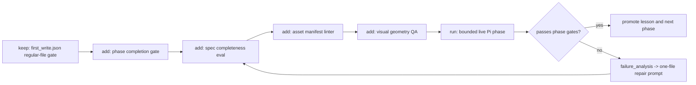

# Impl Plan: Next Hypotheses for Terminus-Level Frontend Delegation

## Summary

Improve `delegate-frontend` and the `frontend-pi-kimi` profile by moving from
single-run prompt tuning to a structured hypothesis queue with mechanical gates
for spec completeness, asset quality, visual geometry, scroll motion, and
external CLI reliability.

Recommended path: build a tiny experiment harness around the existing
self-improve runner, then run phase-scoped Pi/Kimi experiments only when local
lint and replay gates pass. Do not broaden into generic model switching or
unbounded generated-media runs until the phase gates can reject weak output
without human interpretation.

## Scope

In:

- add durable hypotheses to the `delegate-frontend` self-improve program,
- add binary eval cases for spec, asset, visual-geometry, completion, and
  startup reliability failures,
- add local checkers or replay fixtures before more live Pi/Kimi attempts,
- define an autonomous experiment order with stop conditions.

Out:

- no live asset/video spend without an explicit spend/cap gate,
- no new generic multi-CLI router work,
- no claim that Pi/Kimi can produce Terminus-level UI until artifacts prove it,
- no weakening of current first-write, scroll-debug, or asset-manifest gates.

## Plan

### Change

Turn the current self-improve loop from "one eval runner plus remembered
failures" into a phase-gated experiment queue:

1. local replay evals decide whether a prompt/profile/checker candidate is worth
   live testing,
2. live Pi/Kimi runs are split into `startup`, `spec`, `assets`,
   `implementation`, and `visual-review`,
3. each phase has a named owned output, a regular-file first-write proof, and a
   completion checker,
4. only passing phase artifacts can feed the next phase.

### Why

The current metric catches weak output but does not yet tell the agent which
next experiment to run. Live evidence showed four distinct failure modes:

- Pi reads references before writing anything,
- Pi writes a stub then times out,
- Pi startup can fail before any session file appears,
- a locally repaired prototype can pass mechanics while still failing
  Terminus-level media and visual-delta gates.

Each failure needs its own hypothesis, metric, and stop condition.

### Before -> After

- Before: one broad "make the Terminal-style page better" loop can produce a
  stub, timeout, or weak canvas prototype and still require human interpretation.
- After: the loop records which phase failed and the next experiment is selected
  from the highest-value failing gate.

### Touch

- `skills/delegate-frontend/self-improve/program.md`: next hypotheses and
  accepted/rejected lessons.
- `skills/delegate-frontend/self-improve/evals/test_cases.jsonl`: more
  captured-output cases.
- `skills/delegate-frontend/self-improve/evals/assertions.py`: new assertion
  families for spec, asset manifest, visual geometry, startup, and completion.
- `skills/delegate-frontend/self-improve/results/candidate_outputs.jsonl`:
  replay fixtures for known failures and new pass cases.
- `skills/delegate-frontend/self-improve/runs/*/autoresearch.md`: run-specific
  experiment queue and stop conditions.
- `templates/external-cli/profiles/frontend-pi-kimi/APPEND_SYSTEM.md`: only
  when a measured prompt/profile rule wins.
- `templates/external-cli/profiles/frontend-pi-kimi/prompt.md.tpl` and
  `handoff.md.tpl`: only if handoff evidence fields are missing.
- `skills/landing-page/scripts/scroll_scrub_qa.cjs`: only if visual/motion
  metric gaps require new observable fields.

### Inspect

- current `delegate-frontend` self-improve program and latest run,
- landing-page Terminal benchmark program and notes,
- Terminal parity research checklist,
- scroll-scrub QA gap analysis,
- delegate CLI first-write functions and tests,
- Pi profile system and handoff templates.

### Signature Delta

- `evals/assertions.py / evaluate_spec(case, output): list[AssertionResult]`
- `evals/assertions.py / evaluate_asset_manifest(case, output): list[AssertionResult]`
- `evals/assertions.py / evaluate_visual_geometry(case, output): list[AssertionResult]`
- `evals/assertions.py / evaluate_phase_completion(case, output): list[AssertionResult]`
- `evals/assertions.py / evaluate_startup_reliability(case, output): list[AssertionResult]`
- `evals/runner.py / load_jsonl(path): list[dict]`
- `bin/delegate_cli_agent.py / command_run(args): DelegateRunResult payload`
- `scroll_scrub_qa.cjs / result.score: ScrollScrubScore`

### Type Sketch

```text
SelfImproveCase:
  id: string
  input: string
  spec?: SpecAssertion
  first_write?: FirstWriteAssertion[]
  scroll_qa?: ScrollQaAssertion[]
  asset_manifest?: AssetManifestAssertion[]
  visual_geometry?: VisualGeometryAssertion[]
  phase_completion?: PhaseCompletionAssertion[]
  startup?: StartupAssertion[]

CandidateOutput:
  id: string
  output: string
  first_write?: FirstWriteSummary
  spec?: SpecSummary
  asset_manifest?: AssetManifestSummary
  desktop_scroll_qa?: ScrollQaSummary
  visual_geometry?: VisualGeometrySummary
  phase_completion?: PhaseCompletionSummary
  startup?: StartupSummary

SpecSummary:
  status: "complete" | "stub" | "missing"
  recipe_id: string
  taste_profile_id: string
  effect_stack_id: string
  asset_prompts: int
  sections: int
  motion_checkpoints: int

AssetManifestSummary:
  asset_strategy: string
  assets: [{ path: string, kind: string, width?: int, height?: int, source_prompt?: string }]
  generated_or_rendered_count: int
  broken_refs: int

VisualGeometrySummary:
  hero_object_fill_ratio: float
  first_viewport_blank_ratio: float
  nav_overflow: bool
  mobile_crop_intent: "deliberate" | "accidental" | "missing"
```

### Typed Flow Example

```text
Hypothesis H08 starts as:
  { id: "asset-manifest-linter", target: "asset_manifest", keep_rule: "raise pass rate or catch known weak output" }

It adds one replay case:
  CandidateOutput.asset_manifest = {
    asset_strategy: "code-native-canvas",
    assets: [],
    generated_or_rendered_count: 0,
    broken_refs: 0
  }

The assertion evaluates:
  min generated_or_rendered_count >= 1 -> fail
  asset_strategy != code-native-canvas -> fail

If a future Pi asset phase outputs:
  asset_strategy: "generated-frame-sequence"
  generated_or_rendered_count: 24
  broken_refs: 0

The case flips from fail to pass, `skill_eval_pass_rate` rises, and the asset
phase becomes eligible for implementation testing.
```

### Hypothesis Queue

1. `H01 startup probe`: add a cheap Pi health run before expensive phases.
   Keep if it separates startup/no-session failures from prompt failures.
2. `H02 lean skill bootstrap`: run spec phase with a tiny mounted bundle:
   `landing-page`, `visual-design`, `review`, no broad media skills. Keep if
   first-write and completed spec both pass faster.
3. `H03 prompt compiler`: generate phase prompts from selected recipe/taste/
   effect IDs and acceptance criteria instead of asking Pi to reread broad
   references. Keep if completion rate improves without losing required fields.
4. `H04 spec completeness gate`: reject `SPEC.md` stubs with binary assertions
   for offer, audience, carrier world, recipe route, asset prompts, section map,
   motion checkpoints, and QA plan.
5. `H05 first-write plus completion`: keep first-write as an early proof but
   add `phase_completion.status == complete`; a stub is not enough.
6. `H06 asset manifest linter`: require generated/rendered assets, source
   prompts, dimensions or duration, broken-ref count `0`, and mobile/reduced
   fallbacks.
7. `H07 visual geometry QA`: add screenshot-derived summaries for hero object
   fill ratio, blank-band ratio, nav overflow, and mobile crop intent. Keep if
   it catches the known "ugly but mechanically passing" page.
8. `H08 motion intensity QA`: preserve scroll-scrub debug, then require large
   checkpoint deltas and phase diversity. Keep if fake HUD-only deltas fail.
9. `H09 proof module gate`: require at least two concrete enterprise proof
   modules: named quote, logos, analyst badge, metric, ROI/demo artifact, or
   proof-of-value CTA.
10. `H10 repair prompt generator`: turn `failure_analysis.md` into the smallest
    next repair prompt with one owned file and one expected output. Keep if it
    reduces broad rereads and improves phase completion.
11. `H11 visual-review-only Pi pass`: attach screenshots only in a visual-review
    phase, not implementation. Keep if Pi produces useful critique without
    trying to rewrite the whole site.
12. `H12 local Remotion/frame fallback`: when live video spend is unavailable,
    generate a simple rendered frame sequence locally as a valid media carrier.
    Keep if it clears asset and visual-delta gates without external spend.
13. `H13 adapter/model A/B smoke`: compare Pi/Kimi against another configured
    CLI only after the same phase prompt, gates, and expected outputs exist.
    Keep only if the winner improves completion and visual gates, not just
    prose quality.
14. `H14 anti-bloat guard`: track prompt/profile rule count and duplicated
    Terminal rules. Keep improvements only if they raise pass rate or catch a
    known failure without turning `SKILL.md` into a long prompt dump.

### Execution Steps

1. Freeze the current baseline metric and failure themes.
2. Add replay cases for `spec stub`, `startup no session`, `asset manifest
   missing`, `nav overflow`, `blank hero band`, and `stub after first-write`.
3. Extend `assertions.py` with the smallest new assertion family needed for
   those replay cases.
4. Run the eval suite; record the new baseline after adding harder cases.
5. Try one local-only hypothesis first: `H04 spec completeness gate`.
6. Keep the change only if the runner emits a numeric metric, skill validation
   passes, and the failure analysis becomes more specific.
7. Then test `H03 prompt compiler` against captured outputs before any live Pi
   call.
8. Only after local replay gates pass, run a live `startup` probe.
9. If startup passes, run one `spec` phase with `--expect-output SPEC.md`.
10. Reject the run if first-write passes but `SPEC.md` fails the completeness
    gate.
11. If spec passes, run the `assets` phase with one manifest output and no UI
    implementation scope.
12. If assets pass, run implementation with bounded file ownership.
13. Run scroll-scrub QA, visual geometry QA, mobile, and reduced-motion proof.
14. Update `program.md` with only accepted lessons, rejected ideas, and the next
    highest-value failing gate.

### Recommendation

Start with `H04`, `H05`, `H06`, and `H07` before more live UI generation. These
turn the known failures into local binary gates. Then run `H01` and `H02` to
separate Pi startup reliability from prompt quality. Only after those pass
should we spend more runs on generated media or full implementation.

### Options Considered

1. Prompt-only tightening.
   - Pros: fastest.
   - Cons: already failed; lets weak outputs satisfy the skill rhetorically.
2. More live Pi attempts immediately.
   - Pros: may stumble into a better output.
   - Cons: expensive in time/model budget; confounds startup, prompt, asset,
     implementation, and visual-review failures.
3. Structured local gates first, then live phase experiments.
   - Pros: turns failures into reusable evals and makes each live run explain
     why it failed.
   - Cons: slower before the next flashy demo.

Recommended: option 3.

### Blast Radius

- Self-improve eval format grows beyond prompt text checks.
- Pi profile prompts become more phase-bound, which may reduce flexibility but
  increases reliability.
- Landing-page QA may gain visual geometry assertions that affect future
  Terminal-style pages.
- Live generated-media tests remain spend-sensitive and must not run
  unattended.

### Risks

- Overfitting to one Terminal/warehouse example. Mitigation: add at least one
  non-warehouse industrial case before trusting broad claims.
- Metric gaming through synthetic summaries. Mitigation: captured-output rows
  must come from actual QA summaries or explicitly marked fixtures.
- Prompt/profile bloat. Mitigation: every retained rule must map to a failing
  eval or accepted lesson.
- External CLI flake. Mitigation: startup probe is separate from phase
  completion metrics.
- Spend drift. Mitigation: asset/video phases require an explicit spend gate.

## Gap Analysis

Current state:

- first-write and scroll-debug gates exist,
- fake-scroll rejection exists,
- current prototype fails final visual parity because it has tiny visual deltas
  and no generated/rendered assets,
- Pi/Kimi live runs have not completed a full Terminus-level artifact.

Production expectation:

- spec-first phase split,
- generated/rendered media or frame sequence,
- deliberate desktop/mobile crop,
- large scroll-linked visual transitions,
- enterprise proof modules,
- replayable QA artifacts.

Missing gaps:

- no spec completeness checker,
- no asset manifest linter beyond simple asset count,
- no screenshot geometry metric for object scale, blank bands, and nav overflow,
- no completion gate distinguishing stub from finished phase,
- no startup probe metric,
- no automatic repair-prompt generator from failure themes.

## Diagram



## Acceptance Criteria

- The next self-improve pass adds at least 4 new replay cases that catch known
  real failures.
- The eval runner still emits `METRIC skill_eval_pass_rate=<number>` and exits
  `0`.
- New assertions do not read live `.harness` state unless the case explicitly
  supplies a captured summary.
- The new baseline records whether the pass rate dropped due to harder cases.
- Live Pi runs are not launched until local replay gates and startup probe rules
  are defined.
- Any live phase run writes `first_write.json`, a handoff, and a phase-specific
  completion summary.
- A run that produces only a stub is failed even when first-write passed.

## Verification

- `python3 skills/delegate-frontend/self-improve/evals/runner.py`
- `python3 -m py_compile skills/delegate-frontend/self-improve/evals/assertions.py skills/delegate-frontend/self-improve/evals/runner.py bin/delegate_cli_agent.py bin/test_delegate_cli_agent.py`
- `python3 -m unittest bin/test_delegate_cli_agent`
- `python3 skills/skill-creator/scripts/quick_validate.py skills/delegate-frontend`
- `node --check skills/landing-page/scripts/scroll_scrub_qa.cjs`
- JSONL parse check for eval cases and candidate outputs.
- For UI artifacts: scroll-scrub QA plus desktop/mobile/reduced-motion
  screenshots after implementation phases only.

## Autonomy Readiness

Autonomous now:

- add local replay fixtures,
- add assertions over captured summaries,
- run local evals and Python/Node checks,
- update `program.md` with accepted/rejected lessons.

Requires human gate:

- live generated image/video spend,
- switching default model/provider/adapter,
- pushing/committing the current dirty tree,
- accepting a visual-quality threshold below the Terminal parity bar.

Stop conditions:

- `skill_eval_pass_rate` drops without a clearly harder accepted case,
- no `first_write.json` for a live `--expect-output` run,
- first-write passes but completion summary is missing or `stub`,
- startup probe fails twice in a row with no session file,
- asset manifest has zero generated/rendered assets for a final-quality claim,
- mobile or reduced-motion QA cannot be produced.

## Refs

- `docs/MEMORY.md`: `MEM-0080`, `MEM-0083`, `MEM-0084`, `MEM-0085`.
- `docs/TROUBLES.md`: 2026-05-07 Pi/Kimi scroll-scrub and self-improve misses.
- `skills/delegate-frontend/self-improve/program.md`.
- `skills/landing-page/self-improve/program.md`.
- `skills/landing-page/references/spec-first-cinematic-industrial.md`.
- `docs/research/web-research/2026-05-07_terminal-industries-parity-landing-page.md`.
- `docs/research/web-research/2026-05-07_scroll-scrub-qa-gap-analysis.md`.

## Evidence

Current evidence before this plan:

- `skill_eval_pass_rate=0.948276`
- failure themes: visual delta, asset strategy, asset count
- delegate CLI tests: 27 passing tests for first-write behavior
- final narrow review: no blocking findings on first-write/self-improve repair

## Blockers

- No active ticket exists for this exact next self-improve continuation.
- Live media generation and additional OpenRouter/Pi spend require an explicit
  operator gate before unattended execution.
