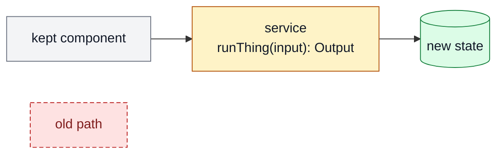
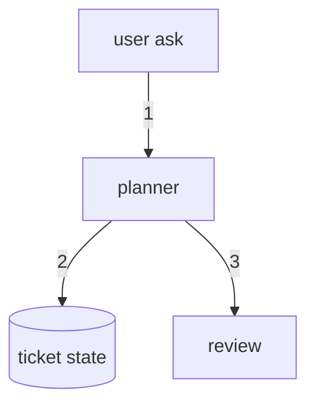

# Diagramming Patterns

Use these patterns when `SKILL.md` says a diagram is warranted.

## 1. Top-Level Delta Map

Use when:

- the question is "what changed?"
- the ticket spans multiple components
- the reader needs a fast approval surface

Pattern:

Legend:

- `gray = keep`
- `amber = change`
- `green = add`
- `red dashed = remove`

## 2. Numbered Data-Flow Trace

Use when:

- the question is "how does data move?"
- ordering matters
- the system map alone is insufficient

Pattern:

Rules:

- keep only the critical path
- number the edges
- avoid side branches unless the branch is the point

## 3. Zoom-In

Use when:

- one subsystem remains unclear after the top-level map
- one interface cluster needs more detail

Rules:

- inherit the same legend/classes as the top-level map
- keep the zoom-in scoped to one subsystem
- do not redraw the whole system again

## 4. Inline Signatures

Use when:

- the function or interface is the important thing
- a detached list would make the reader scroll

Good:

- `planner / buildPlan(ticket): PlanArtifact`
- `state / claim.ticket_id: string`
- `review / judgePlan(plan): pass|fix`

Bad:

- full type definitions
- three-method classes stuffed into one node
- signatures that wrap across many lines

## Anti-Patterns

Fail the diagram if:

- it has more diagrams than decisions
- it uses before/after views when one delta map would do
- the labels are paragraphs
- the legend is missing
- the diagram repeats the prose instead of compressing it
