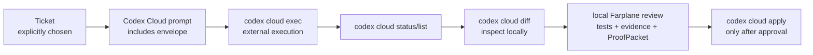

# Codex Cloud Handoff

This reference is a manual or future-adapter handoff recipe. It is not a
Farplane-owned cloud runner.

Use it only when a human explicitly decides that one ticket should run in Codex
Cloud. Codex Cloud owns remote execution. Farplane owns the input contract,
skill route, evidence expectations, local review, and `ProofPacket`.

## Verified Local Command Vocabulary

Checked with `codex cloud --help` on 2026-05-06.

Available subcommands:

- `codex cloud exec`
- `codex cloud status`
- `codex cloud list`
- `codex cloud diff`
- `codex cloud apply`

Important `exec` flags from local help:

- `--env <ENV_ID>` is required.
- `--branch <BRANCH>` can select the branch.
- `--attempts <ATTEMPTS>` defaults to `1`.

This recipe must stay conservative if the local CLI changes. Refresh help
output before updating the template.

## Handoff Flow



1. Choose one ticket intentionally. Do not use ticket creation, `ready`, status,
   or `compute_target` as the trigger.
2. Build a prompt from
   `skills/farplane-invocation/templates/codex-cloud-task-prompt.md`.
3. Include a `FarplaneRunEnvelope` with `mode: "external_runner"` and a writable
   `proofPacketPath`.
4. Submit manually with `codex cloud exec --env <ENV_ID> --branch <BRANCH>
   "<prompt>"`.
5. Inspect progress with `codex cloud status <TASK_ID>` or `codex cloud list`.
6. Inspect the remote diff with `codex cloud diff <TASK_ID>`.
7. Apply only after local review approves the diff and evidence:
   `codex cloud apply <TASK_ID>`.

## Prompt Contract

The task prompt should tell remote Codex to:

- use normal Codex with Farplane installed;
- read the ticket and the embedded `FarplaneRunEnvelope`;
- route through the selected Farplane skill such as `impl-plan`, `impl`, `qa`,
  `review`, or `close-ticket`;
- update ticket evidence when the filesystem ticket exists;
- write the requested `ProofPacket`;
- avoid launching another scheduler, watcher, or cloud task;
- leave a clear blocker if the remote environment lacks Farplane, dependencies,
  or write access.

## Return Contract

Before applying any remote diff, the operator should be able to inspect:

- `codex cloud diff <TASK_ID>`;
- the ticket evidence links changed by the task;
- test commands and results;
- QA/review artifacts when required by the ticket;
- the `ProofPacket` path named in the envelope.

If the proof packet is missing, treat the task as incomplete even when the diff
looks plausible.

## Compute Selector Boundary

`computeTarget: "codex_cloud"` is a future adapter target. In local Farplane it
must still return `unsupported_target`.

For a manually submitted Codex Cloud task, use `mode: "external_runner"` in the
envelope. The remote task itself runs in the cloud workspace selected by Codex
Cloud. Farplane inside that task should normally see `computeTarget:
"local_shared"` unless a future adapter owns a stronger cloud-specific
contract.

## AI Misread Risks

- Do not add a `codex cloud` wrapper to Farplane in this recipe.
- Do not submit real cloud tasks from tests.
- Do not apply a cloud diff before local inspection, tests, and review.
- Do not claim Farplane owns Codex Cloud task status, retries, workspaces, or
  billing.
- Do not silently fall back from `codex_cloud` to `local_shared` in the local
  compute selector.
- Do not put secrets or private environment IDs into tracked templates.

## Minimal Manual Commands

```bash
codex cloud exec --env <ENV_ID> --branch <BRANCH> "$(cat /tmp/farplane-task.md)"
codex cloud status <TASK_ID>
codex cloud diff <TASK_ID>
codex cloud apply <TASK_ID>
```

Run `codex cloud apply` only after review says the diff, evidence, and proof
are trustworthy.
