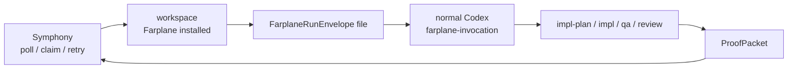

# Symphony Integration Shim

This reference is a handoff contract, not a live Symphony backend.

Symphony can integrate with Farplane by launching normal Codex in a workspace
where Farplane has already been installed, then giving Codex a
`FarplaneRunEnvelope` file or prompt block. Farplane stays inside Codex: it
loads the envelope, normalizes one work item, selects compute admission, routes
to existing skills, and writes a machine-readable `ProofPacket`.

The Symphony trigger is explicit: Symphony has already claimed a work item and
chosen to run Codex. Farplane must not start a second scheduler, watch the
board, or infer new runs from ticket status changes inside the worker.

## Minimal Worker Flow



1. Symphony claims an issue and prepares a per-ticket workspace.
2. The workspace contains this repo's installed Farplane skills, templates,
   hooks, and `WORKFLOW.md`.
3. Symphony writes a request file based on
   `skills/farplane-invocation/templates/symphony-run-envelope.json`.
4. Symphony launches normal Codex using its own Codex app-server/runtime
   contract.
5. The prompt asks Codex to use `farplane-invocation` with the request file.
6. Farplane routes to the selected phase skill and writes the requested
   `ProofPacket`.
7. Farplane leaves ticket evidence and review artifacts in the workspace.
8. Symphony reads the diff/evidence/review/`ProofPacket` and decides whether to
   comment, transition, retry, cancel, or hand off.

## Responsibility Split

| Concern | Owner | Farplane expectation | Failure behavior |
| --- | --- | --- | --- |
| Board polling and claims | Symphony | One claimed work item per envelope | Retry/release is Symphony policy |
| Workspace creation and cleanup | Symphony | Workspace path already exists and has Farplane installed | Worker failure before Farplane starts |
| Codex launch/app-server lifecycle | Symphony | Launch normal Codex, not a separate Farplane CLI | Symphony logs process/protocol failure |
| Run request | Symphony | Provide `FarplaneRunEnvelope` as a file or prompt block | Missing/invalid envelope blocks the run |
| Work item normalization | Farplane | V1 reads filesystem tickets through `FileTicketAdapter` | Proof/error if possible; otherwise clear stderr |
| Compute admission | Farplane | `local_shared` means inside the current Symphony workspace | Unsupported targets return blockers, not fallback |
| Skill routing | Farplane | Route to `impl-plan`, `impl`, `qa`, `review`, or `close-ticket` | Block when no route exists |
| Ticket evidence | Farplane | Link artifacts in the ticket when filesystem ticket exists | Missing evidence lowers review/proof quality |
| Proof packet | Farplane | Write JSON to `proofPacketPath` | Symphony treats missing proof as worker failure |
| Tracker comments/state transitions | Symphony or agent tools | Farplane does not own tracker writeback in v1 | External caller decides comment/retry/handoff |

## Return Contract

A Symphony-run Farplane task is not done just because the Codex process exited.
The worker should return or expose:

- the workspace diff or changed-file summary,
- ticket evidence links,
- QA/review artifact paths when required,
- the `ProofPacket` at `proofPacketPath`,
- the next action or blocker when proof verdict is not `pass`.

Symphony may decide how to post or transition tracker state, but Farplane's
local review/proof decides whether the work is trustworthy.

## Envelope Notes

- Use `mode: "symphony_worker"` so the proof clearly identifies the caller
  style.
- Use `computeTarget: "local_shared"` when Symphony already chose the worker
  workspace. `computeTarget: "symphony"` is reserved for future adapter
  selection and intentionally blocks in local Farplane today.
- Use `workItemPath` when Symphony materializes a filesystem ticket in the
  workspace. Future Linear/Notion adapters may use `workItemId` once those
  adapters exist.
- Keep `proofPacketPath` under `.harness/results/` or the ticket's
  `artifacts/` directory.

## Prompt Shape

```text
Use the farplane-invocation skill with this request file:
.harness/requests/<ticket>.farplane-run.json

After the selected phase skill finishes, write the requested ProofPacket. Do not
poll the board, launch another scheduler, submit cloud work, or infer another
run from board state inside Farplane.
```

## Smoke Command

```bash
python3 bin/farplane_invocation.py prepare \
  --envelope skills/farplane-invocation/templates/symphony-run-envelope.json
```

The command should return JSON with:

- `envelope.mode: "symphony_worker"`
- `workflow.name: "farplane-invocation"`
- `compute.target: "local_shared"`
- `route.skillName` for the requested phase
- `proof_packet_path` under `.harness/results/`

## AI Misread Risks

- Do not use `computeTarget: "symphony"` inside the Symphony worker envelope.
  Use `mode: "symphony_worker"` with `computeTarget: "local_shared"` after
  Symphony has already created the workspace.
- Do not add a Farplane poller just because Symphony polls externally.
- Do not treat missing proof as success. Missing proof is a worker failure or
  manual recovery state.
- Do not let Farplane mutate Linear/Notion/GitHub state unless a separate
  explicit tool or adapter owns that write.
