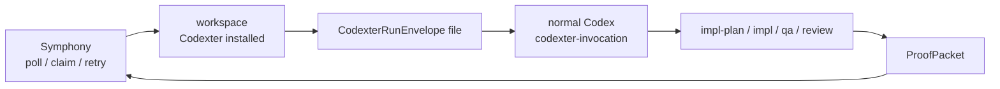

# Symphony Integration Shim

This reference is a handoff contract, not a live Symphony backend.

Symphony can integrate with Codexter by launching normal Codex in a workspace
where Codexter has already been installed, then giving Codex a
`CodexterRunEnvelope` file or prompt block. Codexter stays inside Codex: it
loads the envelope, normalizes one work item, selects compute admission, routes
to existing skills, and writes a machine-readable `ProofPacket`.

## Minimal Worker Flow



1. Symphony claims an issue and prepares a per-ticket workspace.
2. The workspace contains this repo's installed Codexter skills, templates,
   hooks, and `WORKFLOW.md`.
3. Symphony writes a request file based on
   `skills/codexter-invocation/templates/symphony-run-envelope.json`.
4. Symphony launches normal Codex using its own Codex app-server/runtime
   contract.
5. The prompt asks Codex to use `codexter-invocation` with the request file.
6. Codexter routes to the selected phase skill and writes the requested
   `ProofPacket`.
7. Symphony reads the proof and decides whether to comment, transition, retry,
   cancel, or hand off.

## Responsibility Split

| Concern | Owner | Codexter expectation | Failure behavior |
| --- | --- | --- | --- |
| Board polling and claims | Symphony | One claimed work item per envelope | Retry/release is Symphony policy |
| Workspace creation and cleanup | Symphony | Workspace path already exists and has Codexter installed | Worker failure before Codexter starts |
| Codex launch/app-server lifecycle | Symphony | Launch normal Codex, not a separate Codexter CLI | Symphony logs process/protocol failure |
| Run request | Symphony | Provide `CodexterRunEnvelope` as a file or prompt block | Missing/invalid envelope blocks the run |
| Work item normalization | Codexter | V1 reads filesystem tickets through `FileTicketAdapter` | Proof/error if possible; otherwise clear stderr |
| Compute admission | Codexter | `local_shared` means inside the current Symphony workspace | Unsupported targets return blockers, not fallback |
| Skill routing | Codexter | Route to `impl-plan`, `impl`, `qa`, `review`, or `close-ticket` | Block when no route exists |
| Ticket evidence | Codexter | Link artifacts in the ticket when filesystem ticket exists | Missing evidence lowers review/proof quality |
| Proof packet | Codexter | Write JSON to `proofPacketPath` | Symphony treats missing proof as worker failure |
| Tracker comments/state transitions | Symphony or agent tools | Codexter does not own tracker writeback in v1 | External caller decides comment/retry/handoff |

## Envelope Notes

- Use `mode: "symphony_worker"` so the proof clearly identifies the caller
  style.
- Use `computeTarget: "local_shared"` when Symphony already chose the worker
  workspace. `computeTarget: "symphony"` is reserved for future adapter
  selection and intentionally blocks in local Codexter today.
- Use `workItemPath` when Symphony materializes a filesystem ticket in the
  workspace. Future Linear/Notion adapters may use `workItemId` once those
  adapters exist.
- Keep `proofPacketPath` under `.harness/results/` or the ticket's
  `artifacts/` directory.

## Prompt Shape

```text
Use the codexter-invocation skill with this request file:
.harness/requests/<ticket>.codexter-run.json

After the selected phase skill finishes, write the requested ProofPacket. Do not
poll the board or launch another scheduler from inside Codexter.
```

## Smoke Command

```bash
python3 bin/codexter_invocation.py prepare \
  --envelope skills/codexter-invocation/templates/symphony-run-envelope.json
```

The command should return JSON with:

- `envelope.mode: "symphony_worker"`
- `workflow.name: "codexter-invocation"`
- `compute.target: "local_shared"`
- `route.skillName` for the requested phase
- `proof_packet_path` under `.harness/results/`
