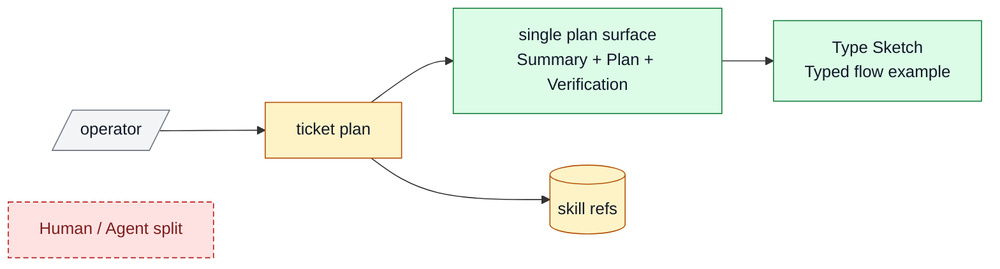

# Impl Plan Examples

## Good

````md
## Summary
Realign `impl-plan` with the canonical ticket template and make typed data flow
explicit in the plan instead of proving only callable seams. This keeps plans
compact while making stateful or interface-heavy work readable in plain text.

## Scope
- In:
  - remove the stale `Human` / `Agent` split from the skill package
  - add `Type Sketch` and `Typed flow example` to the compact plan contract
- Out:
  - expanding `impl-plan` into full system-design interviews
  - exhaustive schema dumps

## Plan
- `Change:` remove the stale `Human` / `Agent` split from `impl-plan` and add
  compact typed-data planning to the single ticket `Plan` section
- `Why:` `MEM-0031` says `impl-plan` should stay compact and avoid parallel
  human-versus-agent documents, but the live skill package still teaches the
  split
- `Before -> After:` before, the skill proves callable seams but leaves typed
  payload continuity implicit; after, the ticket stays single-surface and
  shows both callable and data-shape seams
- `Touch:` `skills/impl-plan/SKILL.md`, `prompts/plan.md`,
  `references/template.md`, `references/examples.md`, `references/review.md`,
  `README.md`, `AGENTS.md`, `todos.md`, `tickets/templates/ticket.md`,
  `tickets/README.md`
- `Inspect:` `docs/MEMORY.md`, `tickets/TASK-0086-*.md`,
  `docs/specs/spec-first-execution-loop.md`
- `Signature delta:`
  - `skills/impl-plan/SKILL.md / plan(ticket): TicketPlan`
  - `skills/impl-plan/prompts/plan.md / outputShape(mode): TicketBody`
  - `tickets/templates/ticket.md / Plan fields(...): compact plan contract`
- `Type Sketch:`
  - `PlanField { label: string, required: boolean, note?: string }`
  - `TypeSketchEntry { name: string, fields: string[] }`
  - `TypedFlowStep { stage: string, input: string, output: string }`
- `Typed flow example:`
  - `DraftPlanTicket { touch, inspect, signatureDelta }`
  - `ReviewedPlanTicket { typeSketch, typedFlowExample, recommendation }`
  - `ApprovedPlanTicket { verification, evidence, ready }`
- `Recommendation:` keep one compact plan surface and add typed planning inside
  `Plan`
- `Options considered:`
  - `Option 1:` keep `Human` / `Agent` and add type sections there
    - `Pros:` smallest diff to recent skill package
    - `Cons:` preserves the drift against `MEM-0031` and the ticket template
    - `Why not chosen:` it keeps the wrong public contract alive
  - `Option 2:` collapse to one plan surface without typed examples
    - `Pros:` simpler template
    - `Cons:` still leaves data-shape continuity implicit
    - `Why not chosen:` it solves drift but not the typed-flow planning gap
  - `Option 3:` collapse to one plan surface and add `Type Sketch` plus one
    golden-path typed flow
    - `Pros:` template-aligned, readable, and strong enough for interface-heavy
      work
    - `Cons:` needs coordinated changes across the package
    - `Why not chosen:` n/a
- `Blast radius:` every future `impl-plan` ticket, examples, and review pass
  will read differently; the biggest risk is over-correcting into type bloat
- `Risks:` one file may keep the stale split, or the typed-flow example may
  expand into a schema dump if the contract is too loose

## Diagram
- Legend: gray = keep, amber = change, green = add, red dashed = remove



## Acceptance Criteria
- [ ] AC-1: the live `impl-plan` package no longer uses `Human` / `Agent` as
      the public output contract
- [ ] AC-2: the ticket template and `impl-plan` references share the same
      compact plan shape
- [ ] AC-3: material plans can show callable seams, data shapes, and one typed
      golden path without turning into an appendix dump

## Verification
- `Tests:` compare the skill package files and ticket template for contract
  drift; run repo validators that cover ticket metadata and doc parity
- `Manual checks:` inspect the good example and template to confirm the typed
  flow is readable without `Human` / `Agent`
- `Evidence required:` updated skill surfaces plus passing validator output
- `Artifacts path:` `tickets/artifacts/TASK-0086/`

## Evidence
- `Artifacts:` updated skill surfaces and validator output linked from the
  ticket
- `Commands:` `python3 tickets/scripts/check_ticket_metadata.py`; `python3
  bin/check_doc_parity.py`; `python3 bin/check_harness_invariants.py`
- `Plan review:`
  - `Refs used:` ticket, memory, spec-first execution-loop spec, current
    `impl-plan` package
  - `Checks:` scope pass; template-alignment pass; signature pass; type-flow
    pass; rollback pass
  - `Fixes:` removed the stale split and made typed data planning explicit
- `Result summary:` the single-surface ticket contract is now the only public
  `impl-plan` shape
- `Ready:` yes

## Blockers
- none
````

## Bad

```md
We should improve the plan a bit and maybe add some more detail about types later.
```

Why bad:

- no canonical ticket shape
- no real callable seams
- no typed data continuity
- no real recommendation or rejected options
- no proof
- still sounds like hand-wavy prose instead of a believable ticket plan
