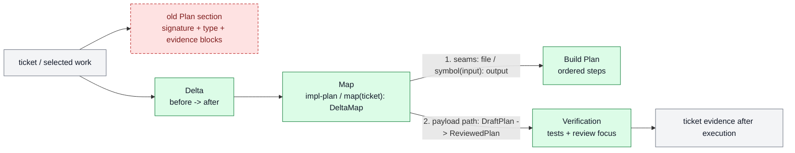

# Impl Plan Examples

## Good

````md
## Summary
Shorten `impl-plan` output around one approval-ready delta and one visual map.
The plan keeps enough detail to build from directly, but moves signatures and
typed flow into the diagram so the output stops expanding into parallel
sections.

## Scope
- `In:` `skills/impl-plan/SKILL.md`, `prompts/plan.md`,
  `references/template.md`, `references/review.md`, `references/examples.md`,
  `README.md`, `AGENTS.md`
- `Out:` changing ticket storage, installing the edited skill into live
  Codex home, or removing the ticket-level proof contract

## Delta
- `Before:` the template emits `Plan`, `Diagram`, `Signature delta`,
  `Type Sketch`, `Typed flow example`, `Refs`, and `Evidence` as mostly
  separate surfaces.
- `After:` the template emits `Delta`, `Map`, `Build Plan`, `Verification`,
  and sparse `Notes`; the map carries changed seams and typed flow when that is
  clearer than prose.
- `Why now:` verbose plan output makes approval slower and buries the actual
  before/after change.

## Map
- `Touch:` skill contract, prompt, template, review checklist, example, README,
  maintenance rules
- `Inspect:` `AGENTS.md`, existing skill package, diagramming conventions
- `Legend:` gray = keep, amber = change, green = add, red dashed = remove



## Build Plan
1. Rewrite the template around `Delta`, `Map`, `Build Plan`, `Verification`,
   and sparse `Notes`.
2. Update the prompt and `SKILL.md` rules so signatures and typed flow live in
   the map first, with fallback sections only when needed.
3. Tighten the review checklist so default `Evidence`, citation dumps, and fake
   option comparisons fail.
4. Refresh README, examples, and maintenance notes to match the new contract.

## Verification
- `Tests:` run `python3 skills/skill-maintenance/scripts/check_skills.py --write`
- `Manual checks:` inspect the package for stale default `Evidence`, `Refs`,
  and unconditional `Options considered`
- `Review focus:` output compactness, map usefulness, concrete build steps,
  proof clarity
- `Human gate:` approval before using the updated planner for live ticket work

## Notes
- `Blast radius:` future `impl-plan` outputs get shorter and more visual.
- `Risks / rollback:` agents may omit useful fallback type details; the review
  checklist still requires them when the map is not enough.
- `Citations:` `MEM-0030`, `MEM-0031`, `MEM-0050`, `MEM-0062`
- `Blockers:` none

## Proof Contract
- `Metric:` none mechanical
- `Review rubrics / TAS gates:` planning clarity, evidence discipline, skill
  consistency
- `Hard gates:` skill package surfaces agree on the same output shape
- `Required proof:` skill-maintenance check plus manual drift scan
````

## Bad

```md
We should improve the plan a bit and maybe add some more detail about types later.
```

Why bad:

- no before/after delta
- no visual map or code seams
- no ordered build plan
- no concrete verification
- no rationale for optional sections
- still sounds like hand-wavy prose instead of a believable ticket plan
