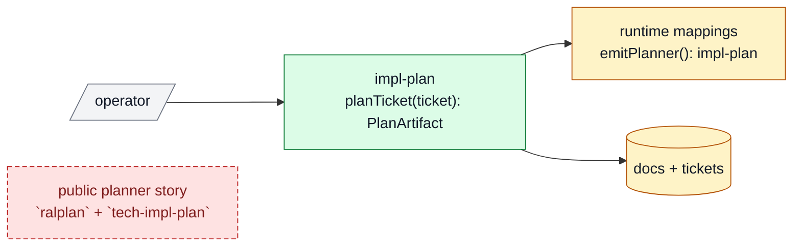

# Impl Plan Examples

## Good

````md
## Pitch
- Req: merge overlapping planner surfaces so the repo stops teaching both `ralplan` and `tech-impl-plan`
- Bet: replace them with one `impl-plan` surface that keeps concise approval output and preserves consensus as a mode
- Win: one public planner, less routing ambiguity, and a clearer handoff story

## Recommendation
- Best: collapse into `impl-plan`, keep ticket planning only, and leave execution-surface cleanup for a later ticket
- Why: it fixes the current confusion without expanding into execution-surface redesign
- Tradeoff accepted: the cutover touches several docs and runtime mappings in one pass

## Diagram Summary
- Legend: gray = keep, amber = change, green = add, red dashed = remove



## B -> A
- Before: `ralplan` and `tech-impl-plan` both exist and the repo documents both
- After: `impl-plan` is the only public planner, with consensus available as a mode inside it
- Outcome: users and agents no longer need to choose between two planner names for the same class of work

## Delta
- Touch: merged planner skill, runtime planning mappings, canonical docs, handoff references
- Keep: discovery before planning, one-ticket planning scope, consensus review for riskier work
- Change: planner naming and contract
- Delete/Avoid: permanent public aliases and a second planner story

## Core Flow


## Proof
- P1: no live canonical docs still describe `ralplan` and `tech-impl-plan` as separate public planners
- P2: planning runtime mappings emit `impl-plan`
- Risk: mixed-state rename leaves docs and runtime mappings inconsistent
- Rollback: restore the removed planner surface only if the merged contract proves incoherent

## User Story
- Actor: operator or agent planning a bounded ticket
- Need: one obvious planner name and one obvious planning artifact
- Outcome: less routing confusion and less duplicated planner documentation

## User Pain / JTBD
- Current pain: two planning surfaces that read like the same thing
- Why now: planner naming confusion is blocking trust in the planning flow itself

## Non-Goals
- Do not reopen public execution-surface naming in this ticket
- Do not replace discovery surfaces with the merged planner

## High-Fidelity Example
- Example flow/artifact: `deep-interview -> impl-plan --consensus TASK-0043 -> impl TASK-0043`

## What Good Looks Like
- Quality bar: a new operator can follow the planning path without asking which planner to use

## Proof Target
- Reviewer-visible proof: updated skill contract, updated docs, updated runtime mappings, and a clean reference sweep

## Plan Review
- Refs: AGENTS, README, canonical specs, live skill files, runtime mappings
- Scope: pass, planner merge only
- Proof: pass, checks are observable in the repo
- Guardrails: pass, discovery and execution surfaces remain separate
- Recommendation: pass, one planner beats either labels-only tuning or a second long-form brief
- Fixes: kept consensus as a mode instead of preserving a second public planner

## Options Appendix
- Option 1: keep both planner names
- Pros: lowest migration churn
- Cons: preserves the exact confusion the user wants removed
- Why not chosen: it solves nothing
- Option 2: add `impl-plan` but keep the old names as aliases
- Pros: softer migration
- Cons: extends mixed-state teaching and keeps three names in circulation
- Why not chosen: user asked for hard cutover
- Option 3: merge into one public planner named `impl-plan`
- Pros: one public story, one contract, one handoff path
- Cons: larger rename in one patch
- Why not chosen: n/a, this is the recommended path

## Delegation
- Need: Not needed

## Ask
- Ready: yes
- Next: patch the merged planner and update live refs
````

## Bad

```md
We should improve planning somehow. There are a few overlapping skills and maybe one day we can simplify them.
```

Why bad:

- no sharp req understanding
- no recommendation
- no diagram-first approval surface
- no real option comparison
- `Before -> After` buried or missing
- no explicit user-facing problem
- no proof target
- leaves the planner boundary unresolved
