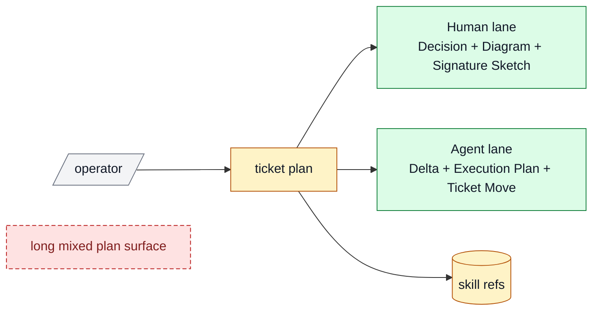

# Impl Plan Examples

## Good

````md
## Human

### Decision
- Req: make `impl-plan` easy to approve from the top of the ticket instead of forcing the reviewer through a long mixed artifact
- Best: split the plan into a top `Human` lane and a lower `Agent` lane, and add a compact signature sketch beside the diagram
- Why: this keeps the reviewer-facing decision surface short while still proving codebase understanding
- Tradeoff accepted: the skill, prompt, template, and examples all need to move together
- Not chosen:
  - keep the current mixed shape and just trim prose
  - move signatures into a detached appendix

### Diagram
- Legend: gray = keep, amber = change, green = add, red dashed = remove



### Signature Sketch
- `skills/impl-plan/SKILL.md / buildHumanLane(ticket): HumanPlan`
- `skills/impl-plan/SKILL.md / buildAgentLane(ticket): AgentPlan`
- `references/template.md / Signature Sketch: SignatureLine[]`
- `prompts/plan.md / outputShape(mode): HumanThenAgent`

### B -> A
- Before: the top of the plan mixes approval context, execution detail, and narrative sections into one long read
- After: the reviewer sees one short `Human` lane first, then the implementer gets a lower `Agent` lane
- Outcome: the ticket becomes easier to trust quickly without losing execution detail

### Proof
- P1: the live skill contract explicitly requires `Human` before `Agent`
- P2: the prompt, template, and example all show a compact signature sketch near the top
- Risk: one file keeps the old shape and teaches the wrong contract
- Rollback: revert to the prior mixed format only if the split proves less clear in real tickets

### Ask
- Ready: yes
- Next: patch the package files so future plans render with the new top-of-ticket shape

## Agent

### Delta
- Touch: `SKILL.md`, `prompts/plan.md`, `references/template.md`, `references/examples.md`, `references/review.md`
- Keep: one public planner, consultative recommendation, diagram-first material plans
- Change: output shape and top-of-ticket emphasis
- Delete/Avoid: essay-like approval surfaces and detached signature appendices

### Execution Plan
1. rewrite the skill contract around `Human` and `Agent`
2. make the `Signature Sketch` a first-class field near the top
3. align the prompt and reference template
4. replace the example so the new shape is visible immediately
5. tighten the review checklist around skimability and signatures

### Risk / Rollback
- Primary risk: the new split becomes another wrapper without actually reducing reading time
- Containment: keep the required top lane very small and push optional narrative sections lower
- Rollback: restore the prior section layout if the new top lane proves less clear in real use

### Plan Review
- Refs: current skill package, diagram-first spec, memory, troubles, nearby examples
- Checks: scope pass; proof pass; guardrails pass; diagram pass; signatures pass; rollback pass
- Fixes: moved signatures from implicit inline advice into an explicit top-level field

### Options Appendix
- Option 1: keep the current shape and just tighten wording
- Pros: smallest textual diff
- Cons: the reviewer still has to scan the same mixed artifact
- Why not chosen: it trims words but not structure
- Option 2: keep one mixed plan and add a signature appendix
- Pros: preserves most of the old contract
- Cons: signatures stay below the fold, so the trust-building piece still arrives late
- Why not chosen: it does not solve the skim problem
- Option 3: split the plan into `Human` and `Agent`, with a top-level signature sketch
- Pros: faster approval skim, clearer execution handoff, visible code understanding
- Cons: requires coordinated updates across the skill package
- Why not chosen: n/a, this is the recommended path

### Delegation
- Need: Not needed

### Ticket Move
- Now: `status: review`
- On approval: `status: building`
- Follow-ups: none
- Blocked in building?: no
````

## Bad

```md
We should improve the plan a bit and maybe add some more detail about signatures later.
```

Why bad:

- no `Human` skim lane
- no diagram or signature sketch
- no real recommendation or rejected options
- no proof
- no agent-facing execution shape
- still sounds like hand-wavy prose instead of a believable ticket plan
