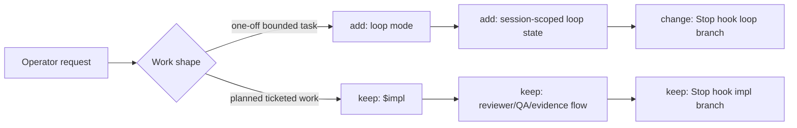
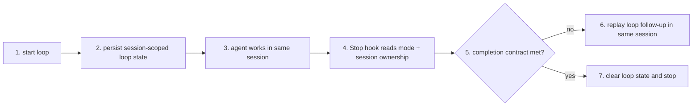

# TASK-0060: define short-task loop mode separate from impl

## Summary
Define a dedicated short-task `loop` mode for one-off auto-resume work and keep `$impl` as the long-run ticketed orchestration surface.

## Scope
- In:
  - naming and contract for a short-task `loop` surface
  - runtime-state shape for multi-panel loop ownership
  - stop-hook decision split between simple loop continuation and ticketed `$impl` judgment
  - completion signaling for loop mode
- Out:
  - replacing `$impl` with a generic loop
  - hidden board-wide continuation by default
  - reintroducing `ralph` as the public execution name

## User Story
- `Actor:` Codexter operator working across one or more live Codex panels
- `Need:` a lightweight one-off auto-resume mode for bounded tasks plus a separate heavier end-to-end ticket mode
- `Outcome:` short tasks stop paying the full `$impl` orchestration cost, while long-run work keeps the stronger review/evidence system

## User Pain / JTBD
- `Current pain:` the current continuation story is overloaded; `$impl` plus the Stop hook carry ticket orchestration, review gating, user-intent alignment, and same-ticket continuation even when the task is just a one-off loop
- `Why now:` Anthropic's Ralph Wiggum plugin showed that the simple loop pattern is real, but Codexter also needs multi-panel state and a smarter stop boundary than one global state file

## Non-Goals
- `Do not solve:` a forever-running hidden agent supervisor, multi-ticket autonomous board dispatch, or a single universal loop abstraction for every workload

## High-Fidelity Example
- `Example flow/artifact:` panel A runs `loop "fix the auth bug and stop only when tests pass" --completion-promise "AUTH FIXED"` and auto-resumes within that session, while panel B runs `$impl TASK-0061` with ticketed review, QA, and evidence gates without sharing loop state

## What Good Looks Like
- `Quality bar:` the operator can clearly tell whether a session is in `loop` mode or `$impl` mode, multi-panel ownership is unambiguous, and the Stop hook stays understandable enough to debug from runtime state plus logs

## Proof Target
- `Reviewer-visible proof:` a planning artifact that cleanly separates the two modes, names the runtime state required for multi-panel `loop`, and defines when the Stop hook should use deterministic loop replay versus `$impl` judgment

## Plan

### Diagram Summary
- `Required:` yes
- `Legend:` keep | change | add | remove

- `Tier 2:` the main design question is not UI shape but boundary shape, so Tier 1 is enough for now

### Pitch
- `Req:` add a simpler auto-resume mode for short tasks without collapsing the current ticketed orchestration model into the same control surface
- `Bet:` split execution into `loop` for short one-off tasks and `$impl` for ticketed end-to-end work
- `Win:` each mode can stay legible and fit-for-purpose instead of forcing one stop-hook/runtime path to serve incompatible goals

### Recommendation
- `Best:` introduce a new public `loop` skill/command with session-scoped runtime state and a small deterministic stop-hook continuation contract; keep `$impl` as the heavier ticketed path
- `Why:` this matches the real workload split, preserves Codexter's multi-panel runtime model, and avoids turning short-task persistence into another ticket-orchestration ceremony
- `Tradeoff accepted:` there will be two execution surfaces instead of one, and operators will need to choose the right mode up front

### B -> A
- `Before:` same-ticket continuation lives mostly inside the `$impl` and Stop-hook control plane, even when the operator only wants a one-off persistent task loop
- `After:` one-off `loop` uses a simpler explicit contract, while `$impl` remains the reviewed ticket execution path
- `Outcome:` simpler short-task iteration, preserved rigor for long-run work

### Delta
- `Touch:` public skill/command surface, runtime-state contract, stop-hook routing docs, and likely `hooks.json` / `bin/stop_hook.py`
- `Keep:` session-first state, multi-panel ownership, `$impl` as the ticketed orchestrator, visible continuation rather than hidden background autonomy
- `Change:` stop-hook logic becomes mode-aware and should branch early between loop continuation and `$impl` judgment
- `Delete/Avoid:` avoid calling the short-task mode `ralph`; avoid one global loop file; avoid another model-backed verifier for simple loop replay

### Core Flow

```pseudo
detect active runtime mode for this session
if mode == loop:
  evaluate deterministic completion contract
  continue same session when incomplete
if mode == impl:
  run existing ticketed review/evidence path
persist mode-specific state and summaries
```

### Proof
- `P1:` loop mode is explicitly session-scoped and does not collide across multiple live panels
- `P2:` the public contract makes clear when to use `loop` versus `$impl`
- `Risk:` the Stop hook could become even harder to reason about if the mode split is layered on top of the current logic without simplifying the routing entrypoint
- `Rollback:` keep the initial `loop` slice narrow and deterministic, and avoid touching `$impl` behavior beyond an early routing branch

### Plan Review
- `Refs:` `README.md`, `docs/specs/runtime-surface.md`, `docs/specs/orchestrator-subagent-loop.md`, Anthropic Ralph Wiggum plugin, operator notes from this thread
- `Scope:` pass; focused on public execution-surface split and runtime contract
- `Proof:` pass; planning artifact can be reviewed before any runtime changes land
- `Guardrails:` pass; avoids hidden continuation default, preserves multi-panel state, and does not widen `$impl`
- `Fixes:` rename the short-task concept from `ralph` to `loop`, keep `advise` out of Stop-hook inference, and narrow v1 predicates to surfaces the current hook can actually evaluate deterministically

### Options Appendix
- `Option 1:` add a dedicated `loop` mode and keep `$impl` ticketed
- `Pros:` clear operator mental model, simpler short-task continuation, preserves current review/evidence rigor where it matters
- `Cons:` two public execution surfaces
- `Why not chosen:` recommended
- `Option 2:` add a `--loop` flag or submode inside `$impl`
- `Pros:` fewer public names
- `Cons:` overloads `$impl` with contradictory semantics and keeps the Stop hook tightly coupled to ticket artifacts
- `Why not chosen:` it hides the real product split instead of clarifying it
- `Option 3:` replace `$impl` with a single generic loop engine
- `Pros:` one conceptual runtime
- `Cons:` loses the distinction between bounded one-off looping and long-run ticket orchestration, and risks weakening review/evidence gates
- `Why not chosen:` the workloads are materially different

### Delegation
- `Need:` Not needed yet
- `Why:` this slice is still design and contract shaping
- `Artifact:` approval-ready execution split plus runtime questions list

### Ask
- `Ready: no`
- `Next:` continue brainstorming to settle the completion contract, consultant-thinking handoff policy, and exact runtime-state fields for `loop`

### Ticket Move
- `Now:` `status: review`, `phase: planning`
- `On approval:` split into an execution ticket for the runtime/stop-hook changes once the contract is agreed
- `Follow-ups:` likely one implementation ticket for `loop` mode and possibly one cleanup ticket to simplify current Stop-hook routing
- `Blocked in building?:` yes until the contract is agreed

## Acceptance Criteria
- [ ] AC-1: the planned design clearly distinguishes short-task `loop` mode from long-run `$impl` mode
- [ ] AC-2: the design defines a multi-panel-safe runtime ownership model for `loop`
- [ ] AC-3: the design defines a completion contract for `loop` that is simpler than `$impl` but still operator-trustworthy
- [ ] AC-4: the design names the minimum Stop-hook routing change needed to support both modes without reintroducing hidden continuation

## Working Notes
- The short-task mode should be called `loop`, not `ralph`.
- The operator prefers same-session continuation over a separate verifier agent deciding for the session from outside.
- Anthropic's plugin is useful as a control-shape reference, but Codexter needs per-session state instead of one shared state file because multiple panels may run concurrently.
- A likely open question is whether `loop` completion should be pure keyword/promise based, or keyword plus lightweight same-session “is this actually done?” guidance in the prompt contract.
- Chosen `advise` role: optional pre-loop helper for ambiguous work; the Stop hook should not infer or invoke `advise` during deterministic loop continuation.
- Repro note: current control-session capture only recognizes the literal `$impl` token. Prompts like `impl TASK-0060`, `please impl TASK-0060`, or `Impul TASK-0060` do not activate control-session ownership or `impl_loop_active`.
- Repro note: the current `$impl` detector also matches `$impl-plan`, so planning prompts can be misclassified as explicit impl/build-loop requests. The trigger substrate needs cleanup regardless of whether `loop` is added.

## Inspiration
- https://github.com/anthropics/claude-code/tree/main/plugins/ralph-wiggum
- Operator note: “It’s not even right to call this Ralph; call this loop.”

## Implementation Notes
- Touched areas:
  - new loop skill/command surface
  - runtime-state docs and stop-hook routing
- Reused patterns:
  - session-first runtime ownership
  - visible continuation via Stop hook
- Guardrails:
  - do not collapse `loop` and `$impl` into one overloaded public story
  - do not use one global loop file for all sessions
  - keep `$impl` review/evidence gates out of the one-off loop happy path

## Evidence
- [ ] Tests
- [ ] Typecheck
- [ ] Lint
- [ ] QA / manual verification

## Review Packet
- Scores use the anchored `1.0`-to-`5.0` rubric scale.
- `work_type:` `["planning", "runtime", "hooks"]`
- `search_scope:` `{changed_files: ["tickets/TASK-0060-define-loop-mode-separate-from-impl.md"], related_files: ["README.md", "docs/specs/runtime-surface.md", "docs/specs/orchestrator-subagent-loop.md", "bin/stop_hook.py", "hooks.json"], invariants_checked: ["visible continuation", "session-first multi-panel routing", "impl remains the ticketed orchestrator"], docs_checked: ["README.md", "docs/specs/runtime-surface.md", "docs/specs/orchestrator-subagent-loop.md"]}`
- `reviewed_at:` ``
- `rubrics_used:` `[]`
- `overall_score:`
- `overall_threshold:`
- `overall_verdict:` `revise`
- `rerun_required:` `true`
- `evidence_quality:` `fail`
- `integration_readiness:` `fail`
- `traceability:` `pass`
- `freshness:` `pass`
- `hard_gate_failures:` `["planning ticket only; execution contract not finalized"]`
- `finding_log:` `[]`
- `blocking_findings:` `["loop completion contract unresolved", "runtime-state shape unresolved"]`
- `next_action:` `continue brainstorming and convert the chosen contract into an implementation ticket or approved plan`

## Blockers
- Need agreement on the `loop` completion contract and runtime-state fields before building.

## Handoff
- Current state: the direction split is captured, but the `loop` contract is intentionally left in review for more brainstorming
- Resume from: compare 2-3 concrete completion-contract shapes, decide whether `consultant-thinking` is a required pre-step or optional helper, then move into `impl-plan` for the execution slice

## Writeback
- Update this ticket as work progresses.
- If the ticket changes queue state, update `status` and `phase` in frontmatter. Do not move the file.
- When implementation and verification pass, move `phase` to `documenting`, write durable docs, then move the ticket into `tickets/archive/` or set `status: done` briefly if you intentionally keep a short-lived visible completion state first.
