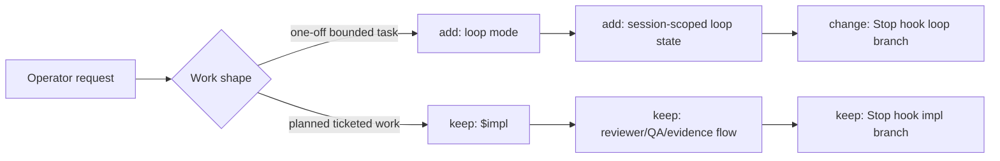
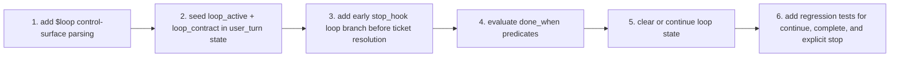
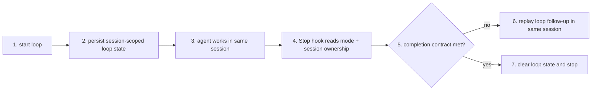

# TASK-0060: define short-task loop mode separate from impl

## Summary
Define a dedicated short-task `loop` mode for one-off auto-resume work and keep `$impl` as the long-run ticketed orchestration surface.

## Scope
- In:
  - naming and contract for a short-task `loop` surface
  - runtime-state shape for multi-panel loop ownership
  - stop-hook decision split between simple loop continuation and ticketed `$impl` judgment
  - completion signaling for loop mode
- Out:
  - replacing `$impl` with a generic loop
  - hidden board-wide continuation by default
  - reintroducing `ralph` as the public execution name

## User Story
- `Actor:` Codexter operator working across one or more live Codex panels
- `Need:` a lightweight one-off auto-resume mode for bounded tasks plus a separate heavier end-to-end ticket mode
- `Outcome:` short tasks stop paying the full `$impl` orchestration cost, while long-run work keeps the stronger review/evidence system

## User Pain / JTBD
- `Current pain:` the current continuation story is overloaded; `$impl` plus the Stop hook carry ticket orchestration, review gating, user-intent alignment, and same-ticket continuation even when the task is just a one-off loop
- `Why now:` Anthropic's Ralph Wiggum plugin showed that the simple loop pattern is real, but Codexter also needs multi-panel state and a smarter stop boundary than one global state file

## Non-Goals
- `Do not solve:` a forever-running hidden agent supervisor, multi-ticket autonomous board dispatch, or a single universal loop abstraction for every workload

## High-Fidelity Example
- `Example flow/artifact:` panel A starts a session-scoped `loop` with a persisted contract like `done_when=[{kind: "path_exists", path: ".harness/tmp/auth-fixed.flag"}, {kind: "completion_marker_seen", text: "AUTH FIXED"}]`, so the Stop hook can deterministically either continue that same session or clear the loop state; panel B runs `$impl TASK-0061` with ticketed review, QA, and evidence gates without sharing loop state

## What Good Looks Like
- `Quality bar:` the operator can clearly tell whether a session is in `loop` mode or `$impl` mode, multi-panel ownership is unambiguous, and the Stop hook stays understandable enough to debug from runtime state plus logs

## Proof Target
- `Reviewer-visible proof:` a planning artifact that cleanly separates the two modes, names the runtime state required for multi-panel `loop`, and defines when the Stop hook should use deterministic loop replay versus `$impl` judgment

## Plan

### Diagram Summary
- `Required:` yes
- `Legend:` keep | change | add | remove

- `Tier 2:` the main design question is not UI shape but boundary shape, so Tier 1 is enough for now

### Signature Sketch
- `bin/user_turn.py / capture_user_turn(project_root, raw_text, ...): last_user_turn | seeds control-session runtime`
- `bin/user_turn.py / persist_runtime_update(project_root, current_run, updates): current-run + session mirror`
- `bin/stop_hook.py / main(raw_payload): stop-event router for impl or loop`
- `bin/stop_hook.py / evaluate_loop_contract(message, current_run): loop verdict`
- `bin/stop_hook.py / continue_hook_response(payload, ticket?, continuation_message, ...): same-session replay`

### Pitch
- `Req:` add a simpler auto-resume mode for short tasks without collapsing the current ticketed orchestration model into the same control surface
- `Bet:` split execution into `loop` for short one-off tasks and `$impl` for ticketed end-to-end work
- `Win:` each mode can stay legible and fit-for-purpose instead of forcing one stop-hook/runtime path to serve incompatible goals

### Recommendation
- `Best:` introduce a new public `loop` skill/command with session-scoped runtime state and a small deterministic stop-hook continuation contract; keep `$impl` as the heavier ticketed path
- `Why:` this matches the real workload split, preserves Codexter's multi-panel runtime model, and avoids turning short-task persistence into another ticket-orchestration ceremony
- `Tradeoff accepted:` there will be two execution surfaces instead of one, and operators will need to choose the right mode up front

### Completion Contract Decision
- `Decision:` choose the first `loop` completion contract now so the runtime and Stop-hook slice can be planned concretely
- `Criteria:` deterministic stop-hook behavior, multi-panel safety, low operator friction, and clear separation from `$impl`
- `Option 1:` marker-only promise
- `Pros:` smallest implementation surface; easy to explain
- `Cons:` too easy to game, weak for tasks whose real success is more than echoing one phrase, and brittle when the agent forgets to emit the marker despite finishing the work
- `Option 2:` structured `done_when` checks plus optional completion marker
- `Pros:` deterministic without needing a reviewer model; can express task-specific checks such as file existence or exact output; optional marker keeps the operator affordance simple
- `Cons:` more runtime-state schema work than marker-only
- `Option 3:` same-session reflective completion prompt or judge
- `Pros:` more flexible for fuzzy tasks
- `Cons:` reintroduces model judgment into the short-task path, weakens the product split from `$impl`, and is harder to debug
- `Recommendation:` use Option 2. `loop` should persist a small structured contract such as `done_when`, `completion_marker`, and `retry_message`; the Stop hook should continue only when `done_when` is not yet satisfied and should clear loop state when the checks pass
- `Tradeoff accepted:` the first `loop` slice will require users or the loop entrypoint to express completion a bit more explicitly, but that keeps the short-task path deterministic and easier to trust than a hidden judge
- `Next step:` rewrite the execution delta around the exact `done_when` shape, the runtime writers/readers that own it, and the minimal Stop-hook branch needed to evaluate it

### Runtime Contract
- `State owner:` `bin/user_turn.py` seeds and updates loop session state in `.harness/state/current-run.json` plus `.harness/state/sessions/<session>.json`; `bin/stop_hook.py` reads and mutates that state at Stop boundaries
- `Keep unchanged in v1:` `skills/impl/scripts/tmux_helper.py` and ticket claim aliasing stay `$impl`-only; `loop` is same-session and does not create a per-ticket run-state file or tmux follow-up helper in the first slice
- `Runtime fields:` persist:
  - `skill_name: "loop"`
  - `status: "running" | "blocked" | "complete"`
  - `loop_active: true|false`
  - `loop_contract: { done_when: [...], completion_marker?: string, retry_message: string }`
  - `loop_last_checked_at`
  - `loop_last_check_summary`
  - existing session fields that already work across control surfaces: `session_id`, `session_name`, `session_origin`, `last_user_turn`, `updated_at`
- `Done-when predicates for v1:` only predicates the Stop hook can evaluate locally without another model pass:
  - `{kind: "completion_marker_seen", text: "..."}`
  - `{kind: "path_exists", path: "..."}`
  - `{kind: "file_contains", path: "...", text: "..."}`
- `Deferred from v1:` generic command-exit predicates, judge-style reflective completion, and tmux-orchestrated loop workers; those need a separate persisted command-result or worker-result surface and should not be implied by this slice
- `Operator stop rule:` v1 stop should be an explicit same-session user request such as `stop loop` or a cleared `loop_active` flag; pressing Escape may cancel a client turn, but it is not a harness-level deterministic stop contract

### Execution Order

```pseudo
extend control-surface parser to recognize $loop
persist loop session state without creating an impl run_state or ticket claim
route Stop-hook early on skill_name == loop and loop_active
evaluate only supported local done_when predicates
if explicit stop request or done_when passes: clear loop_active and stop
else continue the same session with retry_message
cover continue, complete, and explicit-stop paths in tests
```

### B -> A
- `Before:` same-ticket continuation lives mostly inside the `$impl` and Stop-hook control plane, even when the operator only wants a one-off persistent task loop
- `After:` one-off `loop` uses a simpler explicit contract, while `$impl` remains the reviewed ticket execution path
- `Outcome:` simpler short-task iteration, preserved rigor for long-run work

### Delta
- `Touch:` `bin/user_turn.py` control-surface parsing and runtime seeding, `bin/stop_hook.py` early loop routing and predicate evaluation, runtime docs, and regression tests
- `Keep:` session-first state, multi-panel ownership, `$impl` as the ticketed orchestrator, visible continuation rather than hidden background autonomy
- `Change:` stop-hook logic branches early on `skill_name == "loop"` before ticket resolution; loop uses session-owned state instead of ticket/run-state ownership
- `Delete/Avoid:` avoid calling the short-task mode `ralph`; avoid one global loop file; avoid reusing `impl_loop_active` for loop; avoid another model-backed verifier for simple loop replay; avoid pulling `tmux_helper.py` into v1 loop ownership

### Core Flow

```pseudo
detect active runtime mode for this session
if mode == loop:
  evaluate deterministic completion contract
  clear loop state on explicit stop or satisfied done_when
  continue same session when incomplete
if mode == impl:
  run existing ticketed review/evidence path
persist mode-specific state and summaries
```

### Proof
- `P1:` loop mode is explicitly session-scoped and does not collide across multiple live panels
- `P2:` the public contract makes clear when to use `loop` versus `$impl`
- `Risk:` the Stop hook could become even harder to reason about if the mode split is layered on top of the current logic without simplifying the routing entrypoint
- `Rollback:` keep the initial `loop` slice narrow and deterministic, and avoid touching `$impl` behavior beyond an early routing branch

### Plan Review
- `Refs:` `README.md`, `docs/specs/runtime-surface.md`, `docs/specs/orchestrator-subagent-loop.md`, Anthropic Ralph Wiggum plugin, operator notes from this thread
- `Checks:` exact runtime owners are named; loop uses a deterministic local contract; `$impl`-only tmux/ticket machinery stays isolated; explicit stop behavior is documented as a user-turn contract rather than an Escape assumption
- `Fixes:` rename the short-task concept from `ralph` to `loop`, keep `advise` out of Stop-hook inference, and narrow v1 predicates to surfaces the current hook can actually evaluate deterministically

### Options Appendix
- `Option 1:` add a dedicated `loop` mode and keep `$impl` ticketed
- `Pros:` clear operator mental model, simpler short-task continuation, preserves current review/evidence rigor where it matters
- `Cons:` two public execution surfaces
- `Why not chosen:` recommended
- `Option 2:` add a `--loop` flag or submode inside `$impl`
- `Pros:` fewer public names
- `Cons:` overloads `$impl` with contradictory semantics and keeps the Stop hook tightly coupled to ticket artifacts
- `Why not chosen:` it hides the real product split instead of clarifying it
- `Option 3:` replace `$impl` with a single generic loop engine
- `Pros:` one conceptual runtime
- `Cons:` loses the distinction between bounded one-off looping and long-run ticket orchestration, and risks weakening review/evidence gates
- `Why not chosen:` the workloads are materially different

### Delegation
- `Need:` Not needed yet
- `Why:` this slice is still design and contract shaping
- `Artifact:` approval-ready execution split plus runtime questions list

### Ask
- `Ready: yes`
- `Next:` execute this ticket directly; do not split a second execution ticket

### Ticket Move
- `Now:` `status: building`, `phase: building`
- `On approval:` already approved; execute on this ticket directly
- `Follow-ups:` richer predicates or tmux-backed loop helpers can be separate tickets later if needed
- `Blocked in building?:` no

## Acceptance Criteria
- [ ] AC-1: `$loop` is recognized as a control surface and seeds session-owned runtime state
- [ ] AC-2: loop v1 persists `loop_active`, `skill_name`, `loop_contract`, `loop_last_checked_at`, and `loop_last_check_summary`
- [ ] AC-3: Stop-hook branches early for loop mode and deterministically evaluates `completion_marker_seen`, `path_exists`, and `file_contains`
- [ ] AC-4: explicit same-session stop intent clears loop state and stops safely
- [ ] AC-5: `$impl`-only tmux/ticket-claim behavior remains unchanged
- [ ] AC-6: regression tests cover continue, complete, and explicit-stop cases

## Working Notes
- The short-task mode should be called `loop`, not `ralph`.
- The operator prefers same-session continuation over a separate verifier agent deciding for the session from outside.
- Anthropic's plugin is useful as a control-shape reference, but Codexter needs per-session state instead of one shared state file because multiple panels may run concurrently.
- Chosen contract: `loop` should use structured deterministic `done_when` checks plus an optional completion marker, not marker-only completion and not a model-judged loop-stop path.
- Chosen `advise` role: optional pre-loop helper for ambiguous work; the Stop hook should not infer or invoke `advise` during deterministic loop continuation.
- Escape/cancel behavior should not be treated as the canonical stop control in v1 because the current harness does not persist a reliable Escape signal into Stop-hook state; explicit same-session stop intent is the supported contract.
- Operator correction: keep impl-plan and execution on the same ticket; do not split a second execution ticket for this slice.
- Repro note: current control-session capture only recognizes the literal `$impl` token. Prompts like `impl TASK-0060`, `please impl TASK-0060`, or `Impul TASK-0060` do not activate control-session ownership or `impl_loop_active`.
- Repro note: the current `$impl` detector also matches `$impl-plan`, so planning prompts can be misclassified as explicit impl/build-loop requests. The trigger substrate needs cleanup regardless of whether `loop` is added.

## Inspiration
- https://github.com/anthropics/claude-code/tree/main/plugins/ralph-wiggum
- Operator note: “It’s not even right to call this Ralph; call this loop.”

## Implementation Notes
- Touched areas:
  - `bin/user_turn.py` control-surface parsing and session-state seeding
  - `bin/stop_hook.py` loop routing and predicate evaluation
  - runtime docs and hook tests
- Reused patterns:
  - session-first runtime ownership
  - visible continuation via Stop hook
- Guardrails:
  - do not collapse `loop` and `$impl` into one overloaded public story
  - do not use one global loop file for all sessions
  - do not widen loop v1 beyond predicates the Stop hook can evaluate locally from assistant output and filesystem state
  - keep `$impl` review/evidence gates out of the one-off loop happy path

## Evidence
- [x] Tests
  - `python3 -m unittest bin.test_runtime_state bin.test_stop_hook`
- [x] Typecheck
  - `python3 -m py_compile bin/user_turn.py bin/stop_hook.py`
- [x] Lint
  - `git diff --check`
- [x] QA / manual verification
  - `python3 bin/check_harness_invariants.py`
  - `python3 bin/check_doc_parity.py`
  - verified `$loop` v1 stays session-owned and does not reuse `$impl` tmux/ticket-claim ownership

## Review Packet
- Scores use the anchored `1.0`-to-`5.0` rubric scale.
- `work_type:` `["runtime", "hooks", "tests", "docs"]`
- `search_scope:` `{changed_files: ["bin/user_turn.py", "bin/stop_hook.py", "bin/test_runtime_state.py", "bin/test_stop_hook.py", "docs/specs/runtime-surface.md", "skills/impl/references/stop-hook-routing.md", "README.md", "bin/AGENTS.md", "docs/MEMORY.md", "docs/HISTORY.md", "tickets/TASK-0060-define-loop-mode-separate-from-impl.md"], related_files: ["skills/impl/scripts/tmux_helper.py", "bin/README.md"], invariants_checked: ["MEM-0025", "MEM-0029", "MEM-0032", "MEM-0038"], docs_checked: ["skills/review/references/code-quality.md", "skills/review/references/evidence-quality.md", "skills/review/references/integration-readiness.md", "skills/review/references/desloppify.md", "docs/specs/runtime-surface.md", "skills/impl/references/stop-hook-routing.md", "README.md", "bin/AGENTS.md"]}`
- `reviewed_at:` `2026-04-13 19:31 +0100`
- `rubrics_used:` `["code-quality", "evidence-quality", "integration-readiness"]`
- `overall_score:` `4.3`
- `overall_threshold:` `4.0`
- `overall_verdict:` `pass`
- `rerun_required:` `false`
- `evidence_quality:` `pass`
- `integration_readiness:` `pass`
- `traceability:` `pass`
- `freshness:` `pass`
- `hard_gate_failures:` `[]`
- `finding_log:` `[
  {"severity":"low","confidence":"high","rubric":"integration-readiness","summary":"Loop v1 intentionally leaves command-exit predicates and tmux-backed loop workers out of scope; follow-on work should add a real persisted command-result surface before widening the contract.","file_refs":["bin/stop_hook.py","docs/specs/runtime-surface.md","tickets/TASK-0060-define-loop-mode-separate-from-impl.md"],"evidence":["The implementation only evaluates `completion_marker_seen`, `path_exists`, and `file_contains`.","The runtime docs now explicitly defer command-exit predicates and tmux-backed loop workers from v1."],"next_action":"Keep future loop extensions behind a separate ticket with an explicit command-result/runtime contract."}
]`
- `blocking_findings:` `[]`
- `rubric_sections:` `[
  {"name":"code-quality","score":4.2,"threshold":4.0,"pass":true,"dimension_scores":{"modularity":4.2,"bloatability":4.1,"readability":4.2,"boundaries":4.3,"error_handling":4.0,"maintainability":4.2},"findings":["The runtime split stays clean: loop-only state lives in `user_turn.py` and `stop_hook.py`, while `$impl`-only tmux plumbing remains untouched.","The implementation explicitly clears impl-owned fields when a session switches to loop mode, which avoids silent boundary leakage."],"next_action":"Preserve the loop vs `$impl` ownership split in future runtime changes."},
  {"name":"evidence-quality","score":4.4,"threshold":4.0,"pass":true,"dimension_scores":{"sufficiency":4.3,"reproducibility":4.5,"traceability":4.4,"consistency":4.3,"inspectability":4.4},"findings":["The build is backed by targeted runtime and stop-hook tests plus harness/doc validators, and the docs were updated to match the shipped behavior."],"next_action":"When loop grows beyond local predicates, add targeted tests for the new predicate family before widening the contract."},
  {"name":"integration-readiness","score":4.3,"threshold":4.0,"pass":true,"dimension_scores":{"integration_safety":4.3,"contract_correctness":4.4,"dependency_readiness":4.1,"coupling_risk":4.2,"merge_readiness":4.4},"findings":["The new loop branch routes before ticket resolution, which avoids breaking ticket-dependent impl paths.","The build keeps Escape out of the supported stop contract, matching the actual current hook behavior instead of documenting a false guarantee."],"next_action":"Any later Escape-aware stop control should arrive as a separate contract change with explicit runtime signaling."}
]`
- `next_action:` `none; build pass complete`

## Blockers
- none

## Handoff
- Current state: loop v1 runtime and stop-hook support are implemented, verified, and documented; the missing operator-facing skill artifact was split into `TASK-0070`.
- Resume from: `tickets/TASK-0070-add-loop-skill-surface.md` for the public `skills/loop` package, or open a new ticket if you want to add command-exit predicates, Escape-aware stop signaling, or tmux-backed loop workers.

## Writeback
- Update this ticket as work progresses.
- If the ticket changes queue state, update `status` and `phase` in frontmatter. Do not move the file.
- When implementation and verification pass, move `phase` to `documenting`, write durable docs, then move the ticket into `tickets/archive/` or set `status: done` briefly if you intentionally keep a short-lived visible completion state first.
