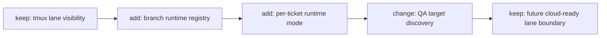
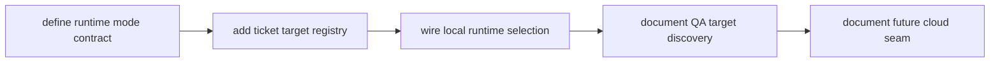

# TASK-0081: add selective branch runtime scaling

## Summary
Parked on 2026-05-06: this ticket is not the next Codexter milestone. The
current architecture keeps Codexter as a ticket invocation/proof layer inside
normal Codex, while worktrees, Codex Cloud, and Symphony remain external compute
lanes or manual setup paths until repeated isolated-QA pain proves this runtime
scaling work is necessary.

Extend the current tmux-based runtime into a selective branch-runtime model
where each ticket can choose the lightest execution environment that still gives
QA an isolated frontend/backend target, while preserving a clean boundary for
future cloud lanes.

## Scope
- In:
  - branch-first execution with explicit runtime modes per ticket
  - selective worktree use when parallel live branches or overlap require it
  - per-ticket QA environment rules for frontend/backend availability
  - a clearer split between session orchestration, branch ownership, and runtime
    allocation
  - a cloud-ready interface boundary without implementing full cloud runners
- Out:
  - production cloud orchestration
  - opaque hidden worker farms
  - mandatory worktrees for every ticket
  - mandatory per-ticket full Docker stacks

## User Story
- `Actor:` operator pushing Codexter past one local ticket lane
- `Need:` safer parallelism and unattended QA without forcing worktree churn for
  ordinary local development
- `Outcome:` Codexter can scale locally with selective isolation before any
  cloud jump

## User Pain / JTBD
- `Current pain:` tmux lanes exist, but the runtime does not yet decide when a
  ticket should stay lightweight versus when it should spin up a more isolated
  QA target
- `Why now:` the checklist calls out tmux orchestration, worktrees, and more
  compute as open DevX gaps

## Non-Goals
- `Do not solve:` a cloud control plane in the first slice
- `Do not solve:` fully autonomous per-ticket remote VMs as the default path

## High-Fidelity Example
- `Example flow/artifact:` a small UI-only ticket stays on a shared branch
  runtime with shared infra, while a DB-changing ticket launches a branch-local
  compose environment with its own app ports and isolated data surface; both
  publish a ticket-scoped QA target that `qa-tester` can open without guessing

## What Good Looks Like
- `Quality bar:` local execution stays low-friction by default, but tickets that
  need isolated QA can publish a reproducible frontend/backend target before
  cloud complexity is introduced

## Proof Target
- `Reviewer-visible proof:` the runtime can choose among lightweight and
  isolated local modes, ticket ownership remains visible, QA can discover the
  right target from runtime state, and the lane contract stays clear

## Plan

### Human

#### Decision
- `Req:` increase compute without making the runtime opaque or overbuilt
- `Best:` make branch-first execution the default, let each ticket choose a
  runtime mode, and keep worktrees plus full compose isolation as selective
  tools rather than mandatory defaults
- `Why:` most local work does not need worktree overhead, but unattended QA
  still needs a stable frontend/backend target; selective runtime choice solves
  both problems without committing to cloud workers yet
- `Tradeoff accepted:` cloud execution stays deferred
- `Not chosen:` jumping straight to remote workers

#### Diagram
- `Required:` yes
- `Legend:` keep | change | add | remove

- `Tier 2:` not needed

#### Signature Sketch
- `runtime / launch_lane(ticket): session`
- `runtime / resolve_ticket_runtime(ticket): shared|branch-runtime|branch-compose`
- `runtime / ensure_ticket_target(ticket): target`
- `runtime / lane_contract(): local|remote-ready`

#### B -> A
- `Before:` parallelism depends mostly on tmux visibility and shared workspace
- `After:` local lanes can stay lightweight by default, but tickets that need
  stronger QA isolation can publish their own frontend/backend target through
  one runtime contract
- `Outcome:` more compute with less conflict risk and less routine worktree
  overhead

#### Proof
- `P1:` ticket runtime mode is visible and deterministic
- `P2:` QA can discover the correct frontend/backend target from runtime state
- `P3:` the lane contract leaves room for future remote execution
- `Risk:` runtime complexity grows too quickly
- `Rollback:` keep `shared` mode as the simplest path and make stronger
  isolation opt-in

#### Ask
- `Ready: no`
- `Next:` approve the selective branch-runtime strategy

### Agent

#### Delta
- `Touch:` runtime helpers, tmux helpers, docs, and ticket/runtime ownership
  surfaces
- `Keep:` visible local lanes and ticket-centric control
- `Change:` add runtime mode selection, QA target discovery, and selective
  isolation rules
- `Delete/Avoid:` no hidden worker farm

#### Execution Plan

```pseudo
define the lane contract for selective execution
add per-ticket runtime mode and target assignment rules
wire the local runtime to launch the lightest sufficient environment
let QA resolve the ticket target from runtime state instead of guessing ports
document the future remote seam without implementing it
```

#### Risk / Rollback
- `Primary risk:` runtime mode selection becomes hand-wavy or inconsistent
- `Containment:` make the ticket and runtime contract say when `shared`,
  `branch-runtime`, `branch-compose`, and optional `worktree` are allowed
- `Rollback:` keep the old shared-workspace path available during rollout and
  let stronger isolation stay opt-in

#### Plan Review
- `Refs:` `docs/specs/runtime-surface.md`,
  `docs/specs/orchestrator-subagent-loop.md`, `skills/impl/scripts/tmux_helper.py`,
  `README.md`
- `Checks:` visible ownership, local-first compute, QA target discovery, clear
  cloud boundary
- `Fixes:` closes the checklist gaps around tmux orchestration, selective local
  isolation, and more compute

#### Options Appendix
- `Option 1:` selective branch-runtime scaling
- `Pros:` lowest-friction default with enough isolation for unattended QA
- `Cons:` requires a clearer runtime contract than today
- `Why not chosen:` recommended
- `Option 2:` worktree-first local runtime scaling
- `Pros:` stronger branch isolation for all parallel work
- `Cons:` more overhead than the current local workflow earns
- `Why not chosen:` premature
- `Option 3:` cloud runners first
- `Pros:` strongest long-term scale ceiling
- `Cons:` much higher trust and infrastructure cost
- `Why not chosen:` too weak

#### Delegation
- `Need:` Not needed
- `Why:` planning ticket only
- `Artifact:` n/a

#### Ticket Move
- `Now:` `status: review`, `phase: planning`
- `On approval:` move to `building`
- `Follow-ups:` cloud-lane implementation could follow later if still needed
- `Blocked in building?:` yes, waiting for approval

## Acceptance Criteria
- [ ] AC-1: each ticket can declare or derive a local runtime mode from a small
  bounded set such as `shared`, `branch-runtime`, or `branch-compose`
- [ ] AC-2: ticket and runtime ownership remain visible without forcing
  worktrees for every ticket
- [ ] AC-3: QA can discover the correct ticket-scoped frontend/backend target
  from runtime state instead of guessing ports
- [ ] AC-4: worktree support remains optional and is used only when overlap,
  parallel live branches, or risky isolation needs justify it
- [ ] AC-5: the runtime contract exposes a clean future remote seam

## Working Notes
- 2026-05-06: superseded for now by the thinner ticket-invocation architecture.
  Do not implement this as a broad background-agent/runtime-scaling system. Use
  manual worktrees or Codex Cloud directly when the operator wants isolated
  branch work, and revisit only when that manual path becomes a repeated
  bottleneck.
- Branch-first runtime selection is the near-term compute lever; worktrees and
  compose isolation should stay selective, and cloud should stay behind a later
  seam.

## Implementation Notes
- Touched areas: runtime helpers, tmux helpers, docs
- Reused patterns: current visible lane model
- Guardrails: local-first, explicit ownership, optional rollout, QA target
  discovery from runtime state

## Evidence
- [ ] Tests
- [ ] Typecheck
- [ ] Lint
- [ ] QA / manual verification

## Review Packet
- Scores use the anchored `1.0`-to-`5.0` rubric scale.
- `work_type:` `[]`
- `search_scope:` `{changed_files: [], related_files: ["docs/specs/runtime-surface.md", "docs/specs/orchestrator-subagent-loop.md", "skills/impl/scripts/tmux_helper.py", "README.md"], invariants_checked: ["MEM-0005", "MEM-0016", "MEM-0017", "MEM-0018"], docs_checked: []}`
- `reviewed_at:` `not run`
- `rubrics_used:` `[]`
- `overall_score:`
- `overall_threshold:`
- `overall_verdict:` `revise`
- `rerun_required:` `true`
- `evidence_quality:` `fail`
- `integration_readiness:` `fail`
- `traceability:` `pass`
- `freshness:` `pass`
- `hard_gate_failures:` `["evidence-quality", "integration-readiness"]`
- `finding_log:` `[]`
- `blocking_findings:` `[]`
- `next_action:` `approve or refine the selective branch-runtime strategy`

## Refs
- `README.md`
- `docs/specs/runtime-surface.md`
- `docs/specs/orchestrator-subagent-loop.md`
- `skills/impl/scripts/tmux_helper.py`

## Blockers
- superseded by TASK-0120/TASK-0122 until isolated local QA/runtime setup becomes repeated pain

## Handoff
- Current state: parked planning ticket seeded from the roadmap audit
- Resume from: only after a fresh user decision that isolated local QA/runtime
  setup is a real repeated bottleneck; otherwise prefer explicit Codexter
  invocation plus manual worktree/Codex Cloud/Symphony handoff recipes

## Writeback
- Update runtime docs and helpers if this lands.
