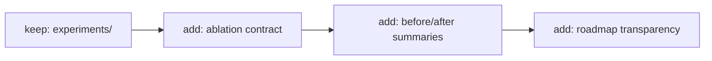
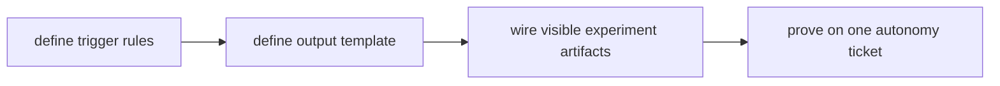

# TASK-0082: add transparency and ablation evals

## Summary
Add a transparency layer for autonomy changes by defining ablation tests,
comparison reports, and visible experiment artifacts that show whether new
harness behavior actually improves outcomes.

## Scope
- In:
  - an ablation/eval contract for major autonomy changes
  - visible experiment outputs and comparison writeups
  - operator-facing transparency summaries for what changed and what improved
- Out:
  - perfect benchmarking or fully automated research infrastructure

## User Story
- `Actor:` maintainer changing the harness autonomy loop
- `Need:` proof that a new behavior helped instead of only sounding better
- `Outcome:` roadmap decisions become evidence-based

## User Pain / JTBD
- `Current pain:` autonomy and trust changes are often discussed qualitatively,
  but not compared through explicit ablations
- `Why now:` the checklist explicitly calls out transparency and ablation tests

## Non-Goals
- `Do not solve:` exhaustive benchmark infrastructure for every tiny change

## High-Fidelity Example
- `Example flow/artifact:` when the new planning/evidence/action-routing tickets land, Codexter runs a before/after
  comparison on a small ticket queue, stores the outputs in `experiments/`, and
  writes a short summary of whether autonomy, proof quality, and operator trust
  improved

## What Good Looks Like
- `Quality bar:` big harness changes ship with comparable evidence instead of
  only narrative claims

## Proof Target
- `Reviewer-visible proof:` there is a lightweight ablation workflow, clear
  experiment artifacts, and a visible summary template for autonomy changes

## Plan

### Human

#### Decision
- `Req:` make autonomy progress measurable without building a giant eval lab
- `Best:` define a lightweight ablation workflow for major harness changes and
  store the outputs in visible experiment artifacts
- `Why:` this raises trust while staying proportionate to the repo
- `Tradeoff accepted:` only high-leverage changes get ablations at first
- `Not chosen:` continuing with narrative-only claims

#### Diagram
- `Required:` yes
- `Legend:` keep | change | add | remove

- `Tier 2:` not needed

#### Signature Sketch
- `experiments / run_ablation(change): result set`
- `experiments / summarize(result set): report`
- `roadmap / link evidence(ticket): summary`

#### B -> A
- `Before:` autonomy changes mostly rely on docs and qualitative reasoning
- `After:` major changes can ship with visible before/after evidence
- `Outcome:` transparency and roadmap prioritization improve

#### Proof
- `P1:` the ablation workflow stays lightweight enough to actually run
- `P2:` experiment outputs are visible and comparable
- `Risk:` overbuilding measurement infrastructure
- `Rollback:` keep the first slice template-driven and focused on major changes

#### Ask
- `Ready: no`
- `Next:` approve the lightweight ablation scope

### Agent

#### Delta
- `Touch:` experiment docs, templates, and maybe helper scripts
- `Keep:` current canonical docs and experiment folder
- `Change:` add comparison and summary discipline for autonomy changes
- `Delete/Avoid:` do not turn this into full benchmark infrastructure

#### Execution Plan

```pseudo
define which changes require ablations
define the output template and storage path
add a visible summary workflow
prove it on one high-leverage autonomy ticket
```

#### Risk / Rollback
- `Primary risk:` too much measurement overhead
- `Containment:` keep scope to high-leverage autonomy changes
- `Rollback:` use manual template-driven comparisons first

#### Plan Review
- `Refs:` `docs/specs/harness-techniques.md`, `docs/specs/doc-governance.md`,
  `experiments/README.md`, `README.md`
- `Checks:` visible evidence, lightweight workflow, no giant lab
- `Fixes:` closes the checklist's transparency and ablation gap

#### Options Appendix
- `Option 1:` lightweight visible ablations for major changes
- `Pros:` strong trust gain for low operational complexity
- `Cons:` still some extra process
- `Why not chosen:` recommended
- `Option 2:` qualitative summaries only
- `Pros:` cheapest
- `Cons:` weak evidence
- `Why not chosen:` too weak
- `Option 3:` full benchmark lab
- `Pros:` strongest rigor
- `Cons:` too much infrastructure for the current repo stage
- `Why not chosen:` premature

#### Delegation
- `Need:` Not needed
- `Why:` planning ticket only
- `Artifact:` n/a

#### Ticket Move
- `Now:` `status: review`, `phase: planning`
- `On approval:` move to `building`
- `Follow-ups:` connect the first ablation to a major autonomy ticket
- `Blocked in building?:` yes, waiting for approval

## Acceptance Criteria
- [ ] AC-1: a lightweight ablation workflow exists for major autonomy changes
- [ ] AC-2: experiment outputs have a visible storage and summary format
- [ ] AC-3: roadmap claims can link to experiment evidence
- [ ] AC-4: the workflow is proven on at least one high-leverage change

## Working Notes
- Transparency should follow the highest-leverage autonomy and proof changes,
  not every minor refactor.

## Implementation Notes
- Touched areas: experiments docs, templates, and roadmap docs
- Reused patterns: existing `experiments/` surface and doc-governance doctrine
- Guardrails: template-driven first, no giant benchmark system

## Evidence
- [ ] Tests
- [ ] Typecheck
- [ ] Lint
- [ ] QA / manual verification

## Review Packet
- Scores use the anchored `1.0`-to-`5.0` rubric scale.
- `work_type:` `[]`
- `search_scope:` `{changed_files: [], related_files: ["docs/specs/harness-techniques.md", "docs/specs/doc-governance.md", "experiments/README.md", "README.md"], invariants_checked: [], docs_checked: []}`
- `reviewed_at:` `not run`
- `rubrics_used:` `[]`
- `overall_score:`
- `overall_threshold:`
- `overall_verdict:` `revise`
- `rerun_required:` `true`
- `evidence_quality:` `fail`
- `integration_readiness:` `fail`
- `traceability:` `pass`
- `freshness:` `pass`
- `hard_gate_failures:` `["evidence-quality", "integration-readiness"]`
- `finding_log:` `[]`
- `blocking_findings:` `[]`
- `next_action:` `approve or refine the ablation scope`

## Refs
- `README.md`
- `docs/specs/harness-techniques.md`
- `docs/specs/doc-governance.md`
- `experiments/README.md`

## Blockers
- deferred late-game work; needs a fresh high-leverage autonomy-change package before planning resumes

## Handoff
- Current state: planning ticket seeded from the roadmap audit
- Resume from: define trigger rules for when an autonomy change requires an ablation

## Writeback
- Update experiments and roadmap docs if this lands.
