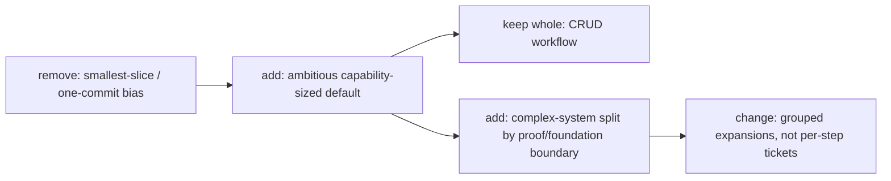

# TASK-0084: make ticket sizing more ambition-aware

## Summary
Tighten Codexter's live planning doctrine so agents stop reward-hacking toward
tiny proof slices and instead keep larger coherent capability tickets intact
unless a real complexity, proof, or runtime boundary justifies a split.

## Scope
- In:
  - strengthen `spec-to-ticket` sizing doctrine
  - remove `impl-plan` language that pushed "one commit" splitting
  - align ticket docs and templates around complexity-aware ticket sizing
  - record the new invariant in durable memory and history
- Out:
  - runtime/autonomy execution changes
  - changing existing active product tickets beyond the planning doctrine

## User Story
- `Actor:` Codexter maintainer tuning agent ambition
- `Need:` the harness to package work into stronger tickets that match system complexity and proof shape
- `Outcome:` agents can take bigger coherent bets without dissolving every feature into micro-steps

## User Pain / JTBD
- `Current pain:` the planner still nudged toward smallest-slice and one-commit thinking even after capability-first ticketing had been introduced
- `Why now:` the user wants agents to target more ambitious slices and split complex systems by real testability and future-friction boundaries

## Non-Goals
- `Do not solve:` autonomous queue selection or new runtime routing behavior

## High-Fidelity Example
- `Example flow/artifact:` CRUD stays one ticket, while a complex ingestion pipeline becomes a foundation ticket with a real proof path plus a small number of grouped expansion tickets instead of parse/chunk/embed/index microtickets

## What Good Looks Like
- `Quality bar:` the live docs tell the agent to keep coherent tickets whole, the complex-system examples are explicit, and the old "one commit" bias is gone from planning surfaces

## Proof Target
- `Reviewer-visible proof:` the planning skills, ticket docs, and durable memory all agree on the new sizing rule and the validators pass

## Plan

### Human

#### Decision
- `Req:` make ticket splitting more ambitious and context-aware
- `Best:` adopt an ambition-aware capability-plus-proof-surface doctrine
- `Why:` this keeps simple workflows whole while giving complex systems a clean rule for foundation-first and future-friction-aware splits
- `Tradeoff accepted:` some tickets will now be intentionally larger and multi-commit, so review relies more on proof coherence than on commit count
- `Not chosen:` strict vertical-only slicing keeps some large systems awkward; microservices-first splitting creates premature boundaries; per-step proof slicing is too timid

#### Diagram
- `Required:` yes
- `Legend:` keep | change | add | remove

- `Tier 2:` not needed

#### Signature Sketch
- `skills/spec-to-ticket / sizing rules + examples`
- `skills/impl-plan / scope + split-check contract`
- `tickets/README.md / sizing doctrine`
- `tickets/templates/ticket.md / ambitious-slice wording`

#### B -> A
- `Before:` the repo said capability-first in some places but `impl-plan` still taught "next smallest executable slice" and "one commit" splitting
- `After:` `spec-to-ticket`, `impl-plan`, ticket docs, and memory all agree on a larger-ticket default with explicit split triggers
- `Outcome:` agents can keep coherent work intact and only split when complexity, proof, or runtime boundaries make that obviously better

#### Proof
- `P1:` `spec-to-ticket` now teaches CRUD-whole plus foundation-first complex-system splitting
- `P2:` `impl-plan` no longer forces one-commit decomposition
- `Risk:` doctrine drift between planning modules and ticket docs
- `Rollback:` revert the wording changes without runtime fallout

#### Ask
- `Ready: yes`
- `Next:` use this doctrine on the next planning/ticketization pass and watch whether ticket sizing becomes materially bolder

### Agent

#### Delta
- `Touch:` `docs/MEMORY.md`, `docs/HISTORY.md`, `skills/spec-to-ticket/*`, `skills/impl-plan/*`, `tickets/README.md`, `tickets/templates/ticket.md`
- `Keep:` capability-first default, testability-first ticket contracts, diagram-first planning
- `Change:` split triggers, complexity examples, and planner wording that previously favored tiny slices
- `Delete/Avoid:` no runtime changes and no new ticket metadata fields

#### Execution Plan

```pseudo
inspect planning and ticketing surfaces
replace smallest-slice and one-commit rules
add explicit CRUD and ingestion examples
align docs and durable memory
run validators and a review pass
```

#### Risk / Rollback
- `Primary risk:` wording could make tickets too large if the split triggers stay vague
- `Containment:` keep hard split triggers explicit and add concrete examples for CRUD and ingestion
- `Rollback:` revert the planning-doc changes and remove `MEM-0044`

#### Plan Review
- `Refs:` `AGENTS.md`, `docs/MEMORY.md`, `docs/TROUBLES.md`, `skills/spec-to-ticket/SKILL.md`, `skills/impl-plan/SKILL.md`, `tickets/README.md`, local changed files
- `Checks:` scope stayed in doctrine/doc surfaces; split-boundary language is explicit; proof remains concrete; examples are specific; no new machine-readable ticket burden was added
- `Fixes:` removed the lingering `impl-plan` "one commit" quality-gate wording after the first validation search

#### Options Appendix
- `Option 1:` stay purely capability-first with no complexity refinement
- `Pros:` simple rule, low doctrine surface area
- `Cons:` still leaves complex systems underspecified and encourages timid follow-up splitting in practice
- `Why not chosen:` too weak for the actual failure mode
- `Option 2:` split by microservices or architecture boundaries first
- `Pros:` clean ownership boundaries for some systems
- `Cons:` premature services, weak operator value packaging, and higher future migration cost when the service boundary is not yet real
- `Why not chosen:` overfits architecture neatness
- `Option 3:` ambition-aware capability plus proof-surface splitting
- `Pros:` keeps simple work whole, gives complex systems a reusable foundation-first rule, and aligns ticket size with provability
- `Cons:` requires more judgment than a mechanical size rule
- `Why not chosen:` chosen

#### Delegation
- `Need:` Not needed
- `Why:` repo-local planning doctrine pass
- `Artifact:` n/a

#### Ticket Move
- `Now:` `status: done`, `phase: complete`
- `On approval:` already executed
- `Follow-ups:` none required
- `Blocked in building?:` no

## Acceptance Criteria
- [x] AC-1: `spec-to-ticket` teaches ambition-aware capability sizing with explicit split triggers
- [x] AC-2: `impl-plan` stops forcing "smallest slice" or "one commit" decomposition
- [x] AC-3: ticket docs and templates reflect the new sizing doctrine
- [x] AC-4: durable memory/history capture the new invariant and validators pass

## Working Notes
- The main bug was not just ticketization. `impl-plan` still carried a stronger
  shrinking bias than the repo-level doctrine, so both planning surfaces had to
  be updated together.

## Implementation Notes
- Touched areas: planning skill docs, ticketing docs, durable memory/history
- Reused patterns: capability-first doctrine from `MEM-0041`, diagram-first planning shape, existing ticket contract
- Guardrails: no runtime changes, no new control-plane complexity

## Evidence
- [x] Tests
- [ ] Typecheck
- [ ] Lint
- [x] QA / manual verification
- `Commands:` `rg -n "next smallest executable slice|one commit|smallest executable slice|next-commit slice" skills/impl-plan skills/spec-to-ticket tickets/templates/ticket.md tickets/README.md docs/MEMORY.md AGENTS.md`; `python3 tickets/scripts/check_ticket_metadata.py`; `python3 bin/check_harness_invariants.py`; `python3 bin/check_doc_parity.py`; `git diff --check`
- `Manual verification:` confirmed the live planning surfaces now say CRUD stays whole, complex systems split by proof/foundation or real runtime boundaries, and `impl-plan` no longer teaches commit-count splitting
- `Not run:` typecheck and lint were not applicable because this pass only touched docs and ticket artifacts

## Review Packet
- Scores use the anchored `1.0`-to-`5.0` rubric scale.
- `work_type:` `["docs","planning-contract","tickets"]`
- `search_scope:` `{changed_files: ["docs/MEMORY.md", "docs/HISTORY.md", "skills/spec-to-ticket/AGENTS.md", "skills/spec-to-ticket/SKILL.md", "skills/spec-to-ticket/todos.md", "skills/spec-to-ticket/references/review.md", "skills/impl-plan/AGENTS.md", "skills/impl-plan/README.md", "skills/impl-plan/SKILL.md", "skills/impl-plan/prompts/plan.md", "skills/impl-plan/references/review.md", "skills/impl-plan/references/template.md", "tickets/README.md", "tickets/templates/ticket.md", "tickets/TASK-0084-make-ticket-sizing-more-ambition-aware.md"], related_files: ["AGENTS.md", "docs/TROUBLES.md"], invariants_checked: ["MEM-0041", "MEM-0044"], docs_checked: ["skills/spec-to-ticket/SKILL.md", "skills/impl-plan/SKILL.md", "tickets/README.md"]}`
- `reviewed_at:` `2026-04-16 01:04 +0100`
- `rubrics_used:` `["user-intent-satisfaction", "debloatability", "evidence-quality", "integration-readiness"]`
- `overall_score:` `4.6`
- `overall_threshold:` `4.0`
- `overall_verdict:` `pass`
- `rerun_required:` `false`
- `evidence_quality:` `pass`
- `integration_readiness:` `pass`
- `traceability:` `pass`
- `freshness:` `pass`
- `hard_gate_failures:` `[]`
- `finding_log:` `[]`
- `blocking_findings:` `[]`
- `next_action:` `apply the doctrine on the next complex feature ticket and watch whether ticket scope stays bolder without losing proof quality`

## Blockers
- none

## Handoff
- Current state: the planning doctrine is aligned across memory, ticket docs,
  `spec-to-ticket`, and `impl-plan`
- Resume from: use `TASK-0084` as the reference when future ticket splits look too timid or architecture-first

## Writeback
- Added `MEM-0044`, updated the planning/ticket docs, and recorded the change
  in `docs/HISTORY.md`.
