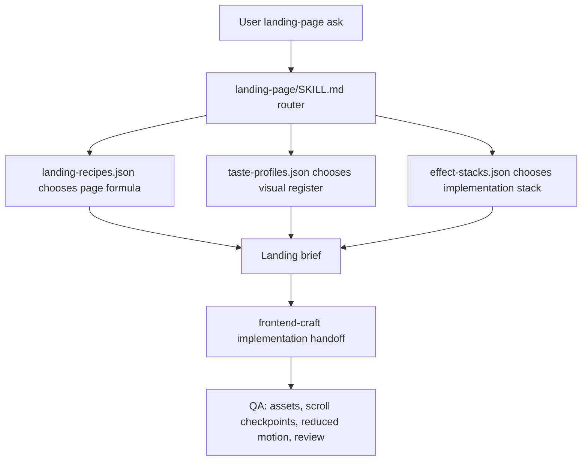

# TASK-0109: add modular landing page recipe scale

## Summary
Turn `landing-page` into a small router over JSON-backed recipe registries so agents can build repeatable high-taste landing pages from proven formulas instead of improvising one giant guideline. The recommended format is a landing recipe scale with three composable JSON registries: page recipes for structure, taste profiles for visual register, and effect stacks for implementation mechanics.

## Scope
- In:
  - `landing-page` routing language for selecting recipes, taste profiles, and effect stacks.
  - `references/landing-recipes.json` with the first `industrial-mission-control` recipe grounded in Terminal Industries plus the Nomous prototype.
  - `references/taste-profiles.json` with the first Terminal/Palantir-style enterprise mission-control taste profile.
  - `references/effect-stacks.json` with the first cinematic frame-sequence/GSAP stack split out of the current cinematic guideline.
  - `references/registry-format.md` with the JSON field contract, routing rules, and authoring guidance.
  - Compatibility pointer from the current `cinematic-scroll-site-guideline.md` to the JSON recipe/profile/stack records.
  - `frontend-craft` routing updates so cinematic landing implementation loads the recipe scale before building.
  - Validation and review proof for the skill topology change.
- Out:
  - Building a website.
  - Generating new video, images, Spline scenes, or production frontend assets.
  - A custom parser, CLI, formal JSON Schema, database loader, or automatic URL-to-recipe ingestion flow.
  - Moving general app UI taste into `landing-page`; app UI remains owned by `functional-ui` and `visual-design`.

## Parity Brief
- `Capability + parity lens:` A modular landing-page reference system where a main skill routes to reusable page formulas, taste profiles, effect stacks, and reference examples.
- `Local baseline:` `landing-page` has a compact workflow, scrolltelling references, and one combined `cinematic-scroll-site-guideline.md`. `visual-design` has general taste dials. `frontend-craft` knows to route landing pages to `landing-page`, but no recipe taxonomy exists yet.
- `Comparable implementations:`
  - shadcn/ui registry separates reusable items by type such as block, component, page, style, theme, dependencies, files, targets, docs, categories, and metadata.
  - Storybook separates runnable stories from MDX documentation and supports docs pages, examples, controls, and dos/don'ts inside one navigable documentation surface.
  - PatternFly patterns define reusable best-practice solutions for common user problems, with design guidelines covering usage, appearance, features, and variations, while demos live separately.
  - Tailwind UI organizes marketing UI into page-section categories such as heroes, features, CTA sections, bento grids, pricing, testimonials, logo clouds, FAQs, and page examples, and frames them as blueprints rather than a rigid kit.
  - GSAP ScrollTrigger provides the canonical implementation vocabulary for pinned, scrubbed, snapped, and timeline-driven scroll animation stacks.
  - Spline docs define 3D scene exports, events, actions, and variables as a distinct interactive 3D capability, which fits better as an effect stack than as a landing recipe.
- `Common surfaces:`
  - an index/router that chooses the relevant reference by category and use case,
  - item-level metadata for name, type, category, dependencies, docs, examples, and compatibility,
  - separation between pattern guidelines and demos/examples,
  - reusable page sections or blocks rather than one monolithic site template,
  - explicit visual styling/tokens/themes separate from functional composition,
  - implementation dependencies/effects separated from the content formula,
  - clear install/build/debug/proof notes for heavier implementation stacks.
- `Repo delta:` Codexter currently has the first combined cinematic reference but not the structured registry files or routing contract needed to keep future inspirations organized as reusable formulas.
- `Recommendation:` Implement JSON registries now because recipes, taste profiles, and effect stacks are naturally record-shaped and will likely feed future database/search tooling. Avoid custom parser/schema work until at least 3-5 records exist and repeated validation pain proves it is worth it.
- `Follow-ups / out-of-scope:` URL-to-recipe extraction, recipe scoring, recipe registry validation, generated media prompt evals, and a larger inspiration library should be follow-up tickets after the first scale proves useful.

## Gap Analysis
- `Current state:` `landing-page` owns landing pages and includes `references/cinematic-scroll-site-guideline.md`, but that file mixes recipe, taste, effect stack, asset pipeline, debugging, and example references into one combined guideline. There is no way to add many industrial/SaaS/luxury/devtool examples without bloating the same file or forcing agents to infer which parts are structural versus aesthetic versus implementation-specific.
- `Production expectation:` A credible reusable design-reference system separates pattern families, examples, visual systems, implementation dependencies, and proof/debug surfaces. Mature systems do not rely on a single mega-doc; they use indexes, categories, templates, examples, and variant-specific references that can be composed.
- `Missing gaps:`
  - no JSON recipe registry that maps landing-page types to the right formula,
  - no JSON field contract that tells agents what to extract from each inspiration set,
  - no taste-profile registry for visual register, palette, typography, density, and anti-slop,
  - no effect-stack registry for GSAP, frame sequences, Spline, WebGL, generated video, debug hooks, and fallbacks,
  - no first-class `industrial-mission-control` recipe record using Terminal-style structure,
  - no compatibility rule for what happens to the existing cinematic guideline,
  - no routing update in `frontend-craft` to require recipe/profile/effect selection before implementation.
- `Comparable implementations:` shadcn/ui registry, Storybook MDX/stories, PatternFly patterns, Tailwind UI marketing sections, GSAP ScrollTrigger docs, Spline docs, Terminal Industries, and the private Nomous agency prototype.
- `Recommendation:` Land one coherent docs-only ticket that creates the JSON registries, first recipe/profile/stack records, format guide, compatibility pointer, and routing updates. Defer automation and formal schema until enough records exist to reveal real validation needs.

## Plan
- `Change:` Add a composable JSON landing-page recipe scale under `skills/landing-page/references/` and update `landing-page` plus `frontend-craft` to route cinematic/marketing pages through recipe, taste, and effect records.
- `Why:` The current combined cinematic guideline is useful but will become a junk drawer as more inspirations arrive. Recipes need to be reusable "skill within a skill" records that agents can mix with taste and effect choices, and JSON keeps those records strict enough for future indexing or database loading.
- `Before -> After:`
  - Before: agents load a single landing-page workflow plus one combined cinematic guideline and must infer whether Terminal-like advice is page structure, taste, or implementation.
  - After: agents select one recipe record, pair it with one taste-profile record, pair that with one effect-stack record, then produce a landing brief and implementation handoff with explicit examples and QA.
- `Touch:`
  - `skills/landing-page/SKILL.md` - add recipe-scale routing to the core workflow and reference map.
  - `skills/landing-page/references/workflows.md` - add the recipe/profile/effect selection sequence.
  - `skills/landing-page/references/cinematic-scroll-site-guideline.md` - convert into a compatibility pointer or short umbrella note after content is split.
  - `skills/landing-page/references/landing-recipes.json` - new JSON recipe registry with `industrial-mission-control`.
  - `skills/landing-page/references/taste-profiles.json` - new JSON taste-profile registry with `terminal-palantir`.
  - `skills/landing-page/references/effect-stacks.json` - new JSON effect-stack registry with `cinematic-frame-sequence`.
  - `skills/landing-page/references/registry-format.md` - concise JSON registry field contract and authoring rules.
  - `skills/frontend-craft/references/workflows.md` - require recipe-scale selection for landing builds.
  - `skills/frontend-craft/references/routing.md` - mention recipe/profile/effect routing as the landing-page subroute.
  - `AGENTS.md`, `docs/MEMORY.md`, `docs/HISTORY.md` - update only if the implementation creates a durable routing invariant.
- `Inspect:`
  - `skills/landing-page/SKILL.md`
  - `skills/landing-page/references/cinematic-scroll-site-guideline.md`
  - `skills/landing-page/references/workflows.md`
  - `skills/landing-page/references/motion-and-media.md`
  - `skills/frontend-craft/references/workflows.md`
  - `skills/frontend-craft/references/routing.md`
  - `skills/visual-design/SKILL.md`
  - `skills/skill-creator/SKILL.md`
  - `docs/MEMORY.md`
  - `docs/TROUBLES.md`
- `Signature delta:`
  - `skills/landing-page/SKILL.md / choose_landing_recipe(request): LandingRecipeRoute`
  - `references/landing-recipes.json / recipes[]: LandingRecipe[]`
  - `references/taste-profiles.json / profiles[]: TasteProfile[]`
  - `references/effect-stacks.json / stacks[]: EffectStack[]`
  - `references/registry-format.md / field_contract(kind): JSON field guide`
  - `frontend-craft/references/workflows.md / landing_build_route(request): recipe + taste_profile + effect_stack + QA`
- `Type Sketch:`
  - `LandingRegistryFile`:
    - `schema_version`
    - `kind: "landing-recipes" | "taste-profiles" | "effect-stacks"`
    - `records_key: "recipes" | "profiles" | "stacks"`
  - `LandingRecipe`:
    - `id`
    - `title`
    - `summary`
    - `use_when`
    - `avoid_when`
    - `reference_examples`
    - `page_formula.top`
    - `page_formula.middle`
    - `page_formula.proof`
    - `page_formula.cta`
    - `asset_plan`
    - `compatible_taste_profile_ids`
    - `compatible_effect_stack_ids`
    - `qa_expectations`
  - `TasteProfile`:
    - `id`
    - `title`
    - `register`
    - `scene_sentence`
    - `palette`
    - `typography`
    - `density`
    - `materials`
    - `motion_attitude`
    - `dos`
    - `donts`
    - `pairs_with_recipe_ids`
    - `pairs_with_effect_stack_ids`
    - `reference_examples`
  - `EffectStack`:
    - `id`
    - `title`
    - `use_when`
    - `tools`
    - `asset_inputs`
    - `implementation_shape`
    - `debug_hooks`
    - `fallbacks`
    - `qa_checks`
    - `gotchas`
    - `pairs_with_recipe_ids`
    - `pairs_with_taste_profile_ids`
  - `LandingRecipeRoute`:
    - `recipe_id`
    - `taste_profile_id`
    - `effect_stack_id`
    - `skipped_refs`
    - `reasoning_summary`
- `Typed flow example:`
  1. User asks for "Terminal Industries but for an enterprise AI logistics product with GSAP scroll."
  2. `landing-page` loads `landing-recipes.json` and selects `industrial-mission-control` because the domain is industrial/enterprise and the desired page is cinematic.
  3. The route selects `terminal-palantir` from `taste-profiles.json` for dark mission-control density, restrained neon, grid/HUD accents, and proof-heavy enterprise tone.
  4. The route selects `cinematic-frame-sequence` from `effect-stacks.json` because the hero is a generated video/frame-sequence scroll transformation.
  5. The output brief names the carrier object, page structure, 2-3 inspiration references, asset prompts, debug hooks, and QA checkpoints before `frontend-craft` implements.
- `Execution steps:`
  1. Create `landing-recipes.json`, `taste-profiles.json`, `effect-stacks.json`, and `registry-format.md`.
  2. Add `schema_version`, `kind`, and one top-level record array to each JSON file.
  3. Split the existing cinematic guideline into the `industrial-mission-control` recipe record, `terminal-palantir` taste-profile record, and `cinematic-frame-sequence` effect-stack record.
  4. Keep generated video prompts, section formulas, and debug hooks as arrays/objects inside JSON instead of prose-only Markdown.
  5. Replace the old cinematic guideline body with a short compatibility pointer to the new JSON records and keep the filename stable for existing references.
  6. Update `landing-page/SKILL.md` to route cinematic/marketing pages through recipe, taste, and effect selection.
  7. Update `landing-page/references/workflows.md`, `motion-and-media.md`, `frontend-craft/references/workflows.md`, and `frontend-craft/references/routing.md`.
  8. Validate JSON files with `python3 -m json.tool`.
  9. Add a durable memory/history entry only if the implementation changes the stable frontend routing contract.
  10. Run skill validation and ticket metadata checks.
  11. Run a review pass and link the review artifact in `Evidence`.
- `Recommendation:` Use JSON for recipe, taste-profile, and effect-stack records now. Do not add custom parser/schema/database automation until the hand-authored records prove the field set is stable.
- `Options considered:`
  - One mega landing guideline: simplest but will bloat and blur structure, taste, and implementation.
  - YAML registries: more author-friendly and supports comments, but JSON is stricter, easier to parse with built-in tooling, and more directly database-friendly.
  - JSON registries under `landing-page`: recommended because it preserves one public entrypoint, gives future inspirations a precise home, and keeps the data programmable from day one.
- `Blast radius:` `landing-page`, `frontend-craft`, visual-design handoff wording, frontend planning habits, and any existing references to `cinematic-scroll-site-guideline.md`.
- `Risks:`
  - JSON can become painful for long prose if records try to absorb full essays.
  - Taste profiles can drift into app-UI visual design unless scoped to landing pages.
  - Recipes can become screenshot mood boards unless each one requires structure, assets, CTA, proof, and QA.
  - The current cinematic filename may break references if moved rather than preserved as a pointer.

## Diagram

## Acceptance Criteria
- [x] `landing-page` exposes recipe/profile/effect-stack routing in its core workflow and reference map.
- [x] `landing-recipes.json` exists, parses as JSON, and includes `industrial-mission-control`.
- [x] `taste-profiles.json` exists, parses as JSON, and includes `terminal-palantir`.
- [x] `effect-stacks.json` exists, parses as JSON, and includes `cinematic-frame-sequence`.
- [x] `registry-format.md` documents the JSON field contract and when to add a new record.
- [x] `cinematic-scroll-site-guideline.md` remains as a stable compatibility pointer or umbrella note.
- [x] `frontend-craft` routing tells landing builds to select a recipe, taste profile, and effect stack before implementation.
- [x] Validators and review pass.

## Verification
- `Tests:`
  - `python3 skills/skill-creator/scripts/quick_validate.py skills/landing-page`
  - `python3 skills/skill-creator/scripts/quick_validate.py skills/frontend-craft`
  - `python3 -m json.tool skills/landing-page/references/landing-recipes.json >/dev/null`
  - `python3 -m json.tool skills/landing-page/references/taste-profiles.json >/dev/null`
  - `python3 -m json.tool skills/landing-page/references/effect-stacks.json >/dev/null`
  - `python3 tickets/scripts/check_ticket_metadata.py`
  - `git diff --check`
- `Manual checks:`
  - Read `landing-page/SKILL.md` once and confirm an agent can still execute the core path without loading every recipe.
  - Open the JSON registry files and confirm a Terminal-like ask routes to `industrial-mission-control`, `terminal-palantir`, and `cinematic-frame-sequence`.
  - Confirm app UI work is not routed into landing-specific taste profiles.
- `Evidence required:`
  - validator output,
  - review artifact under `tickets/TASK-0109/artifacts/review/`,
  - short result summary in ticket `Evidence`.

## Autonomy Readiness
- `Human inputs/assets:` none required for topology implementation; future recipe enrichment benefits from more inspiration URLs.
- `Credentials / external access:` none for implementation; current parity research already captured the core comparables.
- `Compute/runtime needs:` local filesystem only.
- `Tooling gaps:` no custom parser, formal schema, or database loader needed now; built-in JSON validation is enough.
- `QA risks:` docs-only change, but routing quality depends on reading the JSON records and format guide.
- `Human gates:` plan approval before changing the skill topology further.
- `Agent decision boundaries:` do not add more than the first recipe/profile/stack in this ticket; seed additional recipes through follow-up tickets after examples arrive.

## Refs
- [shadcn/ui registry item schema](https://ui.shadcn.com/docs/registry/registry-item-json)
- [Storybook MDX docs](https://storybook.js.org/docs/9/writing-docs/mdx)
- [PatternFly patterns](https://www.patternfly.org/patterns/about/)
- [Tailwind UI marketing blocks](https://tailwindcss.com/plus/ui-blocks/marketing)
- [Tailwind UI React usage note](https://tailwindcss.com/plus/ui-blocks/documentation/using-react)
- [GSAP ScrollTrigger docs](https://gsap.com/docs/v3/Plugins/ScrollTrigger/)
- [Spline docs](https://docs.spline.design/)
- [Terminal Industries](https://terminal-industries.com/)
- `ZanarkandTechnologies/Nomous-Agency-Landing-Page`
- [current cinematic guideline](../../skills/landing-page/references/cinematic-scroll-site-guideline.md)

## Evidence
- `Artifacts:`
  - [planning review](artifacts/review/2026-05-05-plan-review.json)
  - [JSON registry plan review](artifacts/review/2026-05-05-json-registry-plan-review.json)
  - [implementation review](artifacts/review/2026-05-05-impl-review.json)
  - [final risk review](artifacts/review/2026-05-05-final-risk-review.json)
- `Commands:`
  - `python3 -m json.tool skills/landing-page/references/landing-recipes.json >/dev/null` -> passed
  - `python3 -m json.tool skills/landing-page/references/taste-profiles.json >/dev/null` -> passed
  - `python3 -m json.tool skills/landing-page/references/effect-stacks.json >/dev/null` -> passed
  - `python3 skills/skill-creator/scripts/quick_validate.py skills/landing-page` -> passed
  - `python3 skills/skill-creator/scripts/quick_validate.py skills/frontend-craft` -> passed
  - `python3 tickets/scripts/check_ticket_metadata.py` -> passed
  - `python3 bin/check_harness_invariants.py` -> passed
  - `python3 bin/check_doc_parity.py` -> passed
  - `python3 -m json.tool tickets/TASK-0109/artifacts/review/2026-05-05-plan-review.json >/dev/null` -> passed
  - `python3 -m json.tool tickets/TASK-0109/artifacts/review/2026-05-05-json-registry-plan-review.json >/dev/null` -> passed
  - `python3 -m json.tool tickets/TASK-0109/artifacts/review/2026-05-05-impl-review.json >/dev/null` -> passed
  - `python3 -m json.tool tickets/TASK-0109/artifacts/review/2026-05-05-final-risk-review.json >/dev/null` -> passed
  - `git diff --check` -> passed
- `Result summary:` Implemented JSON landing-page registries, seeded the first industrial mission-control recipe route, converted the cinematic guideline into a compatibility pointer, wired landing-page and frontend-craft routing to the records, recorded the durable routing invariant, and fixed the final review risks around frontend-craft ordering plus old cinematic memory wording.

## Blockers
- none
