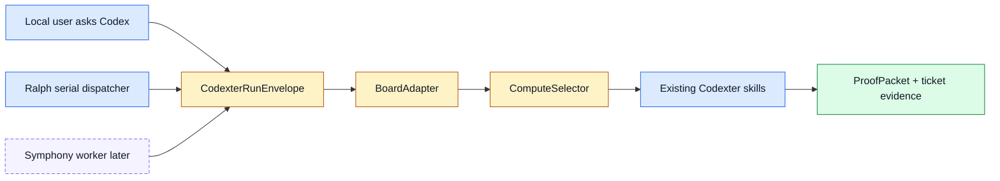

# TASK-0111: respec board and compute orchestration

## Summary
Write the next canonical Codexter system spec for board adapters, work items,
compute selection, local invocation, future Symphony/Linear integration, and
Ralph's local role. This is the place to preserve the architecture we converged
on in discussion so future agents do not have to reconstruct it from chat.

## Scope
- In:
  - New `docs/specs/board-compute-orchestration.md` or equivalent canonical
    spec name.
  - Clear split between local Codexter mode, local filesystem tickets, future
    Linear/shared-board mode, and future Symphony-runner mode.
  - Domain model for `BoardAdapter`, `WorkItem`, `ComputeTarget`,
    `ComputeDecision`, `CodexterRunEnvelope`, `ProofPacket`, and run outcomes.
  - Local state machine for explicit user-triggered execution.
  - Future state machine for board-driven or Symphony-driven execution.
  - Config model for `WORKFLOW.md` and ticket-level `compute_target`.
  - Failure/recovery rules and proof requirements.
  - Follow-up ticket map that points to `TASK-0112` through `TASK-0116`.
- Out:
  - No implementation beyond docs/spec navigation.
  - No new dispatcher, leases, Linear adapter, Notion adapter, or cloud runner.
  - No rewrite of all existing PRD/spec docs.

## Plan
- `Change:` Consolidate the Symphony discussion and Codexter invocation slice
  into one canonical orchestration spec.
- `Why:` We now know the intended direction, but the reasoning is split across
  chat, research memos, scout artifacts, `TASK-0107`, `WORKFLOW.md`, and the
  Symphony-compatible invocation spec.
- `Before -> After:`
  - Before: local tickets, Ralph, invocation contract, compute ideas, and
    Symphony boundaries are understandable but scattered.
  - After: one spec explains which component owns what, what stays local, what
    Symphony can own later, and which follow-up tickets implement each piece.
- `Touch:`
  - `docs/specs/board-compute-orchestration.md`
  - `docs/specs/README.md`
  - `docs/specs/harness-techniques.md`
  - `docs/prd.md` only if a short pointer is needed, not a full rewrite
  - `README.md`
  - `ARCHITECTURE.md`
  - `docs/HISTORY.md`
- `Inspect:`
  - `docs/specs/symphony-compatible-codexter-runner.md`
  - `WORKFLOW.md`
  - `skills/codexter-invocation/SKILL.md`
  - `docs/research/web-research/2026-05-04_symphony-codexter-benchmark.md`
  - `docs/research/web-research/2026-05-05_symphony-dagster-codexter-integration.md`
  - `experiments/harness-scout/runs/2026-05-05-symphony-compatible-codexter/`
  - `skills/ralph/SKILL.md`
  - `skills/ralph/scripts/select_next_ticket.py`
  - `docs/specs/runtime-surface.md`
  - `docs/specs/spec-first-execution-loop.md`
- `Signature delta:`
  - `docs/specs/board-compute-orchestration.md / BoardAdapter`
  - `docs/specs/board-compute-orchestration.md / ComputeSelector`
  - `docs/specs/board-compute-orchestration.md / OrchestrationMode`
  - `docs/specs/board-compute-orchestration.md / FailureModel`
- `Type Sketch:`
  - `OrchestrationMode`: `local_conversational | local_ralph | symphony_worker |
    shared_board_adapter`.
  - `BoardAdapter`: `kind`, `listCandidates`, `readWorkItem`,
    `writeEvidence`, `transitionState`, `normalize`.
  - `ComputeTarget`: `local_shared | local_worktree | symphony | codex_cloud`.
  - `AdmissionResult`: `allowed`, `target`, `reason`, `blockers`,
    `required_human_gate`, `proof_path`.
  - `RunOutcome`: `pass | revise | block | failed`, plus proof packet.
- `Typed flow example:`
  1. User says "run TASK-0110 locally."
  2. Local Codex constructs a `CodexterRunEnvelope`.
  3. Filesystem `BoardAdapter` reads `tickets/TASK-0110/ticket.md`.
  4. `ComputeSelector` chooses `local_shared` because no override exists.
  5. Phase route points to `impl-plan` because the ticket is in planning.
  6. Codex runs the existing skill and writes ticket evidence plus proof.
  7. A future Symphony worker could perform steps 2-6 after owning polling and
     workspace setup itself.
- `Execution steps:`
  1. Draft the spec with a Symphony-style structure: goals, non-goals, domain
     model, configuration, state machines, failure model, observability, tests,
     and implementation checklist.
  2. Make explicit that Codexter owns task quality and proof while Symphony can
     own background scheduling later.
  3. Add diagrams for local conversational mode, local Ralph mode, and future
     Symphony mode.
  4. Add a follow-up-ticket matrix and mark which tickets already exist.
  5. Update docs indexes and public navigation.
  6. Run doc parity, harness invariants, ticket metadata, and review.
- `Recommendation:` Write the spec before adding more runtime code. This keeps
  future adapter work from scattering across skills and helpers.
- `Options considered:`
  - Continue with only `symphony-compatible-codexter-runner.md`: too narrow now
    that BoardAdapter and compute policy are broader than Symphony.
  - Rewrite `docs/prd.md`: wrong layer; PRD should stay user-story level.
  - Add a dedicated system spec: recommended because this is architecture,
    ownership, and conformance policy.
- `Blast radius:` specs index, README/ARCHITECTURE, future board adapter
  tickets, Ralph, invocation contract, and source/feature registry references.
- `Risks:`
  - Creating another doc that agents ignore. Containment: link it from
    `README.md`, `ARCHITECTURE.md`, and the follow-up tickets.
  - Re-litigating OpenClaw/Notion scope. Containment: explicitly say Codexter
    focuses on coding tickets; OpenClaw can call Codexter but is not the core
    service.

## Gap Analysis
- `Current state:` `TASK-0107` implemented the first invocation slice, but the
  larger board/compute direction still lives across research, scout artifacts,
  and conversation.
- `Production expectation:` A system with local and external runners needs one
  authoritative spec for ownership, data contracts, state transitions,
  failures, security boundaries, tests, and follow-up implementation order.
- `Missing gaps:`
  - No canonical BoardAdapter contract.
  - No canonical orchestration-mode map.
  - No end-to-end state machine across local, Ralph, and Symphony modes.
  - No conformance checklist for future board/compute tickets.
  - No single spec that says what PRD vs spec vs ticket owns.
- `Comparable implementations:` Symphony Service Specification draft v1,
  Codexter invocation contract, runtime-surface spec, Ralph skill, feature
  registry.
- `Recommendation:` Produce the spec first and use it to control `TASK-0112`
  through `TASK-0116`.

## Diagram

## Acceptance Criteria
- [ ] New board/compute orchestration spec exists and is linked from specs
  index, README, and ARCHITECTURE.
- [ ] Spec defines local conversational mode, local Ralph mode, and future
  Symphony/shared-board mode without mixing responsibilities.
- [ ] Spec defines BoardAdapter, WorkItem, ComputeSelector, envelope, proof, and
  failure contracts.
- [ ] Spec includes a Symphony-style test/conformance checklist.
- [ ] Spec includes a follow-up-ticket matrix for `TASK-0112` through
  `TASK-0116`.
- [ ] PRD remains user-story oriented; detailed state machines and testing live
  in the spec.

## Verification
- `Tests:`
  - `python3 tickets/scripts/check_ticket_metadata.py`
  - `python3 bin/check_doc_parity.py`
  - `python3 bin/check_harness_invariants.py`
- `Manual checks:`
  - Confirm a future agent can answer "who owns polling?" and "who owns proof?"
    from the spec alone.
  - Confirm every future implementation ticket points to the spec.
- `Evidence required:`
  - Review artifact with `spec-contract` and `implementation-plan` rubrics.

## Agent Contract
- `Open:` no UI.
- `Test hook:` doc parity, harness invariants, and metadata checks.
- `Stabilize:` use the existing spec style and diagram conventions.
- `Inspect:` specs index, README, ARCHITECTURE, `WORKFLOW.md`, invocation skill.
- `Key screens/states:` none.
- `QA cookbook:` none needed.
- `Taste refs:` none.
- `Expected artifacts:` review JSON and command output.
- `Delegate with:` this ticket and `docs/specs/symphony-compatible-codexter-runner.md`.

## Autonomy Readiness
- `Human inputs/assets:` This ticket needs approval of the spec boundary.
- `Credentials / external access:` None.
- `Compute/runtime needs:` local docs only.
- `Tooling gaps:` none.
- `QA risks:` spec drift or doc bloat. Keep it authoritative, not encyclopedic.
- `Human gates:` approve before implementation.
- `Agent decision boundaries:` may choose final spec filename; may not implement
  adapters or dispatchers.

## Evidence Checklist
- [ ] Spec review artifact.
- [ ] Doc parity output.
- [ ] Harness invariant output.

## Refs
- `docs/specs/symphony-compatible-codexter-runner.md`
- `docs/research/web-research/2026-05-04_symphony-codexter-benchmark.md`
- `docs/research/web-research/2026-05-05_symphony-dagster-codexter-integration.md`
- `WORKFLOW.md`
- `skills/codexter-invocation/SKILL.md`

## Evidence
- `Artifacts:`
  - [future-ticket-batch-review.json](/Users/kenjipcx/coding-harness/Codexter/tickets/TASK-0111/artifacts/review/2026-05-05-ticket-batch-review.json)
  - [impl-review.json](/Users/kenjipcx/coding-harness/Codexter/tickets/TASK-0111/artifacts/review/2026-05-05-impl-review.json)
- `Commands:`
  - `python3 docs/sources/validate_sources.py`
    - `source registry contract OK (7 records)`
  - feature registry validation snippet from `docs/features/README.md`
    - `feature registry contract OK (15 records)`
  - `python3 bin/check_doc_parity.py`
    - `structural doc parity OK (6 files checked, 29 rules)`
  - `python3 bin/check_harness_invariants.py`
    - `harness invariants OK (5 files checked, 15 agents, 13 rules)`
- `Result summary:`
  - Added [board-compute-orchestration.md](/Users/kenjipcx/coding-harness/Codexter/docs/specs/board-compute-orchestration.md) as the canonical ownership spec for `BoardAdapter`, `WorkItem`, `ComputeSelector`, `CodexterRunEnvelope`, `ProofPacket`, local conversational mode, serial Ralph, shared-board mode, and future Symphony worker mode.
  - Linked the spec from docs index, README, ARCHITECTURE, harness techniques,
    feature registry, and source registry.
  - Preserved the core boundary: Symphony launches normal Codex; the workspace
    has Codexter installed; prompt/file includes a run envelope; Codexter routes
    existing skills and writes ProofPacket.

## Blockers
- none
