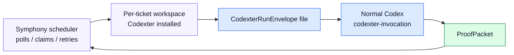

# TASK-0112: add Symphony integration shim

## Summary
Make the handoff from Symphony to Codexter concrete without building a Symphony
clone. The shim should document and test what Symphony must provide when it
launches normal Codex with Codexter installed, and what Codexter returns through
`ProofPacket`.

## Scope
- In:
  - A Symphony integration reference under `skills/codexter-invocation/` or
    `docs/specs/`.
  - A file-based `CodexterRunEnvelope` example designed for Symphony workers.
  - A smoke command proving the same envelope can be prepared locally from a
    file path.
  - Documentation of Symphony responsibilities: polling, claiming, retrying,
    workspace setup, app-server lifecycle, tracker writeback, and remote logs.
  - Documentation of Codexter responsibilities: route to existing skills, write
    ticket evidence, write proof, honor compute admission, and preserve local
    completion gates.
- Out:
  - No Elixir code.
  - No Symphony app-server client.
  - No Linear API integration.
  - No remote worker launch.
  - No retries, scheduler, or workspace cleanup inside Codexter.

## Plan
- `Change:` Add a thin integration contract and examples so a Symphony worker
  can call Codexter-equipped Codex later.
- `Why:` The first slice made Codexter invocable. This ticket makes the external
  caller contract explicit enough that future Symphony work does not guess.
- `Before -> After:`
  - Before: `CodexterRunEnvelope` exists, but Symphony-specific expectations are
    mostly prose in the system design.
  - After: a Symphony-specific template and smoke proof show how a worker passes
    the envelope and reads proof without Codexter taking over scheduling.
- `Touch:`
  - `skills/codexter-invocation/templates/symphony-run-envelope.json`
  - `skills/codexter-invocation/references/symphony.md`
  - `skills/codexter-invocation/README.md`
  - `docs/specs/board-compute-orchestration.md`
  - `docs/specs/symphony-compatible-codexter-runner.md`
  - `bin/test_codexter_invocation.py`
  - `docs/HISTORY.md`
- `Inspect:`
  - `WORKFLOW.md`
  - `bin/codexter_invocation.py`
  - `skills/codexter-invocation/SKILL.md`
  - `tickets/TASK-0107/artifacts/qa/prepare-planning.json`
  - `tickets/TASK-0107/artifacts/qa/sample-proof-packet.json`
  - Symphony Service Specification draft v1 from the research memo.
- `Signature delta:`
  - `templates/symphony-run-envelope.json`
  - `references/symphony.md / responsibilities table`
  - `bin/test_codexter_invocation.py / file envelope smoke`
- `Type Sketch:`
  - `SymphonyEnvelope`: same as `CodexterRunEnvelope`, with
    `mode: "symphony_worker"`, a workspace-local `workItemPath` or tracker
    normalized `workItemId`, and a writable `.harness/results/*.proof.json`.
  - `ResponsibilityRow`: `concern`, `owned_by`, `codexter_expectation`,
    `failure_behavior`.
- `Typed flow example:`
  1. Symphony claims `LIN-123`.
  2. Symphony prepares a workspace and installs Codexter.
  3. Symphony writes `.harness/requests/lin-123.json`.
  4. It launches Codex and asks it to use `codexter-invocation` with that file.
  5. Codexter routes the work to `impl` or `impl-plan`.
  6. Codexter writes `.harness/results/lin-123.proof.json`.
  7. Symphony reads the proof and decides whether to comment, transition, retry,
     or hand off.
- `Execution steps:`
  1. Add Symphony-specific envelope template.
  2. Add reference doc with responsibility split and failure mapping.
  3. Add a file-envelope test or smoke fixture proving the existing helper
     accepts the Symphony-shaped envelope.
  4. Update invocation skill README to point future external callers to the
     Symphony reference.
  5. Run invocation tests, metadata, docs checks, JSON validation, and review.
- `Recommendation:` Keep this as docs plus smoke tests. Do not call Symphony or
  depend on Symphony being installed.
- `Options considered:`
  - Pure prose note: too easy to drift.
  - Template plus smoke test: recommended; enough contract to integrate later.
  - Full adapter/client: premature and outside Codexter's local-first boundary.
- `Blast radius:` invocation skill, helper tests, Symphony spec, future Linear
  adapter work.
- `Risks:`
  - Accidentally implying Symphony is already supported. Containment: state
    clearly that this is a shim/template, not a live backend.
  - Drifting from real Symphony protocol. Containment: treat Symphony's own
    Codex launch/app-server contract as source of truth.

## Gap Analysis
- `Current state:` `CodexterRunEnvelope` and `ProofPacket` work locally, but the
  Symphony caller shape is not packaged as a reusable template.
- `Production expectation:` External callers need example inputs, outputs,
  ownership tables, failure semantics, and proof paths they can validate without
  reading chat or internal tickets.
- `Missing gaps:`
  - No `mode: "symphony_worker"` example.
  - No Symphony-specific responsibility table.
  - No file-envelope smoke artifact for external callers.
  - No explicit unsupported-runtime warning for real Symphony launch.
- `Comparable implementations:` Symphony spec sections on workflow, workspace,
  agent runner, retry/reconciliation, and observability.
- `Recommendation:` Add the shim after `TASK-0111` pins the broader contract.

## Diagram

## Acceptance Criteria
- [x] Symphony-specific envelope template exists and validates through the
  current helper.
- [x] Reference doc says exactly what Symphony owns and what Codexter owns.
- [x] File-envelope smoke test or command proves local preparation works.
- [x] Docs make clear that no live Symphony backend is implemented yet.
- [x] Proof output shape is linked from the shim docs.

## Verification
- `Tests:`
  - `python3 -m unittest bin/test_codexter_invocation.py`
  - JSON validation of the Symphony envelope template.
- `Manual checks:`
  - Read the responsibility table and confirm polling/retries/workspace cleanup
    are not assigned to Codexter.
  - Confirm the template points proof under `.harness/results/`.
- `Evidence required:`
  - Smoke output artifact and review JSON.

## Agent Contract
- `Open:` no UI.
- `Test hook:` invocation helper prepare command with the Symphony template.
- `Stabilize:` use a fixture ticket, not live Linear/Symphony credentials.
- `Inspect:` template JSON, reference doc, helper output.
- `Key screens/states:` none.
- `QA cookbook:` none needed.
- `Taste refs:` none.
- `Expected artifacts:` helper output JSON and review artifact.
- `Delegate with:` this ticket and `skills/codexter-invocation/SKILL.md`.

## Autonomy Readiness
- `Human inputs/assets:` approval after `TASK-0111`.
- `Credentials / external access:` none; do not call Linear/Symphony.
- `Compute/runtime needs:` local Python only.
- `Tooling gaps:` none for template/smoke. Real Symphony runner is explicitly
  future.
- `QA risks:` docs could overclaim support. Review must check wording.
- `Human gates:` approval before implementation.
- `Agent decision boundaries:` may add examples and tests; may not add a live
  external backend.

## Evidence Checklist
- [x] Symphony envelope JSON validates.
- [x] Helper prepare output linked.
- [x] Review JSON linked.

## Refs
- `docs/specs/symphony-compatible-codexter-runner.md`
- `skills/codexter-invocation/SKILL.md`
- `bin/codexter_invocation.py`
- `tickets/TASK-0107/ticket.md`

## Evidence
- `Artifacts:`
  - [future-ticket-batch-review.json](/Users/kenjipcx/coding-harness/Codexter/tickets/TASK-0111/artifacts/review/2026-05-05-ticket-batch-review.json)
  - [symphony-template-prepare.json](/Users/kenjipcx/coding-harness/Codexter/tickets/TASK-0112/artifacts/smoke/symphony-template-prepare.json)
  - [impl-review.json](/Users/kenjipcx/coding-harness/Codexter/tickets/TASK-0112/artifacts/review/2026-05-05-impl-review.json)
- `Commands:`
  - `python3 -m unittest bin/test_codexter_invocation.py`
  - `python3 -m json.tool skills/codexter-invocation/templates/symphony-run-envelope.json`
  - `python3 bin/codexter_invocation.py prepare --envelope skills/codexter-invocation/templates/symphony-run-envelope.json`
  - `python3 -m py_compile bin/codexter_invocation.py bin/test_codexter_invocation.py`
  - `python3 docs/sources/validate_sources.py`
  - `python3 - <<'PY' ... feature registry status-aware validation ... PY`
  - `python3 tickets/scripts/check_ticket_metadata.py`
  - `python3 bin/check_doc_parity.py`
  - `python3 bin/check_harness_invariants.py`
  - `python3 -m unittest discover -s bin -p 'test_*.py'`
- `Result summary:`
  - Added a Symphony-shaped run-envelope template using
    `mode: "symphony_worker"` and `computeTarget: "local_shared"`.
  - Added a Symphony reference with responsibility split, worker flow, prompt
    shape, and smoke expectations.
  - Added a file-envelope invocation test and smoke output artifact.
  - Review passed against solo local operator, future Symphony integration,
    team/shared-board, and maintainer user stories.

## Blockers
- none
