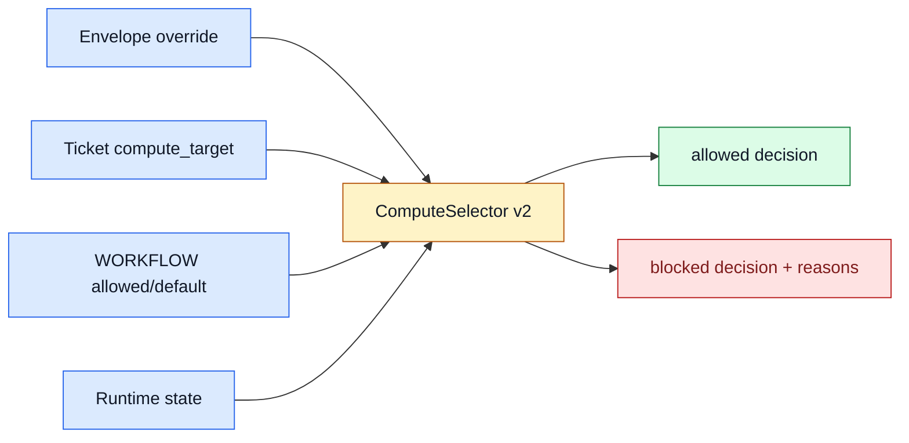

# TASK-0114: implement compute selector v2

## Summary
Turn `compute_target` from a validated string into a real admission policy for
where a ticket runs. The first production-grade selector should support
`local_shared` and `local_worktree`, explicitly block `symphony` and
`codex_cloud` until adapters exist, and produce clear reasons that a human,
Ralph, or future external runner can inspect.

## Scope
- In:
  - Compute policy model from `WORKFLOW.md`.
  - Ticket-level `compute_target` override.
  - Envelope-level compute override.
  - Capability/admission matrix for `local_shared`, `local_worktree`,
    `symphony`, and `codex_cloud`.
  - Runtime hints for `local_worktree`, likely integrating with `pr-runtime` or
    ticket runtime records.
  - Explicit blockers for approval-required, blocked, dependency-unmet,
    disallowed, unsupported, or missing-runtime cases.
  - Tests for precedence, blocking, and future targets.
- Out:
  - No actual cloud execution.
  - No real Symphony worker launch.
  - No automatic worktree creation unless the ticket explicitly chooses to wire
    existing `pr-runtime` helpers and tests prove it.
  - No merge queue or parallel dispatch.

## Plan
- `Change:` Replace string-only compute selection with a typed policy and
  explicit admission decisions.
- `Why:` The central user requirement is choosing where each ticket runs. The
  current helper chooses local compute but does not yet model capability,
  isolation level, human gates, or future remote targets deeply enough.
- `Before -> After:`
  - Before: `compute_target` can be validated and blocked, but the policy is
    minimal.
  - After: compute selection is inspectable, testable, and ready for local
    shared/worktree decisions while future targets remain blocked with precise
    reasons.
- `Touch:`
  - `docs/specs/board-compute-orchestration.md`
  - `WORKFLOW.md`
  - `bin/codexter_invocation.py` or new compute module
  - `bin/test_codexter_invocation.py` or new compute tests
  - `skills/codexter-invocation/SKILL.md`
  - `skills/pr-runtime/SKILL.md`
  - `bin/ticket_runtime.py`
  - `tickets/README.md`
  - `docs/HISTORY.md`
- `Inspect:`
  - `TASK-0081` selective branch runtime planning.
  - `skills/pr-runtime/SKILL.md`
  - `bin/ticket_runtime.py`
  - `.harness/state/tickets` runtime record conventions.
  - `WORKFLOW.md` compute section.
  - `tickets/scripts/check_ticket_metadata.py`.
- `Signature delta:`
  - `select_compute(item, envelope, policy, runtime_state): ComputeDecision`
  - `ComputeDecision.target`
  - `ComputeDecision.allowed`
  - `ComputeDecision.blockers`
  - `ComputeDecision.runtime_record_path`
  - `ComputeDecision.required_setup`
- `Type Sketch:`
  - `ComputeCapability`: `requires_worktree`, `requires_network`,
    `requires_external_runner`, `supports_local_tools`, `implemented`.
  - `ComputeDecision`: `target`, `allowed`, `reason`, `blockers`,
    `runtime_record_path`, `required_setup`, `handoff`.
  - `Blocker`: `approval_required | dependency_unmet | unsupported_target |
    disallowed_by_workflow | missing_worktree_runtime | blocked_ticket`.
- `Typed flow example:`
  1. Ticket has `compute_target: local_worktree`.
  2. Envelope does not override compute.
  3. Workflow allows `local_worktree`.
  4. Selector checks ticket status and blockers.
  5. Selector returns `allowed=true`, `target=local_worktree`, and
     `runtime_record_path=.harness/state/tickets/TASK-XXXX.runtime.json`.
  6. If no runtime exists, the decision includes `required_setup:
     pr-runtime up` rather than silently falling back to shared checkout.
- `Execution steps:`
  1. Read `TASK-0111` and `TASK-0113`.
  2. Define compute capability matrix in docs and code.
  3. Implement selector precedence: envelope override, ticket override,
     workflow default.
  4. Add admission blockers for workflow disallow, unsupported future target,
     approval/build gating, blockers, dependencies, and local runtime needs.
  5. Wire local_worktree hints to existing runtime record paths without
     creating worktrees unless explicitly in scope.
  6. Add tests and smoke artifacts.
  7. Update docs and review.
- `Recommendation:` Make this an admission-policy ticket, not a runner ticket.
  It should answer "can/where should this run?" but not execute the run.
- `Options considered:`
  - Keep current minimal string selector: too thin for future local/cloud split.
  - Admission policy only: recommended.
  - Admission plus runtime launch: too much scope and overlaps `pr-runtime`.
- `Blast radius:` invocation helper, ticket metadata docs, pr-runtime, Ralph
  future parallel mode, Symphony shim.
- `Risks:`
  - Selector starts doing runtime orchestration. Containment: output required
    setup as hints; leave launch to phase skills or runtime helpers.
  - Future targets look available. Containment: explicit unsupported blockers.

## Gap Analysis
- `Current state:` `TASK-0107` selects local compute and blocks unsupported
  future targets, but capability and runtime setup are shallow.
- `Production expectation:` A multi-compute ticketing system needs a policy that
  explains why a ticket can or cannot run on each target and what setup is
  required before dispatch.
- `Missing gaps:`
  - No capability matrix.
  - No structured blocker taxonomy.
  - No first-class local_worktree runtime requirement.
  - No dependency/approval admission model beyond simple blockers.
  - No visible handoff for future cloud/Symphony targets.
- `Comparable implementations:` Symphony worker/SSH extension, Codexter
  pr-runtime, `TASK-0081`, current invocation helper.
- `Recommendation:` Implement compute selector v2 after BoardAdapter v1.

## Diagram

## Acceptance Criteria
- [x] Compute selector precedence is documented and tested.
- [x] `local_shared` and `local_worktree` decisions produce clear runtime
  expectations.
- [x] `symphony` and `codex_cloud` remain blocked with explicit future-adapter
  reasons.
- [x] Approval, blocker, dependency, workflow-disallow, and unsupported-target
  blockers are represented in tests.
- [x] Existing invocation prepare output remains parseable.

## Verification
- `Tests:`
  - compute selector unit tests.
  - invocation helper tests.
  - ticket metadata validator.
- `Manual checks:`
  - Try envelope override, ticket override, and workflow default examples.
  - Confirm no target silently falls back to a different compute target.
- `Evidence required:`
  - JSON prepare artifacts for allowed shared, allowed/deferred worktree, and
    blocked Symphony/cloud.
  - Review artifact.

## Agent Contract
- `Open:` no UI.
- `Test hook:` unit tests plus prepare command examples.
- `Stabilize:` use fixture tickets with explicit metadata.
- `Inspect:` JSON output blockers and runtime hints.
- `Key screens/states:` none.
- `QA cookbook:` none needed.
- `Taste refs:` none.
- `Expected artifacts:` prepare JSON outputs and review JSON.
- `Delegate with:` this ticket, `TASK-0111`, `TASK-0113`, and `TASK-0081`.

## Autonomy Readiness
- `Human inputs/assets:` approval of compute policy.
- `Credentials / external access:` none.
- `Compute/runtime needs:` local Python; optional existing pr-runtime records.
- `Tooling gaps:` may need small module extraction.
- `QA risks:` accidental execution or silent fallback. Tests must assert neither
  happens.
- `Human gates:` approval before implementation.
- `Agent decision boundaries:` may output runtime setup hints; may not launch
  worktrees/cloud/Symphony.

## Evidence Checklist
- [x] Allowed local_shared JSON.
- [x] local_worktree JSON with runtime hint.
- [x] Blocked Symphony/cloud JSON.
- [x] Review JSON linked.

## Refs
- `WORKFLOW.md`
- `bin/codexter_invocation.py`
- `skills/pr-runtime/SKILL.md`
- `bin/ticket_runtime.py`
- `tickets/TASK-0081/ticket.md`

## Evidence
- `Artifacts:`
  - [future-ticket-batch-review.json](/Users/kenjipcx/coding-harness/Codexter/tickets/TASK-0111/artifacts/review/2026-05-05-ticket-batch-review.json)
  - [allowed-local-shared.json](/Users/kenjipcx/coding-harness/Codexter/tickets/TASK-0114/artifacts/compute/allowed-local-shared.json)
  - [deferred-local-worktree.json](/Users/kenjipcx/coding-harness/Codexter/tickets/TASK-0114/artifacts/compute/deferred-local-worktree.json)
  - [blocked-symphony.json](/Users/kenjipcx/coding-harness/Codexter/tickets/TASK-0114/artifacts/compute/blocked-symphony.json)
  - [blocked-codex-cloud.json](/Users/kenjipcx/coding-harness/Codexter/tickets/TASK-0114/artifacts/compute/blocked-codex-cloud.json)
  - [impl-review.json](/Users/kenjipcx/coding-harness/Codexter/tickets/TASK-0114/artifacts/review/2026-05-05-impl-review.json)
- `Commands:`
  - `python3 -m unittest bin/test_codexter_compute.py bin/test_codexter_invocation.py bin/test_codexter_boards.py`
  - `python3 -m py_compile bin/codexter_compute.py bin/test_codexter_compute.py bin/codexter_invocation.py`
  - `python3 bin/codexter_invocation.py prepare --ticket TASK-0114 --phase planning --proof tickets/TASK-0114/artifacts/compute/local-shared.proof.json`
  - `python3 bin/codexter_invocation.py prepare --ticket TASK-0114 --phase planning --compute local_worktree --proof tickets/TASK-0114/artifacts/compute/local-worktree.proof.json`
  - `python3 bin/codexter_invocation.py prepare --ticket TASK-0114 --phase planning --compute symphony --proof tickets/TASK-0114/artifacts/compute/symphony.proof.json`
  - `python3 bin/codexter_invocation.py prepare --ticket TASK-0114 --phase planning --compute codex_cloud --proof tickets/TASK-0114/artifacts/compute/codex-cloud.proof.json`
  - `python3 docs/sources/validate_sources.py`
  - `python3 - <<'PY' ... feature registry status-aware validation ... PY`
  - `python3 tickets/scripts/check_ticket_metadata.py`
  - `python3 bin/check_doc_parity.py`
  - `python3 bin/check_harness_invariants.py`
  - `python3 -m unittest discover -s bin -p 'test_*.py'`
- `Result summary:`
  - Added `bin/codexter_compute.py` with a capability matrix and structured
    `ComputeDecision` containing `blockerCodes`, `runtimeHints`,
    `requiredSetup`, `handoff`, and `capability`.
  - Kept compute selection admission-only: no Codex launch, no worktree launch,
    no polling, no retries, and no remote scheduler behavior.
  - Proved precedence and blockers for envelope override, ticket override,
    workflow default, local worktree runtime records, future targets, approval,
    blocked tickets, and unresolved dependencies.
  - Review passed against solo local operator, future Symphony integration,
    future adapter author, and maintainer user stories.

## Blockers
- none
