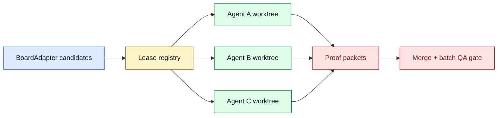

# TASK-0115: design parallel Ralph leases and merge policy

## Summary
Design the future N-agent Ralph mode without implementing it prematurely.
Serial Ralph is intentionally safe today. Parallel Ralph needs leases, worktree
or branch isolation, merge rules, batch QA, and failure handling before it can
pick multiple ready tickets without making the repo chaotic.

## Scope
- In:
  - A design/spec for parallel Ralph over `BoardAdapter`.
  - Lease/claim model for local filesystem tickets.
  - Worktree/local runtime policy for concurrent writers.
  - Merge/integration policy after multiple agents finish.
  - Batch QA and review policy for multiple completed tickets.
  - Stop conditions and human gates.
  - A future implementation ticket breakdown.
- Out:
  - No live parallel dispatcher implementation in this ticket.
  - No hidden worker farm.
  - No automatic branch merges.
  - No cloud runner.
  - No external board adapter.

## Plan
- `Change:` Produce the design needed before turning Ralph from a serial
  dispatcher into a safe parallel dispatcher.
- `Why:` The user wants a mode like "call Ralph on this board and spawn N
  agents," but current project memory explicitly defers parallel autonomy until
  leases, worktrees, merge policy, and batch QA are designed.
- `Before -> After:`
  - Before: `$ralph` drains one eligible filesystem ticket at a time.
  - After: the repo has an approved design for how parallel Ralph would claim,
    isolate, run, review, integrate, and stop safely.
- `Touch:`
  - `docs/specs/board-compute-orchestration.md`
  - `docs/specs/spec-first-execution-loop.md`
  - `docs/specs/orchestrator-subagent-loop.md`
  - `docs/specs/runtime-surface.md`
  - `skills/ralph/SKILL.md`
  - `skills/ralph/references/parallel-ralph.md` or similar
  - `tickets/README.md`
  - `docs/HISTORY.md`
- `Inspect:`
  - `MEM-0074`
  - `skills/ralph/SKILL.md`
  - `skills/ralph/scripts/select_next_ticket.py`
  - `skills/pr-runtime/SKILL.md`
  - `bin/ticket_runtime.py`
  - `tickets/TASK-0081/ticket.md`
  - Symphony spec scheduling/retry/concurrency sections.
- `Signature delta:`
  - `LeaseRecord`: `ticket_id`, `holder`, `compute_target`, `checkout`,
    `started_at`, `expires_at`, `state`, `proof_path`.
  - `ParallelBatch`: `batch_id`, `tickets`, `max_parallel`, `merge_policy`,
    `qa_policy`.
  - `MergePolicy`: `serial_integrate | independent_prs | manual_review`.
- `Type Sketch:`
  - `ClaimState`: `unclaimed | leased | running | proof_ready | integrating |
    released | failed`.
  - `StopReason`: `no_ready_tickets | human_gate | conflict | qa_failed |
    lease_stale | batch_limit`.
  - `BatchQaRing`: `cheap_per_ticket | risky_ticket_targeted |
    release_batch`.
- `Typed flow example:`
  1. Operator asks: "Ralph, run 3 ready low-risk tickets."
  2. Ralph lists candidates through `BoardAdapter`.
  3. Ralph leases 3 tickets with non-overlapping write scopes.
  4. Each ticket gets `local_worktree` or an approved compute target.
  5. Each agent writes `ProofPacket`.
  6. Ralph pauses before integration if diffs overlap or QA ring fails.
  7. A final batch review decides which tickets can close.
- `Execution steps:`
  1. Read dependencies and current Ralph/PR runtime docs.
  2. Define lease schema and storage location.
  3. Define candidate filtering and write-scope conflict rules.
  4. Define compute selection and worktree requirements.
  5. Define batch QA/review gates.
  6. Define stale lease recovery and human stop conditions.
  7. Split implementation into later tickets.
  8. Run review against spec-contract and integration-readiness.
- `Recommendation:` Keep this as a design ticket until BoardAdapter and compute
  selector are real. Parallelism without those foundations is exactly where
  hidden state and merge pain start.
- `Options considered:`
  - Implement parallel Ralph now: too risky; missing leases and merge policy.
  - Keep serial forever: safe but leaves clear user value on the table.
  - Design first, implement later: recommended.
- `Blast radius:` Ralph, tickets, runtime state, pr-runtime, QA/review,
  completion hooks, future external runners.
- `Risks:`
  - Overdesigning a scheduler clone. Containment: keep this local and visible;
    use Symphony for cloud/background scheduling later.
  - Underdesigning merge conflicts. Containment: require write-scope and
    integration policy before implementation.

## Gap Analysis
- `Current state:` Ralph is serial and intentionally avoids leases, worktrees,
  merge queues, and batch QA.
- `Production expectation:` Parallel autonomous coding needs exclusive claims,
  isolated workspaces, conflict detection, proof gates, merge/integration
  sequencing, stale-run recovery, and clear stop reasons.
- `Missing gaps:`
  - No lease schema.
  - No batch model.
  - No write-scope conflict policy.
  - No merge/integration policy.
  - No batch QA ring.
  - No stale lease recovery.
- `Comparable implementations:` Symphony concurrency/claim/retry model,
  Codexter serial Ralph, pr-runtime, Stop-hook completion gates.
- `Recommendation:` Design now; implement only after the foundation tickets
  make it safe.

## Diagram

## Acceptance Criteria
- [x] Parallel Ralph design doc exists and is linked from Ralph skill docs.
- [x] Lease schema and lifecycle are specified.
- [x] Candidate selection, max concurrency, write-scope conflict rules, and
  stop reasons are specified.
- [x] Worktree/compute requirements are specified.
- [x] Merge policy and batch QA rings are specified.
- [x] Implementation is split into follow-up tickets rather than hidden in the
  design ticket.

## Verification
- `Tests:`
  - docs checks only for this design ticket.
- `Manual checks:`
  - Confirm a future builder could implement lease acquisition from the spec.
  - Confirm the design stops safely on conflicts and human gates.
- `Evidence required:`
  - Review artifact with spec-contract and integration-readiness.

## Agent Contract
- `Open:` no UI.
- `Test hook:` doc parity, metadata, harness invariants.
- `Stabilize:` do not mutate live Ralph runtime.
- `Inspect:` lease lifecycle examples and diagrams.
- `Key screens/states:` none.
- `QA cookbook:` none needed.
- `Taste refs:` none.
- `Expected artifacts:` design review JSON.
- `Delegate with:` this ticket plus `MEM-0074`, Ralph skill, and pr-runtime docs.

## Autonomy Readiness
- `Human inputs/assets:` approval after dependencies.
- `Credentials / external access:` none.
- `Compute/runtime needs:` none for design.
- `Tooling gaps:` all runtime implementation is future.
- `QA risks:` accidentally implying parallel mode exists. Wording must be
  clearly design-only.
- `Human gates:` approval before implementation.
- `Agent decision boundaries:` may write design and follow-up tickets; may not
  change Ralph execution behavior.

## Evidence Checklist
- [x] Design review artifact.
- [x] Follow-up ticket map.

## Refs
- `skills/ralph/SKILL.md`
- `skills/ralph/scripts/select_next_ticket.py`
- `skills/pr-runtime/SKILL.md`
- `docs/specs/runtime-surface.md`
- `docs/MEMORY.md#MEM-0074`

## Evidence
- `Artifacts:`
  - [future-ticket-batch-review.json](/Users/kenjipcx/coding-harness/Codexter/tickets/TASK-0111/artifacts/review/2026-05-05-ticket-batch-review.json)
  - [parallel-ralph.md](/Users/kenjipcx/coding-harness/Codexter/skills/ralph/references/parallel-ralph.md)
  - [impl-review.json](/Users/kenjipcx/coding-harness/Codexter/tickets/TASK-0115/artifacts/review/2026-05-05-impl-review.json)
- `Commands:`
  - `python3 docs/sources/validate_sources.py`
  - `python3 - <<'PY' ... feature registry status-aware validation ... PY`
  - `python3 tickets/scripts/check_ticket_metadata.py`
  - `python3 bin/check_doc_parity.py`
  - `python3 bin/check_harness_invariants.py`
- `Result summary:`
  - Added `skills/ralph/references/parallel-ralph.md` with design-only
    lease, batch, write-scope, worktree, merge, stale recovery, batch QA, stop
    condition, and follow-up ticket contracts.
  - Linked the design from Ralph docs and the board-compute conformance matrix.
  - Updated the feature registry to mark Parallel Ralph as designed, not
    implemented.
  - Review passed against solo operator, future parallel builder, future
    external-runner integrator, and maintainer user stories.

## Blockers
- none
