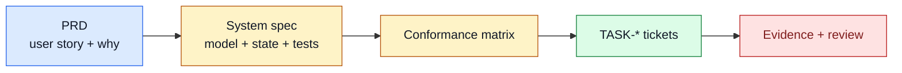

# TASK-0116: add Symphony-style spec template and conformance matrix

## Summary
Adopt the useful parts of Symphony's spec-writing discipline for Codexter
system specs without bloating the PRD or every ticket. Codexter PRDs should
stay user-story oriented; serious system specs should gain explicit domain
models, state machines, config schemas, failure models, observability, and test
matrices.

## Scope
- In:
  - A reusable spec authoring guide or template for complex Codexter systems.
  - Guidance on when to use PRD vs system spec vs ticket plan.
  - Required sections for service/runtime-like specs.
  - A conformance/test matrix template inspired by Symphony.
  - Updates to `deep-system-design`, `impl-plan`, or spec docs only where the
    guidance helps future agents write better specs.
  - Example application to the board/compute orchestration spec if that spec
    exists by implementation time.
- Out:
  - No rewrite of every old spec.
  - No requirement that small tickets use heavyweight spec sections.
  - No change to ticket template unless a small pointer is enough.
  - No implementation code.

## Plan
- `Change:` Add a spec-template/conformance-matrix layer for complex harness
  systems.
- `Why:` Symphony's spec is strong because it makes runtime behavior testable:
  entities, state, config, failure, recovery, and tests are explicit. Codexter
  has good PRD/ticket practice, but some specs are lighter on conformance and
  failure modeling.
- `Before -> After:`
  - Before: PRD captures user stories and tickets capture execution proof, but
    complex specs vary in how much they define state machines and tests.
  - After: complex specs have a repeatable contract while PRDs remain readable
    and tickets remain executable.
- `Touch:`
  - `docs/specs/spec-authoring-contract.md` or
    `docs/specs/spec-template.md`
  - `docs/specs/README.md`
  - `skills/deep-system-design/SKILL.md`
  - `skills/impl-plan/SKILL.md` only if a pointer is needed
  - `skills/spec-to-ticket/SKILL.md` only if ticket slicing should look for the
    conformance matrix
  - `docs/specs/harness-techniques.md`
  - `docs/HISTORY.md`
- `Inspect:`
  - Symphony Service Specification draft v1.
  - `docs/specs/harness-engineering-doctrine.md`
  - `docs/specs/harness-engineering-quickstart.md`
  - `docs/specs/runtime-surface.md`
  - `docs/specs/review-gates.md`
  - `docs/prd.md`
  - `skills/deep-system-design/SKILL.md`
  - `skills/spec-to-ticket/SKILL.md`
- `Signature delta:`
  - `SpecTemplate.sections`
  - `ConformanceMatrix.profile`
  - `SpecDepthDecision`
- `Type Sketch:`
  - `SpecDepth`: `light | system | service-runtime`.
  - `RequiredSections`: `goals`, `non_goals`, `domain_model`,
    `config_schema`, `state_machine`, `failure_model`, `observability`,
    `test_matrix`, `implementation_checklist`.
  - `ConformanceRow`: `area`, `requirement`, `profile`, `proof`, `ticket_ref`.
- `Typed flow example:`
  1. A future task asks for "distributed Codexter board orchestration."
  2. `deep-system-design` chooses `SpecDepth: service-runtime`.
  3. The resulting spec includes entity definitions, config schema, state
     machine, failure/recovery, observability, and conformance tests.
  4. `spec-to-ticket` slices the conformance matrix into implementation tickets.
  5. Tickets keep concrete proof and QA, not the entire spec.
- `Execution steps:`
  1. Extract the reusable spec sections Symphony did well.
  2. Map each section to Codexter's existing PRD/spec/ticket ownership model.
  3. Write the template/guide with examples.
  4. Add minimal pointers from relevant skills/docs.
  5. Add a conformance matrix example.
  6. Run doc parity, metadata, harness invariants, and review.
- `Recommendation:` Add a spec template and skill pointers. Do not force this
  into every PRD or ticket.
- `Options considered:`
  - Put all details in `docs/prd.md`: too heavy; PRD should preserve user
    stories and product intent.
  - Put all details in tickets: too late; tickets need execution proof, not
    whole-system reasoning.
  - Add a system-spec template: recommended for complex runtime/service work.
- `Blast radius:` deep-system-design, spec-to-ticket, impl-plan, specs index,
  future board/compute orchestration work.
- `Risks:`
  - Creating doc bureaucracy. Containment: use spec depth levels and only apply
    heavyweight sections to complex systems.
  - Duplicating ticket proof. Containment: spec defines test matrix; ticket owns
    concrete evidence artifacts.

## Gap Analysis
- `Current state:` Codexter has strong PRD/ticket workflows and some excellent
  specs, but no reusable conformance-matrix template for service/runtime specs.
- `Production expectation:` Runtime orchestration systems need explicit testable
  contracts for config, state, failures, recovery, observability, and
  implementation completeness.
- `Missing gaps:`
  - No spec depth decision.
  - No reusable state-machine/failure-model section template.
  - No conformance matrix template.
  - No clear PRD vs spec vs ticket ownership guidance for test detail.
- `Comparable implementations:` Symphony Service Specification, Codexter
  runtime-surface spec, review-gates spec, spec-to-ticket workflow.
- `Recommendation:` Adopt the spec discipline as a template, not as a root
  prompt rewrite.

## Diagram

## Acceptance Criteria
- [ ] Spec authoring guide/template exists and is linked from specs index.
- [ ] Guide defines when to use PRD, system spec, and ticket plan.
- [ ] Guide includes a Symphony-style conformance matrix template.
- [ ] Relevant skills/docs point to the guide without duplicating it.
- [ ] Heavyweight sections are explicitly optional for small/simple work.
- [ ] Review confirms the guide improves clarity without adding mandatory bloat.

## Verification
- `Tests:`
  - `python3 tickets/scripts/check_ticket_metadata.py`
  - `python3 bin/check_doc_parity.py`
  - `python3 bin/check_harness_invariants.py`
- `Manual checks:`
  - Apply the template mentally to board/compute orchestration and confirm it
    would catch config/state/failure/test gaps.
  - Confirm PRD remains lightweight.
- `Evidence required:`
  - Review artifact with spec-contract and debloatability/integration checks.

## Agent Contract
- `Open:` no UI.
- `Test hook:` doc parity and harness invariant checks.
- `Stabilize:` add pointers, not duplicated long instructions.
- `Inspect:` docs/specs index and skill references.
- `Key screens/states:` none.
- `QA cookbook:` none needed.
- `Taste refs:` none.
- `Expected artifacts:` review JSON.
- `Delegate with:` this ticket and the Symphony spec comparison memo.

## Autonomy Readiness
- `Human inputs/assets:` approval of spec-template direction.
- `Credentials / external access:` none.
- `Compute/runtime needs:` local docs only.
- `Tooling gaps:` none.
- `QA risks:` doc bloat and duplicated policy. Use review/debloatability.
- `Human gates:` approval before implementation.
- `Agent decision boundaries:` may add template and pointers; may not rewrite
  all specs or PRD.

## Evidence Checklist
- [ ] Template review artifact.
- [ ] Doc parity output.
- [ ] Harness invariant output.

## Refs
- `docs/specs/harness-engineering-doctrine.md`
- `docs/specs/runtime-surface.md`
- `docs/specs/review-gates.md`
- `skills/deep-system-design/SKILL.md`
- `skills/spec-to-ticket/SKILL.md`
- `docs/research/web-research/2026-05-04_symphony-codexter-benchmark.md`

## Evidence
- `Artifacts:`
  - [future-ticket-batch-review.json](/Users/kenjipcx/coding-harness/Codexter/tickets/TASK-0111/artifacts/review/2026-05-05-ticket-batch-review.json)
  - [impl-review.json](/Users/kenjipcx/coding-harness/Codexter/tickets/TASK-0116/artifacts/review/2026-05-05-impl-review.json)
- `Commands:`
  - `python3 docs/sources/validate_sources.py`
    - `source registry contract OK (7 records)`
  - feature registry validation snippet from `docs/features/README.md`
    - `feature registry contract OK (16 records)`
  - `python3 bin/check_doc_parity.py`
    - `structural doc parity OK (6 files checked, 29 rules)`
  - `python3 bin/check_harness_invariants.py`
    - `harness invariants OK (5 files checked, 15 agents, 13 rules)`
- `Result summary:`
  - Added [spec-authoring-contract.md](/Users/kenjipcx/coding-harness/Codexter/docs/specs/spec-authoring-contract.md) with PRD/spec/ticket ownership, `light | system | service-runtime` depth choices, reusable spec sections, conformance matrix template, and anti-bloat rules.
  - Added minimal pointers from `deep-system-design`, `spec-to-ticket`, and
    `impl-plan` so future agents use the contract without duplicating it.
  - Linked the contract from the specs index, harness techniques, feature
    registry, and Symphony source record.

## Blockers
- none
