# Codexter V2 Batch Impl Plan

Date: 2026-05-06T18:49:08Z
Tickets: `TASK-0121`, `TASK-0123`, `TASK-0122`
Planning skill: `impl-plan`
Status: approval-ready, not implemented

## Summary

Batch the three remaining V2 tickets into one coherent docs/tests/templates
build loop:

1. `TASK-0121` locks explicit invocation triggers.
2. `TASK-0123` adds board adapter conformance scaffolding.
3. `TASK-0122` adds external compute handoff recipes.

This is the right batch because all three tickets refine the same boundary:
Codexter is normal Codex plus installed Codexter contracts, skills, adapters,
compute admission, review, and proof. It does not become Symphony, Codex Cloud,
a board daemon, or a cloud task launcher.

## Scope

In:

- Define a concrete `InvocationTrigger` vocabulary and examples.
- Add a board adapter conformance reference and at least one filesystem-backed
  conformance test/check.
- Add Codex Cloud and Symphony handoff recipes that share one input/output
  contract: `CodexterRunEnvelope` in, diff/evidence/review/`ProofPacket` out.
- Keep `symphony` and `codex_cloud` blocked locally until real adapters exist.
- Update ticket evidence and canonical docs indexes touched by the new refs.

Out:

- No daemon, watcher, webhook listener, polling loop, retry queue, or hosted
  control plane.
- No Linear, Notion, GitHub, or external board client.
- No wrapper around `codex cloud` and no cloud task submission during tests.
- No Symphony launch, app-server client, or automatic remote diff apply.
- No parallel Ralph or N-agent board drain.

## Plan

### Change

Turn the capped V2 milestone into concrete operator and future-adapter
contracts:

- triggers explain when a work card becomes an intentional run,
- conformance explains how any board source becomes one `WorkItem`,
- external recipes explain how outside compute runs normal Codex with Codexter
  installed and returns proof.

### Why

The current primitives are already strong enough for local use. The remaining
risk is ambiguity: future agents may see `ready: true`, a shared-board card,
or a `compute_target` and rebuild hidden scheduler behavior. This batch removes
that ambiguity without adding infrastructure.

### Before -> After

- Before: V2 is scoped and the Python seams exist, but trigger words, adapter
  conformance, and cloud/Symphony recipes are spread across ticket plans.
- After: a builder can follow one documented path from explicit invocation to
  normalized work item to compute decision to skill route to proof packet, and
  future board/cloud work has a small conformance target instead of a blank
  integration surface.

### Touch

Expected implementation files:

- `docs/specs/codexter-v2-milestone.md`
- `docs/specs/board-compute-orchestration.md`
- `docs/specs/symphony-compatible-codexter-runner.md`
- `docs/specs/README.md`
- `docs/specs/board-adapter-conformance.md` (new)
- `skills/codexter-invocation/SKILL.md`
- `skills/codexter-invocation/README.md`
- `skills/codexter-invocation/references/symphony.md`
- `skills/codexter-invocation/references/codex-cloud.md` (new)
- `skills/codexter-invocation/templates/codex-cloud-task-prompt.md` (new)
- `skills/codexter-invocation/templates/symphony-run-envelope.json`
- `skills/codexter-invocation/templates/run-envelope.json`
- `bin/test_codexter_boards.py`
- `bin/test_codexter_invocation.py`
- `bin/test_codexter_compute.py` if recipe expectations need one extra
  unsupported-target assertion

Optional implementation files, only if tests need a small real seam:

- `bin/codexter_boards.py`
- `bin/codexter_invocation.py`

Do not touch unrelated media/frontend skill files currently dirty in the
worktree.

### Inspect

Context already inspected for this plan:

- `skills/impl-plan/SKILL.md`
- `skills/impl-plan/references/review.md`
- `tickets/TASK-0121/ticket.md`
- `tickets/TASK-0122/ticket.md`
- `tickets/TASK-0123/ticket.md`
- `docs/specs/codexter-v2-milestone.md`
- `docs/specs/board-compute-orchestration.md`
- `docs/specs/symphony-compatible-codexter-runner.md`
- `docs/specs/README.md`
- `tickets/README.md`
- `tickets/templates/ticket.md`
- `docs/MEMORY.md`
- `docs/TROUBLES.md`
- `WORKFLOW.md`
- `bin/codexter_invocation.py`
- `bin/codexter_boards.py`
- `bin/codexter_compute.py`
- `bin/test_codexter_invocation.py`
- `bin/test_codexter_boards.py`
- `bin/test_codexter_compute.py`
- `skills/codexter-invocation/SKILL.md`
- `skills/codexter-invocation/README.md`
- `skills/codexter-invocation/references/symphony.md`

### Signature Delta

Expected docs/templates seams:

- `docs/specs/board-compute-orchestration.md / InvocationTrigger`
  `(source action): CodexterRunEnvelope`
- `docs/specs/board-adapter-conformance.md / AdapterConformanceCase`
  `(raw board payload): expected WorkItem + writeback expectation`
- `skills/codexter-invocation/references/codex-cloud.md / Handoff Flow`
  `(ticket + envelope): external task prompt + review/apply checklist`
- `skills/codexter-invocation/references/symphony.md / Handoff Flow`
  `(claimed issue + workspace): envelope + proof packet`
- `skills/codexter-invocation/templates/codex-cloud-task-prompt.md / template`
  `(ticket id/path + envelope): prompt text`

Optional code/test seams:

- `bin/test_codexter_boards.py / assert_work_item_contract(item): None`
- `bin/test_codexter_boards.py / test_filesystem_adapter_satisfies_conformance_contract(): None`
- `bin/test_codexter_invocation.py / test_external_trigger_envelope_examples_prepare_without_side_effects(): None`
- `bin/test_codexter_compute.py / test_codex_cloud_target_blocks_with_external_handoff_hint(): None`

### Type Sketch

```ts
type InvocationTrigger = {
  kind: "local_chat" | "local_ralph" | "ticket_comment" | "codex_cloud_task" | "symphony_worker";
  command: "plan" | "implement" | "qa" | "review" | "close";
  workItemRef: { id?: string; path?: string; url?: string };
  actor: string;
  source: "filesystem" | "linear" | "notion" | "github" | "external";
  requestedAt: string;
};

type CodexterRunEnvelope = {
  workflowPath: string;
  workItemId?: string;
  workItemPath?: string;
  computeTarget?: "local_shared" | "local_worktree" | "symphony" | "codex_cloud";
  phase: "planning" | "building" | "qa" | "review" | "documenting";
  mode: "local_codex" | "local_ralph" | "symphony_worker" | "external_runner";
  requestedBy: string;
  requestedAt: string;
  proofPacketPath: string;
};

type AdapterConformanceCase = {
  source: "filesystem" | "linear" | "notion" | "github";
  rawFixture: string | Record<string, unknown>;
  expectedWorkItem: Pick<WorkItem,
    "source" | "identifier" | "title" | "status" | "phase" |
    "ready" | "approvalRequired" | "blockedBy" | "dependsOn" |
    "computeTarget"
  >;
  writeExpectation: "manual" | "traceable_write" | "unsupported";
};

type ExternalComputeHandoff = {
  target: "codex_cloud" | "symphony";
  input: CodexterRunEnvelope;
  executionOwner: "Codex Cloud" | "Symphony";
  codexterOwner: "skill route + evidence + ProofPacket";
  returnContract: {
    diff: "inspect_before_apply";
    artifacts: string[];
    review: string;
    proofPacket: string;
  };
};
```

### Typed Flow Example

1. The operator writes, "run `TASK-0123` locally with `impl-plan`."
2. Codexter treats that as:

   ```json
   {
     "kind": "local_chat",
     "command": "plan",
     "workItemRef": {"id": "TASK-0123"},
     "actor": "local-operator",
     "source": "filesystem"
   }
   ```

3. The invocation becomes a `CodexterRunEnvelope`:

   ```json
   {
     "workflowPath": "WORKFLOW.md",
     "workItemId": "TASK-0123",
     "phase": "planning",
     "mode": "local_codex",
     "requestedBy": "local-operator",
     "proofPacketPath": ".harness/results/task-0123-plan.proof.json"
   }
   ```

4. `FileTicketAdapter.read_work_item(...)` returns a filesystem `WorkItem`.
5. `ComputeSelector` admits `local_shared` or blocks unsupported external
   targets with a named blocker.
6. `codexter-invocation` routes to the existing skill such as `impl-plan`.
7. The run writes ticket evidence and a `ProofPacket`.
8. A future Symphony or Codex Cloud caller follows the same envelope/proof
   contract, but owns the outside execution lifecycle.

### Diagram

```mermaid
flowchart LR
  classDef trigger fill:#dbeafe,stroke:#2563eb,color:#111827
  classDef contract fill:#fef3c7,stroke:#b45309,color:#111827
  classDef adapter fill:#e5e7eb,stroke:#4b5563,color:#111827
  classDef compute fill:#dcfce7,stroke:#15803d,color:#111827
  classDef proof fill:#fee2e2,stroke:#b91c1c,color:#7f1d1d
  classDef future fill:#f5f3ff,stroke:#8b5cf6,color:#111827,stroke-dasharray: 5 3

  Trigger["InvocationTrigger<br/>0121: explicit intent"]:::trigger
  Envelope["CodexterRunEnvelope<br/>one item, phase, mode, proof path"]:::contract
  Adapter["BoardAdapter conformance<br/>0123: normalize into WorkItem"]:::adapter
  Compute["ComputeSelector<br/>admit local, block unsupported external"]:::compute
  Skills["Normal Codex + Codexter skills<br/>impl-plan / impl / qa / review"]:::compute
  Proof["ProofPacket + ticket evidence<br/>reviewable return contract"]:::proof
  External["External recipes<br/>0122: Codex Cloud / Symphony own lifecycle"]:::future

  Trigger --> Envelope --> Adapter --> Compute --> Skills --> Proof
  External -. "supplies same envelope" .-> Envelope
  Proof -. "diff/evidence/review/proof returned" .-> External
```



### Execution Steps

1. Land `TASK-0121` trigger vocabulary.
   - Add `InvocationTrigger` to the board/compute and Symphony-compatible specs.
   - Update `codexter-invocation` docs with examples:
     `run TASK-0123 locally`, `$ralph`, `@codexter implement`,
     Codex Cloud task payload, and Symphony worker payload.
   - State clearly that comment triggers are caller-side conventions until a
     later adapter converts them into an envelope.
   - Add or update invocation tests so local and external-shaped envelopes
     prepare one route without launching anything.

2. Land `TASK-0123` adapter conformance scaffolding.
   - Add `docs/specs/board-adapter-conformance.md`.
   - Define required adapter operations in terms of the existing Python seam:
     `list_candidates`, `read_work_item`, `write_evidence`, and normalization
     into `WorkItem`.
   - Add a small conformance checklist and one filesystem conformance test or
     assertion helper in `bin/test_codexter_boards.py`.
   - Link the conformance doc from `docs/specs/README.md`,
     `docs/specs/board-compute-orchestration.md`, and, if useful,
     `tickets/README.md`.
   - Keep external writeback as manual/unsupported until a real adapter exists.

3. Land `TASK-0122` external compute recipes.
   - Add `skills/codexter-invocation/references/codex-cloud.md`.
   - Add `skills/codexter-invocation/templates/codex-cloud-task-prompt.md`.
   - Update the Symphony reference so Codex Cloud and Symphony share the same
     envelope/proof language.
   - Verify `codex cloud --help` for current local command vocabulary if the
     command is available; otherwise record that the command was unavailable
     and keep the recipe version-sensitive.
   - Keep `codex_cloud` and `symphony` compute targets blocked locally in
     `ComputeSelector`.

4. Close the batch surface.
   - Update `docs/specs/codexter-v2-milestone.md` checklists/status language.
   - Add evidence links to the three tickets.
   - Run tests and doc validators.
   - Run `review` against the completed batch before claiming done.
   - Commit only the V2 docs/tests/templates/ticket files, not unrelated dirty
     media/frontend work.

### Recommendation

Implement the three tickets together in the next `$impl` pass, in this order:
`TASK-0121` -> `TASK-0123` -> `TASK-0122`.

This wins because the work is one contract refinement, not three independent
runtimes. The accepted tradeoff is one slightly larger review batch in exchange
for fewer inconsistent examples and less context loss.

### Options Considered

1. Sequential tickets, one commit each.
   - Pros: smallest review chunks; easy rollback.
   - Cons: repeats the same trigger/envelope language across three passes and
     increases drift risk.

2. One bounded V2 batch: docs/tests/templates only.
   - Pros: consistent vocabulary, low runtime risk, fastest path to close the
     Symphony-inspired capstone.
   - Cons: review must inspect a broader set of docs and examples at once.
   - Decision: recommended.

3. Full runtime integration now.
   - Pros: more automation and a visible cloud/background story.
   - Cons: violates the V2 cap, duplicates Symphony/Codex Cloud, and adds
     external side effects before the user needs them.
   - Decision: reject for this batch.

### Blast Radius

- Future Linear/Notion/GitHub adapter tickets.
- Local filesystem ticket normalization tests.
- `codexter-invocation` skill docs and templates.
- Compute-target wording in `WORKFLOW.md` and specs.
- Operator workflows for manually using Codex Cloud or Symphony with
  Codexter-installed Codex.

### Risks

- Risk: docs accidentally imply Codexter watches comments or tickets.
  - Containment: always say comments/actions are converted by an external
    caller into a `CodexterRunEnvelope`; Codexter does not listen by itself.

- Risk: Codex Cloud command names drift.
  - Containment: check local `codex cloud --help` when available and keep the
    recipe clearly version-sensitive.

- Risk: conformance becomes abstract prose.
  - Containment: tie it to the existing filesystem adapter and at least one
    concrete test/check.

- Risk: batch expands into external adapters.
  - Containment: keep all network/cloud execution out of scope and verify no
    launcher or polling code was added.

## Gap Analysis

Current state:

- `WORKFLOW.md` exists.
- `CodexterRunEnvelope` exists in `bin/codexter_invocation.py`.
- `FileTicketAdapter` normalizes filesystem tickets.
- `ComputeSelector` admits local targets and blocks future external targets.
- Symphony-compatible docs exist as a shim.
- V2 milestone caps the remaining work.

Production expectation:

- Multi-entry agent systems distinguish work storage from explicit run intent.
- Pluggable board adapters need a conformance contract before multiple
  implementations exist.
- External compute handoff needs a stable input, output, review, and proof
  boundary before automation is added.

Missing gaps for this batch:

- No single `InvocationTrigger` vocabulary.
- No concrete board adapter conformance doc/fixture.
- No Codex Cloud handoff recipe/template.
- Symphony and Codex Cloud references do not yet share one proof-return
  checklist.

Comparable grounding:

- Symphony's spec: strong scheduler/workspace/retry and normalized issue model.
- Codexter's current code: `WorkItem`, `CodexterRunEnvelope`,
  `ComputeSelector`, `ProofPacket`.
- Command-comment style systems: comments/actions are trigger conventions that
  another runner converts into structured work.
- Codex Cloud CLI: external compute should own execution; Codexter should own
  contract and proof.

Recommendation:

- Land trigger vocabulary, conformance scaffolding, and handoff recipes now.
- Defer live external adapters, background scheduling, and cloud submission
  wrappers until a real project ticket needs them.

## Acceptance Criteria

- [ ] `TASK-0121`: specs and invocation docs define explicit invocation as the
  only start signal.
- [ ] `TASK-0121`: local chat, `$ralph`, comment convention, Codex Cloud, and
  Symphony examples map to a `CodexterRunEnvelope`.
- [ ] `TASK-0121`: comment triggers are documented as caller-side conventions,
  not Codexter listeners.
- [ ] `TASK-0123`: a board adapter conformance doc or fixture exists.
- [ ] `TASK-0123`: filesystem adapter is covered by the conformance shape.
- [ ] `TASK-0123`: future adapters are told to normalize into `WorkItem` and
  preserve explicit invocation semantics.
- [ ] `TASK-0122`: Codex Cloud handoff reference and prompt template exist.
- [ ] `TASK-0122`: Symphony and Codex Cloud handoffs share the same
  envelope/proof return contract.
- [ ] `TASK-0122`: local selectors still block unsupported external targets.
- [ ] No daemon, listener, external adapter, cloud wrapper, or auto-apply code
  ships.

## Verification

Tests:

- `python3 -m unittest bin/test_codexter_invocation.py`
- `python3 -m unittest bin/test_codexter_boards.py`
- `python3 -m unittest bin/test_codexter_compute.py`
- `python3 -m py_compile bin/codexter_invocation.py bin/codexter_boards.py bin/codexter_compute.py`
- `python3 tickets/scripts/check_ticket_metadata.py`
- `python3 bin/check_doc_parity.py`
- `python3 bin/check_harness_invariants.py`

Manual checks:

- `python3 bin/codexter_invocation.py prepare --ticket TASK-0085 --phase building --proof .harness/results/task-0085.proof.json`
- `python3 skills/ralph/scripts/select_next_ticket.py --root . --json`
- `codex cloud --help` if available, without submitting tasks
- `rg -n "auto.*run|watch|webhook|poll|daemon|listener|cloud exec|cloud apply" docs skills/codexter-invocation WORKFLOW.md`

Evidence required:

- Batch review artifact linked from all three tickets.
- Test output summary linked from the tickets after implementation.
- Any command-unavailable result for `codex cloud --help` captured in evidence
  if the command is not present in the local environment.

## Autonomy Readiness

- Human inputs/assets: approval of this batch implementation plan.
- Credentials / external access: none for implementation; do not use cloud or
  tracker credentials.
- Compute/runtime needs: local Python and repo docs/tests only.
- Tooling gaps: no external adapter exists; recipes remain manual references.
- QA risks: docs can overpromise automation; review must inspect for daemon,
  listener, webhook, polling, cloud submission, and auto-apply claims.
- Human gates: keep tickets in `status: review` until approval; next `$impl`
  can move them to `building`.
- Agent decision boundaries: builder may update docs/templates/tests and tiny
  helper seams; builder may not add external clients, launchers, polling, or
  background workers.

## Refs

- `docs/specs/codexter-v2-milestone.md`
- `docs/specs/board-compute-orchestration.md`
- `docs/specs/symphony-compatible-codexter-runner.md`
- `skills/codexter-invocation/SKILL.md`
- `skills/codexter-invocation/references/symphony.md`
- `WORKFLOW.md`
- `bin/codexter_invocation.py`
- `bin/codexter_boards.py`
- `bin/codexter_compute.py`
- `docs/MEMORY.md` entries `MEM-0077`, `MEM-0081`, `MEM-0082`

## Evidence

Artifacts:

- This plan:
  `tickets/TASK-0121/artifacts/plan/2026-05-06-v2-batch-impl-plan.md`
- Plan review:
  `tickets/TASK-0121/artifacts/review/2026-05-06-v2-batch-plan-review.json`

Commands for planning pass:

- `sed -n '1,260p' skills/impl-plan/SKILL.md`
- `sed -n '1,240p' skills/impl-plan/references/review.md`
- `sed -n '1,280p' tickets/TASK-0121/ticket.md`
- `sed -n '1,280p' tickets/TASK-0122/ticket.md`
- `sed -n '1,280p' tickets/TASK-0123/ticket.md`
- `sed -n '1,260p' docs/specs/codexter-v2-milestone.md`
- `sed -n '1,560p' docs/specs/board-compute-orchestration.md`
- `sed -n '1,520p' docs/specs/symphony-compatible-codexter-runner.md`
- `sed -n '1,620p' bin/codexter_invocation.py`
- `sed -n '1,620p' bin/codexter_boards.py`
- `sed -n '1,260p' bin/codexter_compute.py`
- `sed -n '1,320p' bin/test_codexter_invocation.py`
- `sed -n '1,320p' bin/test_codexter_boards.py`
- `sed -n '1,220p' bin/test_codexter_compute.py`

Result summary:

- The three remaining V2 tickets are one coherent implementation batch.
- The batch should stay docs/tests/templates first and avoid new runtime
  ownership.

## Blockers

- Awaiting user approval to switch the batch from planning/review to
  implementation/building.
