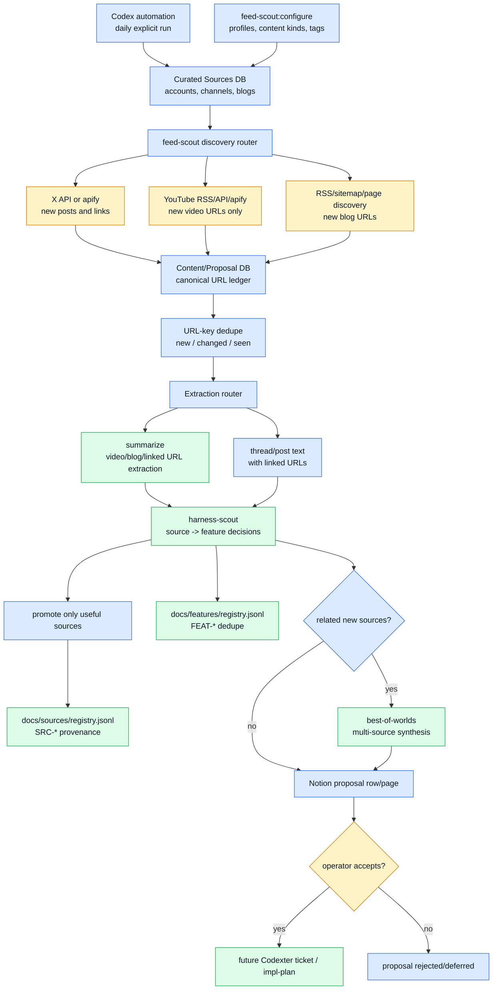

# TASK-0126: add feed-scout recipe for curated source monitoring

## Summary
Add a thin `feed-scout` recipe skill that lets a user configure tracked
profiles: X accounts, YouTube channels, and blog/RSS feeds. `feed-scout`
discovers content from those profiles, dedupes each content URL in an ingestion
ledger, then routes eligible content items through `summarize`,
`harness-scout`, and `best-of-worlds` before writing proposal tickets to
Notion.

## Scope
- In:
  - Create `skills/feed-scout/` as the orchestration recipe for curated source
    monitoring.
  - Make `feed-scout` the operator entrypoint with explicit modes such as
    `feed-scout:configure`, `feed-scout:run`, `feed-scout:review`, and
    `feed-scout:status`.
  - Define the two-db model: tracked profiles and a URL-keyed content/proposal
    ingestion ledger.
  - Add small deterministic scripts for validation, dedupe-key normalization,
    fixture-based discovery output normalization, and automation dry-run checks.
  - Add Notion schema templates for those two databases.
  - Add an automation prompt template for Codex daily polling.
  - Document discovery/extraction boundaries for X, YouTube, and blogs.
  - Preserve `harness-scout` as the per-content-item analyst.
  - Add examples showing how `feed-scout` composes `apify`, `summarize`,
    `harness-scout`, `best-of-worlds`, `advise`, `impl-plan`, and Notion.
  - Update canonical skill inventory/navigation only after the discoverable
    skill package exists.
- Out:
  - No hosted crawler, daemon, queue service, vector database, or custom web UI.
  - No long-running script that polls forever or launches Codex by itself.
  - No automatic creation of live Notion databases during implementation.
  - No direct X API implementation unless credentials and API terms are provided
    in a later ticket.
  - No YouTube transcript scraping through Apify by default; use `summarize`
    for video extraction after discovery yields a video URL.
  - No automatic creation of local implementation tickets without operator or
    Notion proposal acceptance.

## Plan
- `Change:` Add `skills/feed-scout/` as a higher-order recipe that reads a
  tracked-profile database, discovers content items from those profiles,
  dedupes each content URL through a URL-keyed ingestion ledger, extracts
  content, scouts harness-relevant ideas, synthesizes repeated patterns, and
  writes proposal rows/pages to Notion. Expose the workflow as simple operator
  modes so a user can configure profiles, run discovery, review proposals, and
  inspect status without knowing the underlying schema.
- `Why:` Codexter already has the analyst skills, source registry, feature
  registry, and Apify/summarize acquisition helpers. The missing piece is a
  visible orchestration recipe that explains what gets fetched, what gets
  analyzed, what gets deduped, and what becomes a proposal.
- `Before -> After:`
  - Before: `harness-scout` handles a supplied video/blog/tweet/repo URL but
    explicitly does not own feed polling or cron execution.
  - After: `feed-scout` owns the profile polling recipe and data model, records
    each discovered content item once by canonical URL, then hands eligible new or
    changed content items to `harness-scout` and related items to
    `best-of-worlds`.
- `Touch:`
  - `skills/feed-scout/SKILL.md`
  - `skills/feed-scout/AGENTS.md`
  - `skills/feed-scout/README.md`
  - `skills/feed-scout/templates/source-db.md`
  - `skills/feed-scout/templates/proposal-db.md`
  - `skills/feed-scout/templates/codex-automation-prompt.md`
  - `skills/feed-scout/templates/config-intake.md`
  - `skills/feed-scout/references/workflow.md`
  - `skills/feed-scout/references/data-model.md`
  - `skills/feed-scout/scripts/validate_profiles.py`
  - `skills/feed-scout/scripts/normalize_items.py`
  - `skills/feed-scout/scripts/dedupe_key.py`
  - `skills/feed-scout/fixtures/example-profiles.jsonl`
  - `skills/feed-scout/fixtures/example-items.jsonl`
  - `README.md`
  - `ARCHITECTURE.md`
  - optional: `docs/features/registry.jsonl` if this becomes a planned
    `source-ingestion` technique record
- `Inspect:`
  - `skills/harness-scout/SKILL.md`
  - `skills/harness-scout/references/architecture.md`
  - `skills/harness-scout/references/workflows.md`
  - `skills/best-of-worlds/SKILL.md`
  - `skills/apify/SKILL.md`
  - `skills/apify/references/twitter.md`
  - `skills/apify/references/youtube.md`
  - `skills/summarize/SKILL.md`
  - `docs/sources/README.md`
  - `docs/features/README.md`
  - `docs/MEMORY.md`
  - `docs/TROUBLES.md`
- `Signature delta:`
  - `skills/feed-scout/SKILL.md / route(profile: TrackedProfile): DiscoveryPlan`
  - `skills/feed-scout/SKILL.md / configure(input: ConfigureRequest): ConfigurePlan`
  - `skills/feed-scout/SKILL.md / status(scope?: StatusScope): FeedScoutStatus`
  - `skills/feed-scout/SKILL.md / discover(profile: TrackedProfile, since: Cursor): ContentItem[]`
  - `skills/feed-scout/SKILL.md / dedupe(item: ContentItem): IngestionDecision`
  - `skills/feed-scout/SKILL.md / extract(item: ContentItem): ExtractedSource`
  - `skills/feed-scout/SKILL.md / scout(extracted: ExtractedSource): ScoutRunRef`
  - `skills/feed-scout/SKILL.md / synthesize(theme: SourceCluster): ProposalDraft`
  - `skills/feed-scout/SKILL.md / writeProposal(draft: ProposalDraft): NotionProposalRef`
  - `skills/feed-scout/scripts/validate_profiles.py / validate(path: Path): ValidationResult`
  - `skills/feed-scout/scripts/normalize_items.py / normalize(raw: RawItem): ContentItem`
  - `skills/feed-scout/scripts/dedupe_key.py / dedupe_key(url: str, title?: str): string`
  - `docs/sources/registry.jsonl / SourceRecord(source): SRC-* provenance`
- `Type Sketch:`
  - `TrackedProfile { id: string, platform: "x" | "youtube" | "blog", profile_url: string, display_name?: string, content_kinds: ("post" | "thread" | "video" | "short" | "article")[], fetch_method: string, tags: string[], cadence: string, enabled: boolean, min_signal: "low" | "medium" | "high" }`
  - `ConfigureRequest { profiles: { url: string, content_kinds?: string[], tags?: string[], cadence?: string, min_signal?: "low" | "medium" | "high" }[], defaults?: { tags?: string[], cadence?: string, min_signal?: "low" | "medium" | "high", proposal_destination?: "notion" | "local-only" } }`
  - `ConfigurePlan { profile_rows: TrackedProfile[], db_changes: string[], validation_commands: string[], human_gates: string[] }`
  - `DiscoveryCursor { profile_id: string, last_seen_at: string, last_seen_key: string }`
  - `ContentItem { profile_id: string, platform: string, kind: "post" | "thread" | "video" | "short" | "article", canonical_url: string, canonical_key: string, native_id?: string, title: string, author: string, published_at: string, discovered_at: string, content_hash?: string, status: "new" | "seen" | "changed" | "ignored" | "scout-queued" | "scouted" | "proposed" | "rejected" }`
  - `IngestionLedgerRow { canonical_key: string, canonical_url: string, profile_ids: string[], first_seen_at: string, last_seen_at: string, last_ingested_at?: string, content_hash?: string, scout_run?: string, src_id?: string, proposal_url?: string, status: string }`
  - `IngestionDecision { action: "skip-seen" | "ingest-new" | "ingest-changed" | "update-source-links", reason: string, row: IngestionLedgerRow }`
  - `ExtractedSource { item_url: string, source_type: "tweet-thread" | "video" | "blog" | "linked-article", summary_ref: string, extraction_command: string, visibility: string }`
  - `ScoutRunRef { item_url: string, src_id?: string, run_path: string, decisions: string[] }`
  - `ProposalDraft { title: string, decision: "adopt" | "adapt" | "defer" | "reject" | "needs-benchmark", source_refs: string[], scout_runs: string[], recommended_change: string, ticket_handoff?: string }`
- `Typed flow example:`
  1. Operator calls `feed-scout:configure` with profile-shaped input:
     `ConfigureRequest { profiles: [{ url: "https://x.com/example", content_kinds: ["post", "thread"], tags: ["agents", "harness"] }, { url: "https://www.youtube.com/@anthropic-ai", content_kinds: ["video"] }, { url: "https://cursor.com/blog", content_kinds: ["article"] }], defaults: { cadence: "daily", min_signal: "high", proposal_destination: "notion" } }`
  2. `configure` infers platform/fetch defaults and produces:
     `TrackedProfile { id: "x-example", platform: "x", profile_url: "https://x.com/example", content_kinds: ["post", "thread"], fetch_method: "apify:apidojo/tweet-scraper", tags: ["agents", "harness"], cadence: "daily", enabled: true, min_signal: "high" }`
  3. Operator or Codex automation calls `feed-scout:run`.
  4. `discover` uses Apify or X API-compatible fetch to return
     `ContentItem { profile_id: "x-example", platform: "x", kind: "thread", canonical_url: "https://x.com/example/status/123", canonical_key: "x-status-example-123", native_id: "123", title: "thread on agent review loops", author: "example", published_at: "2026-05-13T00:00:00Z", discovered_at: "2026-05-14T00:00:00Z", status: "new" }`
  5. `dedupe` checks the content/proposal ledger by `canonical_key`. If absent,
     it creates an `IngestionLedgerRow` with `action: "ingest-new"`. If present
     with the same content hash, it returns `skip-seen`. If present with a
     changed hash or updated metadata, it returns `ingest-changed`.
  6. `extract` preserves tweet/thread text and routes linked article/video URLs
     through `summarize`, producing an `ExtractedSource` with the extraction
     command and redacted summary path.
  7. `harness-scout` writes
     `experiments/harness-scout/runs/<date-slug>/decision-matrix.md` and reuses
     or creates an `SRC-*` record only for content worth preserving as source
     provenance.
  8. The ledger row is updated with `last_ingested_at`, `scout_run`, `src_id`,
     `status: "scouted"` or `status: "rejected"`.
  9. If two or more new items propose similar review-loop changes,
     `best-of-worlds` produces a `ProposalDraft` with the chosen adapt/reject
     decisions.
  10. `writeProposal` creates or updates a Notion proposal row with the local
     scout run, source refs, decision, and next recommended Codexter ticket,
     then links `proposal_url` back to the ledger row.
- `Execution steps:`
  1. Create `skills/feed-scout/` with `SKILL.md`, `AGENTS.md`, and `README.md`.
  2. In `SKILL.md`, state the ownership boundary: feed polling and proposal
     writeback belong here; per-source feature analysis stays in
     `harness-scout`.
  3. Define the user-facing modes:
     - `feed-scout:configure` ingests a short list of creator/channel/blog URLs
       and turns them into validated tracked-profile rows plus setup steps.
     - `feed-scout:run` executes or simulates one discovery/extraction/scout
       loop for enabled sources.
     - `feed-scout:review` summarizes pending Notion/local proposals and
       recommends accept, reject, defer, or ticket.
     - `feed-scout:status` reports source count, last run, unseen item count,
       proposal count, blockers, and credential gaps.
  4. Add Markdown links to composed skills so dependency tooling can parse the
     graph: `apify`, `summarize`, `harness-scout`, `best-of-worlds`, `advise`,
     `impl-plan`, and `review`.
  5. Add a `config-intake.md` template showing the minimum user input:
     tracked profile URLs/handles, content kinds to watch, optional profile
     tags, cadence, min signal, destination, and any credential preference.
  6. Add the tracked-profile database template with fields for accounts,
     channels, blogs/RSS feeds, content kinds, cadence, tags, fetch method,
     enabled state, and signal threshold.
  7. Add the content/proposal database template as the high-volume ingestion
     ledger with `canonical_url`/`canonical_key` as the unique resource
     identity, plus source relation, platform/native IDs, first/last seen,
     content hash, ingestion/scout/proposal status, scout run, `SRC-*` refs,
     operator review state, and optional ticket handoff.
  8. Add script helpers:
     - `validate_profiles.py` validates tracked-profile JSONL fixtures/templates.
     - `dedupe_key.py` canonicalizes source/content URLs and stable keys, with
       URL-first uniqueness for normal web resources and platform-native IDs
       as a fallback.
     - `normalize_items.py` converts fixture-shaped X/YouTube/blog discovery
       outputs into the planned `ContentItem` shape.
     - scripts are single-shot utilities; they must not poll forever, call
       Codex, create live Notion rows, or spend external API budget.
  9. Add fixtures that make the scripts testable without live X, YouTube, blog,
     Apify, or Notion access.
  10. Add the automation prompt template that a Codex automation can run daily:
     read enabled sources, fetch new items, dedupe, extract, scout, synthesize,
     write proposals, and record evidence.
  11. Add platform routing guidance:
     - X: use X API when credentials exist, otherwise use the `apify` skill's
       `apidojo/tweet-scraper` actor as the default fetch adapter.
     - YouTube: use RSS/API/Apify only for new video URL discovery; use
       `summarize --youtube auto` for transcript/content extraction.
     - Blogs: use RSS/sitemap/page discovery when available; use `summarize`
       for article extraction.
  12. Add state guidance:
      - High-volume discovered content items live in the content/proposal DB.
      - Local cursor/cache state can live under
        `.harness/scout-feed/seen.jsonl` for dry runs and resilience.
      - Durable source decisions live under `docs/sources`,
        `docs/features`, and `experiments/harness-scout/runs`.
      - `docs/sources/registry.jsonl` should not receive a row for every
        watched tweet/video/blog item; promote only scouted or durable sources.
  13. Update `README.md` and `ARCHITECTURE.md` to list `feed-scout` only after
     the skill package exists, preserving `MEM-0044`.
  14. Run skill validation, feed-scout script checks, source/feature registry
      validation, ticket metadata
      validation, and review.
- `Recommendation:` Implement the recipe as a docs-and-skill package first,
  with Notion schema templates and a Codex automation prompt. Do not build a
  service or live Notion database creation until the first operator-run loop
  proves the fields and cadence are right.
- `Options considered:`
  - `Repo markdown/jsonl watchlist plus local seen file:` fastest and most
    versionable, but weak for many rows and awkward for operator curation.
  - `Two Notion DBs plus local evidence:` recommended because the operator wants
    curation and proposal review in Notion while Codexter keeps durable source
    evidence in repo artifacts. The second DB doubles as the high-volume
    ingestion ledger.
  - `Single entrypoint skill with modes:` recommended user-facing interface
    because the operator should be able to call `feed-scout:configure` with a
    list of profiles and content kinds, then let the recipe generate the needed
    rows/templates.
  - `Hosted ingestion service:` too much infrastructure for the first lovable
    slice and conflicts with Codexter's current explicit-invocation boundary.
  - `Recipe-only with no scripts:` too weak because schema drift, URL dedupe,
    and fixture normalization are deterministic enough to test mechanically.
- `Blast radius:`
  - Skill inventory and navigation.
  - Source/proposal ingestion expectations.
  - `harness-scout` boundary clarity.
  - Notion proposal workflow expectations.
  - Future automation prompts and external fetch cost/rate behavior.
- `Risks:`
  - Scope creep into a hidden crawler or background runtime.
  - Notion becoming the durable source of truth instead of the proposal inbox.
  - Raw tweet/video/blog text being retained in tracked docs.
  - Duplicate proposals if source and content dedupe are underspecified.
  - High-volume content rows overwhelming `docs/sources/registry.jsonl` if the
    ledger-to-registry promotion boundary is not enforced.
  - Apify/X API credential, rate-limit, and cost differences changing fetch
    behavior.

## Gap Analysis
- `Current state:` Codexter has `harness-scout` for supplied URLs/sources,
  `summarize` for URL/video/article extraction, `apify` for social scraping,
  `best-of-worlds` for synthesis, `docs/sources/registry.jsonl` for source
  provenance, and `docs/features/registry.jsonl` for durable technique dedupe.
  There is no recipe that monitors curated accounts/channels/blogs, discovers
  new source items, or writes Notion proposal rows.
- `Production expectation:` A credible monitoring workflow separates source
  curation from discovered content, stores high-volume ingested resources in a
  URL-keyed ledger, preserves cursors and dedupe state, treats fetched text as
  untrusted evidence, records extraction commands, batches related findings,
  and gates proposed Codexter changes behind review.
- `Missing gaps:`
  - No tracked-profile database schema.
  - No content/proposal ingestion ledger schema with URL-keyed uniqueness.
  - No easy operator entrypoint for "here are profiles and blogs, configure the
    monitoring workflow for me."
  - No explicit discovery-versus-extraction routing for X, YouTube, and blogs.
  - No programmable helper layer for validating curated sources, normalizing
    discovered items, or computing stable dedupe keys.
  - No promotion rule between high-volume content rows and durable `SRC-*`
    records.
  - No Codex automation prompt template for the daily loop.
  - No clear rule that `harness-scout` analyzes content items rather than
    polling creators.
  - No Notion proposal writeback contract.
- `Comparable implementations:`
  - Existing `harness-scout` source-run workflow and source registry.
  - Existing `apify` hub skill actor routing.
  - Existing `summarize` URL/YouTube extraction workflow.
  - Existing `best-of-worlds` synthesis and adopt/adapt/reject/defer model.
- `Recommendation:` Land one coherent recipe-skill ticket. Defer live Notion
  database creation, X API credential plumbing, background polling services, and
  automatic ticket creation until the operator validates the first daily-loop
  prompt against a small curated list.

## Diagram
- `Legend:` keep = existing skill/registry; add = new `feed-scout` recipe and
  Notion templates; external = platform/API boundary.

## Acceptance Criteria
- [x] AC-1: `skills/feed-scout/` exists as a discoverable skill package with
  `SKILL.md`, `README.md`, and `AGENTS.md`.
- [x] AC-2: `feed-scout` documents operator modes for `configure`, `run`,
  `review`, and `status`, with `configure` accepting tracked profiles
  (account/channel/feed URLs), content kinds, optional tags, cadence, signal
  threshold, and destination.
- [x] AC-3: The skill clearly states that feed discovery belongs to
  `feed-scout`, while source judgment belongs to `harness-scout`.
- [x] AC-4: The skill links to the composed skills using Markdown links:
  `apify`, `summarize`, `harness-scout`, `best-of-worlds`, `advise`,
  `impl-plan`, and `review`.
- [x] AC-5: The profile DB template defines tracked accounts/channels/blogs with
  platform, profile URL/handle, content kinds, cadence, tags, fetch method,
  enabled state, and signal threshold.
- [x] AC-6: The proposal/content DB template defines a URL-keyed ingestion
  ledger with canonical URL/key uniqueness, source relations, first/last seen,
  content hash, extraction status, scout run path, `SRC-*` refs, decision,
  Notion review state, and optional ticket handoff.
- [x] AC-7: Script helpers validate tracked-profile records, compute stable
  dedupe keys, and normalize fixture discovery output into `ContentItem`
  records without live external calls.
- [x] AC-8: Platform guidance covers X, YouTube, blogs, and linked URLs without
  requiring Apify transcript fetching for YouTube.
- [x] AC-9: The promotion rule says high-volume discovered resources stay in the
  content/proposal ledger, while `docs/sources/registry.jsonl` receives only
  scouted or durable source-provenance records.
- [x] AC-10: The automation prompt template describes a daily Codex automation
  loop that fetches, dedupes, extracts, scouts, synthesizes, writes proposals,
  and records evidence.
- [x] AC-11: README and ARCHITECTURE navigation mention `feed-scout` only after
  the skill package exists.
- [x] AC-12: Validation and review evidence are linked from this ticket.

## Verification
- `Tests:`
  - `python3 skills/skill-creator/scripts/quick_validate.py skills/feed-scout`
  - `python3 skills/feed-scout/scripts/validate_profiles.py skills/feed-scout/fixtures/example-profiles.jsonl`
  - `python3 skills/feed-scout/scripts/normalize_items.py skills/feed-scout/fixtures/example-items.jsonl`
  - `python3 skills/feed-scout/scripts/dedupe_key.py https://www.youtube.com/watch?v=example`
  - `python3 docs/sources/validate_sources.py`
  - `python3 docs/features/validate_features.py`
  - `python3 tickets/scripts/check_ticket_metadata.py`
  - `git diff --check -- skills/feed-scout README.md ARCHITECTURE.md tickets/TASK-0126/ticket.md`
- `Manual checks:`
  - Confirm `feed-scout` does not claim to be a shipped public capability until
    the skill package exists.
  - Confirm a user can configure the workflow from tracked profile URLs/handles,
    content kinds, tags, cadence, signal threshold, and destination.
  - Confirm the plan keeps Notion as proposal review/writeback, not the only
    durable source of truth.
  - Confirm raw transcripts and bulky source extracts remain out of canonical
    docs.
  - Confirm `harness-scout` remains usable for manually supplied URLs and does
    not inherit cron/fetch ownership.
  - Confirm repeated URLs hit one content/proposal ledger row and do not create
    duplicate proposals or duplicate `SRC-*` records.
- `Evidence required:`
  - Validation command output.
  - Review artifact under `tickets/TASK-0126/artifacts/review/`.
  - Ticket evidence summary with pass/fail status.

## Proof Contract
- `Metrics:`
  - `Primary metric:` pass/fail validation suite for skill package, registries,
    metadata, and diff hygiene.
  - `Direction:` pass/fail
  - `Verify:` commands listed in `Verification`.
  - `Guard:` manual boundary checks for source retention, Notion ownership, and
    skill composition.
  - `Min acceptable result:` all listed commands pass; manual checks pass.
  - `Autoresearch warranted:` no
  - `Autoresearch session:` none
- `Review Rubrics:`
  - `spec-contract >= 4.0`
  - `implementation-plan >= 4.0`
  - `evidence-quality >= 4.0`
  - `integration-readiness >= 4.0`
  - Hard gates: no hidden crawler/runtime, no raw-source retention in canonical
    docs, no duplicate ownership with `harness-scout`, no Notion-only durable
    truth.
- `Required Evidence:`
  - Ticket plan review artifact.
  - Command output for validation.
  - Final review result after implementation.

## Autonomy Readiness
- `Human inputs/assets:` A small initial curated list of X accounts, YouTube
  channels, and blogs is needed before a real automation run can be useful.
- `Credentials / external access:` X API credentials or Apify token may be
  needed for X discovery. YouTube/blog extraction can use public URLs and
  `summarize`; blocked blogs may need optional summarize/Firecrawl fallback.
- `Compute/runtime needs:` Local Codex automation or manual Codex run; no
  service daemon.
- `Tooling gaps:` No live Apify MCP tools are currently exposed in this thread;
  the recipe can still document Apify usage via the existing skill and defer
  runtime credential checks to the first operational run.
- `QA risks:` External fetch results are unstable; implementation proof should
  validate the recipe and use fixtures/examples rather than depend on one live
  platform response.
- `Human gates:` Operator must approve creating live Codex automations, Notion
  databases, or external API/API-token spend.
- `Agent decision boundaries:` Agents may propose Notion rows and local tickets,
  but should not publish, deploy, spend, or auto-create implementation tickets
  from source content without operator acceptance.

## Evidence Checklist
- [x] Review artifact:
  `tickets/TASK-0126/artifacts/review/<timestamp>-plan-review.json`
- [x] Validation command output:
- [x] Final review result:

## Refs
- [skills/harness-scout/SKILL.md](/Users/kenjipcx/coding-harness/Codexter/skills/harness-scout/SKILL.md)
- [skills/harness-scout/references/architecture.md](/Users/kenjipcx/coding-harness/Codexter/skills/harness-scout/references/architecture.md)
- [skills/harness-scout/references/workflows.md](/Users/kenjipcx/coding-harness/Codexter/skills/harness-scout/references/workflows.md)
- [skills/apify/SKILL.md](/Users/kenjipcx/coding-harness/Codexter/skills/apify/SKILL.md)
- [skills/summarize/SKILL.md](/Users/kenjipcx/coding-harness/Codexter/skills/summarize/SKILL.md)
- [skills/best-of-worlds/SKILL.md](/Users/kenjipcx/coding-harness/Codexter/skills/best-of-worlds/SKILL.md)
- [docs/sources/README.md](/Users/kenjipcx/coding-harness/Codexter/docs/sources/README.md)
- [docs/features/README.md](/Users/kenjipcx/coding-harness/Codexter/docs/features/README.md)

## Evidence
- `Artifacts:`
  - `tickets/TASK-0126/artifacts/review/2026-05-13-plan-review.json`
  - `tickets/TASK-0126/artifacts/review/2026-05-14-profile-model-review.json`
  - `tickets/TASK-0126/artifacts/review/2026-05-14-impl-review.json`
- `Commands:`
  - `python3 skills/skill-creator/scripts/quick_validate.py skills/feed-scout`
    - `[PASSED] Skill is valid!`
  - `python3 skills/feed-scout/scripts/validate_profiles.py skills/feed-scout/fixtures/example-profiles.jsonl`
    - `feed-scout profile validation OK (3 records)`
  - `python3 skills/feed-scout/scripts/normalize_items.py skills/feed-scout/fixtures/example-items.jsonl --discovered-at 2026-05-14T00:00:00Z`
    - emitted 3 normalized `ContentItem` rows with canonical URLs and keys
  - `python3 skills/feed-scout/scripts/dedupe_key.py 'https://www.youtube.com/watch?v=example&utm_source=test'`
    - `youtube-video-example`
    - `https://youtube.com/watch?v=example`
  - `python3 docs/sources/validate_sources.py`
    - `source registry contract OK (7 records)`
  - `python3 docs/features/validate_features.py`
    - `feature registry contract OK (21 records)`
  - `python3 tickets/scripts/check_ticket_metadata.py`
    - `ticket metadata OK (9 ticket files checked)`
  - `python3 bin/check_doc_parity.py`
    - `structural doc parity OK (6 files checked, 29 rules)`
  - `python3 -m py_compile skills/feed-scout/scripts/*.py`
    - passed
  - `git diff --check -- tickets/TASK-0126/ticket.md`
    - passed
- `Result summary:`
  - Implemented `skills/feed-scout/` as a tracked-profile monitoring recipe
    with configure/run/review/status modes, data-model references, Notion DB
    templates, automation prompt, fixtures, and deterministic helper scripts.
  - README and ARCHITECTURE now route to the discoverable `feed-scout` package.
  - Final implementation review verdict: pass, overall score `4.15`, no blocking
    findings.

## Blockers
- none
