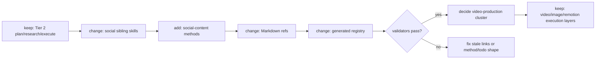

# TASK-0148: decide skill consolidation and method-address hard migrations

## Summary
Consolidate obvious sibling Tier 3 content skills into fewer method-addressed
skill packages so the installed skill list stays smaller, decisions are easier,
and generated registry graphs can still show the content pipeline. Start with
the social-content cluster, validate it as a hard migration, then decide whether
to apply the same pattern to the video-production cluster.

## Scope
- `In:`
  - write a keep / merge / defer decision table for current sibling candidates
  - hard-merge the social-content cluster into one owning skill with method
    addresses
  - update Markdown skill links, frontmatter metadata, `todos.md`, generated
    registry output, and docs that name the migrated skills
  - validate no stale skill links or tier-todo violations remain
  - decide whether the video-production cluster is ready for the same migration
    in a second checkpoint
- `Out:`
  - soft aliases, compatibility wrappers, or hidden router trees
  - merging Tier 3 execution-layer skills such as `image-generation`,
    `video-generation`, `remotion`, or `remotion-render`
  - merging frontend topology skills such as `frontend-craft`,
    `functional-ui`, `visual-design`, `landing-page`, or `frontend-design`
  - changing the Tier 1 / Tier 2 ladder
  - creating a hand-authored pipeline registry

## Plan
- `Change:` replace scattered social-content sibling skills with one
  method-addressed `social-content` owner, then evaluate video siblings as a
  separate hard-migration batch.
- `Why:` every skill description is loaded into the available-skill surface, so
  duplicate sibling packages increase context and decision overhead. The
  registry already has `group` and `methods`; use those fields instead of more
  public skill directories.
- `Before -> After:`
  - Before: `ai-social-media-content`, `social-media-carousel`,
    `linkedin-content`, and `twitter-thread-creation` are separate public Tier 3
    skills with overlapping research, planning, asset, and execution logic.
  - After: one `social-content` package owns method addresses such as
    `social-content:cross-platform`, `social-content:carousel`,
    `social-content:linkedin`, and `social-content:twitter-thread`.
- `Touch:`
  - `skills/ai-social-media-content/` -> rename or replace with
    `skills/social-content/`
  - `skills/social-media-carousel/` -> merge into `social-content` then remove
  - `skills/linkedin-content/` -> merge into `social-content` then remove
  - `skills/twitter-thread-creation/` -> merge into `social-content` then remove
  - `docs/skills/registry.jsonl` generated output
  - `docs/skills/README.md` only if the registry contract needs clarification
  - `docs/specs/skill-tier-rollout-plan.md` only for durable rollout progress
  - `docs/MEMORY.md` / `docs/HISTORY.md` only if the migration establishes a
    durable rule or shipped milestone
  - any Markdown refs found by `rg` across `AGENTS.md`, `docs/`, `skills/`,
    `tickets/`, `agents/`, and templates
- `Inspect:`
  - `docs/skills/registry.jsonl`
  - `docs/skills/README.md`
  - `docs/specs/skill-tier-rollout-plan.md`
  - `skills/skill-maintenance/SKILL.md`
  - `skills/skill-maintenance/todos.md`
  - source `SKILL.md` and `todos.md` files for the social and video candidates
  - `bin/sync_skill_registry.py`
  - `bin/check_skill_todo_tiers.py`
  - `skills/skill-maintenance/scripts/check_skills.py`
- `Signature delta:`
  - `skills/social-content/SKILL.md / frontmatter.methods: string[]`
  - `skills/social-content/SKILL.md / method_router(request): selected method obligations`
  - `skills/social-content/todos.md / conditional checklist(method): ordered todo subset`
  - `bin/sync_skill_registry.py / collect_skill_rows(skills_dir): registry rows`
  - `bin/check_skill_todo_tiers.py / audit_todo_links(skill): violations[]`
  - `docs/skills/registry.jsonl / row(name="social-content"): generated skill row`
- `Type Sketch:`
  - `ConsolidationCandidate`: `group`, `current_skills`, `recommendation`,
    `owner_skill`, `method_addresses`, `keep_separate_reason`, `risk`
  - `SkillFrontmatter`: `name`, `description`, `tier`, `source`, `group`,
    `methods`, `common_chains`, `allowed_tools`
  - `SkillLinkRewrite`: `old_target`, `new_target`, `files_touched`,
    `anchor_required`, `validated`
  - `RegistryRow`: `name`, `tier`, `source`, `group`, `methods`, `has_todos`,
    `skill_links`
- `Typed flow example:`
  - Input ask: "write a LinkedIn carousel for an AI launch"
  - Discovery before: agent chooses among `linkedin-content`,
    `social-media-carousel`, and `ai-social-media-content`
  - Discovery after: agent loads `social-content`, selects
    `social-content:linkedin` plus `social-content:carousel`, imports the
    single conditional todo set, routes generated visuals to `image-generation`,
    and records one registry row with methods instead of three public skills
- `Execution steps:`
  1. Generate a current candidate table from `docs/skills/registry.jsonl`, using
     `group`, `skill_links`, and `methods` to identify true sibling clusters.
  2. Write the decision table into this ticket before editing skill packages.
  3. Hard-migrate the social cluster first:
     - create or rename to `skills/social-content/`
     - preserve the strongest cross-platform body from `ai-social-media-content`
     - fold carousel, LinkedIn, and Twitter/X specifics into explicit method
       sections
     - create conditional `todos.md` entries that select only the relevant
       method obligations
     - remove the old sibling directories in the same commit
  4. Replace Markdown refs:
     - `ai-social-media-content` -> `social-content` or
       `social-content:cross-platform`
     - `social-media-carousel` -> `social-content:carousel`
     - `linkedin-content` -> `social-content:linkedin`
     - `twitter-thread-creation` -> `social-content:twitter-thread`
  5. Run the skill maintenance sync and validators.
  6. Commit the social cluster as one migration checkpoint.
  7. Re-run the candidate table for video siblings and decide whether to proceed
     with `video-production` in a second checkpoint.
  8. If approved by the evidence from step 7, migrate video siblings separately:
     `ai-marketing-videos`, `explainer-video-guide`,
     `talking-head-production`, `video-ad-specs`, and possibly
     `storyboard-creation` into `video-production` methods.
  9. Keep `video-generation`, `image-generation`, `remotion`, and
     `remotion-render` separate as execution layers.
  10. Update rollout docs/history only after a validated migration lands.
- `Recommendation:` approve the social-content-first hard migration. Do not
  merge video until the first cluster proves the link rewrite, registry sync,
  and method-address checklist pattern.
- `Options considered:`
  - `Keep all skills:` lowest risk, but preserves context bloat and duplicate
    decision surfaces.
  - `Social first, video second:` best balance; proves the pattern on the
    clearest sibling group before touching the more nuanced video workflows.
  - `Merge social and video in one pass:` fastest skill-count reduction, but
    raises stale-link and lost-specificity risk across too many public names at
    once.
- `Blast radius:` skill discovery, generated registry rows, Markdown skill refs,
  downstream content workflows, installed `~/.codex/skills` symlinks after
  `install.sh`, and any user muscle memory around old skill names.
- `Risks:`
  - stale links to removed skill directories
  - method sections becoming a nested router instead of conditional method
    addresses
  - losing channel-specific platform constraints during merge
  - accidentally merging execution layers that should remain callable directly
  - validators passing while human-facing descriptions still mention removed
    skill names

## Gap Analysis
- `Current state:` registry metadata already exposes `content-social` and
  `content-video` groups; `research` proves the method-address pattern; skill
  maintenance validators catch stale tier edges and registry drift.
- `Production expectation:` public skill list should expose one owner when
  sibling packages share lifecycle, proof surface, dependencies, and references.
  Specific formats should be method addresses inside that owner.
- `Missing gaps:` no consolidation decision table exists yet; social and video
  clusters still have separate public descriptions; no migration has proved
  stale-link cleanup for removed skill directories.
- `Grounding references:` `docs/specs/skill-tier-rollout-plan.md`,
  `docs/skills/README.md`, `docs/skills/registry.jsonl`, and existing
  `research:*` method metadata.
- `Recommendation:` migrate the social cluster first and use it as the reference
  implementation for later video consolidation.

## Diagram

## Consolidation Decision Table
| Candidate group | Current skills | Decision | Target | Reason |
| --- | --- | --- | --- | --- |
| Social content | `ai-social-media-content`, `social-media-carousel`, `linkedin-content`, `twitter-thread-creation` | merge first | `social-content` with methods | Same Tier 3 group, same research/plan/execute lifecycle, same asset handoffs, high description overlap. |
| Video production | `ai-marketing-videos`, `explainer-video-guide`, `talking-head-production`, `video-ad-specs`, maybe `storyboard-creation` | defer until social validates | `video-production` with methods | Same domain, but storyboard and ad-spec planning have different obligations; migrate after proving pattern. |
| Media execution | `image-generation`, `video-generation`, `remotion`, `remotion-render` | keep | separate execution skills | These own tool/model/render contracts and proof surfaces, not just content subtype guidance. |
| Frontend topology | `frontend-craft`, `functional-ui`, `visual-design`, `landing-page`, `frontend-design` | keep | separate topology skills | Boundaries are intentionally different: UX, visual taste, implementation, landing-page narrative, and app-UI reference. |
| Research/documentation/code patterns | `research`, `documentation`, `external-patterns` | inspect later | likely `research:*` methods only if redundant | Some surfaces may already be Tier 2 helpers with real tooling differences; do not combine during content migration. |

## Acceptance Criteria
- [ ] Ticket contains a decision table for the current consolidation candidates.
- [ ] Social-content migration removes old public sibling skill directories and
      replaces their references with method-addressed links.
- [ ] `social-content` frontmatter declares `methods` for all migrated public
      addresses.
- [ ] `social-content/todos.md` is conditional by method and does not instruct
      agents to run every method sequentially.
- [ ] Tier 3 checklist links continue to target Tier 2 surfaces plus intentional
      peer Tier 3 execution layers only.
- [ ] Generated registry reflects the new owner and no stale removed-skill refs.
- [ ] Video-production migration is either approved as a second checkpoint or
      explicitly deferred with evidence.

## Verification
- `Tests:`
  - `python3 skills/skill-maintenance/scripts/check_skills.py --write`
  - `python3 bin/sync_skill_registry.py --check`
  - `python3 bin/check_skill_todo_tiers.py --allow-peer-tier3`
  - `python3 tickets/scripts/check_ticket_metadata.py`
  - `git diff --check`
- `Manual checks:`
  - `rg -n "\]\([^)]*(ai-social-media-content|social-media-carousel|linkedin-content|twitter-thread-creation)" AGENTS.md docs skills tickets agents templates`
  - inspect `docs/skills/registry.jsonl` for `social-content` methods and no
    stale deleted-skill links
  - inspect installed skill list after `./install.sh` if the migration is meant
    to be available immediately in the current Codex home
- `Evidence required:`
  - final decision table
  - validator outputs
  - stale-link search output
  - before/after skill count
  - review artifact

## Proof Contract
- `Metrics:`
  - `Primary metric:` stale Markdown links to removed social-content sibling skill directories
  - `Direction:` zero
  - `Verify:` `rg -n "\]\([^)]*(ai-social-media-content|social-media-carousel|linkedin-content|twitter-thread-creation)" AGENTS.md docs skills tickets agents templates`
  - `Guard:` `python3 skills/skill-maintenance/scripts/check_skills.py --write`; `python3 bin/check_skill_todo_tiers.py --allow-peer-tier3`; `git diff --check`
  - `Min acceptable result:` zero stale Markdown links to removed skill paths
  - `Autoresearch warranted:` no
  - `Autoresearch session:` none
- `Review Rubrics:`
  - `implementation-plan >= 4.0` hard gate
  - `integration-readiness >= 4.0` hard gate
  - `evidence-quality >= 4.0` hard gate
- `Required Evidence:`
  - consolidation decision table
  - validator command outputs
  - stale-link search result
  - generated registry diff summary
  - review result linked from this ticket

## Refs
- `docs/specs/skill-tier-rollout-plan.md`
- `docs/skills/README.md`
- `docs/skills/registry.jsonl`
- `skills/skill-maintenance/SKILL.md`
- `skills/research/SKILL.md`

## Evidence
- `Artifacts:`
  - `tickets/TASK-0148/artifacts/review/2026-05-19-plan-review.json`
  - `tickets/TASK-0148/artifacts/review/2026-05-19-impl-review.json`
- `Commands:`
  - `python3 skills/skill-maintenance/scripts/check_skills.py --write`
  - `python3 bin/sync_skill_registry.py --check`
  - `python3 bin/check_skill_todo_tiers.py --allow-peer-tier3`
  - `python3 tickets/scripts/check_ticket_metadata.py`
  - `python3 bin/check_doc_parity.py`
  - `python3 bin/check_harness_invariants.py`
  - `git diff --check`
  - `rg -n "\]\([^)]*(ai-social-media-content|social-media-carousel|linkedin-content|twitter-thread-creation)" AGENTS.md docs skills tickets agents templates --glob '!tickets/archive/**'`
  - `./install.sh`
- `Result summary:` `social-content` now owns
  `social-content:cross-platform`, `social-content:carousel`,
  `social-content:linkedin`, and `social-content:twitter-thread`; old social
  sibling skill directories were removed; copied upstream references were kept
  under `skills/social-content/references/`; generated registry now reports 74
  rows and no stale Markdown links to removed social skill paths; live
  `~/.codex/skills` install has `social-content` and no old social sibling
  symlinks. Implementation review passed with overall score `4.2`.

## Blockers
- none
