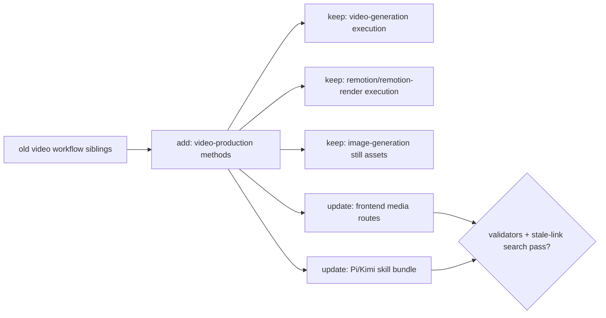

# TASK-0151: consolidate video production skills into method addresses

## Summary
Consolidate sibling Tier 3 video-production workflow skills into one
method-addressed `video-production` package while keeping tool execution layers
such as `video-generation`, `image-generation`, `remotion`, and
`remotion-render` separate. Use the completed `social-content` migration as the
reference pattern.

## Scope
- `In:`
  - hard-merge `ai-marketing-videos`, `explainer-video-guide`,
    `storyboard-creation`, `talking-head-production`, and `video-ad-specs` into
    one `video-production` owner
  - preserve their upstream and prompting references under the new owner
  - declare method addresses for `video-production:marketing`,
    `video-production:explainer`, `video-production:storyboard`,
    `video-production:talking-head`, and `video-production:ad-spec`
  - rewrite Markdown refs, registry rows, live install symlinks, and domain
    routing docs
  - validate no stale Markdown links or tier-todo violations remain
- `Out:`
  - merging `video-generation`, `image-generation`, `remotion`, or
    `remotion-render`
  - creating soft aliases or compatibility wrappers
  - changing Tier 1 / Tier 2 skill rules
  - merging `documentation` or `external-patterns` into `research` in this pass

## Plan
- `Change:` replace five public video workflow skills with one
  method-addressed `video-production` skill.
- `Why:` the candidate skills are all Tier 3 application workflow routers around
  the same image/video/Remotion/frontend execution stack. Keeping them as public
  siblings increases skill-list and system-prompt surface without adding a real
  ownership boundary.
- `Before -> After:`
  - Before: agents choose among five video workflow skill names, each with the
    same research -> plan -> domain-production -> media-execution shape.
  - After: agents load `video-production`, select the relevant method, and only
    call execution layers such as `video-generation`, `image-generation`,
    `remotion`, or `remotion-render` when the plan requires them.
- `Touch:`
  - `skills/video-production/` new owner
  - `skills/ai-marketing-videos/` remove after migration
  - `skills/explainer-video-guide/` remove after migration
  - `skills/storyboard-creation/` remove after migration
  - `skills/talking-head-production/` remove after migration
  - `skills/video-ad-specs/` remove after migration
  - `skills/video-generation/SKILL.md`, `todos.md`, `AGENTS.md`, and `README.md`
    route references
  - `skills/frontend-craft/references/media-pipelines.md`
  - `templates/external-cli/profiles/frontend-pi-kimi/skill-bundle.json`
  - `templates/external-cli/profiles/frontend-pi-kimi/APPEND_SYSTEM.md`
  - `docs/skills/registry.jsonl`
  - `docs/specs/skill-tier-rollout-plan.md`
  - `tickets/TASK-0151/ticket.md`
- `Inspect:`
  - current video skill `SKILL.md`, `todos.md`, `references/upstream.md`, and
    `references/prompting.md` files
  - `skills/social-content/SKILL.md` and `todos.md` as the reference migration
  - `docs/skills/README.md` and `docs/skills/registry.jsonl`
  - `bin/sync_skill_registry.py`
  - `bin/check_skill_todo_tiers.py`
  - `skills/skill-maintenance/scripts/check_skills.py`
- `Signature delta:`
  - `skills/video-production/SKILL.md / frontmatter.methods: string[]`
  - `skills/video-production/SKILL.md / select_method(request): VideoProductionMethod`
  - `skills/video-production/todos.md / conditional checklist(method): todo[]`
  - `docs/skills/registry.jsonl / row(name="video-production"): RegistryRow`
  - `templates/external-cli/profiles/frontend-pi-kimi/skill-bundle.json / skills[]: string[]`
- `Type Sketch:`
  - `VideoProductionMethod`: `marketing | explainer | storyboard | talking-head | ad-spec`
  - `VideoReferenceBundle`: `method`, `upstream_path`, `prompting_path`,
    `shared_domain_workflow_path`
  - `SkillLinkRewrite`: `old_target`, `new_target`, `files_touched`,
    `validated`
  - `RegistryRow`: `name`, `tier`, `group`, `methods`, `skill_links`,
    `has_todos`, `source`
- `Typed flow example:`
  - User asks for a product launch ad.
  - Before: agent may choose `ai-marketing-videos` or `video-ad-specs`, then
    bounce to `video-generation` and `frontend-craft`.
  - After: agent loads `video-production`, selects
    `video-production:marketing` as primary and `video-production:ad-spec` as a
    supporting method only if paid placement specs matter, drafts the brief and
    prompts, then routes model-native clips to `video-generation` and campaign
    page integration to `frontend-craft`.
- `Execution steps:`
  1. Create `skills/video-production/` with `SKILL.md`, `todos.md`, `README.md`,
     `AGENTS.md`, and `references/`.
  2. Move upstream and prompting references into method-specific reference names
     such as `upstream-marketing.md` and `prompting-marketing.md`.
  3. Fold the five old skill bodies into method sections and keep the shared
     domain video production workflow as the common route.
  4. Write conditional method todos so the skill does not run every video method
     sequentially.
  5. Rewrite downstream refs from old skill names to `video-production:*`.
  6. Update the Pi/Kimi frontend profile skill bundle to mount
     `video-production` instead of the five old video workflow siblings.
  7. Remove old sibling directories in the same commit.
  8. Regenerate the skill registry and run validators.
  9. Run `./install.sh`, then prune stale old video skill symlinks from
     `~/.codex/skills` if install does not remove them.
  10. Write evidence and review results to this ticket.
- `Recommendation:` migrate the full video workflow cluster in one ticket. Do
  not split the five methods into separate tickets because the link rewrite and
  registry proof should happen atomically.
- `Options considered:`
  - `Keep all video skills:` lowest immediate risk, but keeps duplicate public
    descriptions and decision load.
  - `Merge only marketing/explainer/ad specs:` safer, but leaves storyboard and
    talking-head as leftover same-domain wrappers.
  - `Merge all five into video-production:` best path; the methods share enough
    infrastructure and references to justify one owner while preserving method
    specificity.
- `Blast radius:` skill discovery, generated registry count, installed skill
  symlinks, video-generation route docs, frontend media-pipeline docs, and Pi/Kimi
  external frontend skill bundles.
- `Risks:`
  - losing platform-specific ad or avatar safety details during consolidation
  - leaving stale old skill names in templates or copied upstream references
  - accidentally making `video-production` call every method rather than select
    conditionally
  - confusing workflow planning (`video-production`) with tool execution
    (`video-generation`)

## Gap Analysis
- `Current state:` social-content proves the method-addressed Tier 3 migration
  pattern. The video wrappers still expose five public skill descriptions for
  one shared production workflow.
- `Production expectation:` an agent should choose one video workflow owner,
  select the relevant method, then route only necessary execution work to
  media-generation or Remotion skills.
- `Missing gaps:` no `video-production` owner exists; downstream refs still name
  old siblings; external frontend profile still mounts the old video workflow
  skill bundle.
- `Grounding references:` current video skill files, `social-content` migration,
  generated skill registry, and skill-tier rollout plan.
- `Recommendation:` implement `video-production` next and keep
  `documentation`/`external-patterns` as separate Tier 2 surfaces for now.

## Diagram

## Consolidation Decision Table
| Candidate | Decision | Target | Reason |
| --- | --- | --- | --- |
| `ai-marketing-videos` | merge | `video-production:marketing` | Campaign and promo workflow over shared media production stack. |
| `explainer-video-guide` | merge | `video-production:explainer` | Explainer/tutorial/product-demo workflow with same route shape. |
| `storyboard-creation` | merge | `video-production:storyboard` | Preproduction method still belongs in video workflow planning and routes to same panel/video execution layers. |
| `talking-head-production` | merge | `video-production:talking-head` | Avatar/lipsync/presenter workflow is method-specific but shares production routing. |
| `video-ad-specs` | merge | `video-production:ad-spec` | Platform ad specs are a method-specific planning surface, not a separate execution layer. |
| `video-generation` | keep | separate execution skill | Owns inference.sh model map, spend gate, async jobs, and result bundle proof. |
| `remotion` | keep | separate execution/authoring skill | Owns deterministic Remotion code authoring and official rules. |
| `remotion-render` | keep | separate execution skill | Owns inference.sh Remotion render command and MP4 bundle proof. |
| `image-generation` | keep | separate execution skill | Owns still image model map, spend gate, and asset bundle proof. |

## Acceptance Criteria
- [x] `video-production` exists with the five method addresses.
- [x] Old video workflow sibling directories are removed.
- [x] Method-specific upstream and prompting references are preserved under
      `skills/video-production/references/`.
- [x] `video-production/todos.md` selects methods conditionally and does not run
      every method sequentially.
- [x] `video-generation`, `image-generation`, `remotion`, and
      `remotion-render` remain separate execution layers.
- [x] Downstream docs/templates route old video workflow names to
      `video-production:*`.
- [x] Generated registry and todo-tier checks pass.
- [x] Live install has `video-production` and no stale old video workflow
      symlinks.

## Verification
- `Tests:`
  - `python3 skills/skill-maintenance/scripts/check_skills.py --write`
  - `python3 bin/sync_skill_registry.py --check`
  - `python3 bin/check_skill_todo_tiers.py --allow-peer-tier3`
  - `python3 tickets/scripts/check_ticket_metadata.py`
  - `git diff --check`
- `Manual checks:`
  - `rg -n "\]\([^)]*(ai-marketing-videos|explainer-video-guide|storyboard-creation|talking-head-production|video-ad-specs)" AGENTS.md docs skills tickets agents templates --glob '!tickets/archive/**'`
  - inspect `docs/skills/registry.jsonl` for `video-production` methods
  - inspect `~/.codex/skills` after install/prune
- `Evidence required:`
  - candidate table
  - validator output
  - stale-link search output
  - registry count before/after
  - review artifact

## Proof Contract
- `Metrics:`
  - `Primary metric:` zero stale Markdown links to removed video workflow skill
    directories
  - `Direction:` zero
  - `Verify:` stale-link `rg` command in `Verification`
  - `Guard:` skill-maintenance validators and `git diff --check`
  - `Min acceptable result:` zero stale Markdown links outside archive or
    explicitly quoted migration notes
  - `Autoresearch warranted:` no
  - `Autoresearch session:` none
- `Review Rubrics:`
  - `implementation-plan >= 4.0`
  - `integration-readiness >= 4.0`
  - `evidence-quality >= 4.0`
- `Required Evidence:`
  - consolidation decision table
  - validator outputs
  - stale-link search result
  - generated registry diff summary
  - review result

## Refs
- `docs/specs/skill-tier-rollout-plan.md`
- `docs/skills/registry.jsonl`
- `skills/social-content/SKILL.md`
- `skills/video-generation/SKILL.md`
- `templates/external-cli/profiles/frontend-pi-kimi/skill-bundle.json`

## Evidence
- `Artifacts:`
  - `tickets/TASK-0151/artifacts/review/2026-05-19-plan-review.json`
- `Commands:`
  - `python3 skills/skill-maintenance/scripts/check_skills.py --write`
  - `rg -n "\]\([^)]*(ai-marketing-videos|explainer-video-guide|storyboard-creation|talking-head-production|video-ad-specs)" AGENTS.md docs skills tickets agents templates --glob '!tickets/archive/**'`
  - `./install.sh`
  - `rm -f ~/.codex/skills/{ai-marketing-videos,explainer-video-guide,storyboard-creation,talking-head-production,video-ad-specs}`
- `Result summary:` hard migration completed. `video-production` replaced five
  old video workflow siblings, registry now has 70 skill rows, stale Markdown
  links are clean, and only `video-production` remains linked under the live
  Codex skills directory.

## Blockers
- none
