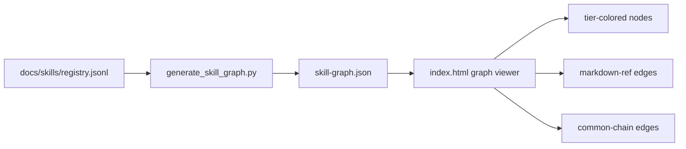

# TASK-0153: build local skill registry graph visualization

## Summary
Create a local skill registry graph view that reads generated skill registry
data, shows Markdown reference edges between skills, color-codes nodes by tier,
and visually distinguishes chain edges from normal skill-link edges.

## Scope
- `In:`
  - add a deterministic graph-data generator script for skill nodes and edges
  - derive nodes from `docs/skills/registry.jsonl`
  - derive normal edges from generated `skill_links`
  - derive special chain edges from Tier 3 `common_chains.after`
  - color-code Tier 1, Tier 2, Tier 3, and external-source nodes
  - create a local static visualization app that can be opened without adding a
    repo-wide frontend package
  - include filters for tier, group, source, edge type, and search
  - include visual proof screenshots or browser-check notes
- `Out:`
  - editing the registry manually
  - making graph edits write back into skills
  - adding a permanent Next/Vite app unless this lightweight app proves
    insufficient
  - replacing the generated registry as source of truth

## Plan
- `Change:` add a generated graph JSON plus a static local graph viewer under a
  docs/tools surface, likely `docs/skills/graph/`.
- `Why:` the registry is now mechanically generated, but humans still need a
  visual way to see tiering, references, and common chains without scanning
  JSONL.
- `Before -> After:`
  - Before: skill relationships are inspectable only through registry rows and
    `rg`.
  - After: `docs/skills/graph/index.html` opens a local interactive graph with
    tier colors, edge legends, filters, and node detail panels.
- `Touch:`
  - `skills/skill-maintenance/scripts/generate_skill_graph.py` or
    `bin/generate_skill_graph.py`
  - `docs/skills/graph/skill-graph.json`
  - `docs/skills/graph/index.html`
  - `docs/skills/graph/README.md`
  - `docs/skills/README.md`
  - `tickets/TASK-0153/ticket.md`
- `Inspect:`
  - `docs/skills/README.md`
  - `docs/skills/registry.jsonl`
  - `bin/sync_skill_registry.py`
  - `skills/react-flow/SKILL.md`
  - `skills/data-viz/SKILL.md`
- `Signature delta:`
  - `generate_skill_graph.py / load_registry(path): SkillRow[]`
  - `generate_skill_graph.py / build_graph(rows): SkillGraph`
  - `generate_skill_graph.py / write_graph(graph, output_path): None`
  - `docs/skills/graph/index.html / renderGraph(graph): void`
- `Type Sketch:`
  - `SkillNode`: `id`, `label`, `tier`, `source`, `group`, `methods`,
    `has_todos`, `path`
  - `SkillEdge`: `source`, `target`, `type`, `label`, `from_path`,
    `to_path?`
  - `SkillGraph`: `nodes`, `edges`, `generated_at`, `counts`
  - `EdgeType`: `markdown-ref | common-chain`
- `Typed flow example:`
  - Registry row for `social-content` has `tier=3`,
    `group=content-social`, and `skill_links=[execute, frontend-craft, ...]`.
  - Graph generator emits a Tier 3 node and Markdown-ref edges to those skills.
  - If future frontmatter has `common_chains.after`, graph emits dashed chain
    edges with a different color.
  - Viewer colors the node by tier and shows methods in the detail panel.
- `Execution steps:`
  1. Implement a small deterministic graph generator using only the Python
     standard library.
  2. Generate `docs/skills/graph/skill-graph.json` from the current registry.
  3. Build `docs/skills/graph/index.html` as a static app with no package
     install required.
  4. Render nodes with tier colors and external-source styling.
  5. Render Markdown-ref edges as solid lines and common-chain edges as dashed
     or thicker lines.
  6. Add tier/group/source/search filters and a node detail panel.
  7. Link the graph from `docs/skills/README.md`.
  8. Validate graph JSON determinism, registry checks, and browser load.
- `Recommendation:` start with a static D3-style local app, not React Flow.
  The repo has no frontend package scaffold, and the first need is inspection,
  not graph editing. React Flow becomes a good follow-up only if we want a
  managed editor for skill metadata.
- `Options considered:`
  - `Static SVG/vanilla app:` lowest dependency, works from local files, enough
    for tier/edge inspection.
  - `D3 CDN app:` visually nicer force graph, but depends on network unless
    vendored.
  - `React Flow app:` best for rich graph management, but adds a frontend stack
    that this repo does not currently have.
- `Blast radius:` generated docs graph, registry docs, and skill-maintenance
  scripts. No runtime hook behavior should change.
- `Risks:` local browser CORS when opening JSON via `file://`, graph clutter
  from too many edges, stale graph JSON if generation is not wired into the
  validation flow, or confusing method addresses with separate skill nodes.

## Gap Analysis
- `Current state:` registry rows already contain tier, source, group, methods,
  todos, and `skill_links`.
- `Production expectation:` operators can see the skill graph, tier colors,
  normal dependency edges, and chain edges without reading JSONL.
- `Missing gaps:` no graph JSON, no viewer, no docs entry point, and no visual
  validation artifact.
- `Recommendation:` add generated graph data first, then a static local viewer.

## Diagram

## Acceptance Criteria
- [x] Graph JSON is generated from `docs/skills/registry.jsonl`.
- [x] Nodes include tier, source, group, methods, todos status, and path.
- [x] Edges include normal Markdown refs and special common-chain edges.
- [x] Visualization color-codes tiers and distinguishes edge types.
- [x] Viewer provides search and basic filters.
- [x] Docs link to the local graph viewer.
- [x] Browser proof shows the graph loads.

## Verification
- `Tests:`
  - `python3 skills/skill-maintenance/scripts/check_skills.py --write`
  - graph generator command
  - JSON parse/check command for graph output
  - `python3 tickets/scripts/check_ticket_metadata.py`
  - `git diff --check`
- `Manual checks:`
  - browser-open the graph page through a local static server
  - verify tier colors and edge legend visually
- `Evidence required:`
  - command outputs
  - graph JSON count summary
  - screenshot or browser QA note
  - review artifact

## Proof Contract
- `Metrics:`
  - `Primary metric:` graph node count equals registry row count
  - `Direction:` equality
  - `Verify:` parse registry and graph JSON and compare counts
  - `Guard:` graph JSON parse and skill registry check
  - `Autoresearch warranted:` no
  - `Autoresearch session:` none
- `Review Rubrics:`
  - `implementation-plan >= 4.0`
  - `integration-readiness >= 4.0`
  - `evidence-quality >= 4.0`
  - `ui-quality >= 3.5`
- `Required Evidence:`
  - graph count check
  - browser load proof
  - review result

## Refs
- `docs/skills/README.md`
- `docs/skills/registry.jsonl`
- `skills/react-flow/SKILL.md`
- `skills/data-viz/SKILL.md`

## Evidence
- `Artifacts:`
  - `tickets/TASK-0153/artifacts/review/2026-05-19-plan-review.json`
  - `tickets/TASK-0153/artifacts/review/2026-05-19-batch-review.json`
  - `tickets/TASK-0153/artifacts/review/2026-05-19-clickable-docs-review.json`
  - `tickets/TASK-0153/artifacts/review/2026-05-19-click-targets-review.json`
  - `tickets/TASK-0153/artifacts/skill-graph-browser.png`
  - `tickets/TASK-0153/artifacts/skill-graph-redesign.png`
  - `tickets/TASK-0153/artifacts/skill-graph-chains.png`
  - `tickets/TASK-0153/artifacts/skill-graph-clickable-docs.png`
  - `tickets/TASK-0153/artifacts/skill-graph-click-targets.png`
- `Commands:`
  - `python3 skills/skill-maintenance/scripts/generate_skill_graph.py`
  - `python3 -m py_compile skills/skill-maintenance/scripts/generate_skill_graph.py`
  - graph count equality script
  - Playwright browser check at `http://127.0.0.1:8765/docs/skills/graph/index.html`
- `Result summary:` graph data generated with 71 nodes, 261 edges, 13
  common-chain edges, and 71 embedded skill docs after adding the
  `skill-registry-ui` package. Follow-up browser proof at `file://` and a
  1000px-wide viewport clicked a graph node, changed selection from `advise` to
  `reference-grounding`, kept the detail panel visible, rendered raw YAML plus
  `SKILL.md` Markdown, and found no inactive decorative buttons or console/page
  errors.

## Blockers
- none
