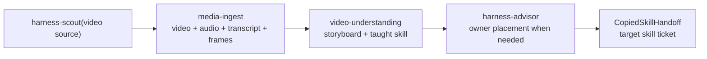

# TASK-0158: add video-to-skill harness scout pipeline

## Summary
Teach `harness-scout` how to handle videos where someone is explaining,
pitching, or demonstrating a reusable skill. This ticket adds the general
support pipeline: ingest media, transcribe it, extract frames, understand the
video with transcript plus frames, identify the taught skill, and produce a
copied-skill handoff for the correct Codexter owner.

## Scope
- In:
  - new Tier 2 `skills/media-ingest` skill for URL/local video -> metadata,
    MP4/audio, transcript, frames, and contact sheet
  - platform guidance for Instagram, YouTube, TikTok/direct URLs, and local MP4
  - local Whisper/summarize setup guidance and fallback behavior
  - new Tier 2 `skills/video-understanding` skill for transcript-plus-frame
    reconstruction
  - `harness-scout` updates so video source runs can emit copied-skill
    candidates and owner-placement handoffs
  - source-run templates or references for selected frames, storyboard,
    action ledger, copied-skill candidate, and confidence notes
  - registry/docs updates after the skill surfaces exist
- Out:
  - implementing any specific copied skill beyond handoff shape
  - frontend animation implementation; that is `TASK-0159`
  - hosted scraping, private-account scraping, cron/feed polling, or media DBs
  - storing raw MP4s, raw social transcripts, cookies, or API keys in tracked
    docs

## Plan
- `Change:` add a reusable video-to-skill pipeline under `harness-scout` with
  `media-ingest` and `video-understanding` as support skills.
- `Why:` `harness-scout` already scores external sources, but video sources
  currently require ad hoc `summarize`, `yt-dlp`, `ffmpeg`, Whisper, and frame
  inspection steps. The missing capability is not Instagram-specific; it is
  turning any skill-teaching video into a grounded copied-skill handoff.
- `Before -> After:`
  - Before: video source analysis is manual and easy to misplace; agents can
    record a video source but may confuse the generic scout process with the
    specific skill being taught.
  - After: `harness-scout` treats video as one source type: ingest it, read the
    transcript, inspect selected frames, extract the taught skill, dedupe it,
    and route the copied-skill candidate through `harness-advisor` when the
    owner is not obvious.
- `Touch:`
  - add `skills/media-ingest/SKILL.md`
  - add `skills/media-ingest/todos.md`
  - add optional `skills/media-ingest/references/platforms.md`
  - add optional `skills/media-ingest/references/transcription.md`
  - add `skills/video-understanding/SKILL.md`
  - add `skills/video-understanding/todos.md`
  - add optional `skills/video-understanding/templates/reconstruction-brief.md`
  - update `skills/harness-scout/SKILL.md`
  - update `skills/harness-scout/todos.md`
  - update `docs/skills/registry.jsonl` through registry sync
  - update `docs/features/registry.jsonl` after the shipped feature exists
  - update `docs/HISTORY.md` after implementation
  - update `tickets/TASK-0158/ticket.md`
- `Inspect:`
  - `skills/harness-scout/SKILL.md` and `todos.md`
  - `skills/summarize/SKILL.md`
  - `skills/harness-advisor/SKILL.md`
  - `docs/specs/harness-engineering-doctrine.md`
  - `docs/specs/harness-techniques.md`
  - `docs/skills/registry.jsonl`
  - `docs/features/registry.jsonl`
  - `experiments/harness-scout/runs/2026-05-20-instagram-claude-portal-video/`
- `Signature delta:`
  - `skills/media-ingest/SKILL.md / media-ingest(source): MediaIngestBundle`
  - `skills/video-understanding/SKILL.md / video-understanding(bundle): VideoReconstructionBrief`
  - `skills/video-understanding/SKILL.md / extract_taught_skill(brief): CopiedSkillCandidate`
  - `skills/harness-scout/SKILL.md / harness-scout(video): CopiedSkillHandoff`
- `Type Sketch:`
  - `MediaSource`: `kind`, `url?`, `local_path?`, `platform?`, `visibility`,
    `cookies_required`, `source_id?`
  - `MediaIngestBundle`: `source`, `metadata_path`, `video_path?`,
    `audio_path?`, `transcript_path?`, `frames_dir`, `contact_sheet_path`,
    `selected_frames`, `commands`, `retention_note`
  - `VideoReconstructionBrief`: `source`, `summary`, `storyboard`,
    `action_ledger`, `event_timeline`, `asset_requirements`,
    `confidence_notes`
  - `CopiedSkillCandidate`: `source_id`, `skill_name_or_method`,
    `capability_summary`, `target_owner_candidates`, `evidence_frames`,
    `transcript_anchors`, `expected_reimplementation`
  - `CopiedSkillHandoff`: `candidate`, `owner_decision`, `skill_delta`,
    `proof_requirements`
- `Typed flow example:`
  - A user gives `harness-scout` an Instagram video.
  - `media-ingest` tries `summarize` first, uses `yt-dlp`/`ffmpeg` when needed,
    transcribes with local Whisper, and emits a bundle.
  - `video-understanding` reads transcript first, then selected frames, and
    emits a reconstruction brief plus copied-skill candidate.
  - `harness-scout` dedupes the candidate and uses `harness-advisor` when the
    owner could be several surfaces.
  - The target skill ticket consumes the handoff; for `SRC-0008`, that target
    is `TASK-0159`.
- `Execution steps:`
  1. Create `media-ingest` with platform, transcription, frame extraction,
     retention, and bundle-output guidance.
  2. Create `video-understanding` with transcript-first and frame-grounded
     reconstruction guidance.
  3. Update `harness-scout` workflow, routing map, decision branches, and
     outcome contract for copied-skill handoffs.
  4. Add selected-frame/storyboard/candidate templates only if they reduce
     repeat work.
  5. Re-run `SRC-0008` through the new documented flow and update that run with
     transcript summary, selected frames, and copied-skill handoff.
  6. Sync registries and run checks.
  7. Run review and link the review artifact.
- `Recommendation:` keep this ticket as the general source-to-skill pipeline.
  `TASK-0159` owns the frontend-specific copied skill and reimplementation.
- `Options considered:`
  1. One giant `instagram-to-skill` skill: rejected because it mixes platform
     ingest, understanding, placement, and implementation.
  2. General video-to-skill pipeline plus target-skill ticket: chosen because it
     matches the real boundary.
  3. Only frontend-craft: rejected because future videos may teach non-frontend
     skills.
- `Blast radius:`
  - `harness-scout` source-run contract
  - skill registry generation
  - source retention rules
  - future copied-skill tickets
- `Risks:`
  - pretending visual-only evidence is enough when transcript is required
  - committing raw media or transcript instead of compact evidence
  - overfitting the pipeline to Instagram
  - opening tickets for vague inspiration instead of concrete taught skills

## Gap Analysis
- `Current state:` Codexter has `harness-scout`, `summarize`, and strong
  frontend/media skills, but no standard video-to-copied-skill handoff.
- `Production expectation:` video sources should produce durable evidence:
  metadata, transcript, selected frames, storyboard, skill candidate,
  owner-placement decision, and proof requirements.
- `Missing gaps:` no `MediaIngestBundle`, no transcript-plus-frame
  reconstruction skill, no copied-skill candidate/handoff shape.
- `Comparable implementations:` `SRC-0008` shows why URL summary alone is too
  thin and why `yt-dlp`, `ffmpeg`, Whisper, and frame selection are needed.
- `Recommendation:` land the general pipeline first, then prove it through
  `TASK-0159`.

## Diagram

## Acceptance Criteria
- [x] `skills/media-ingest` exists with `SKILL.md`, `todos.md`, platform
      branches, transcription guidance, retention guardrails, and bundle output.
- [x] `skills/video-understanding` exists with `SKILL.md`, `todos.md`, and a
      copied-skill candidate output contract.
- [x] `harness-scout` documents the video-to-copied-skill route and when to use
      `harness-advisor`.
- [x] `SRC-0008` run includes a transcript-status-backed, frame-grounded
      copied-skill handoff for `TASK-0159`.
- [x] Registry checks pass.
- [x] No raw MP4, raw social transcript, API key, cookie export, or private
      media is committed.

## Verification
- `Tests:`
  - `python3 skills/skill-maintenance/scripts/check_skills.py --write`
  - `python3 bin/sync_skill_registry.py --check`
  - `python3 bin/check_skill_todo_tiers.py --allow-peer-tier3`
  - `python3 tickets/scripts/check_ticket_metadata.py`
- `Manual checks:`
  - Run the documented ingest steps against `SRC-0008`.
  - Confirm transcript, selected frames, storyboard, and copied-skill handoff
    exist as compact artifacts.
- `Evidence required:`
  - updated `SRC-0008` source run
  - validation command outputs
  - review artifact

## Proof Contract
- `Metrics:`
  - `Primary metric:` `video_to_skill_pipeline_validation_passed`
  - `Direction:` `pass/fail`
  - `Verify:` registry checks plus `SRC-0008` handoff artifact inspection
  - `Guard:` no raw media/transcript/secrets committed
  - `Min acceptable result:` all checks pass and copied-skill handoff exists
  - `Autoresearch warranted:` no
  - `Autoresearch session:` none
- `Review Rubrics:`
  - `spec-contract >= 4.0`
  - `implementation-plan >= 4.0`
  - `evidence-quality >= 4.0`
  - `integration-readiness >= 4.0`
- `Required Evidence:`
  - `SRC-0008` copied-skill handoff
  - command outputs
  - review artifact

## Autonomy Readiness
- `Human inputs/assets:` video URL or local file; optional cookies only with
  explicit operator setup
- `Credentials / external access:` no tracked keys or cookies
- `Compute/runtime needs:` `summarize`, `yt-dlp` or equivalent, `ffmpeg`,
  `whisper-cli` and local model
- `Tooling gaps:` document missing extractor/transcriber as blockers, not
  silent failures
- `QA risks:` transcript quality, selected-frame sufficiency, source retention
- `Human gates:` private source access and paid external processing
- `Agent decision boundaries:` agents may create compact source-run evidence;
  they may not publish, scrape private content, or commit raw media/secrets

## Evidence Checklist
- [x] Ingest bundle:
  `experiments/harness-scout/runs/2026-05-20-instagram-claude-portal-video/media-ingest-bundle.md`
- [x] Transcript summary:
  `experiments/harness-scout/runs/2026-05-20-instagram-claude-portal-video/media-ingest-bundle.md`
- [x] Selected frame ledger:
  `experiments/harness-scout/runs/2026-05-20-instagram-claude-portal-video/video-reconstruction-brief.md`
- [x] Copied-skill handoff:
  `experiments/harness-scout/runs/2026-05-20-instagram-claude-portal-video/handoff.md`
- [x] Text-only smoke log:
  `experiments/harness-scout/runs/2026-05-20-instagram-claude-portal-video/video-understanding-smoke-log.md`
- [x] Validation logs:
  `python3 skills/skill-maintenance/scripts/check_skills.py --write`,
  `python3 bin/sync_skill_registry.py --check`,
  `python3 bin/check_skill_todo_tiers.py --allow-peer-tier3`, and
  `python3 tickets/scripts/check_ticket_metadata.py`
- [x] Review report:
  `tickets/TASK-0158/artifacts/review/2026-05-21-impl-review.md`
  `tickets/TASK-0158/artifacts/review/2026-05-21-checklist-refactor-review.md`
- [x] Automation review and sanitization pass:
  `tickets/TASK-0158/artifacts/review/2026-05-21-0219-automation-review.md`
- [x] Automation closeout review:
  `tickets/TASK-0158/artifacts/review/2026-05-21-0302-automation-closeout-review.md`
- [x] Automation board review:
  `tickets/TASK-0158/artifacts/review/2026-05-21-0403-automation-board-review.md`
- [x] Automation closeout review:
  `tickets/TASK-0158/artifacts/review/2026-05-22-0259-automation-closeout-review.md`

## Refs
- `skills/harness-scout/SKILL.md`
- `skills/summarize/SKILL.md`
- `skills/harness-advisor/SKILL.md`
- `experiments/harness-scout/runs/2026-05-20-instagram-claude-portal-video/source-summary.md`

## Evidence
- `Artifacts:`
  - `tickets/TASK-0158/artifacts/review/2026-05-21-impl-plan-review.md`
  - `tickets/TASK-0158/artifacts/review/2026-05-21-impl-review.md`
  - `tickets/TASK-0158/artifacts/review/2026-05-21-checklist-refactor-review.md`
  - `experiments/harness-scout/runs/2026-05-20-instagram-claude-portal-video/media-ingest-bundle.md`
  - `experiments/harness-scout/runs/2026-05-20-instagram-claude-portal-video/video-reconstruction-brief.md`
  - `experiments/harness-scout/runs/2026-05-20-instagram-claude-portal-video/video-understanding-smoke-log.md`
  - `experiments/harness-scout/runs/2026-05-20-instagram-claude-portal-video/evidence/source-info.json`
  - `tickets/TASK-0158/artifacts/review/2026-05-21-0219-automation-review.md`
  - `tickets/TASK-0158/artifacts/review/2026-05-21-0302-automation-closeout-review.md`
  - `tickets/TASK-0158/artifacts/review/2026-05-21-0403-automation-board-review.md`
  - `tickets/TASK-0158/artifacts/review/2026-05-22-0259-automation-closeout-review.md`
- `Commands:`
  - `python3 tickets/scripts/check_ticket_metadata.py`
  - `python3 bin/sync_skill_registry.py --check`
  - `python3 bin/check_skill_todo_tiers.py --allow-peer-tier3`
  - `python3 bin/check_skill_capabilities.py validate`
  - `python3 skills/skill-maintenance/scripts/check_skills.py --write`
  - `python3 -m json.tool experiments/harness-scout/runs/2026-05-20-instagram-claude-portal-video/evidence/source-info.json`
  - `rg -n "instagram\\.fkul|_nc_|http_headers|formats|comments|author_id|thumbnails|Bearer|PRIVATE KEY|api[_-]?key|cookie" experiments/harness-scout/runs/2026-05-20-instagram-claude-portal-video -S`
  - `git diff --check`
- `Result summary:`
  - media ingest and video understanding support skills added
  - `harness-scout` todos now require summarize-first extraction,
    video-understanding for video evidence, source todo extraction, and local
    skill/todo comparison
  - `SRC-0008` now has compact ingest and reconstruction artifacts feeding
    `TASK-0159`
  - `source-info.json` was sanitized during automation review to remove raw
    extractor metadata, CDN URLs, headers, comments, and user identifiers

## Runtime Decision
- `Checkout mode:` shared checkout
- `Runtime mode:` shared
- `Runtime record:` none; `.harness/state/tickets/TASK-0158.runtime.json` is not needed
- `QA target:` none; this ticket changes skill/docs/source-run artifacts and has no live frontend/backend target
- `Why:` a single local writer can verify the ticket through deterministic file checks, registry checks, source artifact inspection, and review without branch isolation or a live server

## Blockers
- none
